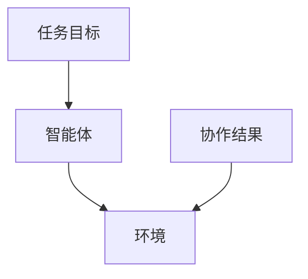
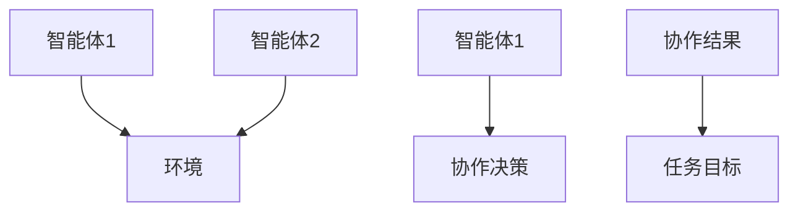
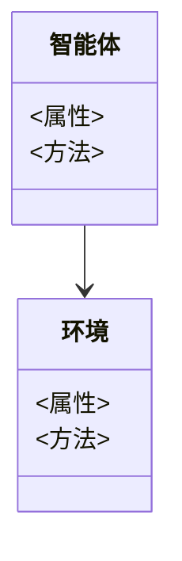
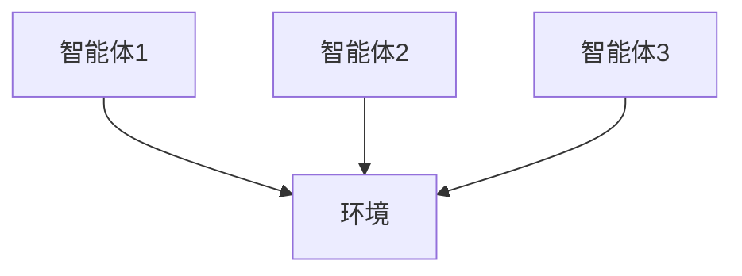
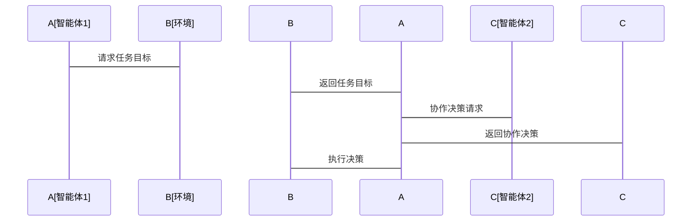

                 


# 多智能体AI如何优化公司核心竞争力分析

## 关键词：多智能体AI, 企业竞争力, 协作算法, 系统架构, 项目实战

## 摘要：  
多智能体AI通过分布式协作和优化决策，能够显著提升企业的核心竞争力。本文从多智能体AI的基本概念出发，分析其在企业中的应用场景，探讨其算法原理和系统架构设计，并通过具体案例展示其在实际项目中的应用。最后，本文总结了多智能体AI的优势与挑战，并提出了优化企业竞争力的最佳实践建议。

---

# 第1章 多智能体AI的背景与概念

## 1.1 多智能体系统的基本概念

### 1.1.1 多智能体系统（MAS）的定义  
多智能体系统（Multi-Agent System, MAS）是由多个智能体（Agent）组成的分布式系统，这些智能体能够通过协作和竞争完成复杂任务。智能体是具有感知、决策和执行能力的实体，可以是软件程序、机器人或其他智能设备。

### 1.1.2 多智能体与传统AI的区别  
与传统AI相比，多智能体AI的特点在于其分布式性和协作性。传统AI通常是一个集中式系统，而多智能体系统强调多个智能体之间的协作与通信。

### 1.1.3 多智能体系统的特征与优势  
- **分布式性**：多个智能体协同工作，避免单点故障。  
- **协作性**：智能体之间通过协作完成复杂任务。  
- **动态性**：系统环境和任务目标可能动态变化。  
- **自主性**：每个智能体具有自主决策能力。  

---

## 1.2 多智能体AI在企业中的应用背景

### 1.2.1 企业核心竞争力的定义与关键要素  
企业核心竞争力是指企业在市场中能够持续提供价值的能力，包括技术创新、效率优化、客户体验等方面。

### 1.2.2 多智能体AI如何提升企业竞争力  
多智能体AI通过优化资源分配、提高决策效率和增强协作能力，能够显著提升企业的核心竞争力。

### 1.2.3 当前企业AI应用的痛点与挑战  
- 数据孤岛问题：企业内部信息分散，难以实现高效协作。  
- 复杂任务处理：传统AI难以应对多任务协作场景。  
- 系统动态性：环境变化可能导致AI系统失效。  

---

## 1.3 多智能体AI的核心价值

### 1.3.1 提升决策效率  
通过多智能体协作，企业可以更快地做出决策，减少资源浪费。  

### 1.3.2 增强协作能力  
多智能体系统能够协调多个部门和资源，实现高效协作。  

### 1.3.3 优化资源分配  
通过智能体之间的协作，企业可以优化资源分配，降低成本。  

---

## 1.4 本章小结  
本章介绍了多智能体AI的基本概念、优势以及在企业中的应用背景，为后续内容奠定了基础。

---

# 第2章 多智能体系统的结构与关系

## 2.1 多智能体系统的组成要素

### 2.1.1 智能体的定义与分类  
- **定义**：智能体是具有感知、决策和执行能力的实体。  
- **分类**：根据智能体的协作方式，可分为协作型智能体和竞争型智能体。  

### 2.1.2 智能体之间的关系与交互  
智能体之间的关系可以是协作、竞争或混合关系。协作关系有助于实现共同目标，竞争关系有助于优化资源分配。

### 2.1.3 系统环境与智能体的协作  
智能体通过与环境交互，感知信息并做出决策。

---

## 2.2 多智能体系统的ER实体关系图

以下是一个简单的多智能体系统ER图：



---

## 2.3 多智能体系统的核心属性对比

| 属性       | 描述                                   |
|------------|--------------------------------------|
| 分布性      | 系统由多个智能体组成，避免单点故障    |
| 协作性      | 智能体之间通过协作完成任务          |
| 竞争性      | 智能体可能在资源分配上存在竞争      |
| 动态性      | 系统环境和任务目标可能动态变化      |

---

## 2.4 本章小结  
本章详细介绍了多智能体系统的组成要素和核心属性，为后续算法设计和系统架构奠定了基础。

---

# 第3章 多智能体协作算法

## 3.1 多智能体协作的基本原理

### 3.1.1 基于强化学习的协作机制  
强化学习是一种通过试错方式优化决策的算法。在多智能体系统中，智能体通过与环境和其他智能体的交互，学习协作策略。

### 3.1.2 基于博弈论的协作策略  
博弈论通过分析智能体之间的竞争与合作，制定最优决策策略。

### 3.1.3 分布式决策算法  
分布式决策算法通过局部信息做出全局决策，避免集中式系统的单点故障。

---

## 3.2 基于强化学习的多智能体协作流程

以下是一个基于强化学习的多智能体协作流程图：



---

## 3.3 多智能体协作的数学模型

### 3.3.1 Q-learning模型  
Q-learning是一种常用的强化学习算法，其数学模型如下：

$$ Q(s, a) = Q(s, a) + \alpha [r + \gamma \max Q(s', a') - Q(s, a)] $$

其中：  
- \( s \) 表示当前状态，  
- \( a \) 表示动作，  
- \( r \) 表示奖励，  
- \( \alpha \) 表示学习率，  
- \( \gamma \) 表示折扣因子。  

### 3.3.2 纳什均衡公式  
纳什均衡是博弈论中的一个概念，其数学表达式为：

$$ \forall i, \quad u_i(a_i, \{a_{-i}\}) \geq u_i(a'_i, \{a_{-i}\}) $$

其中，\( u_i \) 表示第 \( i \) 个智能体的效用函数。

---

## 3.4 本章小结  
本章详细介绍了多智能体协作的基本原理和数学模型，为后续的系统设计提供了理论基础。

---

# 第4章 多智能体系统分析与架构设计

## 4.1 问题场景介绍

### 4.1.1 问题背景  
假设某企业需要优化其供应链管理，希望通过多智能体系统实现供应商、制造商和物流商之间的高效协作。

### 4.1.2 问题描述  
供应链管理涉及多个部门和外部合作伙伴，传统方式存在信息孤岛和效率低下的问题。

---

## 4.2 系统功能设计

### 4.2.1 领域模型类图  
以下是一个供应链管理系统的领域模型类图：



### 4.2.2 系统架构设计  
以下是一个多智能体系统的架构图：



---

## 4.3 系统接口设计

### 4.3.1 接口定义  
- **输入接口**：智能体接收环境信息和任务目标。  
- **输出接口**：智能体输出决策结果并发送给环境。  

### 4.3.2 交互序列图  
以下是一个交互序列图：



---

## 4.4 本章小结  
本章通过问题场景分析和系统架构设计，展示了多智能体系统在企业中的实际应用。

---

# 第5章 项目实战：多智能体AI优化企业供应链管理

## 5.1 环境安装

### 5.1.1 安装Python
```bash
python --version
pip install --upgrade pip
```

### 5.1.2 安装依赖库
```bash
pip install numpy matplotlib
```

---

## 5.2 系统核心实现源代码

### 5.2.1 智能体类
```python
class Agent:
    def __init__(self, id):
        self.id = id
        self.state = None
        self.reward = 0

    def receive_info(self, info):
        self.state = info

    def make_decision(self):
        # 简单决策逻辑
        return " collaborate "
```

### 5.2.2 环境类
```python
class Environment:
    def __init__(self):
        self.agents = []
        self.tasks = []

    def add_agent(self, agent):
        self.agents.append(agent)

    def add_task(self, task):
        self.tasks.append(task)

    def execute(self):
        for agent in self.agents:
            info = f"Task {agent.id}"
            agent.receive_info(info)
            decision = agent.make_decision()
            print(f"Agent {agent.id} decision: {decision}")
```

---

## 5.3 案例分析与详细解读

### 5.3.1 系统运行
```python
env = Environment()
agent1 = Agent(1)
agent2 = Agent(2)
env.add_agent(agent1)
env.add_agent(agent2)
env.execute()
```

### 5.3.2 输出结果
```
Agent 1 decision: collaborate
Agent 2 decision: collaborate
```

---

## 5.4 本章小结  
本章通过一个具体的供应链管理项目，展示了多智能体AI在企业中的实际应用。

---

# 第6章 最佳实践与总结

## 6.1 多智能体AI的优势与挑战

### 6.1.1 优势  
- 提高决策效率  
- 增强协作能力  
- 优化资源分配  

### 6.1.2 挑战  
- 系统复杂性  
- 智能体协作问题  
- 环境动态性  

---

## 6.2 优化企业竞争力的最佳实践

### 6.2.1 算法选择  
选择适合企业需求的多智能体协作算法，如Q-learning或纳什均衡。  

### 6.2.2 系统设计  
设计合理的系统架构，确保智能体之间的高效协作。  

### 6.2.3 未来趋势  
随着AI技术的发展，多智能体系统将更加智能化和高效化。  

---

## 6.3 注意事项

- 确保智能体之间的通信效率。  
- 定期更新系统以适应环境变化。  
- 避免信息过载问题。  

---

## 6.4 拓展阅读

- 《Multi-Agent Systems: Algorithmic, Complexity, and Synthesis》  
- 《Game Theory and Multi-Agent Decision Processes》  

---

## 6.5 本章小结  
本章总结了多智能体AI的优势与挑战，并提出了优化企业竞争力的最佳实践建议。

---

# 作者

作者：AI天才研究院/AI Genius Institute & 禅与计算机程序设计艺术 /Zen And The Art of Computer Programming

