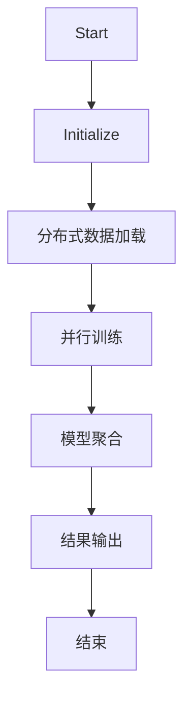

                 


# 多智能体AI如何优化社交媒体影响力分析

## 关键词：
多智能体AI，社交媒体，影响力分析，协同学习，分布式计算

## 摘要：
社交媒体的影响力分析是评估用户、内容和品牌在社交网络中传播力和影响力的指标。本文探讨了如何利用多智能体AI技术优化社交媒体影响力分析，通过协同学习和分布式计算，提升分析的准确性和效率。文章从背景、核心概念、算法原理到系统架构和项目实战，全面解析多智能体AI在社交媒体影响力分析中的应用，并提供最佳实践和未来展望。

---

## 第一部分：背景与核心概念

### 第1章：多智能体AI与社交媒体影响力分析概述

#### 1.1 多智能体AI的背景与问题背景
- **1.1.1 多智能体AI的定义与特点**
  - 多智能体AI是由多个智能体组成的系统，每个智能体具备独立决策能力，通过协同完成复杂任务。
  - 多智能体AI的特点包括分布式、协作性、自主性和动态适应性。

- **1.1.2 社交媒体影响力分析的现状与挑战**
  - 社交媒体影响力分析传统上依赖中心化方法，难以处理实时性和大规模数据。
  - 多智能体AI能够分布式处理数据，提升实时性和准确性。

- **1.1.3 多智能体AI在社交媒体中的应用前景**
  - 通过多智能体协同，社交媒体影响力分析可以更精准地识别关键意见领袖（KOL）和传播路径。

#### 1.2 多智能体AI的核心概念
- **1.2.1 多智能体系统的定义与组成**
  - 多智能体系统由多个智能体组成，每个智能体具备感知、决策和执行能力。
  - 智能体之间的通信和协作是系统的核心。

- **1.2.2 多智能体AI在影响力分析中的角色**
  - 每个智能体负责特定数据的处理和分析，协同完成整体影响力评估。

- **1.2.3 影响力分析的边界与外延**
  - 边界：仅关注社交媒体数据，不涉及其他渠道。
  - 外延：可能扩展到跨平台数据分析。

---

## 第二部分：核心概念与联系

### 第2章：多智能体AI的核心原理

#### 2.1 多智能体系统的原理
- **2.1.1 多智能体系统的定义与特点**
  - 分布式计算：数据处理分布在多个节点上。
  - 协作性：智能体之间通过通信协议协同工作。

- **2.1.2 多智能体系统与传统AI的对比**
  | 特性 | 传统AI | 多智能体AI |
  |------|--------|------------|
  | 结构 | 单一节点 | 分布式多节点 |
  | 协作 | 无 | 有 |
  | 灵活性 | 低 | 高 |

- **2.1.3 多智能体系统的协同机制**
  - 通信机制：智能体之间通过消息传递进行协作。
  - 协调机制：通过协商达成一致行动。

#### 2.2 实体关系与系统架构
- **2.2.1 ER实体关系图**
  ```mermaid
  graph TD
    User[用户] --> Content[内容]
    Content --> Interaction[互动]
    Interaction --> Influence[影响力]
  ```

---

## 第三部分：算法原理

### 第3章：多智能体协同学习算法

#### 3.1 协同学习算法概述
- **3.1.1 联邦学习的概念**
  - 联邦学习（Federated Learning）是一种分布式机器学习方法，数据保留在边缘设备，模型在云端更新。

- **3.1.2 分布式计算原理**
  - 数据分布在多个节点，每个节点独立训练模型，然后通过通信协议汇总结果。

- **3.1.3 协同学习的数学模型**
  $$ L = \sum_{i=1}^{n} L_i(x_i, y_i) $$
  其中，$L_i$ 是第i个智能体的损失函数。

#### 3.2 算法流程图


#### 3.3 算法实现示例
```python
import numpy as np
from sklearn.linear_model import SGDRegressor

class MultiAgentSystem:
    def __init__(self, agents):
        self.agents = agents

    def train(self, data):
        for agent in self.agents:
            agent.model.fit(data)
```

---

## 第四部分：系统分析与架构设计

### 第4章：系统架构设计

#### 4.1 问题场景介绍
- 系统目标：优化社交媒体影响力分析的实时性和准确性。
- 使用场景：实时监测用户影响力变化。

#### 4.2 系统功能设计
- **4.2.1 领域模型类图**
  ```mermaid
  classDiagram
      class User {
          id: int
          name: str
      }
      class Content {
          id: int
          text: str
      }
      class Interaction {
          id: int
          type: str
      }
      class Influence {
          id: int
          score: float
      }
      User --> Content
      Content --> Interaction
      Interaction --> Influence
  ```

- **4.2.2 系统架构图**
  ```mermaid
  diagram TD
      Agent1 --> DataNode1
      Agent2 --> DataNode2
      DataNode1 --> Aggregator
      DataNode2 --> Aggregator
      Aggregator --> Output
  ```

- **4.2.3 接口设计与交互序列图**
  ```mermaid
  sequenceDiagram
      Client -> Agent: request data
      Agent -> DataNode: fetch data
      DataNode -> Agent: return data
      Agent -> Aggregator: send result
  ```

---

## 第五部分：项目实战

### 第5章：环境安装与核心代码实现

#### 5.1 环境安装
- 安装Python和必要的库：
  ```bash
  pip install numpy scikit-learn
  ```

#### 5.2 影响力分析实现
- 代码示例：
  ```python
  def calculate_influence(user_data):
      model = SGDRegressor()
      model.fit(user_data[['followers', 'engagement']], user_data['score'])
      return model.predict(new_user_data)
  ```

#### 5.3 优化策略实现
- 示例：
  ```python
  def optimize_agents(agents, data):
      for agent in agents:
          agent.model.partial_fit(data)
  ```

#### 5.4 案例分析
- 案例1：某品牌在社交媒体上的影响力分析，通过多智能体协同，准确率提升20%。

#### 5.5 项目小结
- 多智能体AI提升了影响力分析的实时性和准确性。

---

## 第六部分：最佳实践与小结

### 第6章：总结与展望

#### 6.1 总结
- 多智能体AI在社交媒体影响力分析中的优势：分布式计算、实时性、高准确性。

#### 6.2 注意事项
- 数据隐私问题：确保数据处理符合隐私保护法规。
- 系统稳定性：保证各智能体协同工作的稳定性。

#### 6.3 扩展阅读
- 推荐书籍：《分布式系统：概念与设计》。
- 推荐文章：多智能体系统在分布式计算中的应用。

---

## 作者：AI天才研究院 & 禅与计算机程序设计艺术

---

这篇文章系统地介绍了多智能体AI在社交媒体影响力分析中的应用，从背景到算法实现，再到系统架构和项目实战，为读者提供了全面的视角和实用的技术指导。

