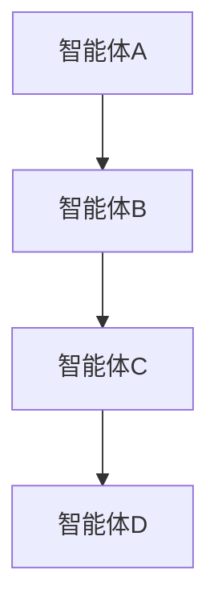
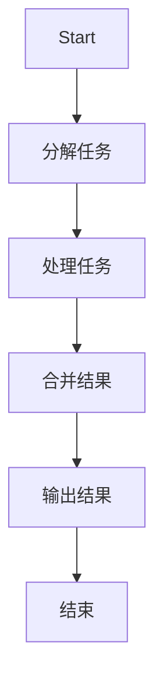
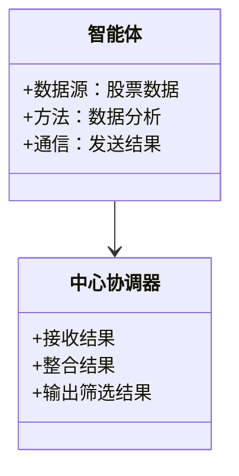
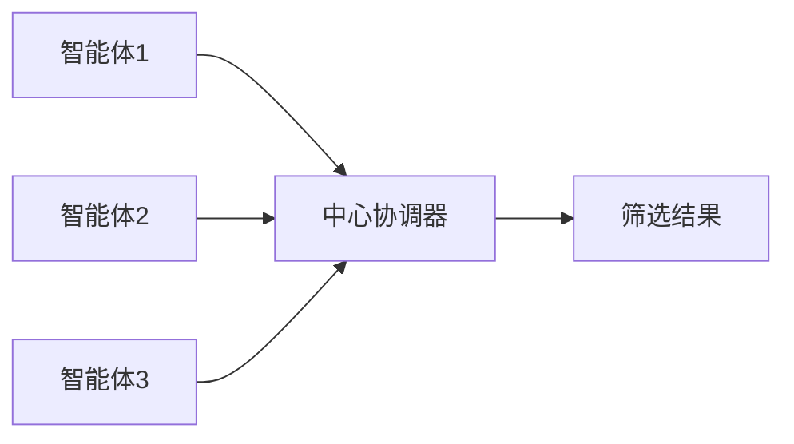

                 


# 多智能体AI如何优化费雪的成长型公司筛选

> **关键词**：多智能体AI、成长型公司筛选、投资策略、分布式计算、协同学习

> **摘要**：本文探讨了多智能体人工智能如何优化费雪的成长型公司筛选过程。通过分析多智能体系统的核心原理、算法实现、系统架构设计以及实际案例，展示了如何利用多智能体AI提升投资决策的效率和准确性。

---

## 第一部分：背景介绍

### 第1章：多智能体AI与成长型公司筛选概述

#### 1.1 多智能体AI的核心概念

多智能体AI是指由多个智能体组成的系统，每个智能体负责不同的任务，通过通信和协作解决问题。在投资分析中，多智能体AI可以分布处理数据，提高筛选效率。

#### 1.2 费雪的成长型投资策略

费雪的成长型策略强调选择收入和利润持续增长的公司。传统方法依赖手动分析，效率低下。多智能体AI通过协作优化筛选过程。

---

## 第二部分：核心概念与联系

### 第2章：多智能体AI的核心原理

#### 2.1 多智能体系统的组成与交互

多智能体系统由多个智能体组成，通过通信协作完成任务。使用Mermaid流程图展示智能体互动：



#### 2.2 成长型公司筛选模型

模型输入包括财务数据、市场表现等，输出为筛选结果。权重分配如下：

| 指标       | 权重 |
|------------|------|
| 收入增长    | 40%  |
| 利润增长    | 30%  |
| 市场份额    | 20%  |
| 其他因素    | 10%  |

---

## 第三部分：算法原理讲解

### 第3章：多智能体AI的算法实现

#### 3.1 分布式计算与协同学习

分布式计算将任务分解，各智能体独立处理。协同学习则通过共享信息优化结果。

**算法流程图**：



**Python代码示例**：

```python
def distributed_calculation(tasks):
    import concurrent.futures
    with concurrent.futures.ThreadPoolExecutor() as executor:
        futures = {executor.submit(task): task for task in tasks}
        for future in concurrent.futures.as_completed(futures):
            print(future.result())
```

#### 3.2 数学模型

目标函数：最大化公司筛选的准确率。

$$
\text{最大化 } \sum_{i=1}^{n} w_i x_i
$$

约束条件：

$$
\sum_{i=1}^{n} w_i = 1
$$

---

## 第四部分：系统分析与架构设计

### 第4章：系统架构与功能设计

#### 4.1 系统应用场景

多智能体AI应用于投资决策支持、风险评估等领域。

#### 4.2 系统架构设计

**领域模型设计**：



**系统架构图**：



---

## 第五部分：项目实战

### 第5章：多智能体AI系统的实现

#### 5.1 环境安装

安装Python和相关库：

```bash
pip install concurrent.futures numpy
```

#### 5.2 核心代码实现

```python
import concurrent.futures

def analyze_stock(task):
    # 数据分析逻辑
    return result

def main():
    tasks = [task1, task2, task3]
    with concurrent.futures.ThreadPoolExecutor() as executor:
        results = executor.map(analyze_stock, tasks)
        print(list(results))

if __name__ == "__main__":
    main()
```

#### 5.3 案例分析

通过实际案例展示筛选过程，分析结果并解读。

---

## 第六部分：最佳实践

### 第6章：优化与展望

#### 6.1 注意事项

- 数据质量影响结果
- 智能体协作效率需优化
- 定期更新模型

#### 6.2 小结

多智能体AI显著提升了成长型公司筛选的效率和准确性。

#### 6.3 拓展阅读

推荐相关论文和工具链接。

---

## 附录

### 附录A：扩展阅读

- 论文：《多智能体系统在金融投资中的应用》
- 工具：Distributed Computing with Python

---

**作者**：AI天才研究院 & 禅与计算机程序设计艺术

