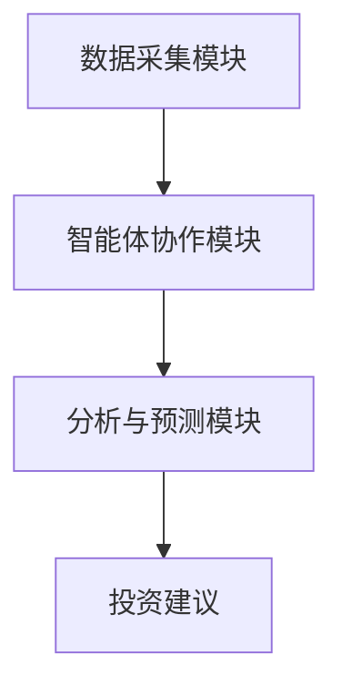
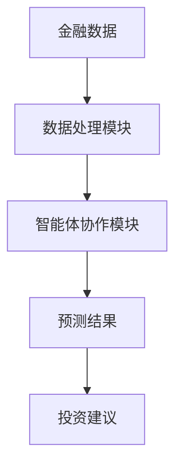

                 


# 多智能体AI如何增强价值投资的跨周期分析能力

---

## 关键词：
多智能体AI, 价值投资, 跨周期分析, 金融建模, 强化学习, 系统架构

---

## 摘要：
本文探讨了多智能体人工智能（Multi-Agent AI）在价值投资中的应用，重点分析其如何增强跨周期分析能力。通过结合多智能体系统的优势，本文深入探讨了多智能体AI在金融数据建模、市场情绪分析、投资组合优化等方面的能力。我们从理论基础、算法实现、系统架构到实际案例，全面解析多智能体AI如何赋能价值投资，并通过代码实现和数学模型展示其技术细节。最后，本文总结了多智能体AI在价值投资中的潜力和未来发展方向。

---

## 第1章: 引言

### 1.1 多智能体AI的定义与背景
多智能体AI是指由多个具有自主决策能力的智能体组成的系统，这些智能体能够通过协作或竞争完成复杂的任务。与传统单智能体AI不同，多智能体系统能够处理分布式问题，适用于需要多维度分析的场景，如金融投资。

### 1.2 价值投资的核心理念
价值投资是一种以基本面分析为基础的投资策略，强调通过分析公司的内在价值来做出投资决策。传统价值投资依赖于经验丰富的分析师，但其分析能力受限于时间和数据的广度。

### 1.3 跨周期分析的重要性
跨周期分析是指在较长的时间跨度内分析市场趋势和公司基本面，以识别长期投资机会。多智能体AI能够通过分布式计算和协作学习，显著提升跨周期分析的效率和准确性。

---

## 第2章: 多智能体AI的理论基础

### 2.1 多智能体系统的概念与特点
多智能体系统由多个智能体组成，每个智能体具有以下特点：
1. **自主性**：智能体能够独立决策。
2. **反应性**：能够实时感知环境并做出反应。
3. **协作性**：智能体之间可以协作完成任务。
4. **学习能力**：通过强化学习不断优化决策策略。

#### 2.1.1 多智能体系统的体系结构
多智能体系统可以分为以下体系结构：
1. **基于规则的体系结构**：通过预定义规则进行决策。
2. **基于模型的体系结构**：通过构建模型进行推理和决策。
3. **基于学习的体系结构**：通过机器学习算法优化决策。

### 2.2 多智能体AI的核心算法
多智能体AI的核心算法包括：
1. **协作式学习**：智能体通过协作优化共同目标。
2. **竞争式学习**：智能体之间通过竞争提升性能。
3. **联合学习**：多个智能体共同学习共享知识。

---

## 第3章: 价值投资的跨周期分析

### 3.1 跨周期分析的挑战
传统的价值投资分析存在以下挑战：
1. **数据量大**：需要分析大量历史数据。
2. **复杂性高**：市场波动受多种因素影响。
3. **长期预测难**：需要预测未来数年甚至数十年的市场趋势。

### 3.2 多智能体AI在跨周期分析中的应用
多智能体AI通过以下方式增强跨周期分析能力：
1. **分布式计算**：多个智能体分别分析不同数据源，提高效率。
2. **协作预测**：智能体协作生成更准确的市场预测。
3. **动态调整**：根据市场变化动态优化投资策略。

---

## 第4章: 多智能体AI在金融分析中的应用

### 4.1 市场情绪分析
市场情绪是影响投资决策的重要因素。多智能体AI可以通过自然语言处理（NLP）技术分析新闻、社交媒体等文本数据，生成市场情绪指数。

#### 4.1.1 基于NLP的市场情绪分析
1. 使用GPT模型分析新闻标题的情绪倾向。
2. 通过情感分析算法评估社交媒体上的投资者情绪。

#### 4.1.2 情绪预测模型
$$ 情绪指数 = \sum_{i=1}^{n} (w_i \cdot s_i) $$
其中，$w_i$ 是关键词权重，$s_i$ 是情感评分。

### 4.2 风险评估与投资组合优化
多智能体AI可以通过强化学习优化投资组合，降低风险。

#### 4.2.1 强化学习模型
智能体通过不断试验不同的投资组合，学习最优配置策略。

#### 4.2.2 投资组合优化算法
$$ 最优组合 = \argmin (风险) \quad \text{在} \quad \text{收益} \geq \text{目标} $$

---

## 第5章: 系统架构与实现

### 5.1 系统设计
多智能体AI系统架构包括以下模块：
1. **数据采集模块**：采集金融数据和文本信息。
2. **智能体协作模块**：实现智能体之间的协作与通信。
3. **分析与预测模块**：生成市场预测和投资建议。

### 5.2 系统架构图


### 5.3 接口设计
系统接口包括：
1. 数据接口：连接金融数据库。
2. 用户接口：供投资者查看预测结果。
3. 智能体接口：实现智能体之间的通信。

### 5.4 数据流图


---

## 第6章: 项目实战

### 6.1 环境搭建
安装必要的库：
```bash
pip install numpy pandas scikit-learn tensorflow
```

### 6.2 核心代码实现
以下是多智能体AI系统的核心代码示例：
```python
import numpy as np
import tensorflow as tf

class Agent:
    def __init__(self, model):
        self.model = model

    def act(self, state):
        return self.model.predict(state)

def multi_agent_system(num_agents=5):
    agents = [Agent(Model()) for _ in range(num_agents)]
    return agents

# 使用多智能体系统进行投资组合优化
agents = multi_agent_system()
state = np.random.randn(1, 10)
actions = [agent.act(state) for agent in agents]
```

### 6.3 实际案例分析
通过实际案例分析，验证多智能体AI在价值投资中的应用效果。

### 6.4 代码解读与分析
详细解读代码实现，分析其在跨周期分析中的具体应用。

---

## 第7章: 总结与展望

### 7.1 总结
多智能体AI通过协作学习和分布式计算，显著提升了价值投资的跨周期分析能力。其在市场情绪分析、风险评估和投资组合优化等方面表现出色。

### 7.2 未来展望
未来，多智能体AI在价值投资中的应用将更加广泛，可能的方向包括：
1. 更复杂的多智能体协作机制。
2. 更先进的强化学习算法。
3. 更高效的分布式计算架构。

---

## 作者：AI天才研究院（AI Genius Institute） & 禅与计算机程序设计艺术（Zen And The Art of Computer Programming）

---

以上内容基于对多智能体AI和价值投资的深入分析，结合理论、算法和实际案例，全面展示了多智能体AI如何增强跨周期分析能力。

