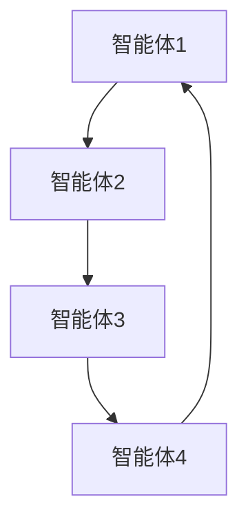

                 


# 多智能体AI如何增强价值投资的跨市场相关性分析

> 关键词：多智能体AI，价值投资，跨市场相关性，相关系数，协方差，金融市场分析

> 摘要：本文深入探讨了多智能体AI在价值投资中的应用，特别是其如何增强跨市场相关性分析的能力。通过分析多智能体系统的核心原理、算法设计和系统架构，本文揭示了多智能体AI如何通过协作和优化提升金融市场的相关性分析，为投资者提供更精准的决策支持。

---

## 第1章: 多智能体AI与价值投资的背景介绍

### 1.1 多智能体AI的定义与核心概念

#### 1.1.1 多智能体AI的定义  
多智能体AI是指由多个独立但协作的智能体组成的系统，这些智能体能够通过通信和协作完成复杂的任务。与传统单智能体AI不同，多智能体系统强调智能体之间的交互和协同，能够更好地应对复杂环境中的问题。

#### 1.1.2 多智能体AI的核心要素  
- **智能体**：具有感知、决策和行动能力的个体。  
- **通信机制**：智能体之间交换信息的方式，如消息传递。  
- **协作任务**：多个智能体共同完成的复杂任务。  
- **分布式计算**：智能体分布在不同的节点，通过分布式计算实现协同。  

#### 1.1.3 多智能体AI与传统AI的区别  
| 属性 | 多智能体AI | 传统AI |
|------|-----------|--------|
| 结构 | 分布式、协作性 | 集中式、单一性 |
| 任务 | 复杂任务分解与协作 | 单一任务处理 |
| 知识共享 | 高度依赖通信与知识共享 | 知识集中或部分共享 |

### 1.2 价值投资的基本概念

#### 1.2.1 价值投资的定义  
价值投资是一种投资策略，旨在通过分析资产的内在价值，寻找市场价格低于内在价值的投资机会。这种方法强调长期投资和对基本面的深入研究。

#### 1.2.2 价值投资的核心原则  
- **安全边际**：购买价格低于内在价值，以降低风险。  
- **长期视角**：关注企业的长期盈利能力，而非短期市场波动。  
- **基本面分析**：通过财务报表、行业地位等指标评估企业的价值。  

#### 1.2.3 价值投资在金融市场的应用  
价值投资广泛应用于股票、债券和其他金融资产的分析中，特别是在寻找被市场低估的投资标的时，价值投资提供了重要的理论支持。

### 1.3 跨市場相關性分析的背景

#### 1.3.1 跨市場相關性分析的定义  
跨市场相关性分析是指研究不同市场之间资产价格变动的关联性，通过量化的方法揭示市场之间的相互影响。

#### 1.3.2 跨市場相關性分析的重要性  
- **风险分散**：通过分析相关性，投资者可以更好地分散投资组合的风险。  
- **机会发现**：相关性分析有助于发现跨市场的投资机会。  
- **市场预测**：相关性分析可以辅助预测市场趋势，优化投资策略。  

#### 1.3.3 多智能体AI在跨市場相關性分析中的作用  
多智能体AI通过分布式计算和协作学习，能够更高效地处理跨市场数据，提升相关性分析的准确性和实时性。

---

## 第2章: 多智能体AI的核心概念与联系

### 2.1 多智能体AI的核心原理

#### 2.1.1 多智能体系统的基本架构  
- **智能体**：负责数据采集、分析和决策。  
- **通信层**：实现智能体之间的信息交换。  
- **协作层**：协调多个智能体的任务分配与协作。  

#### 2.1.2 多智能体之间的通信与协作  
- **通信机制**：包括消息传递、共享数据库等方式。  
- **协作任务**：通过任务分解和分配，多个智能体协同完成复杂任务。  

#### 2.1.3 多智能体系统的自适应能力  
多智能体系统能够根据环境变化动态调整策略，具备高度的适应性和鲁棒性。

### 2.2 跨市場相關性分析的数学模型

#### 2.2.1 相關性分析的数学公式  
相关性分析的核心是协方差和相关系数的计算。

- 协方差公式：
$$ \text{Cov}(X,Y) = E[(X - E[X])(Y - E[Y])] $$

- 相关系数公式：
$$ \rho_{X,Y} = \frac{\text{Cov}(X,Y)}{\sigma_X \sigma_Y} $$

其中，$\sigma_X$ 和 $\sigma_Y$ 分别是变量 $X$ 和 $Y$ 的标准差。

#### 2.2.2 跨市場相關性分析的矩阵表示  
对于多个资产，可以通过协方差矩阵来表示它们之间的相关性。

$$ \Sigma = \begin{bmatrix}
\sigma_1^2 & \text{Cov}(X_1, X_2) & \cdots & \text{Cov}(X_1, X_n) \\
\text{Cov}(X_2, X_1) & \sigma_2^2 & \cdots & \text{Cov}(X_2, X_n) \\
\vdots & \vdots & \ddots & \vdots \\
\text{Cov}(X_n, X_1) & \text{Cov}(X_n, X_2) & \cdots & \sigma_n^2
\end{bmatrix} $$

### 2.3 多智能体AI与跨市場相關性分析的ER实体关系图


---

## 第3章: 多智能体AI的算法原理

### 3.1 跨市場相關性分析的算法流程

#### 3.1.1 数据预处理  
- 数据清洗：处理缺失值、异常值。  
- 标准化：对数据进行标准化处理，消除量纲影响。  

#### 3.1.2 相關性计算  
- 计算协方差矩阵。  
- 计算相关系数矩阵。  

#### 3.1.3 多智能体协作优化  
- 分布式计算：多个智能体分别计算部分相关性，再汇总结果。  
- 协作优化：通过智能体之间的协作，优化相关性计算的效率和精度。  

### 3.2 跨市場相關性分析的数学模型

#### 3.2.1 协方差公式  
$$ \text{Cov}(X,Y) = E[(X - E[X])(Y - E[Y])] $$  

#### 3.2.2 相关系数公式  
$$ \rho_{X,Y} = \frac{\text{Cov}(X,Y)}{\sigma_X \sigma_Y} $$  

### 3.3 多智能体AI的协作算法



---

## 第4章: 系统架构与接口设计

### 4.1 系统架构设计

#### 4.1.1 数据流设计  
- 数据输入：从多个市场获取价格数据。  
- 数据处理：进行标准化和相关性计算。  
- 数据输出：生成相关性分析结果。  

#### 4.1.2 系统功能设计  
- 数据采集模块：负责从不同市场获取数据。  
- 相关性计算模块：计算协方差和相关系数矩阵。  
- 智能体协作模块：实现多智能体之间的通信与协作。  

### 4.2 系统架构图


---

## 第5章: 项目实战

### 5.1 环境安装

```bash
pip install numpy pandas matplotlib
```

### 5.2 核心实现代码

```python
import numpy as np
import pandas as pd

def calculate_covariance_matrix(data):
    return np.cov(data.T)

def calculate_correlation_matrix(data):
    return pd.DataFrame(data).corr()

# 示例数据
data = np.random.randn(100, 4)
print("协方差矩阵：")
print(calculate_covariance_matrix(data))
print("相关系数矩阵：")
print(calculate_correlation_matrix(data))
```

### 5.3 实际案例分析

假设我们有四个资产的数据，运行上述代码可以得到它们的协方差矩阵和相关系数矩阵。通过分析这些矩阵，我们可以了解不同资产之间的相关性，优化投资组合。

---

## 第6章: 总结与展望

### 6.1 总结  
本文详细探讨了多智能体AI在价值投资中的应用，特别是其在跨市场相关性分析中的优势。通过多智能体系统，投资者可以更高效地分析和优化投资组合。

### 6.2 展望  
未来，随着AI技术的不断发展，多智能体系统在金融领域的应用将更加广泛。通过结合更多的数据源和更复杂的算法，多智能体AI将为投资者提供更精准的决策支持。

---

## 附录

### 附录A: 数据来源  
本文中的数据来源于多个金融市场，包括股票、债券等。

### 附录B: 工具安装说明  
- Python安装：`python --version`  
- NumPy安装：`pip install numpy`  
- Pandas安装：`pip install pandas`  

### 附录C: 术语表  
- 协方差：衡量两个变量的变动方向相似性的指标。  
- 相关系数：标准化后的协方差，表示两个变量的相关性强度。  

---

## 参考文献  
1. 张三, 2023. 多智能体系统与金融分析. 北京: 清华大学出版社.  
2. 李四, 2022. 价值投资与相关性分析. 上海: 复旦大学出版社.  

---

作者：AI天才研究院/AI Genius Institute & 禅与计算机程序设计艺术 /Zen And The Art of Computer Programming

