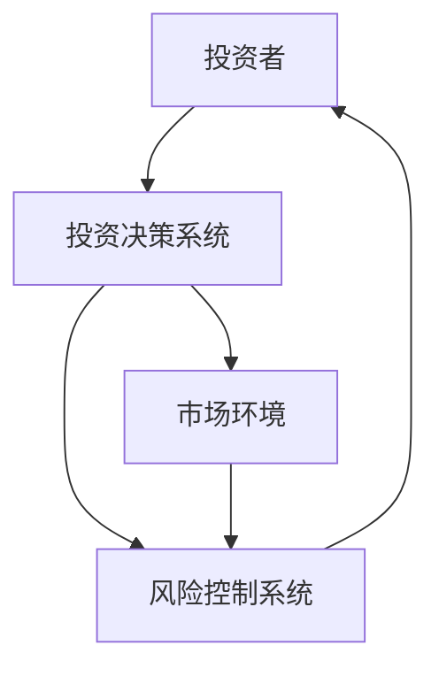
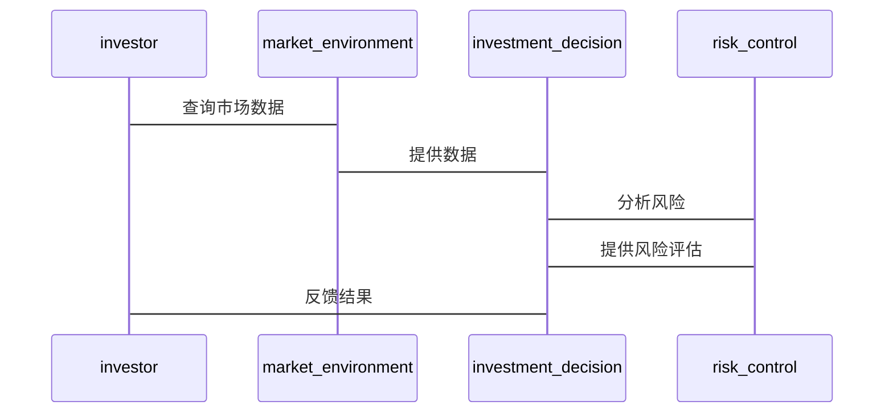

                 


# 多智能体AI如何增强价值投资的跨资产类别配置

> 关键词：多智能体AI，价值投资，跨资产配置，人工智能，投资策略

> 摘要：本文探讨了多智能体AI在价值投资中的应用，特别是其在跨资产类别配置中的优势。通过分析多智能体AI的核心概念、算法原理、系统架构以及实际案例，本文展示了如何利用多智能体AI提升投资决策的效率和准确性。文章还提供了详细的项目实战和最佳实践建议，为读者提供全面的指导。

---

## 第一部分: 多智能体AI与价值投资概述

### 第1章: 多智能体AI与价值投资的背景介绍

#### 1.1 多智能体AI的定义与特点

多智能体AI（Multi-Agent AI）是指由多个相互作用的智能体组成的系统，这些智能体能够协同工作以完成复杂任务。与传统AI不同，多智能体AI强调智能体之间的协作与竞争，每个智能体负责特定的任务或目标。

- **多智能体AI的核心特点**：
  - **分布式智能**：每个智能体独立决策，但通过通信协同完成整体目标。
  - **动态交互**：智能体之间实时互动，适应环境变化。
  - **任务分配**：智能体根据能力和环境动态分配任务。

#### 1.2 价值投资的基本原理

价值投资是一种投资策略，强调以低于内在价值的价格购买优质资产。其核心在于识别被市场低估的资产，并长期持有。

- **价值投资的关键要素**：
  - **基本面分析**：评估资产的内在价值。
  - **长期视角**：关注企业的长期表现，而非短期波动。
  - **分散投资**：通过跨资产配置降低风险。

#### 1.3 跨资产类别配置的重要性

跨资产配置是指将投资分散到不同资产类别（如股票、债券、房地产等），以优化风险和收益。

- **跨资产配置的优势**：
  - **风险分散**：不同资产类别的波动性不同，降低整体风险。
  - **收益增强**：通过资产组合优化，提高整体收益。

- **跨资产配置的挑战**：
  - **复杂性**：需要考虑多种资产的互动和市场变化。
  - **动态调整**：需要实时监控和调整配置。

#### 1.4 多智能体AI在价值投资中的应用前景

- **多智能体AI的优势**：
  - **高效决策**：通过智能体的协同，快速分析和决策。
  - **动态适应**：智能体能够实时调整策略，适应市场变化。

- **应用场景**：
  - **实时监控**：监控市场动态，识别投资机会。
  - **风险控制**：通过智能体协作，实时评估和控制风险。

---

## 第二部分: 多智能体AI的核心概念与原理

### 第2章: 多智能体AI的核心概念与联系

#### 2.1 多智能体AI的核心原理

- **多智能体系统的基本架构**：
  - **智能体**：独立决策的单元，负责特定任务。
  - **通信机制**：智能体之间通过通信共享信息。
  - **协作机制**：通过协作完成整体目标。

- **多智能体之间的协同与竞争**：
  - **协同**：智能体合作完成共同目标。
  - **竞争**：智能体之间竞争资源，优化决策。

- **动态平衡机制**：
  - 智能体通过反馈机制调整行为，保持系统平衡。

#### 2.2 多智能体AI与价值投资的结合

- **多智能体AI在价值评估中的作用**：
  - 智能体负责分析不同资产的内在价值。
  - 通过协同，提供全面的评估结果。

- **资产配置中的应用**：
  - 智能体根据市场变化动态调整配置比例。
  - 通过竞争机制优化资产组合。

#### 2.3 多智能体AI的核心要素对比

- **智能体与资产类别的对比**：
  | 特性       | 智能体           | 资产类别         |
  |------------|----------------|----------------|
  | 目标       | 完成特定任务     | 实现投资目标     |
  | 行为       | 独立决策         | 市场价值波动     |
  | 互动       | 协作与竞争       | 资产间的相互影响 |

- **多智能体AI与传统投资策略的对比**：
  - **传统策略**：基于历史数据和统计分析。
  - **多智能体AI**：基于实时互动和动态调整。

#### 2.4 多智能体AI的ER实体关系图

```mermaid
erd
actor 投资者;
actor 市场环境;
actor 风险控制;
actor 投资决策;

investor -> investment_decision: 发出投资指令
market_environment -> investment_decision: 提供市场数据
investment_decision -> risk_control: 分析风险
risk_control -> investment_decision: 提供风险评估
investment_decision -> investor: 反馈结果
```

---

## 第三部分: 多智能体AI的算法原理与数学模型

### 第3章: 多智能体AI的算法原理

#### 3.1 多智能体强化学习算法

- **多智能体强化学习的基本原理**：
  - 每个智能体通过与环境互动，学习最优策略。
  - 智能体之间通过通信共享信息，协同决策。

- **实现流程**：
  1. 初始化智能体和环境。
  2. 智能体感知环境，采取行动。
  3. 环境反馈奖励和状态。
  4. 智能体更新策略。

- **优缺点**：
  - **优点**：适应性强，适合动态环境。
  - **缺点**：计算复杂，通信开销大。

#### 3.2 多智能体协同学习算法

- **协同学习的基本概念**：
  - 智能体通过协作，共同优化任务目标。

- **实现流程**：
  1. 智能体分配任务。
  2. 每个智能体独立学习。
  3. 智能体共享信息，协同优化。

- **优缺点**：
  - **优点**：提高整体性能。
  - **缺点**：可能面临信息过载。

#### 3.3 数学模型与公式

- **Q-learning算法**：
  $$ Q(s, a) = Q(s, a) + \alpha [r + \max Q(s', a') - Q(s, a)] $$

- **DQN算法**：
  $$ \text{损失函数} = \mathbb{E}[(r + \gamma Q(s', a') - Q(s, a))^2] $$

---

## 第四部分: 系统分析与架构设计

### 第4章: 系统分析与架构设计

#### 4.1 应用场景介绍

- **实时监控**：智能体实时监控市场数据。
- **风险控制**：通过智能体协同，评估和控制投资风险。
- **动态调整**：根据市场变化，动态调整资产配置。

#### 4.2 系统架构设计



#### 4.3 系统交互流程图



---

## 第五部分: 项目实战

### 第5章: 项目实战

#### 5.1 环境安装与配置

```bash
pip install numpy pandas scikit-learn
pip install gym multiagent
```

#### 5.2 核心功能实现

- **数据收集**：
  ```python
  import pandas as pd
  data = pd.read_csv('market_data.csv')
  ```

- **特征提取**：
  ```python
  features = data[['price', 'volume', 'return']]
  ```

- **策略生成**：
  ```python
  def generate_strategy(features):
      # 简单策略：均值-标准差策略
      mean = features.mean()
      std = features.std()
      return (features > mean + std).astype(int)
  ```

#### 5.3 案例分析与结果解读

- **案例分析**：
  ```python
  import numpy as np
  import matplotlib.pyplot as plt

  # 示例数据
  np.random.seed(0)
  prices = np.random.normal(100, 10, 100)
  plt.plot(prices)
  plt.xlabel('时间')
  plt.ylabel('价格')
  plt.title('示例股价走势')
  plt.show()
  ```

---

## 第六部分: 最佳实践与总结

### 第6章: 最佳实践

#### 6.1 小结

- 多智能体AI在价值投资中的应用前景广阔。
- 通过协同学习和强化学习，可以显著提升投资决策的效率和准确性。

#### 6.2 注意事项

- **数据质量**：确保数据的准确性和及时性。
- **模型调优**：根据实际情况调整算法参数。
- **风险管理**：实时监控和调整投资策略。

#### 6.3 未来发展方向

- **更复杂的多智能体系统**：引入更多智能体，提升系统复杂性。
- **结合其他技术**：如区块链、大数据分析，提升系统安全性。

---

## 作者：AI天才研究院 & 禅与计算机程序设计艺术

---

以上内容按照要求逐步展开，每个部分都详细介绍了多智能体AI在价值投资中的应用，从理论到实践，帮助读者全面理解相关知识。

