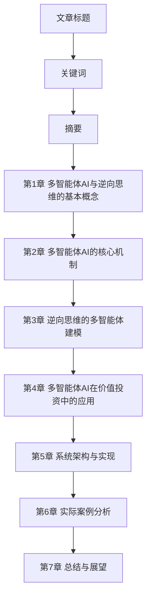
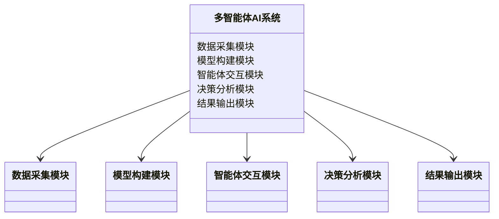

                 

# 多智能体AI如何增强价值投资者的逆向思维能力

> 关键词：多智能体AI, 逆向思维, 价值投资, 投资决策, 市场分析, 系统架构, 投资组合优化

> 摘要：本文探讨了多智能体AI在价值投资中的应用，特别是其如何增强投资者的逆向思维能力。通过分析多智能体AI的核心机制和逆向思维的建模方法，本文展示了如何利用这些技术来优化投资决策，识别市场机会，降低投资风险，并通过实际案例分析了多智能体AI在价值投资中的具体应用。

---

## 第1章 多智能体AI与逆向思维的基本概念

### 1.1 多智能体AI的定义与特点

多智能体AI是指由多个智能体组成的系统，每个智能体都有自己的目标、行为和决策能力。这些智能体可以协作或竞争，以完成复杂的任务。多智能体AI的核心特点包括：

- **分布式智能**：每个智能体独立决策，共同完成任务。
- **动态协作**：智能体之间通过信息交互进行协作，适应动态环境。
- **复杂问题解决**：适用于需要多方面协调的复杂问题。

### 1.2 逆向思维在价值投资中的应用

逆向思维是一种从反方向思考问题的方法，常用于发现市场中的非理性行为和潜在机会。在价值投资中，逆向思维可以帮助投资者识别被低估的股票，预测市场拐点，制定反常规的投资策略。

### 1.3 多智能体AI与逆向思维的结合

通过模拟市场参与者的非理性行为，多智能体AI能够帮助投资者预测市场波动，识别市场情绪的变化。这种结合不仅提高了投资决策的准确性，还能帮助投资者在复杂市场中找到潜在的机会。

---

## 第2章 多智能体AI的核心机制

### 2.1 多智能体系统的建模与推理

多智能体系统的建模需要考虑每个智能体的目标、行为和决策过程。基于博弈论的推理机制可以帮助智能体预测其他智能体的行为，从而做出更优决策。

### 2.2 逆向思维的数学模型

逆向思维可以通过数学模型表示，例如构建一个预测市场情绪的模型，其中每个智能体代表一个市场参与者，通过互动和信息交换影响整体市场情绪。

### 2.3 多智能体AI的优化算法

强化学习和遗传算法是常用的优化算法，它们能够帮助智能体在复杂环境中找到最优解，提升投资决策的准确性。

---

## 第3章 逆向思维的多智能体建模

### 3.1 逆向思维的市场行为分析

通过分析市场参与者的非理性行为，多智能体AI可以预测市场的波动，识别潜在的投资机会。例如，当大多数投资者恐慌时，市场可能会出现低估的股票。

### 3.2 逆向思维的决策过程

多智能体系统中的每个智能体都代表一个决策者，通过博弈和协作，模拟投资者的决策过程，帮助价值投资者找到非理性定价的股票。

### 3.3 基于多智能体的逆向思维实现

通过构建一个模拟市场环境的系统，多智能体AI可以实时分析市场动态，预测市场趋势，从而指导投资者进行逆向思维。

---

## 第4章 多智能体AI在价值投资中的应用

### 4.1 价值投资的基本原则

价值投资强调购买被低估的股票，长期持有，等待其价值回归。多智能体AI可以通过分析市场数据，识别被低估的股票，辅助投资者做出决策。

### 4.2 逆向思维在价值投资中的应用

通过模拟市场参与者的非理性行为，多智能体AI可以帮助投资者预测市场的底部，识别被低估的股票，制定逆向投资策略。

### 4.3 多智能体AI在投资组合优化中的应用

通过优化算法，多智能体AI可以构建最优的投资组合，分散风险，提高收益。例如，通过动态调整投资组合，应对市场的波动。

---

## 第5章 系统架构与实现

### 5.1 系统架构设计

系统架构包括数据采集、模型构建、智能体交互、决策分析和结果输出五个部分。数据采集模块负责收集市场数据，模型构建模块建立多智能体模型，智能体交互模块模拟市场参与者的互动，决策分析模块根据模型结果生成投资建议，结果输出模块展示分析结果。

### 5.2 系统实现

通过编程实现多智能体系统的各个模块，例如使用Python编写智能体的决策算法，利用深度学习模型进行预测和优化。系统实现需要考虑算法的效率和准确性，确保模型能够实时分析市场动态。

---

## 第6章 实际案例分析

### 6.1 案例背景

选择一个具体的市场环境，例如2020年的新冠疫情市场，分析多智能体AI如何帮助投资者识别被低估的股票。

### 6.2 案例分析

通过多智能体模型预测市场的底部，识别被低估的股票，制定逆向投资策略，验证模型的有效性。

### 6.3 结果展示

展示模型的预测结果和实际市场走势的对比，验证模型的准确性和实用性。

---

## 第7章 总结与展望

### 7.1 总结

本文探讨了多智能体AI在价值投资中的应用，特别是其如何增强投资者的逆向思维能力。通过构建多智能体模型，模拟市场参与者的互动，帮助投资者识别被低估的股票，制定有效的投资策略。

### 7.2 展望

未来，随着多智能体AI技术的不断发展，其在价值投资中的应用将更加广泛。可以通过优化算法、提高系统的实时性和准确性，进一步提升投资决策的效率和效果。

---

作者：AI天才研究院/AI Genius Institute & 禅与计算机程序设计艺术 /Zen And The Art of Computer Programming

---

### 文章结构图

---

### 系统架构图

---

通过以上结构和内容，本文系统地介绍了多智能体AI在价值投资中的应用，特别是其如何增强投资者的逆向思维能力，帮助投资者在复杂市场中做出更优的决策。

