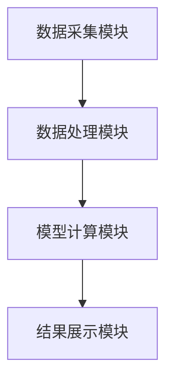
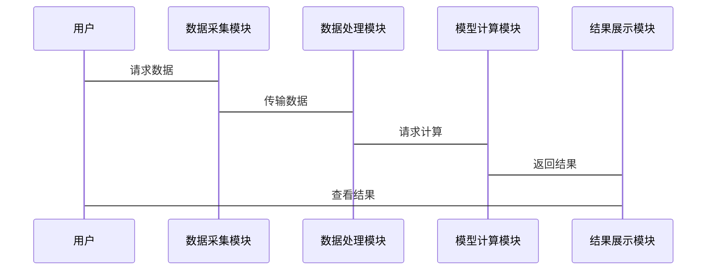

                 


# 多智能体AI如何提升价值投资中的时机选择

> 关键词：多智能体AI，价值投资，时机选择，强化学习，协作优化，金融建模，系统架构

> 摘要：本文探讨了多智能体AI在价值投资中的应用，特别是如何通过多智能体系统优化投资时机选择。文章从背景、核心概念、算法原理、系统设计、实战案例等方面展开，详细分析了多智能体AI如何提升价值投资的效率和准确性。

---

# 正文

## 第1章: 多智能体AI与价值投资概述

### 1.1 多智能体AI的定义与特点

#### 1.1.1 多智能体系统的基本概念
多智能体系统（Multi-Agent System, MAS）是由多个智能体组成的系统，这些智能体能够自主决策、协作完成任务。每个智能体都有自己的目标、知识和行为方式。

#### 1.1.2 多智能体AI的核心特点
- **分布式智能**：多个智能体协同工作，避免单点故障。
- **自主性**：每个智能体能够独立决策。
- **协作性**：智能体之间通过通信和协作完成复杂任务。
- **动态性**：系统能够适应环境变化。

#### 1.1.3 多智能体与单智能体AI的区别
| 特性 | 单智能体AI | 多智能体AI |
|------|------------|------------|
| 决策中心 | 单一决策中心 | 分布式决策中心 |
| 系统复杂度 | 较低 | 较高 |
| 应用场景 | 单任务 | 多任务协作 |

### 1.2 价值投资的基本原理

#### 1.2.1 价值投资的定义
价值投资是一种投资策略，通过分析企业的基本面，寻找被市场低估的投资标的。

#### 1.2.2 价值投资的核心原则
- **长期视角**：关注企业的长期价值。
- **安全边际**：买入价格低于内在价值。
- **选股标准**：高ROE、稳定收益、行业龙头等。

#### 1.2.3 价值投资与时机选择的关系
时机选择是价值投资的重要组成部分，合理的时机选择能够最大化投资收益。

### 1.3 多智能体AI在价值投资中的应用前景

#### 1.3.1 多智能体AI的优势
- **分布式计算**：能够处理复杂的数据和任务。
- **协作能力**：多个智能体可以分别负责不同的分析任务。
- **动态适应**：能够快速适应市场变化。

#### 1.3.2 价值投资中时机选择的重要性
时机选择直接影响投资收益，多智能体AI能够通过实时数据分析优化时机选择。

#### 1.3.3 多智能体AI在时机选择中的潜力
- **实时监控**：多智能体可以实时监控市场数据。
- **多维度分析**：从多个维度分析市场趋势。
- **协作决策**：多个智能体协作做出最优决策。

### 1.4 本章小结
本章介绍了多智能体AI的基本概念和特点，分析了价值投资的基本原理及其与时机选择的关系，最后探讨了多智能体AI在价值投资中的应用前景。

---

## 第2章: 多智能体系统的核心概念

### 2.1 多智能体系统的结构与协作

#### 2.1.1 多智能体系统的组成
- **智能体**：能够感知环境并采取行动的实体。
- **环境**：智能体所处的外部环境。
- **通信机制**：智能体之间交换信息的方式。
- **协作机制**：智能体协作完成任务的方式。

#### 2.1.2 多智能体系统中的协作机制
- **直接协作**：智能体之间直接交换信息并协作完成任务。
- **间接协作**：通过共享信息或改变环境来间接协作。

#### 2.1.3 多智能体系统的通信与协调
- **通信协议**：智能体之间通信的规则和格式。
- **协调机制**：确保智能体之间协作的机制。

### 2.2 多智能体系统中的角色分配

#### 2.2.1 角色分配的基本原则
- **任务需求**：根据任务需求分配角色。
- **智能体能力**：根据智能体的能力分配角色。
- **动态调整**：根据环境变化动态调整角色。

#### 2.2.2 基于任务的角色分配算法
- **任务分解**：将整体任务分解为多个子任务。
- **角色分配**：根据子任务分配不同的角色。

#### 2.2.3 角色分配的动态调整
- **动态检测**：检测环境变化和任务需求的变化。
- **调整角色**：根据变化调整角色分配。

### 2.3 多智能体系统中的决策机制

#### 2.3.1 基于博弈论的决策模型
- **博弈论基础**：分析多个智能体之间的博弈关系。
- **纳什均衡**：每个智能体在最优策略下的均衡状态。

#### 2.3.2 基于强化学习的决策方法
- **强化学习**：通过奖励机制优化决策。
- **策略网络**：智能体通过策略网络进行决策。

#### 2.3.3 多智能体系统中的集体决策
- **集体决策**：多个智能体共同决策。
- **共识算法**：确保智能体之间达成共识的算法。

### 2.4 本章小结
本章详细介绍了多智能体系统的核心概念，包括系统的结构、协作机制、角色分配和决策机制。

---

## 第3章: 强化学习在时机选择中的应用

### 3.1 强化学习的基本原理

#### 3.1.1 强化学习的定义
强化学习是一种通过试错方式来学习策略的机器学习方法。

#### 3.1.2 强化学习的核心要素
- **状态空间**：环境中的所有可能状态。
- **动作空间**：智能体可以执行的所有动作。
- **奖励函数**：智能体执行动作后获得的奖励。

#### 3.1.3 强化学习与监督学习的区别
| 特性 | 强化学习 | 监督学习 |
|------|----------|----------|
| 数据来源 | 环境反馈 | 标签数据 |
| 决策方式 | 自主决策 | 标签指导 |

### 3.2 基于强化学习的时机选择模型

#### 3.2.1 状态空间的定义
- **市场数据**：如股票价格、成交量等。
- **基本面数据**：如公司财务指标。

#### 3.2.2 动作空间的设计
- **买入**：执行买入动作。
- **卖出**：执行卖出动作。
- **持有**：保持当前状态。

#### 3.2.3 奖励函数的构建
- **收益**：投资收益。
- **风险**：投资风险。

### 3.3 强化学习算法在时机选择中的实现

#### 3.3.1 Q-learning算法
Q-learning算法通过更新Q值表来学习最优策略。

$$ Q(s, a) = Q(s, a) + \alpha (r + \gamma \max Q(s', a') - Q(s, a)) $$

#### 3.3.2 Deep Q-Network算法
Deep Q-Network（DQN）算法通过深度神经网络近似Q值函数。

#### 3.3.3 多智能体强化学习算法
多智能体强化学习算法通过多个智能体协作学习。

### 3.4 本章小结
本章介绍了强化学习的基本原理，并详细探讨了其在时机选择中的应用。

---

## 第4章: 多智能体协作优化算法

### 4.1 多智能体协作优化的基本原理

#### 4.1.1 协作优化的定义
协作优化是指多个智能体通过协作实现整体优化。

#### 4.1.2 协作优化的核心要素
- **协作目标**：整体优化的目标。
- **协作机制**：智能体协作的方式。
- **优化算法**：实现协作优化的算法。

### 4.2 基于纳什均衡的协作优化

#### 4.2.1 纳什均衡的定义
纳什均衡是指在博弈中，每个智能体都在最优策略下无法通过单方面改变策略而提高收益。

#### 4.2.2 纳什均衡在协作优化中的应用
- **市场均衡**：多个智能体在市场中达到均衡状态。
- **策略调整**：根据纳什均衡调整策略。

### 4.3 多智能体协作优化算法

#### 4.3.1 多智能体协作优化算法的实现
- **分布式优化**：每个智能体独立优化。
- **集中式优化**：集中优化多个智能体的决策。

#### 4.3.2 多智能体协作优化的数学模型
$$ \max \sum_{i=1}^{n} f_i(x_i) $$

### 4.4 本章小结
本章详细介绍了多智能体协作优化的基本原理和算法实现。

---

## 第5章: 基于多智能体的金融建模

### 5.1 金融建模的基本原理

#### 5.1.1 金融建模的定义
金融建模是通过数学模型模拟金融市场行为。

#### 5.1.2 金融建模的核心要素
- **数据来源**：市场数据、公司财务数据等。
- **模型假设**：模型建立的假设条件。
- **模型参数**：模型中的参数。

### 5.2 基于多智能体的金融建模

#### 5.2.1 数据处理
- **数据清洗**：处理缺失数据和异常值。
- **数据转换**：将数据转换为适合模型的形式。

#### 5.2.2 特征提取
- **特征选择**：选择重要的特征。
- **特征工程**：构建新的特征。

#### 5.2.3 模型设计
- **模型选择**：选择适合的模型。
- **模型训练**：通过数据训练模型。

### 5.3 本章小结
本章介绍了基于多智能体的金融建模过程，包括数据处理、特征提取和模型设计。

---

## 第6章: 系统架构设计

### 6.1 系统功能设计

#### 6.1.1 系统功能模块
- **数据采集模块**：采集市场数据和公司数据。
- **模型计算模块**：计算投资时机。
- **结果展示模块**：展示投资结果。

#### 6.1.2 系统功能流程
1. 数据采集模块采集数据。
2. 模型计算模块分析数据。
3. 结果展示模块展示结果。

### 6.2 系统架构设计

#### 6.2.1 系统架构图


#### 6.2.2 系统接口设计
- **数据接口**：与数据源对接。
- **模型接口**：与模型计算模块对接。
- **用户接口**：与用户交互。

### 6.3 系统交互设计

#### 6.3.1 系统交互流程图


### 6.4 本章小结
本章详细介绍了系统架构设计，包括功能设计、架构设计和交互设计。

---

## 第7章: 项目实战

### 7.1 环境安装

#### 7.1.1 系统需求
- **操作系统**：Windows/Mac/Linux。
- **Python版本**：Python 3.6以上。
- **依赖库**：numpy、pandas、tensorflow、keras。

#### 7.1.2 安装步骤
1. 安装Python。
2. 安装依赖库。

### 7.2 核心实现源代码

#### 7.2.1 数据采集模块
```python
import pandas as pd

def collect_data(ticker):
    # 从数据源获取数据
    data = pd.DataFrame()
    return data
```

#### 7.2.2 模型计算模块
```python
import numpy as np
import tensorflow as tf

def build_model(input_shape):
    model = tf.keras.Sequential()
    model.add(tf.keras.layers.Dense(64, activation='relu', input_shape=input_shape))
    model.add(tf.keras.layers.Dense(1, activation='sigmoid'))
    return model
```

### 7.3 代码应用解读与分析

#### 7.3.1 数据采集模块解读
数据采集模块负责从数据源获取数据，如股票价格、财务指标等。

#### 7.3.2 模型计算模块解读
模型计算模块使用深度神经网络模型进行预测，输出投资时机。

### 7.4 实际案例分析

#### 7.4.1 案例背景
以某股票为例，分析多智能体AI如何选择最佳买入时机。

#### 7.4.2 案例分析
通过模型计算模块分析，得出最佳买入时机。

### 7.5 项目小结
本章通过实际项目案例，详细讲解了多智能体AI在价值投资中的应用。

---

## 第8章: 总结与展望

### 8.1 总结
本文详细探讨了多智能体AI在价值投资中的应用，特别是如何通过多智能体系统优化投资时机选择。

### 8.2 注意事项
- **数据质量**：确保数据准确可靠。
- **模型调优**：不断优化模型参数。
- **风险管理**：控制投资风险。

### 8.3 未来展望
- **算法优化**：进一步优化多智能体协作算法。
- **应用场景扩展**：将多智能体AI应用于更多金融领域。

### 8.4 本章小结
本章总结了全文内容，并提出了未来的研究方向。

---

## 作者：AI天才研究院/AI Genius Institute & 禅与计算机程序设计艺术 /Zen And The Art of Computer Programming

