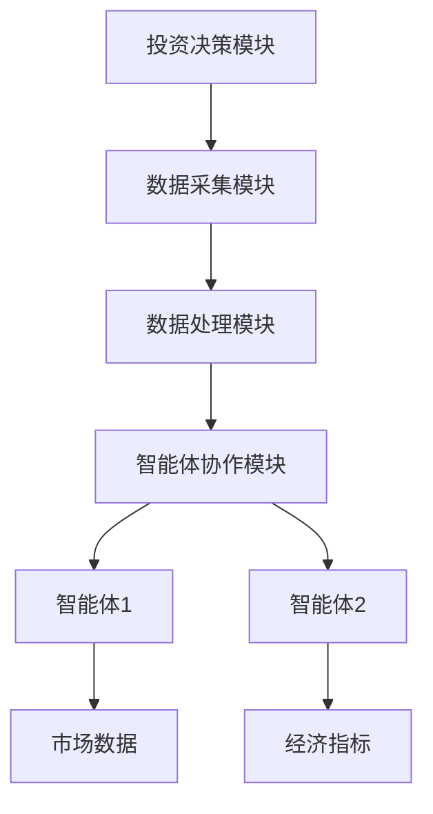
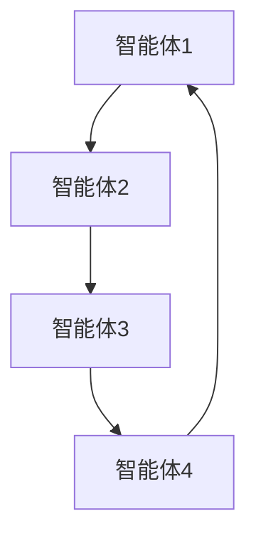

                 

# 多智能体AI如何提升价值投资的全球化视野

> 关键词：多智能体AI，价值投资，全球化视野，金融建模，分布式计算，协作学习

> 摘要：本文探讨了多智能体AI在价值投资中的应用，特别是如何通过全球化视角提升投资决策的效率和准确性。文章从多智能体AI的基本概念出发，分析其在金融领域的优势，详细讲解算法原理、数学模型和系统架构设计，并通过实际案例展示其在价值投资中的应用效果。最后，总结了最佳实践和未来研究方向。

---

## 第1章: 多智能体AI的背景与核心概念

### 1.1 多智能体AI的定义与特点

#### 1.1.1 多智能体系统的定义

多智能体AI（Multi-Agent AI）是指由多个相互作用的智能体组成的系统，每个智能体都有一定的自主性，能够感知环境、做出决策并进行协作或竞争。与传统的单智能体系统相比，多智能体系统更适用于复杂、动态和分布式的任务环境。

#### 1.1.2 多智能体AI的核心特点

1. **分布性**：智能体分布在不同的位置，独立决策。
2. **协作性**：智能体之间通过通信和协作完成共同目标。
3. **动态性**：环境和智能体的状态不断变化，需要实时调整策略。
4. **自主性**：每个智能体都有一定的自主决策能力。

#### 1.1.3 多智能体与传统AI的区别

传统的单智能体系统通常在一个集中式环境中运行，而多智能体系统则是分布式的，多个智能体之间需要协调和通信。多智能体系统更适用于复杂的任务，如金融市场的实时分析和决策。

### 1.2 多智能体AI在金融领域的应用背景

#### 1.2.1 金融领域的复杂性与挑战

金融市场具有高度不确定性和复杂性，传统的单模型分析方法难以捕捉市场的全貌。多智能体AI能够模拟市场中的多个参与者（如投资者、机构），从而更全面地分析市场动态。

#### 1.2.2 多智能体AI在金融中的优势

1. **分布式计算能力**：能够同时处理大量的数据和信息。
2. **协作学习**：通过智能体之间的协作，提高决策的准确性和鲁棒性。
3. **动态适应性**：能够实时调整策略，应对市场的变化。

#### 1.2.3 价值投资的全球化视野需求

价值投资需要考虑全球市场的经济指标、行业趋势和公司基本面。多智能体AI可以通过全球化数据源进行分析，提供更全面的投资决策支持。

---

## 第2章: 多智能体AI的核心概念与联系

### 2.1 多智能体系统的原理

#### 2.1.1 多智能体系统的组成要素

1. **智能体**：具有感知和决策能力的个体。
2. **环境**：智能体所处的外部世界，包括金融市场、经济指标等。
3. **通信机制**：智能体之间交换信息的方式。
4. **协作协议**：定义智能体之间的协作规则。

#### 2.1.2 智能体之间的交互机制

智能体之间的交互可以通过直接通信或间接影响。直接通信包括消息传递，间接影响则是通过市场机制实现。

#### 2.1.3 多智能体系统的协作与竞争

协作有助于实现共同目标，而竞争则可以提高系统的效率和资源分配。多智能体系统需要平衡协作与竞争的关系。

### 2.2 价值投资的全球化视角

#### 2.2.1 价值投资的核心理念

价值投资强调以低于内在价值的价格购买优质资产。多智能体AI可以通过分析全球市场数据，帮助投资者发现被低估的投资机会。

#### 2.2.2 全球化视野对投资决策的影响

全球化视野能够捕捉到跨国市场的投资机会，降低单一市场的风险。多智能体AI能够实时监控全球市场动态，提供更全面的投资分析。

#### 2.2.3 多智能体AI在价值投资中的角色

多智能体AI可以模拟不同市场参与者的决策，分析其对市场的影响，从而为价值投资提供更准确的预测和建议。

### 2.3 多智能体AI的核心算法与数学模型

#### 2.3.1 分布式计算与协作学习

多智能体AI依赖于分布式计算和协作学习，通过智能体之间的协作来提高整体系统的性能。

#### 2.3.2 价值评估的数学模型

价值评估模型可以通过多智能体协作来优化，考虑多个因素对资产价值的影响。

---

## 第3章: 多智能体AI的算法原理

### 3.1 分布式计算与协作学习

#### 3.1.1 分布式计算的基本原理

分布式计算将任务分解为多个部分，分别在不同的计算节点上执行，最后汇总结果。多智能体AI利用分布式计算来处理大规模数据。

#### 3.1.2 协作学习的实现机制

协作学习是指多个智能体共同学习同一个任务，通过共享信息和经验来提高学习效果。

#### 3.1.3 多智能体AI中的通信协议

智能体之间的通信需要高效的协议，确保信息的准确传递和处理。

### 3.2 多智能体系统的数学模型

#### 3.2.1 多智能体系统的状态表示

状态表示需要涵盖市场的多方面信息，如价格、成交量、市场情绪等。

#### 3.2.2 行为决策的数学模型

行为决策模型可以通过强化学习等方法，优化智能体的决策策略。

#### 3.2.3 协作与竞争的数学表达

协作与竞争可以通过博弈论模型来描述，分析智能体之间的互动关系。

---

## 第4章: 多智能体AI的数学模型与公式

### 4.1 多智能体系统的数学框架

#### 4.1.1 状态空间的定义

状态空间包括所有可能的市场状态，如价格、成交量、市场情绪等。

#### 4.1.2 动作空间的定义

动作空间是指智能体可以执行的所有操作，如买入、卖出、持有等。

#### 4.1.3 奖励函数的设计

奖励函数用于衡量智能体的行为是否符合预期目标，如获得超额收益。

### 4.2 价值评估的数学模型

#### 4.2.1 价值函数的定义

价值函数反映了资产的真实价值，可以通过多智能体协作来优化。

#### 4.2.2 状态转移的概率模型

状态转移模型描述了市场状态的变化过程，可以用马尔可夫链来建模。

#### 4.2.3 多智能体协作的数学表达

协作过程可以通过博弈论模型来描述，分析智能体之间的互动关系。

---

## 第5章: 多智能体AI的系统架构设计

### 5.1 系统功能设计

#### 5.1.1 投资决策模块

投资决策模块负责根据市场数据和智能体的协作结果，生成投资策略。

#### 5.1.2 数据采集与处理模块

数据采集模块负责收集全球市场数据，处理模块对数据进行清洗和预处理。

#### 5.1.3 智能体协作模块

协作模块负责管理智能体之间的通信和协作，确保系统的高效运行。

### 5.2 系统架构图

### 5.3 数据流与信息交互图

---

## 第6章: 多智能体AI的项目实战

### 6.1 环境安装与配置

#### 6.1.1 开发环境的选择

推荐使用Python和相关库（如TensorFlow、Keras）进行开发。

#### 6.1.2 依赖库的安装

安装必要的库，如numpy、pandas、scikit-learn等。

#### 6.1.3 网络配置与数据源接入

配置网络环境，接入全球市场数据源，如Yahoo Finance、 Bloomberg。

### 6.2 系统核心实现

#### 6.2.1 智能体通信接口设计

设计智能体之间的通信接口，实现信息的高效传递。

#### 6.2.2 多智能体协作算法实现

实现多智能体协作算法，如分布式强化学习。

#### 6.2.3 价值评估模型的实现

基于多智能体协作，优化价值评估模型。

### 6.3 实际案例分析

#### 6.3.1 案例背景介绍

分析一个具体的投资案例，展示多智能体AI的应用效果。

#### 6.3.2 案例数据准备

准备相关的市场数据和经济指标。

#### 6.3.3 系统运行与结果分析

运行系统，分析结果并总结经验。

---

## 第7章: 最佳实践与总结

### 7.1 多智能体AI的优化建议

#### 7.1.1 算法优化的方向

持续优化多智能体协作算法，提高系统的效率和准确性。

#### 7.1.2 系统性能的提升方法

通过分布式计算和并行处理，提升系统的性能。

#### 7.1.3 数据质量的优化策略

确保数据的准确性和全面性，提高模型的预测能力。

### 7.2 项目小结与未来展望

#### 7.2.1 项目总结

总结项目的主要成果和经验教训。

#### 7.2.2 未来研究方向

探讨多智能体AI在金融领域的进一步应用，如实时市场预测、风险控制等。

#### 7.2.3 对读者的建议与展望

鼓励读者进一步研究和实践多智能体AI在金融领域的应用。

---

## 第8章: 注意事项与拓展阅读

### 8.1 项目实施中的注意事项

#### 8.1.1 数据隐私与安全问题

确保数据的隐私和安全，遵守相关法律法规。

#### 8.1.2 系统稳定性的保障措施

设计高效的系统架构，确保系统的稳定运行。

#### 8.1.3 智能体协作的协调问题

优化智能体协作机制，确保协作的有效性。

### 8.2 拓展阅读

推荐一些相关书籍和论文，供读者深入研究。

---

作者：AI天才研究院/AI Genius Institute & 禅与计算机程序设计艺术 /Zen And The Art of Computer Programming

