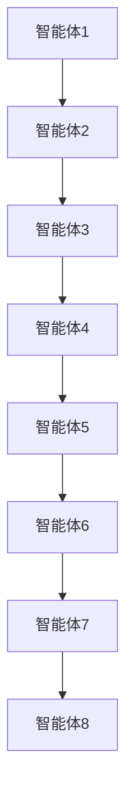
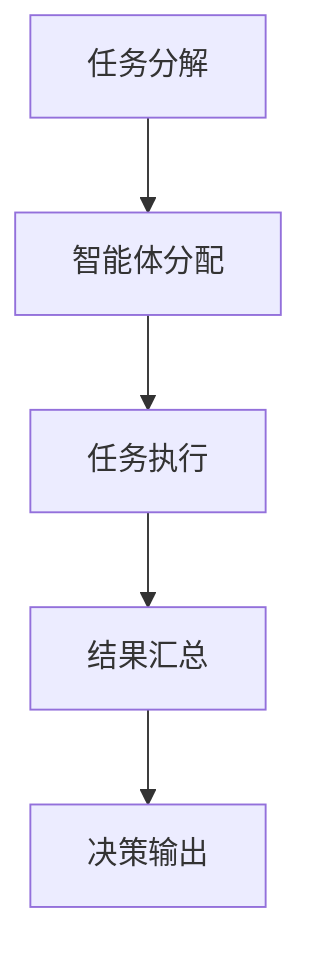

                 

---

# 多智能体AI如何改进巴菲特的现金流折现模型

> 关键词：多智能体AI、现金流折现模型、企业价值评估、分布式计算、协同算法、巴菲特投资理念

> 摘要：  
本文探讨了多智能体人工智能（AI）技术如何优化巴菲特的现金流折现模型，以提升企业价值评估的准确性。通过分析多智能体AI的核心概念、算法原理及其与现金流折现模型的结合方式，本文展示了如何利用分布式计算和协同算法改进传统估值方法。文章结构清晰，首先从背景介绍入手，逐步深入讲解多智能体AI的协同机制、数学模型和系统架构，最后通过实际案例展示其在企业价值评估中的应用效果。本文旨在为投资决策提供更精准的工具，同时展望了多智能体AI在金融领域的未来发展方向。

---

## 第一部分: 多智能体AI与现金流折现模型的背景介绍

### 第1章: 多智能体AI与现金流折现模型概述

#### 1.1 多智能体AI的定义与特点
##### 1.1.1 多智能体AI的定义
多智能体AI（Multi-Agent AI）是由多个相互作用的智能体组成的系统，每个智能体都有自己的目标、决策机制和行动方式。与传统AI不同，多智能体AI强调智能体之间的协同与协作，通过分布式计算实现复杂任务的高效解决。

##### 1.1.2 多智能体AI的核心特点
- **分布式计算**：智能体之间通过分布式计算协同工作，避免单点故障。
- **自主性**：每个智能体都能自主决策，适应环境变化。
- **协作性**：智能体之间通过通信和协调完成共同目标。
- **可扩展性**：系统可以根据需求动态扩展智能体数量。

##### 1.1.3 多智能体AI与传统AI的区别
| 特性                | 多智能体AI                          | 传统AI                              |
|---------------------|------------------------------------|------------------------------------|
| 决策主体            | 多个智能体                          | 单一决策主体                        |
| 协作方式            | 分布式协作，智能体之间通信          | 集中式决策，依赖中央控制系统        |
| 应用场景            | 复杂任务，如自动驾驶、智能城市      | 单一任务，如图像识别、语音识别      |

#### 1.2 巴菲特现金流折现模型的定义与特点
##### 1.2.1 现金流折现模型的定义
现金流折现模型（DCF模型）是一种用于估计企业内在价值的方法，通过预测企业未来现金流并将其折现为现值，来评估企业的合理估值。

##### 1.2.2 现金流折现模型的核心特点
- **现金流预测**：模型的核心在于准确预测未来现金流。
- **现值计算**：通过折现率将未来现金流折算为当前价值。
- **敏感性分析**：模型结果对输入参数（如折现率、增长率）敏感。

##### 1.2.3 巴菲特投资理念与现金流折现模型的关系
巴菲特的投资理念强调企业内在价值的重要性，而现金流折现模型正是评估内在价值的核心工具。巴菲特通过DCF模型分析企业的未来现金流，判断其内在价值是否被市场低估。

#### 1.3 多智能体AI与现金流折现模型的结合背景
##### 1.3.1 传统现金流折现模型的局限性
- **现金流预测的不确定性**：传统模型依赖人工预测，存在主观性和不准确性。
- **计算复杂性**：复杂的现金流预测需要大量计算资源。
- **信息处理能力有限**：难以处理海量数据和实时信息。

##### 1.3.2 多智能体AI的优势与潜力
- **分布式计算能力**：多智能体AI可以并行处理大量数据，提高计算效率。
- **协同预测能力**：多个智能体协同工作，提高现金流预测的准确性。
- **动态适应性**：智能体能够实时调整预测模型，适应市场变化。

##### 1.3.3 两者的结合对企业价值评估的意义
通过结合多智能体AI，现金流折现模型可以实现更精确的现金流预测和更高效的计算过程，从而提高企业价值评估的准确性和实时性。这种结合不仅提升了模型的计算效率，还增强了预测的准确性，为企业投资决策提供更有力的支持。

---

### 第2章: 多智能体AI的核心概念与原理

#### 2.1 多智能体AI的核心概念
##### 2.1.1 智能体的定义与分类
智能体（Agent）是一个能够感知环境并采取行动以实现目标的实体。根据智能体的智能水平和决策能力，可以分为：
- **反应式智能体**：基于当前感知做出反应。
- **认知式智能体**：具备推理、规划能力。
- **协作式智能体**：能够与其他智能体协作完成任务。

##### 2.1.2 多智能体系统的组成与特点
多智能体系统由多个智能体组成，每个智能体负责特定任务，通过通信和协作完成整体目标。其特点包括：
- **分布式结构**：系统由多个智能体构成，无中心控制节点。
- **动态协作**：智能体之间实时通信，动态调整协作策略。
- **自适应性**：系统能够根据环境变化自动调整。

##### 2.1.3 多智能体系统中的协同与协作机制
协同机制是多智能体系统的核心，包括：
- **通信机制**：智能体之间通过消息传递进行信息共享。
- **协调机制**：通过协商和协议分配任务。
- **协作机制**：智能体协同完成共同目标。

---

#### 2.2 多智能体AI的算法原理
##### 2.2.1 分布式计算与多智能体协作
分布式计算是多智能体AI的基础，通过将任务分解为多个子任务，分配给不同的智能体完成。每个智能体负责一部分计算，并将结果汇总到中央节点或直接传递给相关智能体。

##### 2.2.2 多智能体系统的通信与协调
智能体之间的通信可以通过消息队列或发布-订阅模式实现。协调机制通过仲裁或协商算法确保任务分配的合理性和效率。

##### 2.2.3 多智能体系统的决策机制
多智能体系统的决策机制包括：
- **分布式决策**：每个智能体基于局部信息做出决策。
- **共识算法**：通过共识算法（如Raft、Paxos）达成一致决策。
- **群体决策**：基于群体智慧的投票或加权决策。

---

#### 2.3 多智能体AI与现金流折现模型的结合原理
##### 2.3.1 现金流预测的多智能体协同方法
多智能体AI可以将现金流预测任务分解为多个子任务，如市场分析、财务数据处理、风险评估等，由不同的智能体协同完成。

##### 2.3.2 多智能体AI在企业价值评估中的应用
通过多智能体AI，可以实时获取和处理海量数据，提高现金流预测的准确性和效率，从而优化企业价值评估过程。

##### 2.3.3 多智能体AI如何优化现金流折现模型的计算过程
多智能体AI通过分布式计算和协同预测，显著提高现金流预测的效率和准确性，同时降低计算成本。

---

### 图2-1: 多智能体AI的协作机制

---

### 图2-2: 多智能体AI的决策流程

---

### 接下来的内容

接下来，我会继续撰写第三章，详细讲解多智能体AI协同算法及其数学模型。如果需要进一步的内容，请随时告知！

