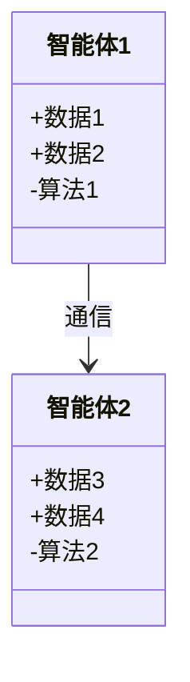
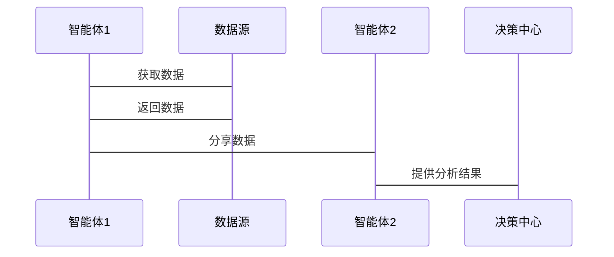

                 


# 多智能体AI如何改进格雷厄姆的工作资本分析

## 关键词：多智能体AI，资本分析，格雷厄姆，投资策略，系统架构，算法原理

## 摘要：  
本文探讨了多智能体AI在改进格雷厄姆工作资本分析中的应用。通过分析多智能体系统的核心概念、算法原理和系统架构，结合实际案例，展示了如何利用多智能体技术提升资本分析的准确性和效率。文章详细阐述了多智能体协作算法、资本分析模型，并通过系统设计和项目实战，为读者提供了从理论到实践的全面指导。

---

## 第1章: 多智能体AI与资本分析概述

### 1.1 多智能体AI的定义与特点  
多智能体AI是一种分布式人工智能系统，由多个相互作用的智能体组成，每个智能体负责特定的任务或子问题。其特点包括：  
1. **分布式计算**：任务由多个智能体协作完成。  
2. **自主性**：每个智能体具备自主决策能力。  
3. **协作性**：智能体之间通过通信和协作优化整体性能。  
4. **动态适应性**：能够实时响应环境变化。  

### 1.2 工作资本分析的背景与意义  
工作资本分析是评估企业短期偿债能力的重要指标，格雷厄姆的投资理论强调安全边际和价值评估。多智能体AI通过实时数据处理和协作优化，能够显著提升资本分析的效率和准确性。

---

## 第2章: 多智能体AI与资本分析的核心概念

### 2.1 多智能体系统的组成与功能  
- **智能体角色**：数据采集智能体、分析智能体、决策智能体。  
- **协作机制**：通过通信协议实现信息共享和任务分配。  

### 2.2 资本分析的关键要素  
- **核心指标**：流动资产、流动负债、速动比率等。  
- **格雷厄姆分析法**：基于安全边际和内在价值的投资策略。  

### 2.3 多智能体系统与资本分析的关系  
通过多智能体协作，资本分析能够实时更新数据，快速响应市场变化，提升决策的准确性。

---

## 第3章: 多智能体AI的算法原理

### 3.1 多智能体协作算法  
#### 3.1.1 分布式协作算法  
通过分布式计算实现任务分解和协同。  
#### 3.1.2 联合推理算法  
智能体之间通过共享信息进行联合推理。  
#### 3.1.3 跨智能体通信协议  
定义智能体之间的通信规则，确保高效协作。  

### 3.2 资本分析模型  
#### 3.2.1 传统资本分析模型  
基于历史数据和统计分析的传统方法。  
#### 3.2.2 基于多智能体的资本分析模型  
利用实时数据和多智能体协作提升分析精度。  

### 3.3 算法实现的数学模型  
$$f(i,j) = \frac{1}{1 + e^{- (w_i x_i + w_j x_j)}}$$  
其中，$w_i$和$x_i$分别代表第i个智能体的权重和特征值。

---

## 第4章: 系统分析与架构设计

### 4.1 问题场景介绍  
通过一个实际的资本分析案例，说明多智能体系统的应用场景。  

### 4.2 系统功能设计  
#### 4.2.1 领域模型  


#### 4.2.2 系统架构设计  


#### 4.2.3 系统接口设计  
定义智能体之间的接口协议，确保数据传输和协作的高效性。  

#### 4.2.4 系统交互设计  


---

## 第5章: 项目实战

### 5.1 环境安装  
安装Python、TensorFlow、Keras等工具，搭建多智能体协作环境。  

### 5.2 系统核心实现  
#### 5.2.1 多智能体协作代码  
```python
import numpy as np

class Agent:
    def __init__(self, weights):
        self.weights = weights

    def compute(self, input_data):
        return 1 / (1 + np.exp(-np.dot(self.weights, input_data)))

agent1 = Agent(np.array([0.5, 0.3]))
agent2 = Agent(np.array([0.4, 0.2]))
data = np.array([1, 2])

result1 = agent1.compute(data)
result2 = agent2.compute(data)
```

#### 5.2.2 资本分析模型代码  
```python
def calculate_ratio流动资产,流动负债):
    return流动资产 /流动负债

流动资产 = 1000000
流动负债 = 800000
ratio = calculate_ratio(流动资产,流动负债)
print(ratio)
```

### 5.3 实际案例分析  
通过具体案例，展示多智能体AI在资本分析中的实际应用，包括数据采集、分析和决策的全过程。  

### 5.4 项目总结  
总结项目实施的经验和成果，指出未来优化方向。

---

## 第6章: 高级主题与最佳实践

### 6.1 多智能体AI的前沿研究  
探讨强化学习在多智能体协作中的应用。  

### 6.2 应用中的注意事项  
避免信息过载和智能体之间的冲突，确保系统的稳定性和高效性。  

### 6.3 未来展望  
多智能体AI在金融领域的潜力和发展方向。  

---

## 作者：AI天才研究院 & 禅与计算机程序设计艺术

---

通过以上结构，文章详细阐述了多智能体AI在资本分析中的应用，从理论到实践，为读者提供了全面的指导和深入的分析。

