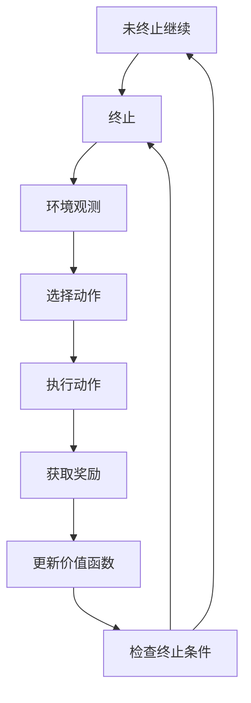
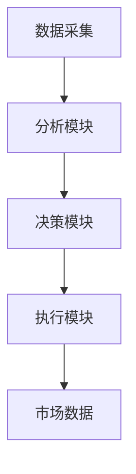

                 


# 多智能体AI如何改进约翰·伯格的指数化策略

---

## 关键词：多智能体AI，指数化策略，约翰·伯格，投资策略，智能体协作，强化学习

---

## 摘要

本文探讨了多智能体AI在改进约翰·伯格指数化策略中的应用。通过分析指数化投资的基本概念、多智能体AI的技术特点及其在金融领域的潜在应用，本文详细阐述了如何利用多智能体协作机制优化投资组合、风险控制和交易效率。文章从理论基础、算法实现、系统架构到项目实战，全面分析了多智能体AI在指数化策略中的具体应用场景和实现方法，最后总结了实际应用中的经验和注意事项。

---

## 第一部分: 多智能体AI与指数化策略的背景与基础

### 第1章: 指数化策略概述

#### 1.1 指数化策略的基本概念

- 1.1.1 指数化投资的定义与特点
  - 指数化投资的定义：通过跟踪特定市场指数（如股票指数、债券指数等）的表现，构建投资组合以获取平均市场收益的投资策略。
  - 特点：分散风险、费用低、操作简单、收益稳定。

- 1.1.2 指数化策略的核心目标与应用场景
  - 核心目标：实现与市场指数同步的收益，避免主动管理的高成本和高风险。
  - 应用场景：机构投资、个人投资、养老金管理等。

- 1.1.3 指数化策略的优缺点分析
  - 优点：分散风险、费用低、透明度高。
  - 缺点：无法超越市场收益、在极端市场条件下表现不佳、对市场波动的敏感性。

#### 1.2 约翰·伯格与指数化投资

- 1.2.1 约翰·伯格的指数化投资理念
  - 约翰·伯格是 Vanguard 集团的创始人，是指数化投资的先驱之一。
  - 他提出了“买入并持有”策略，强调长期投资和分散风险的重要性。

- 1.2.2 约翰·伯格的经典投资策略分析
  - 通过跟踪市场指数构建投资组合，避免频繁交易和市场择时。
  - 强调低成本和低波动性的投资方式。

- 1.2.3 约翰·伯格指数化策略的现状与挑战
  - 现状：指数化投资已成为全球范围内主流的投资策略之一。
  - 挑战：如何进一步优化指数化策略以应对市场变化和投资者需求。

#### 1.3 多智能体AI的基本概念与技术特点

- 1.3.1 多智能体AI的定义与核心特征
  - 多智能体AI：多个智能体协作完成复杂任务的人工智能系统。
  - 核心特征：分布式计算、协作性、自主性、反应性。

- 1.3.2 多智能体AI与单智能体AI的区别
  - 区别：任务分解、协作机制、决策过程。
  - 单智能体AI：单一决策主体，任务集中。
  - 多智能体AI：任务分解，多个智能体协作完成。

- 1.3.3 多智能体AI在金融领域的应用潜力
  - 潜在应用：投资组合优化、风险控制、高频交易、市场预测等。

---

## 第2章: 多智能体AI与指数化策略的结合

#### 2.1 多智能体AI在指数化策略中的作用

- 2.1.1 多智能体AI如何优化投资组合
  - 通过多个智能体协作，优化资产配置和风险分散。
  - 智能体分工：市场分析、风险评估、资产分配等。

- 2.1.2 多智能体AI在风险控制中的应用
  - 实时监控市场风险，智能体协同应对极端市场情况。
  - 通过分布式计算快速响应市场变化。

- 2.1.3 多智能体AI对交易效率的提升
  - 高频交易优化：多个智能体协同完成订单优化和执行。
  - 降低交易成本：通过智能体协作减少不必要的交易摩擦。

#### 2.2 多智能体AI与约翰·伯格指数化策略的结合

- 2.2.1 多智能体AI如何改进约翰·伯格的策略
  - 通过智能体协作优化投资组合的构建。
  - 实现实时市场跟踪和动态调整。

- 2.2.2 多智能体AI在策略执行中的具体应用
  - 智能体分工：数据采集、分析、决策、执行。
  - 通过协作机制提高策略执行的效率和准确性。

- 2.2.3 多智能体AI对策略优化的潜在影响
  - 提高投资组合的灵活性和适应性。
  - 实现更高效的资产配置和风险控制。

---

## 第3章: 多智能体AI的核心算法与数学模型

#### 3.1 多智能体AI的核心算法

- 3.1.1 分布式强化学习算法
  - 分布式强化学习的定义与特点。
  - 多智能体协作的数学模型：$V(s) = \max_{a} Q(s,a)$。
  - 通过智能体之间的通信与协作优化全局目标函数。

- 3.1.2 分布式计算与协作机制
  - 分布式计算的定义与优势。
  - 协作机制的数学模型：$C = \sum_{i=1}^{n} c_i$，其中 $c_i$ 是第 $i$ 个智能体的贡献。

- 3.1.3 群智算法与博弈论模型
  - 群智算法的定义与应用。
  - 博弈论模型：纳什均衡在多智能体协作中的应用。

#### 3.2 数学模型与公式

- 3.2.1 强化学习的数学模型
  - 状态空间：$S$。
  - 行动空间：$A$。
  - 奖励函数：$R: S \times A \rightarrow \mathbb{R}$。
  - 动作价值函数：$Q(s,a) = \mathbb{E}[R|s,a]$。

- 3.2.2 多智能体协作的数学模型
  - 全局目标函数：$J = \sum_{i=1}^{n} J_i$，其中 $J_i$ 是第 $i$ 个智能体的目标函数。
  - 通信协议：$C = \{c_1, c_2, ..., c_n\}$，其中 $c_i$ 是第 $i$ 个智能体的通信内容。

#### 3.3 算法流程图

- 使用 Mermaid 绘制强化学习算法流程图：



---

## 第4章: 系统架构与实现方案

#### 4.1 系统架构设计

- 4.1.1 系统功能模块设计
  - 数据采集模块：实时采集市场数据。
  - 分析模块：对数据进行处理和分析。
  - 决策模块：基于分析结果生成投资策略。
  - 执行模块：将决策转化为实际交易。

- 4.1.2 系统架构图



---

## 第5章: 项目实战与代码实现

#### 5.1 环境安装与配置

- 安装必要的库：numpy、pandas、scikit-learn、tensorflow等。

#### 5.2 核心代码实现

- 5.2.1 多智能体协作算法实现

```python
class Agent:
    def __init__(self, state_space, action_space):
        self.state_space = state_space
        self.action_space = action_space
        self.model = self.build_model()

    def build_model(self):
        # 网络结构定义
        pass

    def act(self, state):
        # 选择动作
        pass

    def update(self, state, action, reward):
        # 更新模型参数
        pass
```

---

## 第6章: 最佳实践与小结

#### 6.1 总结

- 通过多智能体AI的协作机制，可以显著提高指数化策略的优化能力。
- 多智能体AI在投资组合优化、风险控制等方面展现出巨大的潜力。

#### 6.2 注意事项

- 确保智能体之间的通信效率和安全性。
- 定期监控和优化系统架构，以应对市场变化。

#### 6.3 拓展阅读

- 推荐阅读《分布式人工智能》、《强化学习导论》等相关书籍。

---

## 作者：AI天才研究院/AI Genius Institute & 禅与计算机程序设计艺术 /Zen And The Art of Computer Programming

---

# END

