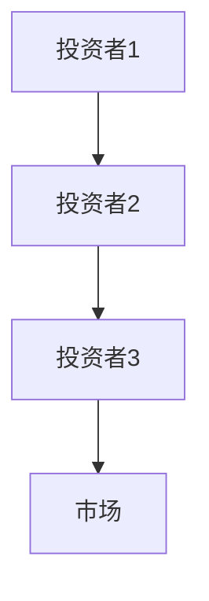
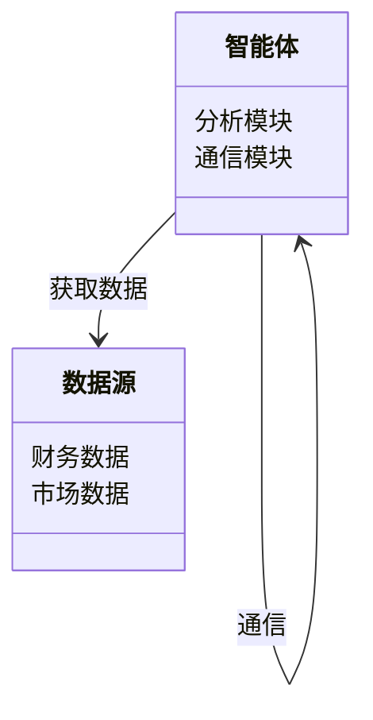

                 


# 多智能体AI系统在价值投资中的道德考量：平衡效率与公平

> **关键词**：多智能体AI系统，价值投资，道德考量，效率与公平，博弈论，伦理决策，系统架构

> **摘要**：本文探讨了多智能体AI系统在价值投资中的应用及其道德考量，分析了如何在效率与公平之间取得平衡。通过深入解析多智能体系统的算法原理、系统架构以及实际案例，本文提出了在价值投资中实现伦理决策的具体方法，同时总结了多智能体系统在金融领域应用的优缺点，并展望了未来的发展方向。

---

## 第一部分：背景与概念基础

### 第1章：多智能体AI系统与价值投资概述

#### 1.1 多智能体AI系统的定义与特点
多智能体AI系统是指由多个独立或协作的智能体组成的系统，这些智能体能够通过通信和协作完成复杂的任务。其特点包括：
- **分布式计算**：每个智能体独立运行，通过通信模块进行协作。
- **博弈论基础**：智能体之间的决策过程可以用博弈论模型描述。
- **动态环境适应**：能够实时感知环境变化并调整策略。

#### 1.2 价值投资的核心概念
价值投资是一种投资策略，旨在通过分析企业的基本面，寻找被市场低估的投资标的。其核心原则包括：
- **长期视角**：关注企业的长期价值，而非短期价格波动。
- **安全边际**：在价格显著低于内在价值时进行投资。
- **分散投资**：通过多样化投资降低风险。

#### 1.3 多智能体AI系统在价值投资中的作用
多智能体系统能够通过以下方式增强价值投资：
- **数据处理能力**：快速分析大量非结构化数据，如新闻、社交媒体和财务报表。
- **协作决策**：多个智能体从不同角度分析企业价值，降低决策偏差。
- **动态调整**：根据市场变化实时优化投资组合。

#### 1.4 道德考量的核心问题
在多智能体系统应用于价值投资的过程中，主要的道德挑战包括：
- **效率与公平的平衡**：如何在提高投资效率的同时避免加剧市场不公。
- **伦理决策机制**：确保智能体的决策符合伦理规范。
- **透明性与可解释性**：投资者需要了解系统决策的依据。

#### 1.5 本章小结
本章介绍了多智能体AI系统和价值投资的基本概念，并分析了两者结合的潜力及道德挑战。

---

## 第二部分：核心概念与联系

### 第2章：多智能体系统与价值投资的核心概念

#### 2.1 多智能体系统的博弈论基础
博弈论是分析多智能体系统的核心工具。在价值投资中，智能体之间的互动可以建模为博弈过程。

- **博弈论的基本概念**：包括玩家、策略、收益和纳什均衡。
- **多智能体系统中的博弈模型**：智能体之间通过信息交换形成策略，最终达成纳什均衡。

#### 2.2 价值投资中的伦理框架
为了确保多智能体系统的决策符合伦理规范，需要构建一个伦理框架：

- **伦理决策的基本原则**：包括公正性、透明性和可追溯性。
- **价值投资中的伦理考量**：避免操纵市场、确保信息公平。
- **多智能体系统中的伦理决策机制**：通过规则约束和反馈机制实现伦理决策。

#### 2.3 多智能体系统与价值投资的核心要素对比

| **要素**       | **多智能体系统**       | **传统价值投资**         |
|----------------|-----------------------|--------------------------|
| 数据处理能力   | 高效处理非结构化数据   | 依赖人工分析             |
| 决策速度       | 实时决策               | 周期性决策               |
| 决策精度       | 高                     | 中等                     |
| 透明性         | 低（复杂算法）         | 高（人工决策可解释）       |

#### 2.4 多智能体系统的ER实体关系图

```mermaid
er
actor(投资者) -|{拥有}| 投资账户(账户ID, 资产, 负债)
投资账户 -|{包含}| 投资组合(组合ID, 资产配置)
投资组合 -|{由...组成}| 投资标的(标的ID, 名称, 行业)
投资标的 -|{影响}| 市场动态(时间, 价格, 交易量)
```

---

## 第三部分：算法原理与数学模型

### 第3章：多智能体系统的算法原理

#### 3.1 分布式计算与多智能体协作



- **算法流程**：
  1. 每个智能体独立分析数据。
  2. 智能体之间通过通信模块共享信息。
  3. 系统根据博弈论模型生成决策。

#### 3.2 博弈论模型与价值投资决策

- **数学模型**：
  $$\text{收益} = \sum_{i=1}^{n} \text{智能体}_i(\text{策略})$$
  其中，$n$ 是智能体的数量。

- **举例说明**：
  智能体1分析财务报表，智能体2分析行业趋势，最终通过纳什均衡生成投资决策。

---

## 第四部分：系统分析与架构设计

### 第4章：系统分析与架构设计方案

#### 4.1 问题场景介绍
假设我们构建一个多智能体系统用于价值投资分析，系统需要处理海量数据并实时生成决策。

#### 4.2 系统功能设计



#### 4.3 系统架构设计


---

## 第五部分：项目实战

### 第5章：项目实战与案例分析

#### 5.1 环境安装
安装Python和必要的库：
```bash
pip install numpy pandas scikit-learn
```

#### 5.2 系统核心实现源代码

```python
import numpy as np
import pandas as pd
from sklearn.metrics import accuracy_score

def nash_equilibrium(players, strategies):
    # 计算纳什均衡
    pass

class MultiAgentSystem:
    def __init__(self, agents):
        self.agents = agents

    def run(self):
        for agent in self.agents:
            agent.update()
        return self.get_decision()

    def get_decision(self):
        # 返回决策结果
        pass
```

#### 5.3 案例分析与优化策略
以某科技公司为例，分析其财务数据和市场动态，生成投资建议。

#### 5.4 项目小结
本章通过实际案例展示了多智能体系统的应用，并提出了优化策略。

---

## 第六部分：总结与展望

### 第6章：总结与展望

#### 6.1 总结
多智能体系统在价值投资中的应用具有巨大潜力，但也面临道德和效率的双重挑战。

#### 6.2 未来展望
未来的研究方向包括优化伦理框架和制定更完善的监管政策。

---

## 作者：AI天才研究院 & 禅与计算机程序设计艺术

