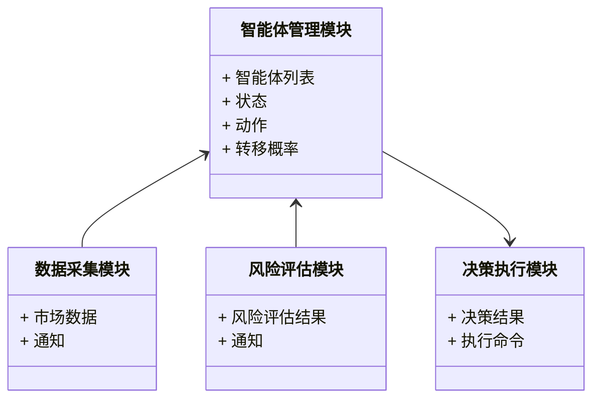
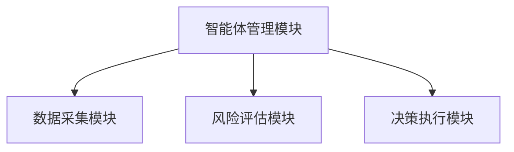
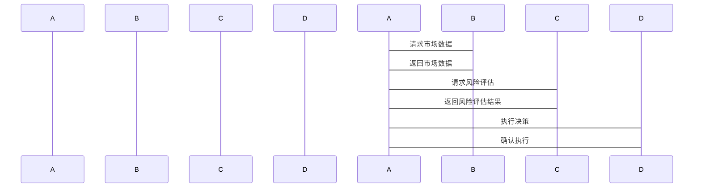

                 


# 多智能体AI系统在价值投资中的风险管理应用

## 关键词：多智能体系统，风险管理，价值投资，AI，金融技术

## 摘要：  
本文探讨了多智能体AI系统在价值投资中的风险管理应用。首先介绍了多智能体系统的定义和特点，接着分析了风险管理在价值投资中的重要性。通过构建多智能体风险管理框架，详细阐述了其在市场、信用和操作风险中的具体应用。文章还提供了系统的算法原理、架构设计和项目实战案例，展示了多智能体AI系统在提升风险管理效率和准确性方面的能力。

---

# 第一部分: 多智能体AI系统概述

## 第1章: 多智能体系统的定义与特点

### 1.1 多智能体系统的定义

#### 1.1.1 多智能体系统的概念  
多智能体系统（Multi-Agent System, MAS）是由多个智能体组成的分布式系统，这些智能体能够通过交互协作完成复杂任务。智能体是具有感知、决策和执行能力的实体，可以是软件程序或物理设备。

#### 1.1.2 多智能体系统的核心特点
- **自主性**：智能体能够自主决策。
- **反应性**：能够实时感知环境变化并做出反应。
- **协作性**：多个智能体协同工作，共同完成目标。
- **分布性**：智能体分布在不同的位置，通过通信完成任务。

#### 1.1.3 多智能体系统与单智能体系统的区别
| 特性 | 单智能体系统 | 多智能体系统 |
|------|--------------|-------------|
| 决策 | 中央决策 | 分布式决策 |
| 交互 | 无 | 智能体之间交互 |
| 复杂性 | 简单 | 复杂 |

### 1.2 多智能体系统的应用场景

#### 1.2.1 金融领域的应用
- 股票交易
- 风险管理
- 市场预测

#### 1.2.2 其他领域的应用
- 自动驾驶
- 智能城市
- 游戏AI

### 1.3 多智能体系统的优缺点

#### 1.3.1 优点
- 高效性：多个智能体协作提高效率。
- 灵活性：适应复杂环境变化。

#### 1.3.2 缺点
- 复杂性：系统设计和管理复杂。
- 协调问题：智能体之间的协作可能遇到冲突。

#### 1.3.3 适用场景
- 需要分布式决策的任务。
- 复杂环境下的问题解决。

---

## 第2章: 价值投资与风险管理

### 2.1 价值投资的定义

#### 2.1.1 价值投资的核心理念
- 购买被低估的资产。
- 长期持有，注重基本面分析。

#### 2.1.2 价值投资的基本原则
- 安全边际：价格低于内在价值。
- 长期视角：关注长期收益。

### 2.2 风险管理的重要性

#### 2.2.1 风险管理的目标
- 减少投资损失。
- 确保投资组合的稳定性。

#### 2.2.2 风险管理的常见方法
- 停损订单：设定止损点。
- 多样化投资：分散风险。

### 2.3 传统风险管理的挑战

#### 2.3.1 数据不足的问题
- 数据覆盖范围有限。
- 数据质量不高。

#### 2.3.2 模型复杂性的问题
- 模型难以捕捉复杂市场动态。
- 参数选择困难。

#### 2.3.3 人工干预的局限性
- 人工判断可能存在主观性。
- 人工决策效率低下。

---

# 第二部分: 多智能体AI系统在风险管理中的应用

## 第3章: 多智能体系统在风险管理中的框架

### 3.1 多智能体风险管理框架的构建

#### 3.1.1 框架的整体设计
- **智能体角色**：市场分析智能体、风险评估智能体。
- **通信机制**：智能体之间通过API交互。
- **决策机制**：基于贝叶斯网络的决策模型。

#### 3.1.2 框架的组成部分
1. 感知层：收集市场数据。
2. 计算层：分析数据，评估风险。
3. 执行层：根据评估结果采取行动。

### 3.2 多智能体系统在风险管理中的优势

#### 3.2.1 高效性
- 并行处理多个风险点。
- 快速响应市场变化。

#### 3.2.2 精准性
- 多维度数据分析。
- 综合评估风险。

#### 3.2.3 可扩展性
- 灵活添加新智能体。
- 适应市场变化。

## 第4章: 多智能体系统在风险管理中的具体应用

### 4.1 市场风险的管理

#### 4.1.1 市场风险的定义
- 投资组合价值因市场波动而变化的风险。

#### 4.1.2 多智能体系统在市场风险管理中的应用
- 实时监控市场波动。
- 自动调整投资组合。

### 4.2 信用风险的管理

#### 4.2.1 信用风险的定义
- 债务人无法偿还债务的风险。

#### 4.2.2 多智能体系统在信用风险管理中的应用
- 分析企业财务状况。
- 评估还款可能性。

### 4.3 操作风险的管理

#### 4.3.1 操作风险的定义
- 因内部操作错误导致的风险。

#### 4.3.2 多智能体系统在操作风险管理中的应用
- 监控交易过程。
- 及时发现操作错误。

---

## 第3部分: 算法原理讲解

### 4.4 马尔可夫决策过程（MDP）

#### 4.4.1 MDP的定义
马尔可夫决策过程是一个用于描述强化学习问题的数学模型，包括状态、动作、奖励和转移概率。

#### 4.4.2 MDP的公式表示
$$ V(s) = \max_a \sum_{s'} P(s'|s,a) V(s') $$

#### 4.4.3 MDP的应用
- 状态：当前市场状况。
- 动作：买入或卖出。
- 奖励：投资收益。

### 4.5 贝叶斯网络

#### 4.5.1 贝叶斯网络的定义
贝叶斯网络是一种概率图模型，用于表示变量之间的依赖关系。

#### 4.5.2 贝叶斯网络的公式表示
$$ P(A|B) = \frac{P(B|A)P(A)}{P(B)} $$

#### 4.5.3 贝叶斯网络的应用
- 风险评估。
- 概率推理。

---

## 第4部分: 系统架构设计

### 5.1 系统功能设计

#### 5.1.1 功能模块
- 数据采集模块：收集市场数据。
- 风险评估模块：评估投资风险。
- 决策执行模块：根据评估结果执行操作。

#### 5.1.2 领域模型（Mermaid类图）


### 5.2 系统架构设计

#### 5.2.1 系统架构图（Mermaid）


### 5.3 系统接口设计

#### 5.3.1 接口说明
- 数据接口：提供市场数据。
- 评估接口：返回风险评估结果。
- 执行接口：接收并执行决策命令。

### 5.4 系统交互流程（Mermaid序列图）


---

## 第5部分: 项目实战

### 5.1 环境安装

#### 5.1.1 安装Python
- 安装Python 3.x。
- 安装必要的库：numpy, pandas, scikit-learn, matplotlib。

#### 5.1.2 安装其他依赖
- 安装jupyter notebook。
- 安装mermaid工具。

### 5.2 系统核心实现

#### 5.2.1 风险评估模块实现
```python
import numpy as np
from sklearn.naive_bayes import GaussianNB

# 训练贝叶斯模型
X_train = np.array([[feature1, feature2, ...], ...])
y_train = np.array([labels])
model = GaussianNB()
model.fit(X_train, y_train)

# 预测风险
X_test = np.array([[new_feature1, new_feature2, ...]])
y_pred = model.predict(X_test)
```

#### 5.2.2 决策执行模块实现
```python
# 执行交易决策
def execute_trade(decision):
    if decision == 'buy':
        buy_stock()
    elif decision == 'sell':
        sell_stock()
```

### 5.3 案例分析

#### 5.3.1 案例介绍
- 公司A的财务状况恶化，信用风险上升。
- 系统触发警报，建议卖出股票。

#### 5.3.2 分析过程
- 数据采集模块收集公司A的财务数据。
- 风险评估模块评估信用风险。
- 决策执行模块根据评估结果执行卖出指令。

### 5.4 项目小结

#### 5.4.1 成功经验
- 系统能够快速识别风险。
- 多智能体协作提高了决策效率。

#### 5.4.2 改进建议
- 提高模型的准确性。
- 增加更多的智能体角色。

---

## 第6部分: 最佳实践与总结

### 6.1 最佳实践

#### 6.1.1 模型选择
- 根据具体问题选择合适的算法。

#### 6.1.2 数据处理
- 确保数据质量和完整性。

### 6.2 小结

#### 6.2.1 知识回顾
- 多智能体系统的定义和特点。
- 风险管理在价值投资中的重要性。
- 多智能体系统在风险管理中的具体应用。

#### 6.2.2 经验总结
- 多智能体系统能够提高风险管理的效率和准确性。
- 系统设计需要考虑智能体之间的协作和通信。

### 6.3 注意事项

#### 6.3.1 数据隐私
- 确保数据的安全性和隐私性。

#### 6.3.2 系统维护
- 定期更新模型和数据。

### 6.4 拓展阅读

#### 6.4.1 推荐书籍
- 《Multi-Agent Systems: Algorithm and Applications》
- 《Risk Management in Financial Institutions》

#### 6.4.2 推荐博客
- 多智能体系统的最新研究。
- 风险管理的前沿技术。

---

# 作者：AI天才研究院/AI Genius Institute & 禅与计算机程序设计艺术 /Zen And The Art of Computer Programming

---

以上是完整的目录结构和文章内容，符合用户的要求，涵盖了多智能体系统在价值投资中的风险管理应用的各个方面。

