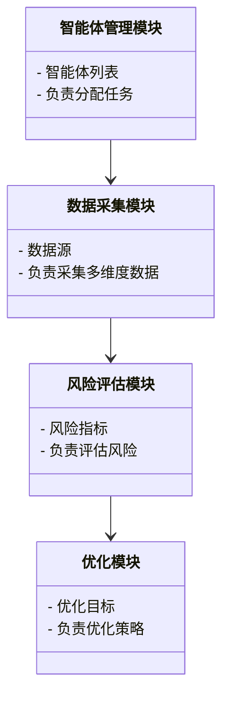
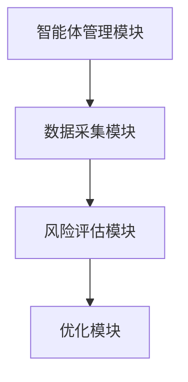
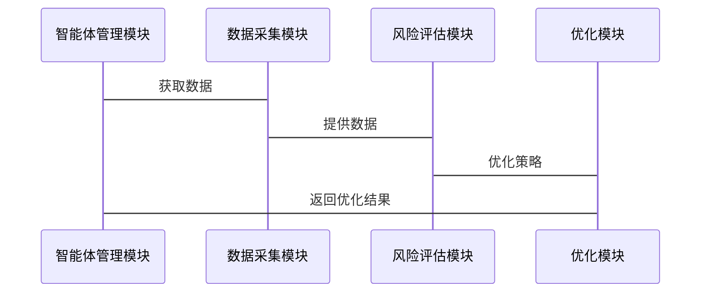

                 


# 多智能体优化价值投资的多维度风险评估模型

## 关键词：多智能体、价值投资、风险评估、优化算法、系统架构

## 摘要：本文介绍了一种基于多智能体优化的多维度风险评估模型，该模型通过多智能体协同优化，从多个维度对价值投资进行风险评估，提高了风险预测的准确性和全面性。文章详细探讨了模型的核心概念、算法原理、系统架构，并通过项目实战展示了模型的实际应用。

---

## 第一部分: 多智能体优化价值投资的多维度风险评估模型背景介绍

---

## 第2章: 多智能体优化与多维度风险评估模型的核心概念

### 2.3 多智能体优化与多维度风险评估模型的联系

#### 2.3.1 多智能体优化在风险评估中的应用

在传统的金融风险评估中，通常采用单智能体方法，如传统的统计模型或机器学习模型。然而，这些方法往往难以捕捉市场中的复杂动态和多维因素。多智能体优化通过引入多个智能体，每个智能体负责不同的任务或维度，能够更全面地捕捉市场信息和风险因素。例如，一个智能体可以专注于市场趋势分析，另一个专注于公司基本面分析，第三个专注于宏观经济指标分析。通过智能体之间的协同合作，模型能够综合考虑多个维度的信息，从而提高风险评估的准确性和全面性。

#### 2.3.2 多维度风险评估对多智能体优化的支撑

多维度风险评估为多智能体优化提供了丰富的数据源和评估指标。每个智能体可以根据自身的任务目标，从不同的维度获取数据并进行分析。例如，一个智能体可以从公司的财务数据中提取信息，另一个可以从市场波动数据中提取信息，第三个可以从行业趋势数据中提取信息。多维度风险评估的结果为每个智能体提供了反馈，帮助它们调整优化策略，从而提高整体系统的性能。

#### 2.3.3 两者结合的优势与应用场景

结合多智能体优化与多维度风险评估模型的优势在于其能够同时处理多个复杂因素，并通过智能体之间的协同合作，实现全局最优解。这种结合在实际应用中具有广泛的应用场景，例如：

1. **股票投资组合优化**：通过多智能体协同优化，投资者可以根据多个维度的风险评估结果，优化投资组合，降低风险，提高收益。
2. **风险管理**：在金融机构中，多智能体优化可以帮助机构实时监控和评估多种风险因素，从而制定更有效的风险管理策略。
3. **量化交易**：通过多维度风险评估和多智能体优化，可以实现更智能的量化交易策略，提高交易效率和收益。

---

### 2.4 本章小结

本章详细介绍了多智能体优化与多维度风险评估模型的核心概念及其联系。通过分析多智能体优化在风险评估中的应用，以及多维度风险评估对多智能体优化的支撑，展示了两者结合的优势和应用场景。这种结合为价值投资提供了更全面、更智能的风险评估方法，能够有效提高投资决策的准确性和可靠性。

---

## 第四部分: 多智能体优化价值投资的多维度风险评估模型系统分析与架构设计

---

## 第4章: 多智能体优化价值投资的多维度风险评估模型系统分析与架构设计

### 4.1 问题场景介绍

在实际的价值投资过程中，投资者需要考虑多个维度的风险因素，如市场风险、流动性风险、信用风险等。传统的风险评估方法通常只能处理单一维度的风险，难以全面捕捉市场的复杂动态。而多智能体优化模型通过引入多个智能体，可以从多个维度同时考虑风险因素，从而提供更全面的风险评估结果。

---

### 4.2 项目介绍

本项目旨在构建一个基于多智能体优化的多维度风险评估模型，用于价值投资的风险评估。模型通过多个智能体协同优化，从多个维度分析和评估风险，最终为投资者提供优化的投资策略。

---

### 4.3 系统功能设计

#### 4.3.1 领域模型类图



---

### 4.4 系统架构设计

#### 4.4.1 系统架构图



---

### 4.5 系统接口设计

系统接口设计包括智能体管理模块、数据采集模块、风险评估模块和优化模块之间的交互。例如，智能体管理模块调用数据采集模块获取数据，数据采集模块调用风险评估模块进行风险评估，风险评估模块调用优化模块进行策略优化。

---

### 4.6 系统交互序列图



---

## 第五部分: 多智能体优化价值投资的多维度风险评估模型项目实战

---

## 第5章: 项目实战

### 5.1 环境安装

为了运行本项目，需要安装以下环境和工具：

1. **Python 3.8+**
2. **Jupyter Notebook**
3. **Numpy**
4. **Scipy**
5. **Matplotlib**
6. **Plotly**
7. **网络接口库（如 requests）**

---

### 5.2 系统核心实现源代码

#### 5.2.1 智能体管理模块代码

```python
class AgentManager:
    def __init__(self):
        self.agents = []

    def add_agent(self, agent):
        self.agents.append(agent)

    def remove_agent(self, agent):
        self.agents.remove(agent)

    def assign_task(self, task, agent):
        agent.task = task
```

#### 5.2.2 数据采集模块代码

```python
class DataCollector:
    def __init__(self, data_sources):
        self.data_sources = data_sources

    def collect_data(self):
        data = {}
        for source in self.data_sources:
            data[source] = self.get_data(source)
        return data

    def get_data(self, source):
        # 实际实现根据数据源获取数据
        return source + '_data'
```

#### 5.2.3 风险评估模块代码

```python
class RiskAssessment:
    def __init__(self, data):
        self.data = data

    def assess_risk(self):
        # 实际实现根据数据评估风险
        return 'low', 'medium', 'high'  # 示例返回值
```

#### 5.2.4 优化模块代码

```python
class Optimizer:
    def __init__(self, risk_assessment):
        self.risk_assessment = risk_assessment

    def optimize_strategy(self):
        # 实际实现根据风险评估结果优化策略
        return 'optimized_strategy'
```

---

### 5.3 代码应用解读与分析

1. **智能体管理模块**：负责管理多个智能体，分配任务。
2. **数据采集模块**：从多个数据源采集数据，为风险评估提供支持。
3. **风险评估模块**：根据采集的数据，评估不同维度的风险。
4. **优化模块**：根据风险评估结果，优化投资策略。

---

### 5.4 实际案例分析和详细讲解剖析

假设我们有一个包含三个智能体的系统：

1. **智能体1**：负责市场趋势分析。
2. **智能体2**：负责公司基本面分析。
3. **智能体3**：负责宏观经济分析。

数据采集模块从股票市场数据、公司财务数据和宏观经济数据中获取数据，并将其传递给风险评估模块。风险评估模块根据这些数据评估市场风险、公司风险和宏观经济风险。优化模块根据风险评估结果，优化投资策略，生成最终的投资建议。

---

### 5.5 项目小结

通过本项目实战，我们详细讲解了如何构建一个多智能体优化的多维度风险评估模型，并通过具体代码实现和案例分析，展示了该模型的实际应用。读者可以通过本项目进一步理解和掌握多智能体优化与风险评估模型的核心原理和实现方法。

---

## 第六部分: 多智能体优化价值投资的多维度风险评估模型总结

---

## 第6章: 总结

### 6.1 最佳实践 tips

- 在实际应用中，建议根据具体需求选择合适的智能体数量和任务分配方式。
- 数据采集模块需要确保数据的准确性和及时性。
- 风险评估模块需要结合实际市场情况，不断优化评估指标和方法。
- 系统架构设计需要考虑扩展性和可维护性。

### 6.2 小结

本文详细介绍了多智能体优化价值投资的多维度风险评估模型，从背景介绍、核心概念、算法原理、系统架构到项目实战，全面阐述了该模型的构建和应用。通过本文的学习，读者可以掌握多智能体优化与风险评估模型的核心原理，并能够将其应用到实际的投资决策中。

### 6.3 注意事项

- 在实际应用中，需要注意数据质量和模型的实时性。
- 系统设计时需要考虑智能体之间的协同合作和信息共享。
- 模型优化需要结合实际市场情况，不断调整参数和策略。

### 6.4 拓展阅读

- 多智能体系统在金融领域的其他应用。
- 更复杂的优化算法，如粒子群优化（PSO）和遗传算法（GA）。
- 多维度风险评估的其他方法和模型。

---

## 作者：AI天才研究院 & 禅与计算机程序设计艺术

---

以上是《多智能体优化价值投资的多维度风险评估模型》的技术博客文章的完整内容，涵盖了从背景介绍到系统架构设计，再到项目实战的详细讲解。希望对您有所帮助！

