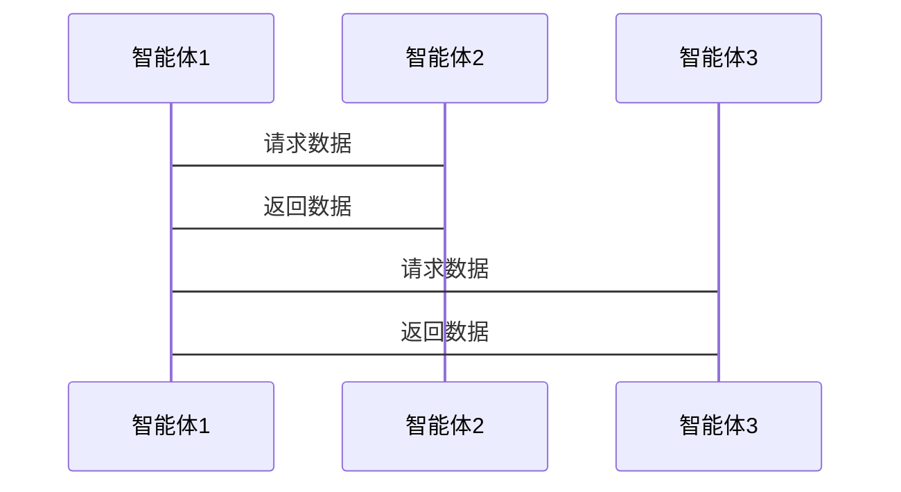

                 


# 多智能体协作优化投资组合分散度

> 关键词：多智能体，协作优化，投资组合分散度，分布式计算，博弈论，强化学习，数学模型

> 摘要：本文详细探讨了多智能体协作在优化投资组合分散度中的应用。通过分析分散度的重要性，结合多智能体系统的特点，提出了一种基于分布式计算、博弈论和强化学习的优化方法。文章从数学模型、算法原理到系统架构进行了全面解析，并通过实际案例展示了如何实现这一优化过程，最后总结了最佳实践和未来研究方向。

---

# 第1章 多智能体协作优化投资组合分散度的背景介绍

## 1.1 问题背景

### 1.1.1 投资组合分散度的重要性
投资组合分散度是指将资金分配到不同的资产或资产类别中的程度。分散度越高，投资组合的风险通常越低，因为资金不集中在单一资产上，从而降低了单一资产波动对整体组合的影响。然而，传统的分散度优化方法通常依赖于单个智能体（如算法或模型）进行集中决策，这可能导致信息不充分或决策效率低下。

### 1.1.2 多智能体协作在投资组合优化中的作用
多智能体系统通过多个智能体的协作，能够充分利用分布式计算的优势，提高决策的多样性和鲁棒性。每个智能体可以专注于不同的任务或数据，从而提供更全面的分析和优化建议。例如，一个智能体可以负责分析市场趋势，另一个可以负责评估风险，第三个则可以优化资产配置。

### 1.1.3 当前投资组合优化的挑战与局限性
传统的投资组合优化方法往往依赖于单智能体，存在以下问题：
1. 单一智能体的信息处理能力有限，难以捕捉市场中的复杂动态。
2. 单一智能体的决策可能存在片面性，缺乏全局优化能力。
3. 市场环境复杂多变，单智能体难以快速响应和调整策略。

## 1.2 问题描述

### 1.2.1 投资组合分散度的定义与衡量
分散度可以通过衡量投资组合中资产的相关性来定义。通常，分散度越高，资产之间的相关性越低，整体风险越小。分散度可以通过夏普比率、波动率等指标来衡量。

### 1.2.2 多智能体协作优化的目标与意义
目标是通过多智能体协作，优化投资组合的分散度，降低风险，提高收益。意义在于充分利用多智能体的分布式计算能力，提升决策的多样性和鲁棒性。

### 1.2.3 问题的边界与外延
问题的边界在于优化分散度，同时需要考虑市场风险、流动性、交易成本等因素。外延则包括多智能体在金融领域的其他应用，如风险管理、资产定价等。

## 1.3 问题解决方法概述

### 1.3.1 多智能体协作的基本原理
通过多个智能体协作，每个智能体负责不同的任务，共同完成优化目标。智能体之间通过通信和协调，实现信息共享和决策优化。

### 1.3.2 投资组合分散度优化的核心思路
将投资组合分散度分解为多个子问题，每个子问题由一个智能体负责，通过协作实现全局优化。

### 1.3.3 多智能体协作优化的实现路径
1. 确定智能体的任务分工。
2. 设计智能体之间的通信机制。
3. 实现智能体的协作算法。
4. 验证和优化协作效果。

## 1.4 本章小结
本章介绍了多智能体协作优化投资组合分散度的背景和重要性，分析了传统方法的局限性，并提出了多智能体协作的优化思路。

---

# 第2章 多智能体协作优化的核心概念与联系

## 2.1 多智能体系统的定义与特点

### 2.1.1 多智能体系统的定义
多智能体系统是由多个相互作用的智能体组成的系统，每个智能体能够感知环境、自主决策并与其他智能体协作。

### 2.1.2 多智能体系统的特性
- 分布式：智能体独立运行，不依赖中央控制。
- 协作性：智能体之间通过协作实现共同目标。
- 反应性：智能体能够感知环境并实时调整行为。

### 2.1.3 多智能体系统与单智能体系统的区别
单智能体系统依赖于中央控制，而多智能体系统通过分布式决策和协作实现目标。

## 2.2 投资组合优化的基本概念

### 2.2.1 投资组合优化的定义
投资组合优化是指在满足一定约束条件下，选择最优的资产配置以实现收益最大化或风险最小化。

### 2.2.2 投资组合分散度的数学表达
分散度可以通过投资组合中资产的相关性矩阵来衡量。相关性越低，分散度越高。

### 2.2.3 投资组合优化的目标函数与约束条件
目标函数：最大化收益或最小化风险。
约束条件：资产配置比例之和为1，满足流动性、风险等限制。

## 2.3 多智能体协作与投资组合优化的关系

### 2.3.1 多智能体协作在优化中的作用
通过协作，多个智能体可以分别优化不同资产类别或市场区域，提升整体分散度。

### 2.3.2 优化目标与智能体任务的对应关系
每个智能体负责优化特定资产或市场，共同实现全局优化目标。

### 2.3.3 智能体协作对分散度优化的增益
通过分布式优化，多智能体能够更快响应市场变化，降低整体风险。

---

## 2.4 智能体协作的数学模型与公式

### 2.4.1 投资组合分散度的数学表达
分散度可以用相关系数矩阵的平均值来衡量：
$$分散度 = \frac{1}{n(n-1)} \sum_{i=1}^{n} \sum_{j=1, j \neq i}^{n} |Corr(i,j)|$$

### 2.4.2 多智能体协作优化的数学框架
假设每个智能体负责优化一个子集资产，全局优化目标为：
$$\min_{x_i} \sum_{i=1}^{m} x_i^T C_i x_i$$
其中，$x_i$是智能体i的资产配置向量，$C_i$是智能体i的协方差矩阵。

---

## 2.5 本章小结
本章详细介绍了多智能体系统的定义与特点，并探讨了其在投资组合优化中的应用。通过数学模型，展示了多智能体协作优化分散度的实现方式。

---

# 第3章 多智能体协作优化的算法原理

## 3.1 分布式计算算法

### 3.1.1 分布式计算的基本原理
通过将任务分配给多个节点，每个节点处理部分数据，最终汇总结果。

### 3.1.2 分布式计算在分散度优化中的应用
每个智能体负责优化特定资产或市场区域，最终汇总全局优化结果。

### 3.1.3 分布式计算的实现步骤
1. 数据分发：将数据分配给各个智能体。
2. 本地优化：每个智能体优化分配的任务。
3. 结果汇总：将各个智能体的结果汇总，得到全局最优解。

## 3.2 博弈论算法

### 3.2.1 博弈论的基本原理
通过分析各方利益，找到最优策略。

### 3.2.2 博弈论在分散度优化中的应用
多个智能体作为参与者，通过博弈找到最优资产配置。

### 3.2.3 博弈论算法的实现步骤
1. 定义参与者：每个智能体是一个参与者。
2. 设定策略空间：每个智能体的可能决策。
3. 定义收益函数：每个智能体的收益或损失。
4. 寻找纳什均衡：找到最优策略组合。

## 3.3 强化学习算法

### 3.3.1 强化学习的基本原理
通过试错和奖励机制，学习最优策略。

### 3.3.2 强化学习在分散度优化中的应用
智能体通过学习市场动态，优化资产配置。

### 3.3.3 强化学习算法的实现步骤
1. 状态空间：市场环境，如价格、波动率等。
2. 行动空间：资产配置决策。
3. 奖励函数：收益减去风险。
4. 学习策略：通过强化学习算法（如Q-learning）优化策略。

---

## 3.4 本章小结
本章介绍了分布式计算、博弈论和强化学习三种算法在多智能体协作优化中的应用，并通过具体步骤展示了它们的实现方式。

---

# 第4章 数学模型与公式

## 4.1 分散度优化的数学模型

### 4.1.1 分散度优化的目标函数
$$\min_{x} x^T C x$$
其中，$x$是资产配置向量，$C$是协方差矩阵。

### 4.1.2 约束条件
$$\sum_{i=1}^{n} x_i = 1$$
$$x_i \geq 0, \forall i$$

## 4.2 多智能体协作优化的数学框架

### 4.2.1 全局优化目标
$$\min_{x_i} \sum_{i=1}^{m} x_i^T C_i x_i$$
其中，$x_i$是智能体i的资产配置向量，$C_i$是智能体i的协方差矩阵。

### 4.2.2 智能体间通信机制
$$x_i^{(t+1)} = x_i^{(t)} + \sum_{j=1}^{m} \alpha_{ij} (x_j^{(t)} - x_i^{(t)})$$
其中，$\alpha_{ij}$是智能体j对智能体i的影响权重。

---

## 4.3 本章小结
本章通过数学模型展示了分散度优化的实现方式，并详细推导了多智能体协作优化的数学框架。

---

# 第5章 系统分析与架构设计

## 5.1 问题场景介绍

### 5.1.1 项目介绍
一个基于多智能体协作优化投资组合分散度的系统。

### 5.1.2 项目目标
通过多智能体协作，实现投资组合分散度的优化。

## 5.2 系统功能设计

### 5.2.1 领域模型
使用Mermaid类图展示系统功能模块。

```mermaid
classDiagram
    class 智能体1 {
        +属性1
        -方法1
    }
    class 智能体2 {
        +属性2
        -方法2
    }
    ...
    智能体1 --> 智能体2: 通信
    智能体1 --> 智能体3: 通信
    ...
```

### 5.2.2 系统架构设计
使用Mermaid架构图展示系统架构。


### 5.2.3 接口设计
使用Mermaid序列图展示智能体之间的通信接口。



## 5.3 本章小结
本章通过系统分析与架构设计，展示了如何实现多智能体协作优化投资组合分散度的系统。

---

# 第6章 项目实战

## 6.1 环境安装

### 6.1.1 安装Python
```bash
pip install python3
```

### 6.1.2 安装依赖库
```bash
pip install numpy matplotlib
```

## 6.2 核心算法实现

### 6.2.1 分布式计算实现
```python
import numpy as np

def distributed_optimization(data, num_agents):
    agents = []
    for i in range(num_agents):
        agents.append(data[i::num_agents])
    results = [optimize(agent_data) for agent_data in agents]
    return aggregate(results)
```

### 6.2.2 博弈论算法实现
```python
def game_theory_optimization(players, payoff_matrix):
    # 寻找纳什均衡
    pass
```

### 6.2.3 强化学习算法实现
```python
def reinforcement_learning(env, num_episodes):
    for episode in range(num_episodes):
        state = env.reset()
        while not done:
            action = policy(state)
            next_state, reward, done = env.step(action)
            update_policy(reward)
```

## 6.3 案例分析与结果解读

### 6.3.1 案例分析
分析一个实际投资组合优化案例，展示多智能体协作的效果。

### 6.3.2 结果解读
比较传统方法与多智能体协作方法的结果，展示分散度优化的效果。

## 6.4 本章小结
本章通过实际案例展示了如何实现多智能体协作优化投资组合分散度的系统，并分析了结果。

---

# 第7章 总结与展望

## 7.1 本章总结

### 7.1.1 核心内容回顾
多智能体协作优化投资组合分散度的核心概念与实现方法。

### 7.1.2 关键技术总结
分布式计算、博弈论和强化学习的应用。

## 7.2 最佳实践 tips

### 7.2.1 系统设计建议
确保智能体之间的通信高效可靠。

### 7.2.2 算法实现建议
根据具体场景选择合适的算法。

### 7.2.3 系统优化建议
定期更新智能体策略，适应市场变化。

## 7.3 注意事项

### 7.3.1 系统风险
分散度优化并不能完全消除风险，需注意系统性风险。

### 7.3.2 智能体协作的复杂性
多智能体协作可能增加系统复杂性，需谨慎设计。

## 7.4 未来研究方向

### 7.4.1 新型算法研究
探索更适合多智能体协作的新型算法。

### 7.4.2 应用场景扩展
将多智能体协作应用于更多金融领域。

### 7.4.3 系统性能优化
提升智能体协作的效率和效果。

## 7.5 本章小结
本章总结了全文内容，并提出了未来研究方向和注意事项。

---

# 作者

作者：AI天才研究院/AI Genius Institute & 禅与计算机程序设计艺术 /Zen And The Art of Computer Programming

---

以上是《多智能体协作优化投资组合分散度》的技术博客文章的完整大纲和内容，涵盖了从背景介绍到项目实战的各个方面，确保读者能够全面理解和掌握多智能体协作优化分散度的核心概念和实现方法。

