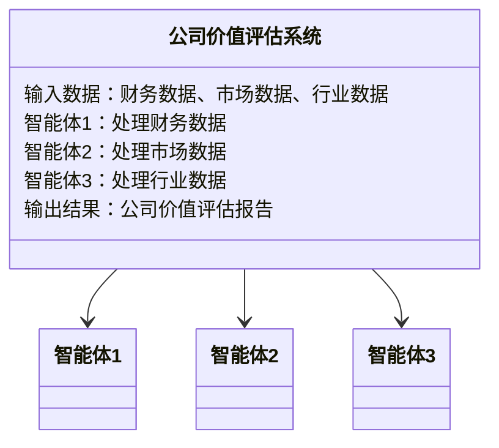
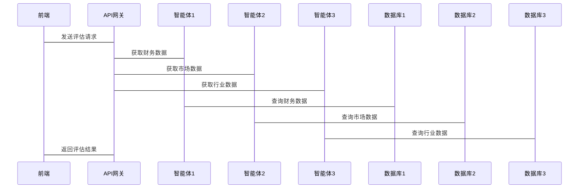

                 


# 多智能体协作实现全面的公司价值评估

## 关键词：多智能体协作、公司价值评估、分布式计算、协同学习、系统架构设计

## 摘要：
随着企业规模的不断扩大和市场环境的日益复杂，传统的单一智能体评估方法已难以满足全面、准确评估公司价值的需求。多智能体协作通过分布式计算和协同学习，能够整合多个智能体的计算能力和数据资源，实现对公司价值的全面评估。本文从多智能体协作的基本原理出发，详细阐述其在公司价值评估中的应用，并通过实际案例分析，展示如何利用多智能体协作技术提升公司价值评估的准确性和效率。最后，本文总结了多智能体协作在公司价值评估中的优势，并提出了未来研究的方向。

---

## 第1章：多智能体协作与公司价值评估概述

### 1.1 多智能体协作的基本概念

#### 1.1.1 多智能体协作的定义
多智能体协作是指多个智能体（Agents）通过分布式计算和协同学习，共同完成某一任务或目标的过程。每个智能体都有自己的计算能力和数据资源，通过通信与协调，实现任务的高效完成。

#### 1.1.2 多智能体协作的特点
- **分布式计算**：智能体之间通过分布式计算，避免了单点计算的局限性。
- **协同学习**：智能体之间可以共享数据和知识，提升整体的学习能力和计算能力。
- **动态协作**：智能体之间的协作关系可以根据任务需求动态调整。

#### 1.1.3 多智能体协作的应用场景
- **分布式计算**：适用于需要大量计算资源的任务。
- **协同学习**：适用于需要多个数据源和模型协作的任务。
- **动态协作**：适用于任务需求变化频繁的场景。

### 1.2 公司价值评估的重要性

#### 1.2.1 公司价值评估的目的
公司价值评估是企业在融资、并购、上市等活动中不可或缺的一部分，能够帮助企业准确评估自身的市场价值。

#### 1.2.2 公司价值评估的常见方法
- **财务指标法**：通过财务数据（如净利润、营业收入等）评估公司价值。
- **市场法**：通过市场可比公司数据评估公司价值。
- **DCF模型**：通过现金流折现法评估公司价值。

#### 1.2.3 公司价值评估的挑战
- **数据多样性**：需要整合财务数据、市场数据、行业数据等多种数据源。
- **计算复杂性**：复杂的计算模型需要高效的计算能力。
- **动态变化**：市场环境的变化需要评估方法具有动态调整能力。

### 1.3 多智能体协作在公司价值评估中的作用

#### 1.3.1 多智能体协作如何提升评估效率
通过分布式计算，多个智能体可以同时处理不同的数据源，显著提高评估效率。

#### 1.3.2 多智能体协作如何提高评估准确性
智能体之间的协同学习可以整合多个数据源和模型，提升评估结果的准确性。

#### 1.3.3 多智能体协作如何实现全面评估
通过多个智能体的协作，可以实现对公司多个维度（如财务、市场、行业等）的全面评估。

---

## 第2章：多智能体协作的核心原理

### 2.1 多智能体协作的原理

#### 2.1.1 分布式计算与协同学习
- **分布式计算**：多个智能体分别承担部分计算任务，通过通信实现结果的整合。
- **协同学习**：智能体之间共享数据和模型，提升整体的学习能力。

#### 2.1.2 智能体之间的通信与协调
- **通信机制**：智能体之间通过消息传递进行通信。
- **协调机制**：通过协调算法确保智能体之间的协作有序进行。

#### 2.1.3 多智能体协作的数学模型
$$
\text{评估价值} = \sum_{i=1}^{n} w_i x_i
$$
其中，$w_i$是智能体i的权重，$x_i$是智能体i的评估结果。

### 2.2 多智能体协作的关键技术

#### 2.2.1 分布式系统架构
- **分布式计算架构**：智能体分别承担不同的计算任务。
- **协同学习架构**：智能体之间共享数据和模型。

#### 2.2.2 协同算法
- **协同学习算法**：如分布式协同回归、分布式协同分类等。
- **通信协议**：如RPC（远程过程调用）、HTTP等。

#### 2.2.3 智能体间的信任机制
- **信任评估**：评估智能体之间的信任度，确保协作过程的安全性。
- **激励机制**：通过激励机制提高智能体的协作积极性。

---

## 第3章：多智能体协作的算法原理

### 3.1 分布式计算算法

#### 3.1.1 分布式计算的基本原理
多个智能体分别承担部分计算任务，通过通信实现结果的整合。

#### 3.1.2 分布式计算在多智能体协作中的应用
- **并行计算**：多个智能体同时处理不同的数据块。
- **任务分解**：将任务分解为多个子任务，分别由不同的智能体处理。

#### 3.1.3 分布式计算的优缺点
- **优点**：提高计算效率，降低单点故障风险。
- **缺点**：需要较高的通信开销，协调复杂。

### 3.2 协同学习算法

#### 3.2.1 协同学习的基本原理
多个智能体共享数据和模型，通过协同学习提升整体的学习能力。

#### 3.2.2 协同学习在多智能体协作中的应用
- **分布式协同回归**：通过协同学习实现回归模型的分布式训练。
- **分布式协同分类**：通过协同学习实现分类模型的分布式训练。

#### 3.2.3 协同学习的数学模型
$$
y = \sum_{i=1}^{n} w_i x_i
$$
其中，$y$是预测结果，$w_i$是智能体i的权重，$x_i$是智能体i的输入。

### 3.3 智能体间通信算法

#### 3.3.1 智能体间通信的基本原理
智能体之间通过消息传递进行通信，确保协作过程的信息共享。

#### 3.3.2 智能体间通信在多智能体协作中的应用
- **消息传递协议**：如HTTP、WebSocket等。
- **通信延迟优化**：通过优化通信协议降低通信延迟。

#### 3.3.3 智能体间通信的优缺点
- **优点**：确保信息共享，提升协作效率。
- **缺点**：需要较高的通信开销，可能面临网络瓶颈。

---

## 第4章：多智能体协作与公司价值评估的系统设计

### 4.1 系统功能设计

#### 4.1.1 领域模型


#### 4.1.2 系统架构设计


#### 4.1.3 系统交互流程


---

## 第5章：多智能体协作的项目实战

### 5.1 环境安装

#### 5.1.1 安装Python
```bash
python --version
pip install --upgrade pip
```

#### 5.1.2 安装依赖库
```bash
pip install numpy pandas scikit-learn requests
```

### 5.2 核心代码实现

#### 5.2.1 智能体类
```python
class Agent:
    def __init__(self, id):
        self.id = id
        self.data = None
        self.model = None

    def process_data(self, data):
        # 处理数据并返回结果
        pass

    def communicate(self, other_agent):
        # 与另一个智能体通信
        pass
```

#### 5.2.2 协作算法实现
```python
import numpy as np
from sklearn.linear_model import LinearRegression

class CollaborativeLearning:
    def __init__(self, agents):
        self.agents = agents

    def train(self, X, y):
        for agent in self.agents:
            agent.model = LinearRegression()
            agent.model.fit(X, y)
```

#### 5.2.3 评估结果整合
```python
def aggregate_results(agents):
    results = [agent.model.predict(X_test) for agent in agents]
    return np.mean(results, axis=0)
```

### 5.3 案例分析

#### 5.3.1 数据准备
```python
import pandas as pd

data = pd.read_csv('company_value.csv')
X = data[['revenue', 'profit', 'market_cap']]
y = data['value']
```

#### 5.3.2 分配任务
```python
agent1 = Agent(1)
agent2 = Agent(2)
agent3 = Agent(3)
collaborative_learning = CollaborativeLearning([agent1, agent2, agent3])
collaborative_learning.train(X, y)
```

#### 5.3.3 评估结果
```python
X_test = pd.DataFrame({'revenue': [1000, 2000], 'profit': [100, 200], 'market_cap': [100000, 200000]})
y_pred = aggregate_results([agent1, agent2, agent3])
print(y_pred)
```

---

## 第6章：多智能体协作的总结与展望

### 6.1 总结
多智能体协作通过分布式计算和协同学习，能够显著提升公司价值评估的效率和准确性。通过多个智能体的协作，可以整合多种数据源，实现对公司价值的全面评估。

### 6.2 注意事项
- **数据隐私**：需要注意智能体之间的数据共享可能带来的隐私问题。
- **通信延迟**：需要优化智能体之间的通信机制，降低通信延迟。
- **计算资源**：需要合理分配计算资源，确保协作过程的高效性。

### 6.3 拓展阅读
- **分布式计算**：深入学习分布式计算的相关技术。
- **协同学习**：研究协同学习的最新进展和应用。

---

## 作者：AI天才研究院 & 禅与计算机程序设计艺术

---

通过本文的详细讲解，读者可以深入了解多智能体协作在公司价值评估中的应用，并掌握相关的算法实现和系统设计方法。希望本文能为读者在实际应用中提供有价值的参考和启发。

