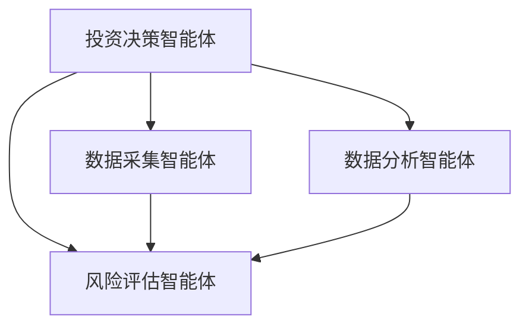
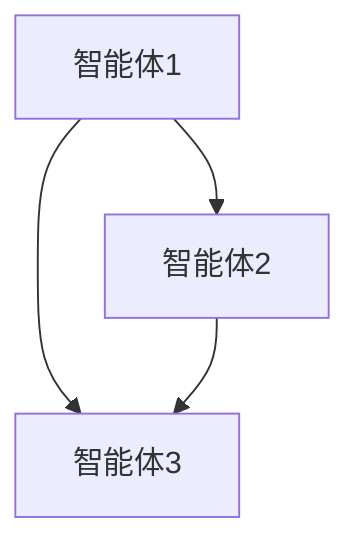
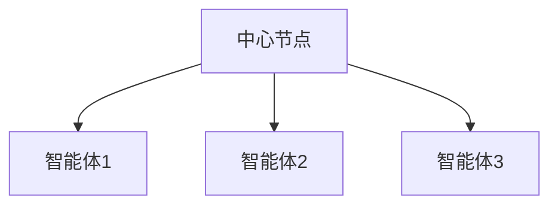
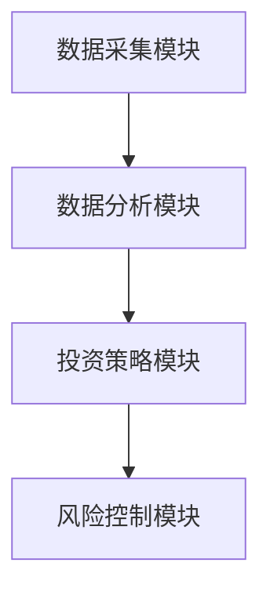
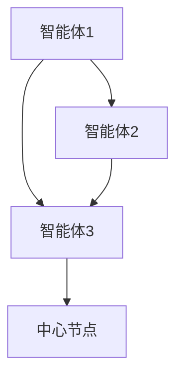
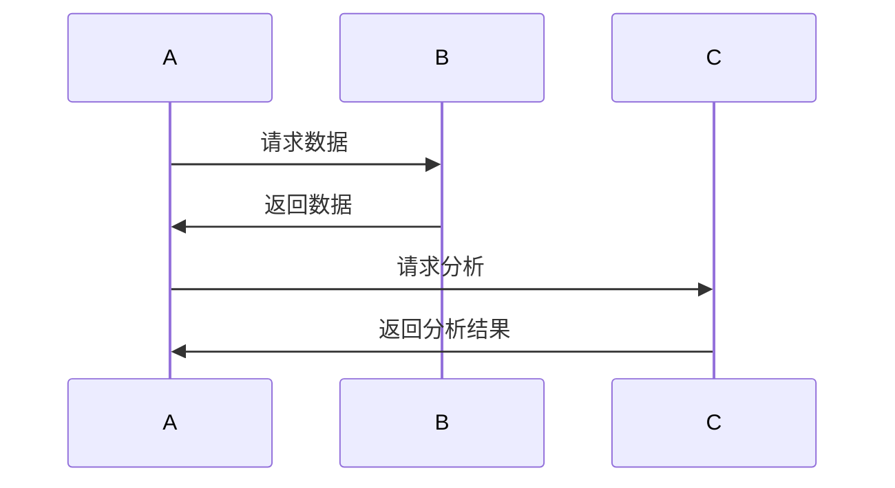

                 


# 多智能体协作提升价值投资决策质量

> 关键词：多智能体协作，价值投资决策，人工智能，投资策略优化，协作机制

> 摘要：本文探讨了多智能体协作在价值投资决策中的应用，分析了其核心概念、算法原理、系统架构及项目实战。通过详细阐述多智能体协作的优势、算法实现和实际案例，本文展示了如何利用多智能体协作提升投资决策的质量。

---

# 第一部分: 多智能体协作与价值投资决策概述

# 第1章: 多智能体协作与价值投资决策概述

## 1.1 多智能体协作的基本概念

### 1.1.1 多智能体协作的定义

多智能体协作是指多个智能体（Agents）通过通信、协调和合作，共同完成某个任务或达到某个目标的过程。智能体可以是软件程序、算法或任何能够感知环境并采取行动的实体。

### 1.1.2 多智能体协作的核心特征

- **分布式性**：多个智能体分布在不同的位置，独立运行并协作。
- **自主性**：每个智能体能够自主决策，无需外部干预。
- **协调性**：智能体之间通过通信和协作机制实现协调。
- **适应性**：能够根据环境变化动态调整协作策略。

### 1.1.3 价值投资决策的基本概念

价值投资是指通过分析企业的基本面，寻找被市场低估的投资标的。传统价值投资依赖分析师的主观判断，而多智能体协作可以通过数据挖掘、模式识别等方式，辅助投资者做出更科学的决策。

---

## 1.2 多智能体协作在投资决策中的应用背景

### 1.2.1 传统投资决策的局限性

- **信息过载**：金融市场数据庞大，分析师难以处理。
- **主观性**：依赖个人经验和判断，存在主观偏差。
- **效率低下**：传统方法难以快速响应市场变化。

### 1.2.2 多智能体协作的优势

- **数据处理能力**：多智能体可以同时处理大量数据，提高效率。
- **决策多样性**：多个智能体可以从不同角度分析问题，提供多样化的决策方案。
- **动态适应**：智能体可以根据市场变化快速调整策略。

### 1.2.3 价值投资决策中的多智能体协作场景

- **数据采集与分析**：多个智能体分别负责数据采集、清洗和分析。
- **策略制定**：智能体协作制定投资策略。
- **风险控制**：通过协作机制降低投资风险。

---

## 1.3 多智能体协作与价值投资的结合

### 1.3.1 多智能体协作在价值投资中的作用

- 提供实时数据支持。
- 帮助识别市场趋势。
- 优化投资组合。

### 1.3.2 价值投资决策中的多智能体协作流程

1. 数据采集：智能体从不同来源获取数据。
2. 数据分析：智能体分别对数据进行处理。
3. 协作决策：智能体协作制定投资策略。
4. 风险评估：智能体评估投资风险。
5. 决策执行：根据协作结果执行投资决策。

### 1.3.3 多智能体协作提升决策质量的机制

- 通过分布式计算提高效率。
- 多角度分析提供全面支持。
- 动态协作适应市场变化。

---

## 1.4 本章小结

本章介绍了多智能体协作的基本概念及其在价值投资中的应用背景。通过分析多智能体协作的优势，我们看到了其在提升投资决策质量中的潜力。

---

# 第二部分: 多智能体协作的核心概念与联系

# 第2章: 多智能体协作的核心概念与联系

## 2.1 多智能体协作的原理

### 2.1.1 智能体的定义与特征

智能体是一种能够感知环境、自主决策并采取行动的实体。其核心特征包括自主性、反应性、目标导向性和学习能力。

### 2.1.2 多智能体协作的基本原理

多智能体协作通过智能体之间的通信与协作，共同完成复杂任务。协作机制包括任务分配、信息共享和决策协调。

### 2.1.3 智能体之间的通信与协作机制

通信机制：智能体之间通过消息传递、数据共享等方式进行通信。

协作机制：通过协商、协调和同步实现协作。

---

## 2.2 多智能体协作与价值投资的联系

### 2.2.1 价值投资中的信息处理需求

- 大量数据处理：股票价格、财务报表、市场新闻等。
- 多维度分析：包括基本面分析、技术分析等。

### 2.2.2 多智能体协作在信息处理中的应用

- 数据采集智能体：负责数据的收集与整理。
- 数据分析智能体：负责对数据进行建模和预测。
- 投资策略智能体：根据分析结果制定投资策略。

### 2.2.3 多智能体协作如何提升投资决策质量

- 提供全面的数据支持。
- 提高决策的科学性和准确性。
- 实现动态调整和风险控制。

---

## 2.3 多智能体协作的核心要素对比

### 2.3.1 不同协作机制的特征对比

| 协作机制 | 特征 |
|----------|------|
| 分布式协作 | 去中心化、高效但复杂 |
| 集中式协作 | 高度集中、简单但效率低 |

### 2.3.2 分布式协作与集中式协作的优缺点

- 分布式协作：优点是去中心化、抗单点故障；缺点是通信复杂、协调困难。
- 集中式协作：优点是易于管理、协调简单；缺点是依赖中心节点、效率受限。

### 2.3.3 协作智能体的实体关系图



---

## 2.4 本章小结

本章分析了多智能体协作的核心概念及其与价值投资的联系。通过对比不同协作机制的特征，我们明确了分布式协作在提升投资决策质量中的优势。

---

# 第三部分: 多智能体协作算法原理与数学模型

# 第3章: 多智能体协作算法原理

## 3.1 多智能体协作算法概述

### 3.1.1 多智能体协作算法的分类

- 分布式算法：任务分配、信息共享。
- 集中式算法：中心节点协调。

### 3.1.2 多智能体协作算法的核心步骤

1. 初始化：设定智能体目标和协作规则。
2. 通信：智能体之间共享信息。
3. 协作：根据信息制定协作策略。
4. 执行：智能体按照协作策略执行任务。

---

## 3.2 多智能体协作算法的实现细节

### 3.2.1 分布式协作算法的实现



### 3.2.2 集中式协作算法的实现



---

## 3.3 多智能体协作算法的数学模型

### 3.3.1 协作目标的数学表达

$$ \text{目标函数} = \sum_{i=1}^{n} f_i(x_i) $$

其中，$f_i$ 是第 $i$ 个智能体的目标函数，$x_i$ 是其决策变量。

### 3.3.2 协作规则的数学表达

$$ \text{协作规则} = \{x_1, x_2, \dots, x_n\} $$

每个智能体的决策变量 $x_i$ 需要满足协作规则。

---

## 3.4 本章小结

本章详细介绍了多智能体协作算法的原理和实现细节，并通过数学模型进一步阐述了协作机制。

---

# 第四部分: 系统分析与架构设计

# 第4章: 系统分析与架构设计

## 4.1 项目背景与需求分析

### 4.1.1 项目背景

本项目旨在利用多智能体协作技术，提升价值投资决策的质量。

### 4.1.2 项目需求

- 实时数据处理
- 多维度分析
- 投资策略优化

---

## 4.2 系统功能设计

### 4.2.1 功能模块划分

- 数据采集模块
- 数据分析模块
- 投资策略模块
- 风险控制模块

### 4.2.2 功能模块的实体关系图



---

## 4.3 系统架构设计

### 4.3.1 系统架构图



### 4.3.2 接口设计

- 数据接口：智能体之间的数据通信接口。
- 控制接口：中心节点对智能体的控制接口。

### 4.3.3 交互流程图



---

## 4.4 本章小结

本章通过系统分析和架构设计，明确了多智能体协作系统的功能模块和协作机制。

---

# 第五部分: 项目实战

# 第5章: 项目实战

## 5.1 项目环境与工具安装

### 5.1.1 环境要求

- 操作系统：Windows/Mac/Linux
- 编程语言：Python 3.8+
- 开发工具：PyCharm/VS Code
- 第三方库：numpy, pandas, scikit-learn

---

## 5.2 系统核心实现

### 5.2.1 核心代码实现

```python
import numpy as np
import pandas as pd

# 数据采集智能体
class DataAgent:
    def collect_data(self):
        # 模拟数据采集
        df = pd.DataFrame({
            'date': ['2023-01-01', '2023-01-02', '2023-01-03'],
            'price': [100, 102, 101]
        })
        return df

# 数据分析智能体
class AnalysisAgent:
    def analyze_data(self, data):
        # 模拟数据分析
        return data['price'].mean()

# 投资策略智能体
class StrategyAgent:
    def create_strategy(self, data_mean):
        # 根据均值制定策略
        if data_mean > 100:
            return '买入'
        else:
            return '卖出'

# 协作流程
class Collaboration:
    def main(self):
        data_agent = DataAgent()
        analysis_agent = AnalysisAgent()
        strategy_agent = StrategyAgent()

        data = data_agent.collect_data()
        mean = analysis_agent.analyze_data(data)
        strategy = strategy_agent.create_strategy(mean)
        return strategy

if __name__ == '__main__':
    collaboration = Collaboration()
    print(collaboration.main())
```

### 5.2.2 代码解读与分析

- `DataAgent` 负责数据采集。
- `AnalysisAgent` 负责数据分析。
- `StrategyAgent` 负责制定投资策略。
- `Collaboration` 是协作流程的主函数。

---

## 5.3 项目实战小结

本章通过实际项目展示了多智能体协作的实现过程，包括环境搭建、代码实现和协作流程设计。

---

# 第六部分: 最佳实践与总结

# 第6章: 最佳实践与总结

## 6.1 多智能体协作在价值投资中的注意事项

### 6.1.1 数据质量的重要性

- 数据的准确性和完整性直接影响协作结果。

### 6.1.2 算法选择的影响

- 不同算法适用于不同场景，需根据实际需求选择。

### 6.1.3 系统维护的必要性

- 定期更新算法和数据，确保系统高效运行。

---

## 6.2 本项目总结

### 6.2.1 项目成果

- 成功实现了多智能体协作系统。
- 提高了投资决策的质量。

### 6.2.2 项目经验

- 多智能体协作需要良好的通信机制。
- 系统架构设计至关重要。

---

## 6.3 未来展望

随着人工智能技术的发展，多智能体协作在投资领域将有更广泛的应用。未来的研究方向包括更高效的协作算法和更智能的系统架构。

---

# 作者

作者：AI天才研究院 & 禅与计算机程序设计艺术

---

以上是《多智能体协作提升价值投资决策质量》的完整目录大纲和文章内容。如需进一步调整或补充，请随时告知。

