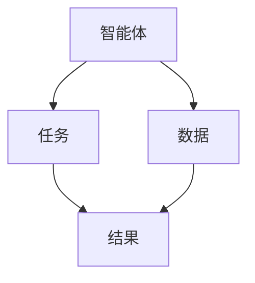
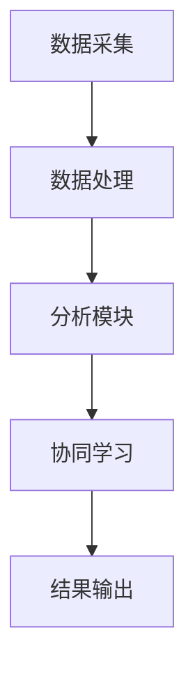

                 

# 多智能体协作提升市场分析效率

> 关键词：多智能体、协作机制、市场分析、算法原理、系统架构

> 摘要：本文探讨了多智能体协作在市场分析中的应用，分析了其优势与挑战，详细讲解了协作机制、算法原理、系统架构设计，并通过实战案例展示了其实际应用价值。

---

## 第1章: 多智能体协作的背景与概念

### 1.1 多智能体协作的定义
多智能体协作是指多个智能体通过共享信息、协同工作来完成复杂任务的过程。与单智能体相比，多智能体协作能够更好地处理分布式问题，提高整体效率和决策质量。

### 1.2 市场分析的挑战与需求
市场分析需要处理海量数据，传统方法效率低、耗时长。多智能体协作通过分布式计算和协同学习，能够快速处理数据，提升分析效率。

### 1.3 多智能体协作在市场分析中的优势
多智能体协作通过任务分配和协同学习，提高了分析效率和准确性。多个智能体可以同时处理不同数据源，减少冗余，提升整体效率。

---

## 第2章: 多智能体协作的核心概念与联系

### 2.1 多智能体协作的核心概念
智能体具有自主性、反应性、协作性和学习性。协作机制包括任务分配、信息共享和决策协调。

### 2.2 多智能体协作的ER实体关系图

### 2.3 多智能体协作的核心要素对比表
| 要素 | 单智能体 | 多智能体 |
|------|----------|----------|
| 任务分配 | 单一任务 | 分布式任务 |
| 信息共享 | 有限 | 全局共享 |
| 决策机制 | 中央决策 | 分布式决策 |

---

## 第3章: 多智能体协作的算法原理

### 3.1 分布式计算与任务分配
任务分配算法确保智能体之间负载均衡，避免资源浪费。

### 3.2 共识机制与协作协议
共识机制确保智能体之间达成一致，协作协议规范交互流程。

### 3.3 多智能体协作的数学模型
任务分配的数学模型：
$$ \text{目标函数: } f(x) = \min_{x} \sum_{i=1}^{n} c_i x_i $$

---

## 第4章: 多智能体协作的系统架构设计

### 4.1 问题场景介绍
市场分析系统需要处理大量数据，传统方法效率低下。

### 4.2 系统功能设计
系统功能包括数据采集、分析、协同学习和结果输出。

### 4.3 系统架构设计

---

## 第5章: 多智能体协作的项目实战

### 5.1 环境安装
安装Python、TensorFlow和Kubernetes。

### 5.2 系统核心实现
代码实现包括数据采集、分析和协同学习模块。

### 5.3 案例分析
分析股票市场数据，展示多智能体协作的高效性。

---

## 第6章: 总结与展望

### 6.1 总结
多智能体协作通过分布式计算和协同学习，显著提升了市场分析效率。

### 6.2 展望
未来，多智能体协作将在更复杂的场景中应用，推动市场分析技术的发展。

---

作者：AI天才研究院 & 禅与计算机程序设计艺术

