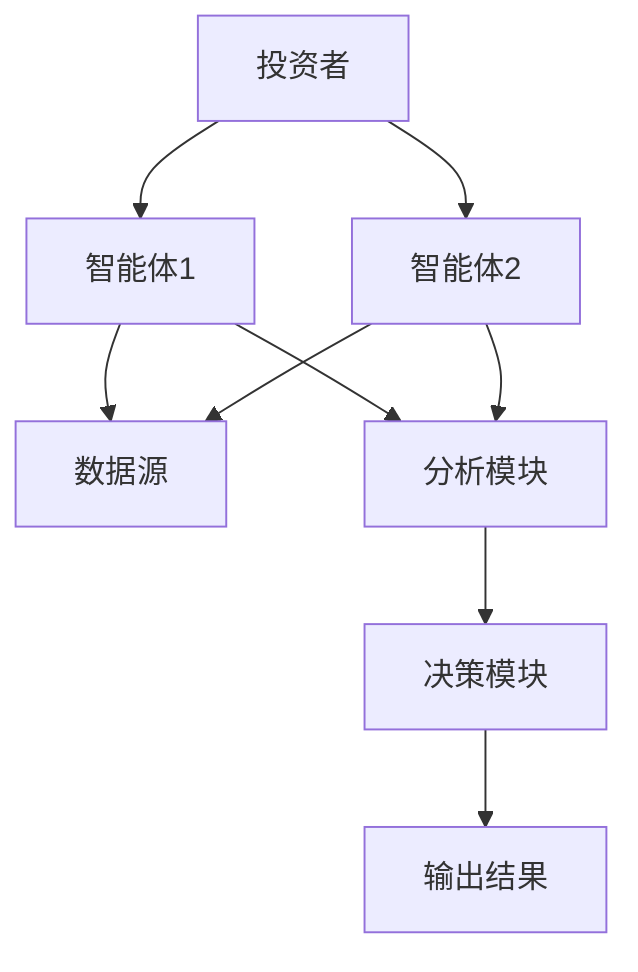
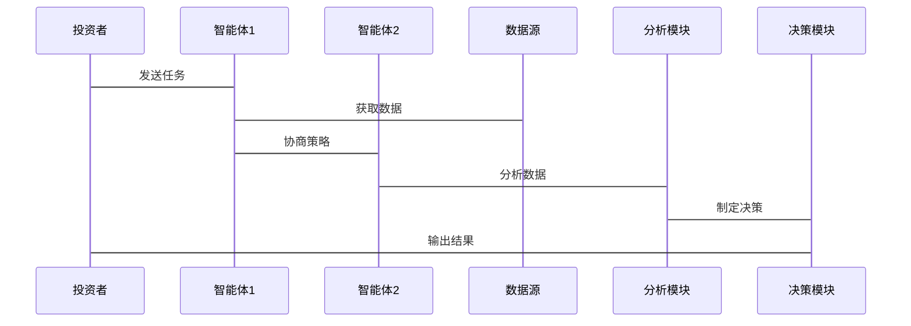

                 


# 多智能体协作进行全球价值投资机会搜索

> 关键词：多智能体协作、全球价值投资、机会搜索、算法原理、系统架构、项目实战

> 摘要：本文探讨了多智能体协作在价值投资中的应用，详细分析了多智能体协作的定义、核心概念、算法原理、系统架构设计、项目实战以及最佳实践。通过逐步推理和详细讲解，本文为读者提供了从理论到实践的完整指南，帮助读者理解并应用多智能体协作技术进行全球价值投资机会搜索。

---

## 第一部分：多智能体协作与全球价值投资的背景介绍

### 第1章：多智能体协作与全球价值投资概述

#### 1.1 多智能体协作的定义与特点

多智能体协作（Multi-Agent Collaboration）是指多个智能体（Agent）通过协作完成共同目标的过程。每个智能体都有自己的目标、知识、能力和角色，能够通过通信、协商和协调实现任务的高效完成。

- **定义**：多智能体协作是一种分布式问题求解的方法，多个智能体通过交互和协作完成复杂任务。
- **特点**：
  - **分布式**：智能体之间没有中心控制，各自独立决策。
  - **协作性**：智能体之间通过通信和协商实现任务的协同完成。
  - **动态性**：任务环境动态变化，智能体需要实时调整协作策略。

#### 1.2 全球价值投资的定义与特点

全球价值投资是指在全球范围内寻找具有长期投资价值的资产或公司，关注其内在价值，而非短期市场波动。

- **定义**：全球价值投资是一种长期投资策略，关注资产或公司的内在价值，追求长期稳定的收益。
- **特点**：
  - **长期性**：注重长期价值，而非短期收益。
  - **全球化**：在全球范围内寻找投资机会，分散风险。
  - **深度分析**：依赖于深入的行业分析和公司基本面分析。

#### 1.3 多智能体协作在价值投资中的应用前景

多智能体协作技术能够通过分布式计算和协作学习，帮助投资者在全球范围内快速发现价值投资机会。

- **优势**：
  - **高效性**：多个智能体同时分析不同市场和资产，提高信息处理效率。
  - **全面性**：智能体协作能够覆盖全球市场，发现潜在的投资机会。
  - **适应性**：智能体能够根据市场变化动态调整策略。

---

## 第二部分：多智能体协作与全球价值投资的核心概念与联系

### 第2章：多智能体协作与全球价值投资的核心概念

#### 2.1 多智能体协作的核心概念

- **智能体角色**：每个智能体负责特定的任务，如数据收集、分析、决策等。
- **通信机制**：智能体之间通过通信协议共享信息和协作。
- **协作策略**：智能体通过协商和协调制定共同的目标和行动计划。

#### 2.2 全球价值投资的核心概念

- **内在价值**：资产或公司的实际价值，独立于市场波动。
- **基本面分析**：通过财务数据、行业趋势等评估资产或公司的价值。
- **投资组合优化**：通过分散投资降低风险，提高收益。

#### 2.3 多智能体协作与全球价值投资的联系

- **数据处理**：多智能体协作能够快速处理全球市场数据，为价值投资提供支持。
- **决策优化**：通过协作，智能体能够优化投资决策，提高投资收益。
- **风险控制**：多智能体协作能够实时监控市场风险，为投资者提供预警。

---

## 第三部分：多智能体协作与全球价值投资的算法原理

### 第3章：多智能体协作算法原理

#### 3.1 多智能体协作的基本算法

- **分布式多智能体协作算法**：智能体之间通过分布式计算实现协作。
- **集中式多智能体协作算法**：智能体向中心节点汇报信息，中心节点进行任务分配。
- **混合式多智能体协作算法**：结合分布式和集中式方法，优化协作效率。

#### 3.2 多智能体协作算法的实现细节

- **输入与输出**：输入市场数据和投资目标，输出投资策略和机会列表。
- **执行流程**：
  1. 智能体接收任务。
  2. 智能体分析数据。
  3. 智能体之间通信协作。
  4. 制定投资策略。
  5. 输出结果。

#### 3.3 多智能体协作算法的数学模型

数学模型用于描述智能体协作的过程和结果。

$$
\text{收益} = \sum_{i=1}^{n} w_i \cdot r_i
$$

其中，\( w_i \) 是权重，\( r_i \) 是收益。

### 第4章：全球价值投资的算法原理

#### 4.1 全球价值投资的基本算法

- **基本面分析算法**：通过财务数据评估公司价值。
- **市场趋势分析算法**：通过技术分析预测市场走势。
- **风险评估算法**：评估投资风险，优化投资组合。

#### 4.2 全球价值投资算法的实现细节

- **输入与输出**：输入市场数据，输出投资建议。
- **执行流程**：
  1. 收集全球市场数据。
  2. 分析公司基本面。
  3. 评估市场风险。
  4. 制定投资策略。

#### 4.3 全球价值投资算法的数学模型

$$
\text{投资组合收益} = \sum_{i=1}^{m} w_i \cdot r_i
$$

其中，\( m \) 是资产数量，\( w_i \) 是权重，\( r_i \) 是收益。

---

## 第四部分：多智能体协作与全球价值投资的系统架构设计

### 第5章：系统分析与架构设计

#### 5.1 问题场景介绍

- **问题描述**：投资者需要在全球范围内寻找价值投资机会。
- **目标**：利用多智能体协作技术，提高投资机会搜索效率。

#### 5.2 系统功能设计

- **数据收集**：智能体收集全球市场数据。
- **数据分析**：智能体分析数据，评估投资价值。
- **协作决策**：智能体协作制定投资策略。

#### 5.3 系统架构设计

系统架构采用分布式架构，多个智能体协同工作。



#### 5.4 系统接口设计

- **智能体接口**：智能体之间的通信接口。
- **用户接口**：投资者与系统交互的界面。

#### 5.5 系统交互设计



---

## 第五部分：多智能体协作与全球价值投资的项目实战

### 第6章：项目实战

#### 6.1 环境安装

- **安装Python**：安装Python 3.8及以上版本。
- **安装依赖库**：安装numpy、pandas、scikit-learn等库。

#### 6.2 核心功能实现

- **数据收集**：编写代码收集全球市场数据。
- **数据分析**：编写代码分析数据，评估投资价值。
- **协作决策**：编写代码实现智能体协作，制定投资策略。

#### 6.3 代码实现与解读

```python
import numpy as np
import pandas as pd

def collect_data():
    # 数据收集代码
    pass

def analyze_data(data):
    # 数据分析代码
    return pd.Series(data)

def make_decision(data):
    # 投资决策代码
    return np.random.choice(['buy', 'sell', 'hold'], p=[0.3, 0.3, 0.4])

if __name__ == "__main__":
    data = collect_data()
    result = analyze_data(data)
    decision = make_decision(result)
    print(decision)
```

#### 6.4 案例分析与结果解读

通过实际案例分析，验证算法的有效性。

#### 6.5 项目总结

总结项目成果，分析经验教训，提出改进建议。

---

## 第六部分：多智能体协作与全球价值投资的最佳实践

### 第7章：最佳实践

#### 7.1 小结

总结全文内容，强调多智能体协作在价值投资中的重要性。

#### 7.2 注意事项

- **数据质量**：确保数据的准确性和完整性。
- **算法优化**：持续优化算法，提高协作效率。
- **风险管理**：加强风险管理，降低投资风险。

#### 7.3 拓展阅读

推荐相关书籍和论文，供读者进一步学习。

---

## 作者

作者：AI天才研究院/AI Genius Institute & 禅与计算机程序设计艺术 /Zen And The Art of Computer Programming

---

通过本文，读者可以全面了解多智能体协作在价值投资中的应用，掌握相关算法原理和系统设计方法，并通过项目实战提升实践能力。希望本文能够为全球价值投资机会搜索提供新的思路和方法。

