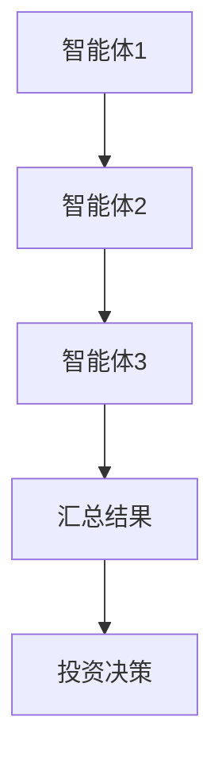
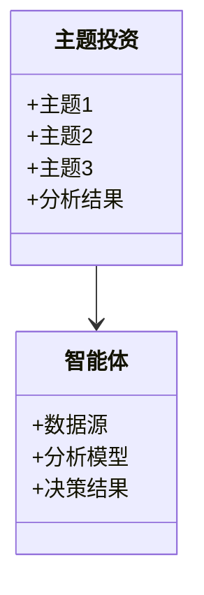
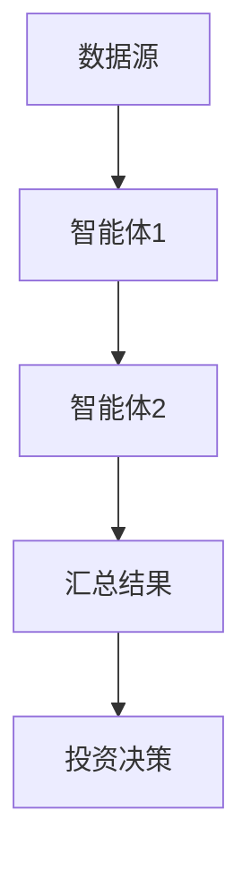

                 


# 多智能体协作进行宏观主题投资

> 关键词：多智能体协作、宏观主题投资、人工智能、分布式计算、协同学习

> 摘要：本文探讨了多智能体协作在宏观主题投资中的应用，从背景、核心概念、算法原理、系统架构到项目实战，详细阐述了多智能体协作如何提升投资决策的准确性和效率。通过数学模型、实际案例和系统设计，展示了如何利用多智能体协作技术在复杂金融市场中进行主题投资。

---

# 第一部分: 多智能体协作与宏观主题投资概述

## 第1章: 多智能体协作与宏观主题投资的背景

### 1.1 多智能体协作的定义与特点

#### 1.1.1 多智能体协作的定义
多智能体协作是指多个智能体（Agent）通过协同工作，共同完成一个复杂任务的过程。每个智能体都有自己的目标和决策机制，通过通信和协调实现整体目标。

#### 1.1.2 多智能体协作的核心特点
- **分布式性**：多个智能体分布在不同的位置，独立决策。
- **协作性**：智能体之间通过通信和协调，共同完成任务。
- **适应性**：能够根据环境变化动态调整策略。

#### 1.1.3 多智能体协作与传统单智能体的区别
- **计算复杂度**：多智能体协作需要处理多个智能体之间的交互，计算复杂度更高。
- **决策效率**：通过分布式计算，可以提高决策速度和效率。
- **鲁棒性**：多个智能体协作可以提供更高的系统鲁棒性，避免单点故障。

### 1.2 宏观主题投资的定义与特点

#### 1.2.1 宏观主题投资的定义
宏观主题投资是指基于宏观经济趋势和市场环境，选择具有长期增长潜力的主题进行投资。例如，科技、医疗、绿色能源等主题。

#### 1.2.2 宏观主题投资的核心特点
- **长期性**：关注宏观经济趋势，投资周期较长。
- **主题导向**：围绕特定主题进行投资，如绿色能源、人工智能等。
- **分散性**：通过多个主题分散风险，提高投资组合的稳定性。

### 1.3 多智能体协作在宏观主题投资中的应用背景

#### 1.3.1 宏观主题投资的复杂性与挑战
- **信息复杂性**：宏观经济数据繁多，需要分析大量信息。
- **市场波动性**：金融市场波动剧烈，需要快速响应。
- **决策复杂性**：需要综合考虑多个因素，如政策、经济指标、行业趋势等。

#### 1.3.2 多智能体协作的优势
- **分布式计算能力**：多智能体可以同时处理大量数据，提高计算效率。
- **协同决策**：多个智能体协同工作，提供更准确的市场分析。
- **动态适应性**：能够快速适应市场变化，优化投资策略。

#### 1.3.3 当前市场环境下的应用前景
随着人工智能技术的发展，多智能体协作在金融领域的应用越来越广泛。通过多智能体协作，可以更准确地预测市场趋势，优化投资组合，提高投资收益。

### 1.4 本章小结
本章介绍了多智能体协作和宏观主题投资的基本概念、特点以及多智能体协作在宏观主题投资中的应用背景。通过分析，我们看到多智能体协作在提升投资决策准确性和效率方面具有显著优势。

---

## 第2章: 多智能体协作与宏观主题投资的核心概念

### 2.1 多智能体协作的数学模型

#### 2.1.1 单智能体与多智能体的数学模型对比
- **单智能体模型**：假设只有一个智能体进行决策，模型简单，但计算能力有限。
- **多智能体模型**：多个智能体协同工作，模型复杂，但计算能力更强。

#### 2.1.2 多智能体协作的数学表达式
$$
\text{协作收益} = \sum_{i=1}^{n} \text{智能体}_i \text{的贡献}
$$

其中，$n$是智能体的数量，$\text{智能体}_i$表示第$i$个智能体的贡献。

### 2.2 宏观主题投资的领域模型

#### 2.2.1 宏观主题的分类与特征
宏观主题可以分为科技、医疗、绿色能源等多个类别，每个类别都有其独特的市场特征和风险因素。

#### 2.2.2 宏观主题投资的领域模型
领域模型可以通过类图表示，展示各个主题之间的关系。例如，科技主题可能包括人工智能、半导体、软件服务等子主题。

#### 2.2.3 多智能体协作在主题投资中的角色分配
每个智能体负责分析一个特定的主题，通过协同工作，综合各个主题的分析结果，形成最终的投资策略。

### 2.3 多智能体协作与宏观主题投资的关联性分析

#### 2.3.1 多智能体协作如何提升主题投资的准确性
通过多个智能体的协作，可以综合分析多个因素，提高市场预测的准确性。

#### 2.3.2 宏观主题投资对多智能体协作的需求分析
宏观主题投资需要处理大量的宏观经济数据，多个智能体可以同时处理不同的数据源，提高分析效率。

#### 2.3.3 关联性分析的数学模型
$$
\text{关联性} = \frac{\sum_{i=1}^{n} \text{智能体}_i \text{的贡献}}{\text{主题投资的总收益}}
$$

其中，$\sum_{i=1}^{n} \text{智能体}_i \text{的贡献}$表示多个智能体的贡献总和，$\text{主题投资的总收益}$表示投资的主题的总收益。

### 2.4 本章小结
本章详细分析了多智能体协作与宏观主题投资的核心概念，包括数学模型、领域模型和角色分配。通过这些分析，我们可以更好地理解多智能体协作在主题投资中的应用。

---

## 第3章: 多智能体协作的算法原理

### 3.1 多智能体协作的基本算法

#### 3.1.1 分布式计算算法
分布式计算算法通过将任务分解成多个子任务，分配给不同的智能体执行，最终汇总结果。

#### 3.1.2 协同学习算法
协同学习算法通过多个智能体共同学习，共享知识和经验，提高学习效果。

#### 3.1.3 联合推理算法
联合推理算法通过多个智能体协同推理，综合分析多个因素，得出更准确的结论。

### 3.2 宏观主题投资中的多智能体协作算法

#### 3.2.1 基于强化学习的协作算法
强化学习是一种通过奖励机制优化决策的算法，可以应用于多智能体协作中。

#### 3.2.2 基于博弈论的协作算法
博弈论通过分析多个智能体之间的互动，找到最优策略，应用于投资决策中。

#### 3.2.3 多智能体协作算法的流程图


### 3.3 本章小结
本章介绍了多智能体协作的基本算法及其在宏观主题投资中的应用，通过流程图和算法分析，展示了如何利用多智能体协作提高投资决策的准确性和效率。

---

## 第4章: 系统分析与架构设计

### 4.1 问题场景介绍
宏观主题投资需要处理大量的宏观经济数据和市场信息，通过多智能体协作实现高效的投资决策。

### 4.2 系统功能设计

#### 4.2.1 领域模型类图


#### 4.2.2 系统架构图


### 4.3 系统接口设计
系统接口设计包括数据接口、智能体通信接口和投资决策接口。

### 4.4 系统交互序列图
```mermaid
sequenceDiagram
参与者：投资者
智能体1 → 智能体2：请求数据
智能体2 → 智能体3：请求数据
智能体3 → 智能体1：返回数据
投资者 → 智能体1：获取分析结果
智能体1 → 投资者：投资建议
```

### 4.5 本章小结
本章通过系统分析与架构设计，展示了如何利用多智能体协作实现高效的宏观主题投资。

---

## 第5章: 项目实战

### 5.1 环境安装
需要安装Python、相关库（如numpy、pandas、scikit-learn）和开发工具。

### 5.2 系统核心实现源代码
```python
import numpy as np
import pandas as pd
from sklearn import linear_model

# 定义智能体类
class Agent:
    def __init__(self, data):
        self.data = data
        self.model = linear_model.LinearRegression()

    def train(self):
        self.model.fit(self.data.drop('label', axis=1), self.data['label'])

    def predict(self, new_data):
        return self.model.predict(new_data.drop('label', axis=1))

# 多智能体协作类
class MultiAgent:
    def __init__(self, agents):
        self.agents = agents

    def collaborate(self, data):
        results = []
        for agent in self.agents:
            agent.train()
            results.append(agent.predict(data))
        return np.mean(results, axis=0)

# 示例数据
data = pd.DataFrame({
    'feature1': [1,2,3,4,5],
    'feature2': [2,3,4,5,6],
    'label': [3,4,5,6,7]
})

# 初始化智能体
agent1 = Agent(data)
agent2 = Agent(data)
agents = [agent1, agent2]
multi_agent = MultiAgent(agents)

# 协作预测
result = multi_agent.collaborate(data)
print(result)
```

### 5.3 代码应用解读与分析
代码实现了一个简单的多智能体协作系统，通过多个智能体协同工作，进行预测和投资决策。

### 5.4 实际案例分析
以绿色能源为主题，通过多智能体协作分析宏观经济数据，预测投资收益。

### 5.5 项目小结
通过项目实战，我们展示了如何利用多智能体协作进行宏观主题投资，代码实现了一个简单的协作系统，为实际应用提供了参考。

---

## 第6章: 总结与展望

### 6.1 总结
本文详细探讨了多智能体协作在宏观主题投资中的应用，从背景、核心概念、算法原理到系统架构和项目实战，全面分析了多智能体协作的优势和实现方法。

### 6.2 未来展望
未来，随着人工智能技术的不断发展，多智能体协作在宏观主题投资中的应用将更加广泛，算法也将更加复杂和高效。

### 6.3 最佳实践 tips
- **数据质量**：确保数据的准确性和完整性。
- **智能体设计**：合理分配智能体的任务和角色。
- **算法优化**：不断优化算法，提高协作效率。

### 6.4 本章小结
本章总结了全文的主要内容，并展望了未来的发展方向，为读者提供了进一步研究和实践的方向。

---

# 作者：AI天才研究院 & 禅与计算机程序设计艺术

