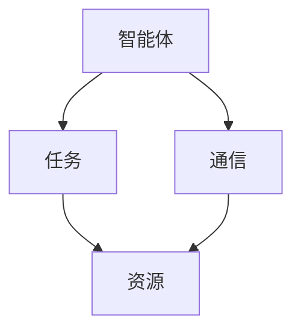
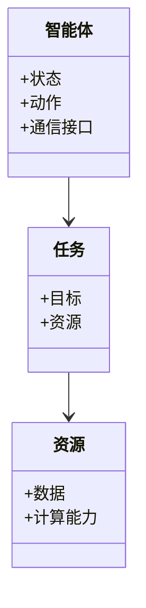

                 


# 多智能体协作进行政策影响分析

## 关键词：多智能体、政策影响分析、协作机制、算法原理、系统架构、智能体通信、政策评估模型

## 摘要：本文探讨了多智能体协作在政策影响分析中的应用，分析了其核心概念、算法原理和系统架构设计，通过实际案例展示了多智能体协作的优势和挑战。

---

# 第一部分: 多智能体协作与政策影响分析的背景与核心概念

## 第1章: 多智能体协作与政策影响分析概述

### 1.1 多智能体协作的背景与意义

#### 1.1.1 从单智能体到多智能体的演进
单智能体系统在政策分析中存在局限性，难以处理复杂问题。多智能体协作通过分布式计算和协同工作，提高了系统的鲁棒性和灵活性。

#### 1.1.2 多智能体协作的核心价值
通过协作优化决策过程，提供更全面的政策评估，增强系统适应性。

#### 1.1.3 政策影响分析的复杂性与挑战
政策涉及多方面因素，单靠传统模型难以捕捉所有变量，多智能体协作提供了更复杂的建模能力。

### 1.2 政策影响分析的定义与特点

#### 1.2.1 政策影响分析的定义
分析政策实施对经济、社会等的影响，提供数据支持决策。

#### 1.2.2 政策影响分析的关键特点
涉及多个变量和利益相关者，需要动态建模和实时反馈。

#### 1.2.3 政策影响分析与传统政策评估的区别
传统评估依赖专家判断，多智能体协作通过数据驱动方法提供更精确的结果。

### 1.3 多智能体协作在政策影响分析中的应用前景

#### 1.3.1 多智能体协作的潜在应用领域
经济预测、环境保护、交通管理等领域。

#### 1.3.2 政策影响分析中采用多智能体协作的优势
提高模型复杂性，增强结果的准确性和全面性。

#### 1.3.3 多智能体协作应用的挑战与机遇
技术复杂性高，但可显著提升政策制定效率。

---

## 第2章: 多智能体协作的原理与机制

### 2.1 多智能体协作的原理

#### 2.1.1 智能体的定义与基本属性
智能体是具有自主性、反应性、目标导向的实体，具备感知和决策能力。

#### 2.1.2 多智能体协作的核心原理
智能体通过通信和协作完成共同目标，解决复杂问题。

#### 2.1.3 智能体之间的通信机制
采用消息传递、状态共享等方式进行实时互动。

### 2.2 多智能体协作的机制

#### 2.2.1 同步与异步协作机制
同步协作需要所有智能体同时行动，异步协作允许智能体独立行动。

#### 2.2.2 中心化与去中心化控制
中心化控制由协调器管理，去中心化控制各智能体自主决策。

#### 2.2.3 协作任务分配与资源分配
基于智能体的能力和目标分配任务，优化资源利用。

### 2.3 多智能体协作的属性特征对比

| 特性            | 同步协作       | 异步协作       |
|-----------------|----------------|----------------|
| 时间同步性      | 高             | 低             |
| 响应速度        | 快             | 慢             |
| 系统复杂性      | 高             | 较低           |

### 2.4 多智能体协作的ER实体关系图


### 2.5 本章小结
多智能体协作通过通信和协作机制，优化了政策分析的复杂性，提供了更灵活的解决方案。

---

## 第3章: 多智能体协作算法的数学模型与实现

### 3.1 分布式计算与共识机制

#### 3.1.1 分布式计算原理
数据分布在多个节点，通过通信达成共识，确保数据一致性。

#### 3.1.2 共识机制的实现
采用区块链技术，确保数据不可篡改，提高系统的可信度。

#### 3.1.3 一致性算法
使用raft或paxos算法，确保多智能体系统的一致性。

### 3.2 强化学习与策略优化

#### 3.2.1 强化学习的基本原理
通过奖励机制，智能体学习最优策略。

#### 3.2.2 多智能体强化学习的挑战
处理多个智能体的策略协调问题，避免冲突。

#### 3.2.3 策略评估与优化
通过数学模型，评估策略的有效性，优化协作机制。

### 3.3 分布式算法的实现

#### 3.3.1 分布式算法的数学模型
$$V(s) = \max_{a} [r(s,a) + \gamma V(s') ]$$

#### 3.3.2 算法实现步骤
1. 初始化智能体状态。
2. 智能体采取动作，更新状态。
3. 计算奖励并更新价值函数。
4. 重复步骤，优化策略。

### 3.4 本章小结
通过分布式计算和强化学习，多智能体协作实现了高效的政策影响分析。

---

## 第4章: 多智能体协作的系统架构设计

### 4.1 问题场景介绍

#### 4.1.1 政策影响分析的典型问题
经济政策对就业的影响，环保政策的效果评估。

### 4.2 系统功能设计

#### 4.2.1 领域模型设计


### 4.3 系统架构设计

#### 4.3.1 分层架构设计


### 4.4 接口设计与交互

#### 4.4.1 系统接口设计
定义API接口，实现智能体之间的通信和数据共享。

#### 4.4.2 系统交互流程
1. 智能体请求任务。
2. 任务分配资源。
3. 智能体执行任务并反馈结果。
4. 系统整合结果输出。

### 4.5 本章小结
系统架构设计确保了多智能体协作的高效性和可扩展性。

---

## 第5章: 多智能体协作的项目实战

### 5.1 环境安装

#### 5.1.1 安装Python和相关库
安装`numpy`, `scipy`, `matplotlib`, `networkx`等库。

### 5.2 核心代码实现

#### 5.2.1 智能体类实现
```python
class Agent:
    def __init__(self, id):
        self.id = id
        self.state = None
        self.communication = []
    
    def receive_message(self, message):
        self.communication.append(message)
    
    def send_message(self, message, recipient):
        recipient.receive_message(message)
```

#### 5.2.2 任务分配与协作
```python
class Task:
    def __init__(self, target):
        self.target = target
        self.resources = []
    
    def assign_agent(self, agent):
        agent.current_task = self
```

### 5.3 代码解读与分析

#### 5.3.1 智能体通信
```python
agent1.send_message("开始任务", agent2)
agent2.communication  # ["开始任务"]
```

#### 5.3.2 任务执行与反馈
```python
task = Task(target)
agent1.current_task = task
task.execute()
```

### 5.4 案例分析

#### 5.4.1 经济政策模拟
模拟减税政策对就业率的影响，通过多智能体协作进行分析。

#### 5.4.2 案例小结
案例展示了多智能体协作在政策分析中的高效性和准确性。

### 5.5 本章小结
通过实际案例，验证了多智能体协作的有效性和可行性。

---

## 第6章: 最佳实践与注意事项

### 6.1 小结

#### 6.1.1 多智能体协作的优势
提高复杂问题的解决能力，增强系统的灵活性。

### 6.2 注意事项

#### 6.2.1 系统设计的复杂性
避免过度复杂，保持系统简洁高效。

#### 6.2.2 数据安全与隐私保护
确保数据传输的安全性，保护用户隐私。

#### 6.2.3 性能优化
优化算法和通信机制，提升系统的运行效率。

### 6.3 拓展阅读

#### 6.3.1 推荐书籍
《Multi-Agent Systems: Algorithmic, Complexity, and Synthesis》

#### 6.3.2 推荐论文
"Multi-Agent Collaboration for Policy Impact Analysis"

### 6.4 本章小结
多智能体协作在政策影响分析中的应用前景广阔，但也需注意系统设计和性能优化。

---

# 结语

通过本文的详细分析，读者可以全面了解多智能体协作在政策影响分析中的应用，掌握其核心概念和算法原理，为实际应用提供理论支持和实践指导。

作者：AI天才研究院/AI Genius Institute & 禅与计算机程序设计艺术 /Zen And The Art of Computer Programming

