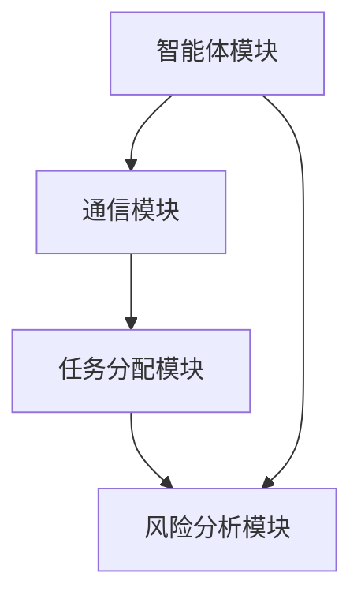

                 


# 多智能体协作进行系统性风险分析

> 关键词：多智能体协作、系统性风险分析、分布式计算、任务分配算法、风险缓解策略

> 摘要：本文详细探讨了多智能体协作在系统性风险分析中的应用。首先介绍了多智能体协作的基本概念和系统性风险分析的重要性，接着分析了多智能体协作的核心算法和数学模型，最后通过实际案例展示了如何利用多智能体协作进行系统性风险分析，并提出了相应的系统架构设计和实现方案。

---

## 引言

在当前复杂的社会和技术环境中，系统性风险分析变得越来越重要。系统性风险是指那些可能影响整个系统稳定性的风险，例如金融市场的崩溃、大规模网络攻击等。传统的单点分析方法往往难以捕捉系统性风险的复杂性和动态性。因此，多智能体协作作为一种新兴的技术手段，为系统性风险分析提供了新的可能性。

---

## 第1章: 多智能体协作概述

### 1.1 多智能体协作的定义与特点

多智能体协作是指多个智能体（Agent）通过协同工作，共同完成一个复杂任务的过程。智能体可以是软件程序、算法或其他具备自主决策能力的实体。与传统的单智能体方法相比，多智能体协作具有以下特点：

- **分布性**：智能体之间分布式协作，不存在单一的控制中心。
- **自主性**：每个智能体都有一定的自主决策能力。
- **动态性**：智能体之间的协作关系和任务分配可以根据实时情况动态调整。
- **多样性**：智能体可以有不同的功能和能力。

### 1.2 多智能体协作的核心概念

#### 1.2.1 智能体的定义与属性
智能体是一个能够感知环境并采取行动以实现目标的实体。智能体的核心属性包括：
- **感知能力**：通过传感器或数据源获取环境信息。
- **决策能力**：基于感知信息做出决策。
- **行动能力**：通过执行动作影响环境。

#### 1.2.2 协作机制
多智能体协作的关键在于智能体之间的通信与协调。常见的协作机制包括：
- **分布式计算**：通过分布式算法实现任务分配和计算。
- **任务分配**：根据智能体的能力和当前任务需求，动态分配任务。
- **共识机制**：通过共识算法（如RAFT、PAXOS）确保智能体之间达成一致。

---

## 第2章: 系统性风险分析

### 2.1 系统性风险的定义与特点

系统性风险是指那些可能对整个系统造成广泛影响的风险。与局部风险不同，系统性风险的影响范围更广，可能引发连锁反应，导致整个系统的崩溃。

#### 2.1.1 系统性风险的传播机制
系统性风险通常通过以下方式传播：
- **直接传染**：一个节点的失败直接影响其他节点。
- **间接传染**：通过市场、供应链等间接渠道传播。
- **系统性漏洞**：系统中存在的普遍性缺陷导致风险扩散。

### 2.2 系统性风险分析的核心步骤

系统性风险分析通常包括以下几个步骤：
1. **数据采集**：收集可能影响系统稳定性的各种数据，包括市场数据、网络流量数据等。
2. **风险建模**：建立数学模型，模拟风险的传播和影响。
3. **风险评估**：通过模型计算系统性风险的潜在影响。
4. **风险缓解**：制定应对策略，降低系统性风险的可能性。

---

## 第3章: 多智能体协作的算法与模型

### 3.1 多智能体协作的算法原理

#### 3.1.1 分布式计算与通信协议
多智能体协作的核心是智能体之间的通信与计算。常见的通信协议包括：
- **HTTP/HTTPS**：适用于简单的请求-响应模式。
- **WebSocket**：适用于实时通信。
- **Gossip协议**：适用于分布式网络中的信息传播。

#### 3.1.2 任务分配算法
任务分配是多智能体协作中的关键问题。常见的任务分配算法包括：
- **贪心算法**：基于局部最优选择全局最优。
- **分布式算法**：通过智能体之间的协商完成任务分配。
- **负载均衡算法**：动态调整任务分配，确保系统负载均衡。

#### 3.1.3 共识机制
共识机制是多智能体协作中的重要组成部分，常用的共识机制包括：
- **RAFT**：适用于分布式系统中的领导者选举。
- **PAXOS**：适用于分布式系统中的一致性协议。
- **BFT**：适用于高可用性系统中的共识。

### 3.2 系统性风险分析的数学模型

#### 3.2.1 风险传播模型
风险传播模型通常采用图论方法，将系统中的各个节点视为图的节点，节点之间的关系视为图的边。风险通过边传播，最终影响整个系统。

#### 3.2.2 风险评估模型
风险评估模型通常采用概率论方法，计算每个节点发生风险的概率，并通过数学模型计算系统性风险的整体影响。

#### 3.2.3 风险缓解模型
风险缓解模型通常采用优化算法，找到最优的风险缓解策略，以最小化系统性风险的影响。

---

## 第4章: 系统架构与设计

### 4.1 系统架构设计

#### 4.1.1 系统组成模块
多智能体协作系统通常包括以下几个模块：
- **智能体模块**：负责感知环境、决策和行动。
- **通信模块**：负责智能体之间的通信。
- **任务分配模块**：负责任务分配和协调。
- **风险分析模块**：负责系统性风险的分析和评估。

#### 4.1.2 系统架构图（Mermaid）



### 4.2 系统功能设计

#### 4.2.1 风险数据采集模块
风险数据采集模块负责收集可能影响系统稳定性的各种数据，例如市场数据、网络流量数据等。

#### 4.2.2 风险分析模块
风险分析模块负责对收集到的数据进行分析，计算系统性风险的潜在影响。

#### 4.2.3 风险决策模块
风险决策模块负责制定风险缓解策略，以降低系统性风险的可能性。

---

## 第5章: 项目实战

### 5.1 项目环境搭建

#### 5.1.1 开发环境配置
项目需要以下开发环境：
- **操作系统**：Linux/Windows/macOS
- **编程语言**：Python/Java
- **依赖库**：NumPy, Pandas, Matplotlib, etc.

#### 5.1.2 依赖库安装
使用以下命令安装依赖库：
```bash
pip install numpy pandas matplotlib
```

#### 5.1.3 项目初始化
创建一个新项目，并初始化代码结构：
```bash
mkdir project
cd project
touch main.py
```

### 5.2 核心算法实现

#### 5.2.1 多智能体协作算法实现
以下是一个简单的多智能体协作算法实现：
```python
import random

class Agent:
    def __init__(self, id):
        self.id = id
        self.task = None
    
    def receive_task(self, task):
        self.task = task
    
    def execute_task(self):
        # 模拟任务执行
        random.sleep(1)
        print(f"Agent {self.id} completed task {self.task}")

# 初始化智能体
agents = [Agent(i) for i in range(4)]

# 任务分配
task = "analyze"
for agent in agents:
    agent.receive_task(task)
    agent.execute_task()
```

#### 5.2.2 系统性风险分析案例
以下是一个简单的系统性风险分析案例：
```python
import numpy as np

# 随机生成系统数据
system_data = np.random.rand(100, 10)

# 计算风险
risk = np.mean(system_data)
print(f"Systemic risk: {risk}")
```

### 5.3 项目总结

通过本项目的实践，我们了解了多智能体协作在系统性风险分析中的应用。通过实际案例，我们验证了多智能体协作的有效性和可行性。未来，我们可以进一步优化算法，提高系统的效率和准确性。

---

## 第6章: 结论

多智能体协作是一种新兴的技术手段，为系统性风险分析提供了新的可能性。通过多智能体协作，我们可以更有效地分析和应对系统性风险，提高系统的稳定性和可靠性。未来，随着技术的不断发展，多智能体协作在系统性风险分析中的应用前景将更加广阔。

---

作者：AI天才研究院/AI Genius Institute & 禅与计算机程序设计艺术 /Zen And The Art of Computer Programming

