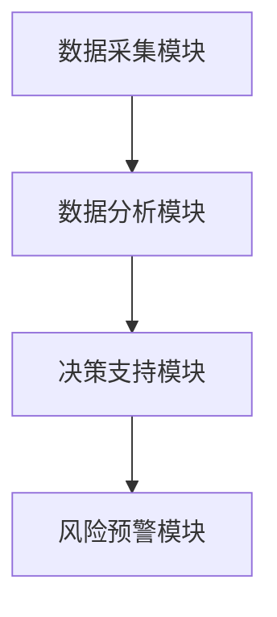

                 

# 多智能体协作进行跨境投资分析

> 关键词：多智能体协作，跨境投资分析，分布式计算，协作算法，系统架构设计

> 摘要：本文探讨了多智能体协作在跨境投资分析中的应用，详细介绍了多智能体协作的核心概念、算法原理、系统架构设计以及实际项目实现。通过背景分析、理论探讨、算法实现和项目实战，全面解析了多智能体协作如何提升跨境投资分析的效率与准确性。

---

## 第1章：多智能体协作与跨境投资分析概述

### 1.1 多智能体协作的背景与意义

#### 1.1.1 多智能体协作的定义与特点
多智能体协作（Multi-Agent Collaboration）是指多个智能体（Agent）通过相互协作，共同完成特定任务的过程。智能体是能够感知环境、自主决策、主动行动的实体，可以是软件程序、机器人或其他智能系统。多智能体协作的特点包括分布性、异步性、自主性和动态性。

#### 1.1.2 跨境投资分析的复杂性与挑战
跨境投资涉及多个国家和地区的金融市场，具有高度的不确定性和复杂性。投资者需要考虑汇率波动、政策差异、市场风险等多种因素。传统的单一智能体分析方法难以应对这些复杂性，因此需要引入多智能体协作来提高分析效率和准确性。

#### 1.1.3 多智能体协作在跨境投资中的优势
多智能体协作能够利用多个智能体的分布式计算能力，从不同角度分析市场数据，提供全面的决策支持。通过智能体之间的协作，可以实时更新市场信息，快速响应市场变化，降低投资风险。

---

### 1.2 跨境投资分析的核心问题

#### 1.2.1 跨境投资的基本概念与流程
跨境投资是指将资金投入其他国家或地区的金融市场，包括股票、债券、外汇等。投资流程包括数据采集、分析、决策和风险管理。

#### 1.2.2 跨境投资中的信息不对称问题
由于不同国家的市场信息分散且不透明，投资者容易面临信息不对称的问题，导致决策失误。多智能体协作可以通过分布式信息采集和共享，缓解这一问题。

#### 1.2.3 跨境投资中的风险与收益平衡
跨境投资需要在风险和收益之间找到平衡点。多智能体协作可以通过实时数据分析和风险评估模型，帮助投资者做出更明智的决策。

---

### 1.3 多智能体协作的应用场景

#### 1.3.1 跨境投资中的数据采集与分析
智能体可以分别负责采集不同国家的市场数据，并通过协作完成综合分析。

#### 1.3.2 跨境投资中的决策支持
通过多智能体协作，投资者可以得到来自不同角度的决策建议，提高投资决策的准确性。

#### 1.3.3 跨境投资中的风险预警与应对
智能体可以实时监控市场变化，及时发现潜在风险，并提出应对策略。

---

## 第2章：多智能体协作的核心概念与原理

### 2.1 多智能体协作的原理

#### 2.1.1 多智能体协作的基本原理
多智能体协作基于分布式计算和通信，智能体之间通过消息传递和状态共享实现协作。协作过程包括任务分配、信息同步和决策优化。

#### 2.1.2 多智能体协作中的通信与协调机制
智能体之间的通信可以通过多种协议实现，包括基于消息队列的异步通信和基于共享数据库的同步通信。协调机制包括任务分配算法和冲突解决策略。

#### 2.1.3 多智能体协作中的任务分配与决策
任务分配算法根据智能体的能力和负载进行动态调整，确保协作效率。决策优化通过博弈论和机器学习算法实现。

---

### 2.2 多智能体协作的核心要素

#### 2.2.1 智能体的定义与属性
智能体具有感知能力、决策能力、行动能力和协作能力。属性包括智能体的类型、能力、目标和状态。

#### 2.2.2 智能体之间的关系与交互
智能体之间的关系可以是竞争、合作或混合关系。交互方式包括信息交换、任务协作和决策共享。

#### 2.2.3 智能体的协作目标与约束条件
协作目标是实现全局最优或局部最优，约束条件包括资源限制、时间限制和不确定性。

---

### 2.3 多智能体协作的数学模型与公式

#### 2.3.1 协作任务分配的数学模型
任务分配问题可以建模为优化问题，目标是最小化任务完成时间或最大化资源利用率。数学模型可以表示为：
$$ \min_{x} \sum_{i=1}^{n} t_i x_i $$
其中，$t_i$是任务$i$的执行时间，$x_i$是智能体分配给任务$i$的标志变量。

#### 2.3.2 协作决策的优化算法
基于博弈论的决策优化算法可以通过纳什均衡实现。纳什均衡的条件是：
$$ \forall i, u_i(x_i, x_{-i}) \geq u_i(y_i, x_{-i}) $$
其中，$u_i$是智能体$i$的效用函数，$x_{-i}$表示其他智能体的策略。

#### 2.3.3 协作过程中的信息传递模型
信息传递模型可以表示为：
$$ s_j = \sum_{i=1}^{n} a_{ij} s_i $$
其中，$s_j$是智能体$j$的状态，$a_{ij}$是智能体$i$和$j$之间的通信权重。

---

## 第3章：多智能体协作的算法原理

### 3.1 多智能体协作的算法概述

#### 3.1.1 基于分布式计算的协作算法
分布式协作算法通过智能体之间的消息传递实现任务分配和状态同步。

#### 3.1.2 基于博弈论的协作决策算法
博弈论算法通过纳什均衡实现协作决策的优化。

#### 3.1.3 基于机器学习的协作优化算法
机器学习算法可以用于协作过程中的模式识别和预测。

---

### 3.2 多智能体协作的具体算法实现

#### 3.2.1 分布式任务分配算法
分布式任务分配算法基于智能体的负载和能力动态分配任务。

#### 3.2.2 协作决策的优化算法
优化算法通过迭代更新智能体的策略实现决策优化。

#### 3.2.3 协作过程中的信息同步算法
信息同步算法通过分布式一致性协议实现智能体之间的状态同步。

---

### 3.3 算法的数学模型与公式

#### 3.3.1 分布式任务分配的数学模型
任务分配问题可以建模为图着色问题，目标是将任务分配给最少数量的智能体：
$$ \min_{x} \sum_{i=1}^{n} x_i $$
其中，$x_i$是智能体$i$是否被分配任务的标志变量。

#### 3.3.2 协作决策的优化公式
优化公式可以通过拉格朗日乘数法实现：
$$ \max_{x} u(x) - \lambda (f(x) - c) $$
其中，$u(x)$是目标函数，$f(x)$是约束条件，$\lambda$是拉格朗日乘子。

---

## 第4章：多智能体协作的系统架构与设计

### 4.1 系统架构概述

#### 4.1.1 系统的整体架构
系统由多个智能体组成，包括数据采集智能体、分析智能体和决策智能体。

#### 4.1.2 系统的功能模块划分
功能模块包括数据采集、数据分析、决策支持和风险预警。

#### 4.1.3 系统的交互
智能体之间通过消息队列进行通信，实现数据共享和任务协作。

---

### 4.2 系统的功能设计

#### 4.2.1 数据采集模块
负责采集不同国家的市场数据，包括股票价格、汇率等。

#### 4.2.2 数据分析模块
对采集的数据进行分析，生成市场报告和投资建议。

#### 4.2.3 决策支持模块
根据分析结果，提供投资决策支持。

#### 4.2.4 风险预警模块
实时监控市场变化，预警潜在风险。

---

### 4.3 系统的架构设计

#### 4.3.1 系统架构图
使用Mermaid绘制系统架构图，展示各个模块之间的关系。

---

## 作者

**作者：AI天才研究院/AI Genius Institute & 禅与计算机程序设计艺术 /Zen And The Art of Computer Programming**

---

以上是《多智能体协作进行跨境投资分析》的详细目录大纲和部分章节内容，接下来将按照上述结构继续展开每一部分的具体内容，确保文章的完整性和逻辑性。

