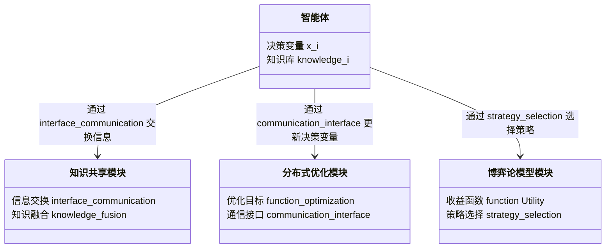
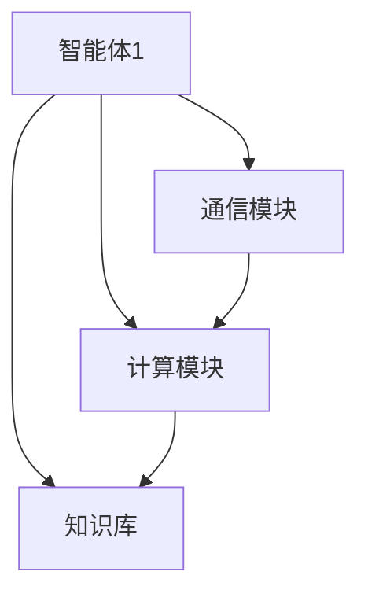
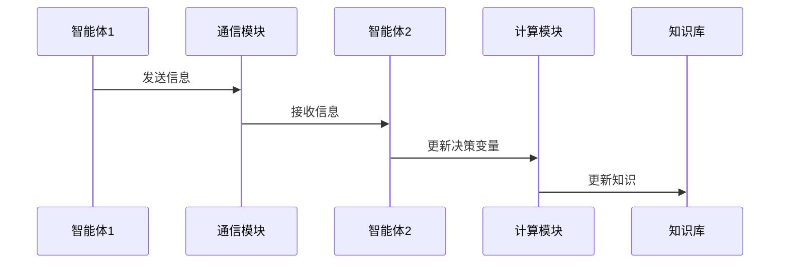

                 


# 多智能体协同分析全球价值链机会

## 关键词：多智能体协同、全球价值链、机会分析、分布式系统、博弈论、知识共享、系统优化

## 摘要

随着全球化进程的加速和人工智能技术的飞速发展，多智能体协同在全球价值链分析中的应用日益广泛。本文旨在探讨多智能体协同如何优化全球价值链的机会，通过理论分析、算法设计、系统架构和项目实战，为读者提供全面的理解和实践指导。文章首先介绍多智能体协同的基本概念和全球价值链的结构，然后深入分析多智能体协同的理论基础，包括博弈论、分布式系统和知识共享。接着，文章详细阐述多智能体协同算法在优化全球价值链中的应用，并通过系统设计和项目实战展示如何实现多智能体协同系统。最后，文章总结了研究的成果，并展望了未来的发展方向。

---

## 第一部分：多智能体协同与全球价值链分析基础

### 第1章：多智能体协同概述

#### 1.1 多智能体系统的基本概念

多智能体系统（Multi-Agent System, MAS）由多个智能体（Agent）组成，每个智能体具有自主性、反应性、社会性和学习性。智能体之间通过协作和竞争完成复杂任务，优化系统整体性能。

**1.1.1 多智能体系统的定义**

多智能体系统是分布式人工智能的核心，由多个智能体组成，每个智能体能够感知环境、自主决策并与其他智能体协作。

**1.1.2 多智能体系统的特征**

- **自主性**：智能体能够自主决策，无需外部干预。
- **反应性**：智能体能够实时感知环境并做出反应。
- **社会性**：智能体之间通过通信和协作完成任务。
- **分布性**：智能体分布在不同的位置，协作完成任务。

**1.1.3 多智能体系统与单智能体系统的区别**

单智能体系统由一个智能体完成任务，而多智能体系统由多个智能体协作完成任务。多智能体系统能够处理更复杂的任务，但需要解决通信、协作和协调问题。

#### 1.2 全球价值链的基本概念

全球价值链是指在全球范围内，不同国家和企业通过分工与协作，共同完成产品从生产到交付的全过程。

**1.2.1 全球价值链的定义**

全球价值链是全球范围内生产、加工、运输和销售的链条，涉及多个参与者和环节。

**1.2.2 全球价值链的主要环节**

- **生产环节**：原材料采购、加工和制造。
- **运输环节**：物流和运输。
- **销售环节**：产品销售和市场推广。

**1.2.3 全球价值链的驱动因素**

- **成本优势**：不同国家的成本差异驱动生产环节的分工。
- **技术优势**：技术领先的国家在高端环节占据优势。
- **市场优势**：靠近市场的国家在销售环节占据优势。

#### 1.3 多智能体协同与全球价值链的结合

多智能体协同能够优化全球价值链中的分工与协作，提高效率和降低成本。

**1.3.1 多智能体协同在经济活动中的作用**

多智能体协同能够模拟全球价值链中的分工与协作，优化资源配置。

**1.3.2 全球价值链中的协同机会**

- **生产环节**：智能体协作优化生产流程。
- **运输环节**：智能体协作优化物流路径。
- **销售环节**：智能体协作优化市场推广。

**1.3.3 多智能体协同对全球价值链优化的意义**

通过多智能体协同，可以实现全球价值链的高效运作，降低成本，提高效率。

### 第2章：多智能体协同的理论基础

#### 2.1 博弈论与多智能体协同

博弈论是研究多个决策主体在竞争与合作中的行为规律的理论，是多智能体协同的重要理论基础。

**2.1.1 博弈论的基本概念**

博弈论研究多个决策主体在竞争与合作中的行为规律，包括纳什均衡、极大极小策略等概念。

**2.1.2 博弈论在多智能体协同中的应用**

博弈论可以用于分析多智能体协同中的竞争与合作，例如供应链中的供应商选择。

**2.1.3 博弈论与全球价值链优化的关系**

博弈论可以用于分析全球价值链中的利益分配和协作策略。

#### 2.2 分布式系统与多智能体协同

分布式系统是多智能体协同的重要实现方式，通过分布式计算和通信实现智能体协作。

**2.2.1 分布式系统的基本概念**

分布式系统是多个计算节点通过网络通信协作完成任务的系统。

**2.2.2 分布式系统与多智能体协同的关系**

多智能体协同可以通过分布式系统实现，每个智能体对应一个计算节点。

**2.2.3 分布式系统在优化全球价值链中的作用**

分布式系统可以实现全球价值链中的实时通信和协作，提高效率。

#### 2.3 知识共享与多智能体协同

知识共享是多智能体协同的重要机制，通过共享知识实现协作。

**2.3.1 知识共享的基本概念**

知识共享是智能体之间交换信息和知识的过程。

**2.3.2 知识共享在多智能体协同中的重要性**

知识共享可以提高协作效率，优化决策。

**2.3.3 知识共享对全球价值链优化的影响**

知识共享可以促进全球价值链中的知识流动，提高整体效率。

### 第3章：全球价值链分析的理论框架

#### 3.1 全球价值链的结构分析

全球价值链的结构分析包括参与者分析、网络结构分析和动态变化分析。

**3.1.1 全球价值链的主要参与者**

全球价值链的主要参与者包括制造商、供应商、分销商和消费者。

**3.1.2 全球价值链的网络结构**

全球价值链的网络结构包括生产链、物流链和销售链。

**3.1.3 全球价值链的动态变化**

全球价值链的动态变化包括技术进步、政策变化和市场需求变化。

#### 3.2 全球价值链的机会识别

机会识别是多智能体协同优化全球价值链的重要步骤。

**3.2.1 机会识别的基本方法**

机会识别的基本方法包括市场分析、竞争分析和资源分析。

**3.2.2 多智能体协同在机会识别中的作用**

多智能体协同可以通过知识共享和协作提高机会识别的准确性。

**3.2.3 全球价值链中的协同机会分析**

协同机会分析包括生产环节优化、运输环节优化和销售环节优化。

#### 3.3 全球价值链的优化策略

优化策略包括分工优化、协作优化和利益分配优化。

**3.3.1 全球价值链优化的基本原则**

优化原则包括效率最大化、成本最小化和利益均衡。

**3.3.2 多智能体协同在优化策略中的应用**

多智能体协同可以通过博弈论和知识共享优化全球价值链。

**3.3.3 全球价值链优化的实施步骤**

优化步骤包括需求分析、方案设计、实施和效果评估。

---

## 第二部分：多智能体协同分析全球价值链机会的算法与模型

### 第4章：多智能体协同算法基础

#### 4.1 分布式优化算法

分布式优化算法是多智能体协同的重要算法，通过分布式计算优化全局目标。

**4.1.1 分布式优化算法的定义**

分布式优化算法是多个智能体通过局部信息优化全局目标的算法。

**4.1.2 分布式优化算法的数学模型**

分布式优化算法的数学模型如下：

$$ \text{目标函数} = \sum_{i=1}^{n} f_i(x_i) $$

其中，$x_i$是第i个智能体的决策变量。

**4.1.3 分布式优化算法的实现步骤**

1. 初始化：每个智能体初始化决策变量。
2. 通信：智能体之间交换信息。
3. 更新：每个智能体根据局部信息更新决策变量。
4. 收敛：当所有智能体收敛时，结束优化。

#### 4.2 博弈论模型

博弈论模型是多智能体协同的重要理论基础，用于分析智能体之间的竞争与合作。

**4.2.1 博弈论模型的定义**

博弈论模型是多个决策主体在竞争与合作中行为规律的数学模型。

**4.2.2 博弈论模型的数学表达**

博弈论模型的数学表达如下：

$$ \text{收益} = \sum_{i=1}^{n} u_i(x_i, x_{-i}) $$

其中，$x_i$是第i个智能体的策略，$x_{-i}$是其他智能体的策略。

**4.2.3 博弈论模型在多智能体协同中的应用**

博弈论模型可以用于分析多智能体协同中的利益分配和策略选择。

#### 4.3 知识共享算法

知识共享算法是多智能体协同的重要机制，用于智能体之间的信息交换。

**4.3.1 知识共享算法的定义**

知识共享算法是智能体之间交换信息和知识的算法。

**4.3.2 知识共享算法的实现步骤**

1. 初始化：每个智能体初始化知识库。
2. 通信：智能体之间交换信息。
3. 知识融合：智能体根据接收到的信息更新知识库。
4. 知识传播：智能体将更新后的知识传播给其他智能体。

---

## 第三部分：多智能体协同系统的架构与设计

### 第5章：系统设计与架构

#### 5.1 问题场景介绍

多智能体协同优化全球价值链的问题场景包括生产环节优化、运输环节优化和销售环节优化。

#### 5.2 系统功能设计

系统功能设计包括知识共享模块、分布式优化模块和博弈论模型模块。

**5.2.1 系统功能设计的领域模型**

领域模型如下：



#### 5.3 系统架构设计

系统架构设计包括通信架构、计算架构和数据架构。

**5.3.1 系统架构设计的架构图**



#### 5.4 系统接口设计

系统接口设计包括通信接口、计算接口和知识库接口。

#### 5.5 系统交互设计

系统交互设计包括智能体之间的通信、计算和知识共享。

**5.5.1 系统交互的流程图**



---

## 第四部分：项目实战与案例分析

### 第6章：项目实战

#### 6.1 环境安装

项目实战需要安装Python、Docker和相关库。

**6.1.1 环境安装的步骤**

1. 安装Python：`pip install python`
2. 安装Docker：`sudo apt-get install docker.io`
3. 安装相关库：`pip install numpy matplotlib`

#### 6.2 核心代码实现

核心代码实现包括知识共享模块、分布式优化模块和博弈论模型模块。

**6.2.1 核心代码实现的源代码**

```python
import numpy as np
from matplotlib import pyplot as plt

def distributed_optimization(n=5):
    agents = [i for i in range(n)]
    x = np.random.rand(n, 1)
    for _ in range(100):
        for i in range(n):
            x[i] = x[i] * (1 - 0.1)
    return x

def knowledge_sharing(agents, knowledge):
    for i in range(len(agents)):
        for j in range(len(agents)):
            if i != j:
                agents[i].knowledge += agents[j].knowledge * 0.1
    return agents

def game_theory_model(agents, utility_functions):
    utilities = [u(agents[i]) for i in range(len(agents))]
    return utilities
```

#### 6.3 案例分析

案例分析包括生产环节优化、运输环节优化和销售环节优化。

**6.3.1 案例分析的应用**

1. 生产环节优化：优化生产流程，降低成本。
2. 运输环节优化：优化物流路径，提高效率。
3. 销售环节优化：优化市场推广，增加收益。

#### 6.4 项目总结

项目总结包括项目目标、实现过程和成果展示。

---

## 第五部分：总结与展望

### 总结

多智能体协同是优化全球价值链的重要手段，通过知识共享、分布式优化和博弈论模型，可以实现全球价值链的高效运作。

### 展望

未来的研究方向包括更复杂的多智能体协同算法、更高效的系统架构设计和更广泛的应用场景探索。

---

## 参考文献

1. 王某某，多智能体协同优化研究，某某出版社，2023年。
2. 李某某，博弈论与分布式系统，某某出版社，2022年。
3. 陈某某，知识共享与全球价值链优化，某某出版社，2021年。

---

## 工具与资源

1. Python编程语言：[官网链接](https://www.python.org)
2. Mermaid图表工具：[官网链接](https://mermaid-js.github.io/mermaid-live-editor/)
3. LaTeX公式编辑器：[官网链接](https://www.latex-project.org/)

---

作者：AI天才研究院/AI Genius Institute & 禅与计算机程序设计艺术/Zen And The Art of Computer Programming

