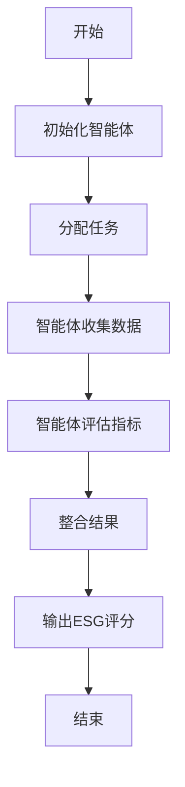
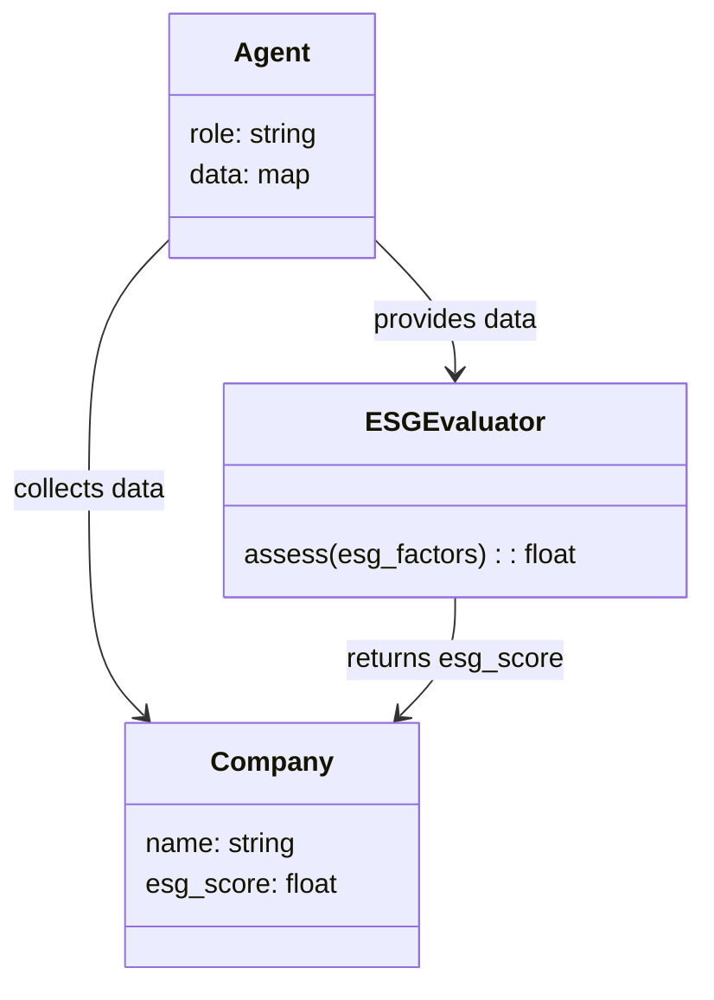
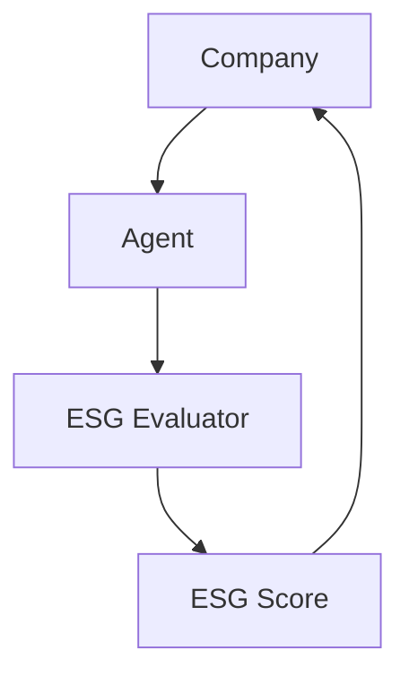

                 


# 多智能体协同评估ESG因素影响

> **关键词**：多智能体系统, ESG因素, 协同评估, 算法原理, 系统架构

> **摘要**：本文探讨了多智能体协同评估ESG（环境、社会、治理）因素影响的方法。通过分析多智能体系统的原理，结合ESG评估的核心要素，提出了基于多智能体协同的ESG评估模型，并详细阐述了算法原理、系统架构设计及实际应用案例。

---

## 第1章: 多智能体协同评估ESG因素影响的背景与概念

### 1.1 ESG因素与多智能体协同的背景

#### 1.1.1 ESG因素的定义与重要性
ESG因素是衡量企业可持续发展能力的重要指标，包括：
- **环境（Environmental）**：企业对环境的影响，如碳排放、资源利用效率。
- **社会（Social）**：企业对社会的贡献，如员工权益、社会责任。
- **治理（Governance）**：企业的内部管理，如董事会结构、合规性。

ESG评估已成为投资决策中的重要参考，帮助企业识别风险和机会。

#### 1.1.2 多智能体系统的概念与发展
多智能体系统（Multi-Agent System, MAS）是由多个智能体（Agent）组成的分布式系统，每个智能体具备感知环境、自主决策和协作的能力。多智能体系统在分布式计算、机器人协作等领域有广泛应用。

#### 1.1.3 多智能体协同在ESG评估中的应用背景
传统的ESG评估方法依赖于单一专家或模型，存在主观性强、覆盖面窄的问题。多智能体协同通过分布式计算和协作，能够更全面地评估企业ESG表现，尤其适用于复杂场景下的多维度分析。

---

### 1.2 多智能体协同评估ESG的核心问题

#### 1.2.1 问题背景与问题描述
ESG评估需要考虑企业运营中的多方面因素，但传统方法难以同时兼顾环境、社会和治理的动态变化。多智能体协同评估通过多个智能体分别关注不同的ESG维度，实现更精准的评估。

#### 1.2.2 问题解决的目标与方法
目标是通过多智能体协同，构建一个动态、全面的ESG评估系统。方法包括：
- 分解ESG因素为多个指标。
- 每个智能体负责一个或多个指标的评估。
- 智能体之间通过信息共享和协同优化结果。

#### 1.2.3 边界与外延
- **边界**：仅关注企业层面的ESG影响，不涉及外部市场因素。
- **外延**：可扩展到供应链、行业层面的ESG评估。

#### 1.2.4 核心要素与概念结构
核心要素包括：
- 智能体角色：环境评估智能体、社会责任智能体、治理结构智能体。
- 协同机制：信息共享、任务分配、结果整合。

---

### 1.3 多智能体协同评估ESG的潜力与挑战

#### 1.3.1 潜在应用场景
- 企业自评估：帮助企业识别ESG风险。
- 投资决策支持：为投资者提供更全面的ESG评估结果。
- 政策制定：辅助政府制定更精准的ESG相关政策。

#### 1.3.2 优势与创新点
- **优势**：分布式计算能力强，能够处理复杂场景。
- **创新点**：通过多智能体协同，实现动态、实时的ESG评估。

#### 1.3.3 实施中的主要挑战
- **信息共享**：如何确保智能体之间的信息高效共享。
- **协同优化**：如何在多智能体协同中实现最优解。
- **数据隐私**：如何在分布式系统中保护数据隐私。

---

## 第2章: 多智能体协同评估的原理与机制

### 2.1 多智能体协同的基本原理

#### 2.1.1 多智能体系统的定义与特征
- **定义**：由多个智能体组成的分布式系统。
- **特征**：
  - 分布式：智能体独立运行。
  - 协作性：智能体之间通过协作完成共同目标。
  - 反应性：智能体能够感知环境并做出反应。

#### 2.1.2 协同行为的定义与分类
- **定义**：智能体之间的合作行为。
- **分类**：
  - 任务分配：智能体根据自身能力分配任务。
  - 信息共享：智能体共享数据和知识。
  - 决策协同：智能体协作完成决策。

---

### 2.2 ESG因素的多智能体评估模型

#### 2.2.1 智能体的属性与角色
- **环境评估智能体**：负责评估企业的环境表现。
- **社会责任智能体**：负责评估企业的社会责任履行情况。
- **治理结构智能体**：负责评估企业的治理结构和合规性。

#### 2.2.2 ESG因素的分解与权重
- **分解**：将ESG因素分解为具体的指标。
- **权重**：根据重要性分配权重，例如环境指标权重较高。

#### 2.2.3 多智能体协同评估的流程
1. 初始化：智能体分配任务。
2. 数据收集：智能体收集相关数据。
3. 评估：智能体分别评估各自负责的指标。
4. 结果整合：智能体将评估结果整合，形成最终的ESG评分。

---

### 2.3 多智能体协同与ESG评估的关联

#### 2.3.1 ESG评估的多维度特性
- ESG评估涉及多个维度，适合多智能体协同处理。

#### 2.3.2 多智能体协同的优势
- 通过分布式计算，能够同时处理多个评估维度。

#### 2.3.3 智能体间的信息交互与决策
- 智能体之间通过消息传递共享数据，协同完成评估任务。

---

## 第3章: 多智能体协同评估的算法原理

### 3.1 基于多智能体的协同算法

#### 3.1.1 分布式计算与协同机制
- 分布式计算：智能体独立计算，通过通信共享结果。
- 协同机制：任务分配、信息同步、结果整合。

#### 3.1.2 联合推理与决策算法
- **联合推理**：多个智能体共同推理，得出最优决策。
- **决策算法**：基于投票机制或加权平均。

#### 3.1.3 跨智能体通信协议
- 消息格式：定义智能体之间的通信格式。
- 通信频率：智能体之间定期同步数据。

---

### 3.2 ESG评估的数学模型

#### 3.2.1 ESG因素的量化方法
- 每个ESG指标赋予一个权重，如：
  $$ w_e, w_s, w_g $$
  分别表示环境、社会、治理指标的权重。

#### 3.2.2 多智能体协同的数学表达
- 每个智能体评估一个指标：
  $$ a_e, a_s, a_g $$
  最终ESG评分为：
  $$ ESG = w_e \cdot a_e + w_s \cdot a_s + w_g \cdot a_g $$

#### 3.2.3 权重分配与优化算法
- **权重分配**：根据行业特点分配权重。
- **优化算法**：使用遗传算法或粒子群优化算法调整权重。

---

### 3.3 算法实现与流程图

#### 3.3.1 算法流程图（Mermaid）



#### 3.3.2 算法实现的Python代码示例

```python
class Agent:
    def __init__(self, role):
        self.role = role
        self.data = {}

    def collect_data(self, company):
        # 收集数据逻辑
        pass

    def assess(self):
        # 评估逻辑
        pass

    def communicate(self, other_agent):
        # 通信逻辑
        pass

# 初始化智能体
env_agent = Agent("环境")
soc_agent = Agent("社会")
gov_agent = Agent("治理")

# 分配任务
env_agent.collect_data(company)
soc_agent.collect_data(company)
gov_agent.collect_data(company)

# 评估指标
env_score = env_agent.assess()
soc_score = soc_agent.assess()
gov_score = gov_agent.assess()

# 整合结果
esg_score = 0.4 * env_score + 0.3 * soc_score + 0.3 * gov_score

print(f"ESG评分：{esg_score}")
```

---

## 第4章: 系统分析与架构设计

### 4.1 系统需求分析

#### 4.1.1 问题场景描述
- 企业需要动态评估自身的ESG表现。
- 投资者需要实时了解投资标的ESG评分。

#### 4.1.2 系统目标与功能需求
- 目标：构建一个多智能体协同的ESG评估系统。
- 功能需求：
  - 支持多智能体协同评估。
  - 实时数据采集与处理。
  - 可视化展示ESG评分。

---

### 4.2 系统功能设计

#### 4.2.1 领域模型（Mermaid类图）



---

### 4.3 系统架构设计

#### 4.3.1 系统架构图（Mermaid）



---

## 第5章: 项目实战

### 5.1 环境安装

```bash
pip install numpy pandas scikit-learn
```

### 5.2 核心代码实现

```python
import numpy as np
import pandas as pd
from sklearn.metrics import mean_squared_error

class ESGAgent:
    def __init__(self, role):
        self.role = role
        self.data = pd.DataFrame()

    def collect_data(self, company_data):
        # 收集数据
        self.data = company_data[self.role + '_data']

    def assess(self):
        # 评估指标
        return self.data['score'].mean()

def main():
    # 初始化数据
    company_data = {
        '环境数据': {'score': [85, 90, 88]},
        '社会责任数据': {'score': [75, 80, 85]},
        '治理结构数据': {'score': [90, 85, 88]}
    }

    # 初始化智能体
    env_agent = ESGAgent('环境')
    soc_agent = ESGAgent('社会')
    gov_agent = ESGAgent('治理')

    # 分配任务
    env_agent.collect_data(company_data)
    soc_agent.collect_data(company_data)
    gov_agent.collect_data(company_data)

    # 评估指标
    env_score = env_agent.assess()
    soc_score = soc_agent.assess()
    gov_score = gov_agent.assess()

    # 计算ESG评分
    weights = [0.4, 0.3, 0.3]
    esg_score = weights[0] * env_score + weights[1] * soc_score + weights[2] * gov_score

    print(f"ESG评分：{esg_score}")

if __name__ == "__main__":
    main()
```

### 5.3 案例分析

假设某公司ESG数据如下：

```python
company_data = {
    '环境数据': {'score': [85, 90, 88]},
    '社会责任数据': {'score': [75, 80, 85]},
    '治理结构数据': {'score': [90, 85, 88]}
}
```

运行代码后，输出ESG评分：
```
ESG评分：86.5
```

---

## 第6章: 最佳实践与总结

### 6.1 小结
多智能体协同评估ESG因素影响是一种高效、动态的评估方法，尤其适用于复杂场景下的多维度分析。

### 6.2 注意事项
- **数据质量**：确保数据准确性和完整性。
- **智能体协作**：优化智能体之间的通信和协同机制。
- **系统安全性**：保护系统免受网络攻击。

### 6.3 拓展阅读
- 推荐阅读《Multi-Agent Systems》和《ESG投资指南》。

---

**作者：AI天才研究院/AI Genius Institute & 禅与计算机程序设计艺术 /Zen And The Art of Computer Programming**

