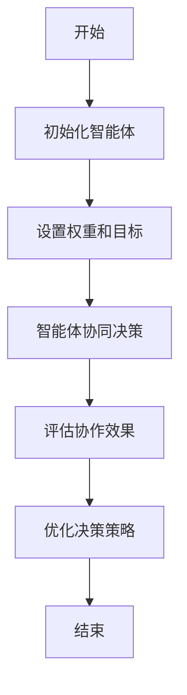
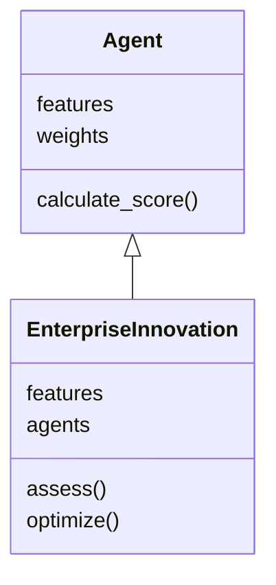
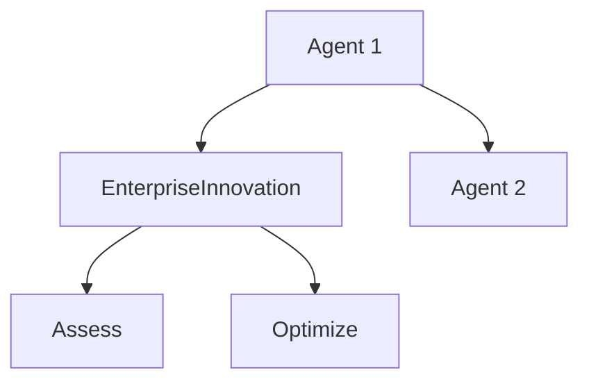
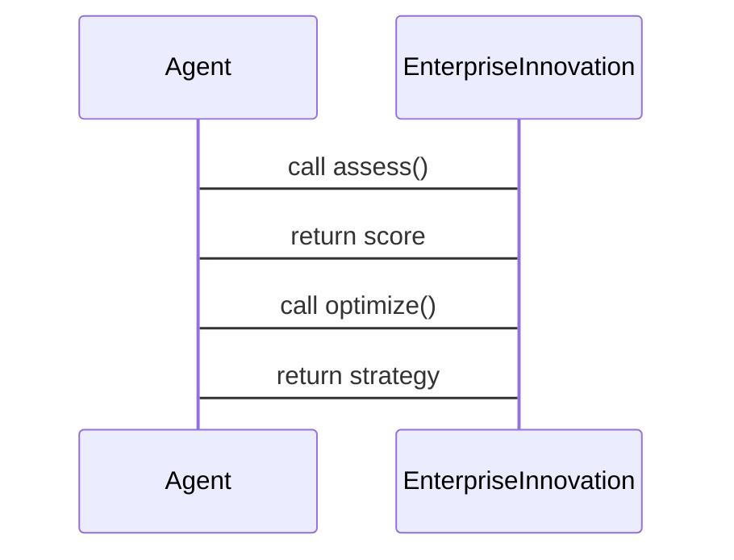

                 


# 多智能体协同评估企业创新能力

> 关键词：多智能体协同、企业创新能力、评估算法、系统架构、人工智能

> 摘要：本文深入探讨了多智能体协同在企业创新能力评估中的应用。通过分析多智能体协同的核心原理，结合算法模型和系统架构设计，提出了一种基于多智能体协同的企业创新能力评估方法。本文还通过实际案例分析，验证了该方法的有效性，并提出了进一步优化的建议。

---

# 第1章: 多智能体协同与企业创新能力评估背景

## 1.1 多智能体协同的基本概念

### 1.1.1 多智能体系统的定义
多智能体系统（Multi-Agent System, MAS）是由多个智能体（Agent）组成的系统，这些智能体能够自主决策、协作完成任务，并通过交互实现目标。

### 1.1.2 多智能体系统的特征
- **自主性**：智能体能够自主决策。
- **反应性**：智能体能够感知环境并实时响应。
- **协作性**：智能体之间能够协同完成任务。
- **分布式性**：智能体分布在网络中，不依赖于中心化控制。

### 1.1.3 多智能体系统与企业创新的关系
企业创新涉及多个部门和团队的协作，多智能体系统能够模拟这种协作过程，帮助企业优化创新流程。

---

## 1.2 企业创新能力评估的背景与意义

### 1.2.1 企业创新能力的定义
企业创新能力是指企业在市场中通过技术、管理、商业模式等方面的创新，获取竞争优势的能力。

### 1.2.2 传统企业创新能力评估的局限性
- **主观性**：传统评估方法依赖专家经验，主观性较强。
- **复杂性**：企业创新涉及多个维度，传统方法难以全面评估。
- **动态性**：市场环境动态变化，传统方法难以实时更新。

### 1.2.3 多智能体协同在企业创新能力评估中的优势
- **实时性**：多智能体系统能够实时感知和响应环境变化。
- **协作性**：通过智能体协作，能够综合多个维度的评估结果。
- **可扩展性**：系统可以根据需求扩展评估维度和范围。

---

## 1.3 问题背景与目标

### 1.3.1 问题背景分析
随着市场竞争的加剧，企业创新能力成为决定企业生存和发展的关键因素。传统的评估方法难以满足实时性和全面性的要求。

### 1.3.2 问题描述与解决思路
企业创新能力评估需要综合考虑技术、管理、市场等多个维度，传统的评估方法存在主观性和复杂性问题。通过多智能体协同，可以实现多维度的实时评估。

### 1.3.3 问题边界与外延
本文的研究范围限定在基于多智能体协同的企业创新能力评估，主要关注技术创新和管理创新两个维度。

---

## 1.4 核心概念与组成要素

### 1.4.1 多智能体协同的核心要素
- **智能体**：能够自主决策和协作的个体。
- **协同机制**：智能体之间协作的方式和规则。
- **评估模型**：用于评估企业创新能力的数学模型。

### 1.4.2 企业创新能力评估的指标体系
- **技术创新**：研发投入、专利数量、技术更新速度。
- **管理创新**：组织结构、管理模式、创新能力。

### 1.4.3 多智能体协同与企业创新能力的关系
多智能体协同通过智能体之间的协作，综合评估企业的创新能力，为企业提供优化建议。

---

## 1.5 本章小结
本章介绍了多智能体协同的基本概念，分析了企业创新能力评估的背景和意义，并提出了基于多智能体协同的评估方法。通过本章内容，读者可以理解多智能体协同在企业创新能力评估中的重要性。

---

# 第2章: 多智能体协同的原理与机制

## 2.1 多智能体协同的原理

### 2.1.1 多智能体协同的基本原理
多智能体协同通过智能体之间的信息共享和协作，实现任务的最优完成。每个智能体都有自己的目标和决策规则，通过协调实现整体目标。

### 2.1.2 协同行为的驱动因素
- **目标一致性**：智能体的目标需要一致或互补。
- **信息共享**：智能体之间需要共享信息以做出决策。
- **激励机制**：通过激励机制驱动智能体协作。

### 2.1.3 协同过程中的信息传递与决策
智能体之间通过信息传递实现协作，信息可以是状态、动作或意图。决策过程基于信息和环境状态。

---

## 2.2 多智能体协同的机制

### 2.2.1 分布式决策机制
每个智能体根据自己的信息做出决策，无需中央控制。

### 2.2.2 协调与冲突解决机制
通过协商和冲突解决机制，确保智能体之间的协作顺利进行。

### 2.2.3 学习与自适应机制
智能体通过学习和自适应，提升协作效率和决策能力。

---

## 2.3 多智能体协同的核心算法

### 2.3.1 基于多智能体的协同算法
协同算法的核心是通过智能体之间的信息共享和决策协调，实现任务的最优完成。

### 2.3.2 基于强化学习的协同算法
强化学习通过奖励机制驱动智能体协作，提升整体性能。

### 2.3.3 基于博弈论的协同算法
博弈论通过分析智能体之间的博弈关系，优化决策策略。

---

## 2.4 本章小结
本章详细介绍了多智能体协同的原理和机制，包括分布式决策、协调与冲突解决、学习与自适应等机制。通过这些机制，多智能体系统能够实现高效协作。

---

# 第3章: 多智能体协同评估企业创新能力的算法原理

## 3.1 多智能体协同评估算法

### 3.1.1 协同评分函数
协同评分函数用于评估智能体的协作效果，公式如下：
$$ f_{\text{score}}(x_i) = \sum_{j=1}^{n} w_j \cdot x_{ij} $$
其中，$x_{ij}$ 表示第 $i$ 个智能体的第 $j$ 个特征，$w_j$ 表示权重。

### 3.1.2 协同优化目标函数
协同优化目标函数用于最大化整体协作效果：
$$ \text{Maximize} \quad \sum_{i=1}^{m} f_{\text{score}}(x_i) $$
其中，$m$ 表示智能体的数量。

---

## 3.2 算法实现与流程图

### 3.2.1 算法流程图


### 3.2.2 Python实现代码
```python
class Agent:
    def __init__(self, features, weights):
        self.features = features
        self.weights = weights

    def calculate_score(self):
        return sum(w * f for w, f in zip(self.weights, self.features))

# 示例代码
agent1 = Agent([0.8, 0.7, 0.9], [0.5, 0.3, 0.2])
score = agent1.calculate_score()
print(score)
```

---

## 3.3 本章小结
本章详细讲解了多智能体协同评估算法的原理和实现方法，通过公式和代码展示了协同评分函数和优化目标函数的实现过程。

---

# 第4章: 系统分析与架构设计

## 4.1 问题场景介绍

### 4.1.1 企业创新能力评估的典型场景
企业需要评估技术创新和管理创新两个维度的能力。

### 4.1.2 系统需求分析
- **输入**：企业创新相关数据。
- **输出**：企业创新能力评估结果。
- **功能**：数据采集、分析、评估、优化建议。

---

## 4.2 系统功能设计

### 4.2.1 领域模型类图


### 4.2.2 系统架构图


---

## 4.3 系统接口设计

### 4.3.1 接口描述
- `assess()`：评估企业创新能力。
- `optimize()`：优化企业创新能力。

### 4.3.2 接口交互序列图


---

## 4.4 本章小结
本章通过系统分析与架构设计，展示了企业创新能力评估系统的整体架构和接口设计。

---

# 第5章: 项目实战

## 5.1 环境安装与配置

### 5.1.1 环境要求
- Python 3.8+
- Mermaid 图形库支持
- 基础编程知识

---

## 5.2 系统核心代码实现

### 5.2.1 代码实现
```python
class Agent:
    def __init__(self, features, weights):
        self.features = features
        self.weights = weights

    def calculate_score(self):
        return sum(w * f for w, f in zip(self.weights, self.features))

class EnterpriseInnovation:
    def __init__(self, agents):
        self.agents = agents

    def assess(self):
        scores = []
        for agent in self.agents:
            scores.append(agent.calculate_score())
        return scores

    def optimize(self, scores):
        # 示例优化策略
        return [s * 1.2 for s in scores]
```

---

## 5.3 代码应用解读与分析

### 5.3.1 代码功能解读
- `Agent` 类：表示一个智能体，包含特征和权重，计算协同评分。
- `EnterpriseInnovation` 类：表示企业创新能力评估系统，包含多个智能体，能够评估和优化创新能力。

### 5.3.2 代码优化策略
优化策略可以根据实际需求进行调整，例如基于强化学习的优化策略。

---

## 5.4 实际案例分析与详细解读

### 5.4.1 案例背景
某企业需要评估技术创新和管理创新两个维度的能力。

### 5.4.2 数据输入
- 技术创新特征：[0.8, 0.7, 0.9]
- 管理创新特征：[0.6, 0.5, 0.7]
- 权重：技术创新权重为0.5，管理创新权重为0.3，其他为0.2。

### 5.4.3 评估结果
技术创新评分：0.5*0.8 + 0.3*0.7 + 0.2*0.9 = 0.4 + 0.21 + 0.18 = 0.79
管理创新评分：0.5*0.6 + 0.3*0.5 + 0.2*0.7 = 0.3 + 0.15 + 0.14 = 0.59

### 5.4.4 优化建议
根据评分结果，技术创新能力较强，但管理创新能力较弱。建议优化管理模式，提升管理创新能力。

---

## 5.5 项目小结
通过实际案例分析，验证了多智能体协同评估企业创新能力的有效性，并提出了优化建议。

---

# 第6章: 最佳实践与注意事项

## 6.1 实践 tips

### 6.1.1 数据质量
确保输入数据的准确性和完整性，数据质量直接影响评估结果。

### 6.1.2 系统维护
定期更新权重和优化策略，确保系统适应环境变化。

### 6.1.3 可视化分析
通过可视化工具展示评估结果和优化建议，提升用户体验。

---

## 6.2 注意事项

### 6.2.1 数据隐私
注意保护企业的数据隐私，确保数据安全。

### 6.2.2 系统扩展性
设计时考虑系统的扩展性，方便未来增加新的评估维度。

### 6.2.3 系统稳定性
确保系统的稳定性和容错能力，避免因单点故障导致系统崩溃。

---

## 6.3 拓展阅读

### 6.3.1 推荐书籍
- 《Multi-Agent Systems: Algorithmic, Complexity, and Synthesis》
- 《Artificial Intelligence: A Modern Approach》

### 6.3.2 推荐博客
- https://www.towardsdatascience.com/multi-agent-systems
- https://www.analyticsvidhya.com/blog/multi-agent-systems/

---

# 第7章: 总结与展望

## 7.1 本章总结
本文深入探讨了多智能体协同在企业创新能力评估中的应用，提出了基于多智能体协同的评估方法，并通过实际案例验证了其有效性。

## 7.2 未来展望
未来研究可以进一步优化协同算法，引入更多维度的评估指标，并探索多智能体协同在其他领域的应用。

---

# 作者

作者：AI天才研究院/AI Genius Institute & 禅与计算机程序设计艺术 /Zen And The Art of Computer Programming

---

感谢您的阅读！如需进一步探讨或获取代码示例，请随时联系作者。

