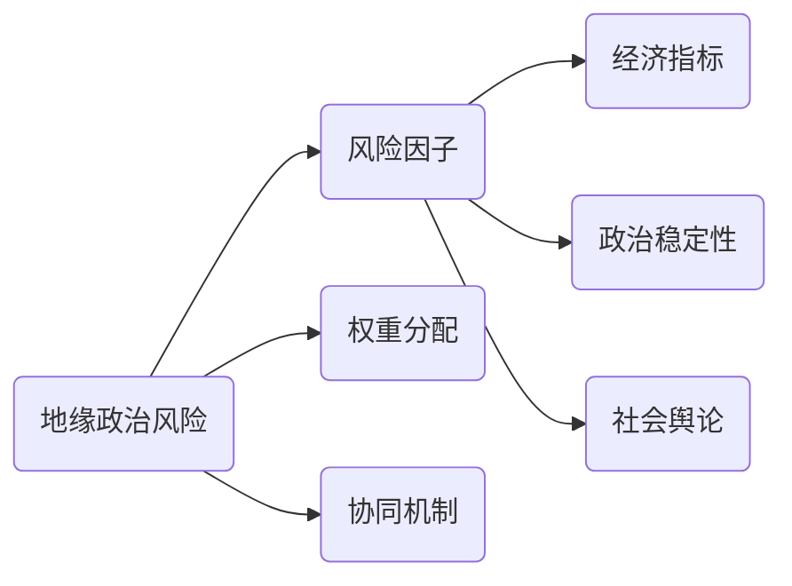

                 


# 多智能体协同评估地缘政治风险

**关键词**：多智能体系统、地缘政治风险、协同评估、人工智能、风险管理

**摘要**：  
随着全球化的深入和国际关系的复杂化，地缘政治风险的评估变得日益重要。传统的单一智能体评估方法在面对复杂多变的地缘政治环境时显得力不从心。多智能体协同评估作为一种新兴的方法，通过多个智能体的协作，能够更全面、更准确地捕捉和分析地缘政治风险。本文将详细探讨多智能体协同评估地缘政治风险的背景、核心概念、算法原理、系统架构以及实际应用，为相关领域的研究和实践提供参考。

---

## 第一部分: 多智能体协同评估地缘政治风险的背景与概念

### 第1章: 地缘政治风险概述

#### 1.1 地缘政治风险的基本概念
地缘政治风险是指由于国家间的政治、经济、军事和社会等因素的变化，可能对企业、组织或个人造成的影响。这些风险可能包括国际冲突、贸易摩擦、政策变化、资源争夺等。地缘政治风险的评估需要综合考虑多个因素，包括地理位置、历史背景、经济利益、文化差异等。

#### 1.2 多智能体协同评估的必要性
传统的地缘政治风险评估方法通常依赖于单一的专家或模型，这种方法在面对复杂多变的地缘政治环境时显得不足。单一智能体难以全面捕捉所有相关因素，且容易受到主观偏见的影响。相比之下，多智能体协同评估能够通过多个智能体的协作，从不同的角度和层面进行分析，从而提供更全面和准确的评估结果。

#### 1.3 多智能体系统的基本原理
多智能体系统（Multi-Agent System, MAS）是由多个智能体组成的系统，这些智能体能够通过协作完成复杂的任务。每个智能体都有自己的目标、知识和行为规则，能够与其他智能体进行通信和协作。在地缘政治风险评估中，多个智能体可以分别关注不同的因素，如经济、军事、社会等，通过协作生成综合的评估结果。

---

## 第二部分: 多智能体协同评估地缘政治风险的核心概念与联系

### 第2章: 多智能体协同评估的地缘政治风险模型

#### 2.1 多智能体协同评估的原理
多智能体协同评估的核心在于智能体之间的协作与信息共享。每个智能体负责分析特定领域的问题，并通过通信模块将结果传递给其他智能体。通过这种方式，多个智能体能够综合不同的信息，形成全面的评估结果。

#### 2.2 地缘政治风险评估的核心概念
在多智能体协同评估中，地缘政治风险评估的核心概念包括风险因子、权重分配、协同机制等。风险因子是影响地缘政治风险的各种因素，如经济指标、政治稳定性、社会舆论等。权重分配是对每个风险因子的重要性进行评估，从而确定其在评估中的权重。协同机制则是智能体之间协作的方式，如信息共享、任务分配等。

#### 2.3 多智能体协同与地缘政治风险的实体关系图



---

## 第三部分: 多智能体协同评估地缘政治风险的算法原理

### 第3章: 算法原理与实现

#### 3.1 分布式计算与信息共享
多智能体协同评估需要多个智能体之间的信息共享。分布式计算是一种常见的实现方式，通过分布式系统中的多个节点分别处理不同的任务，并将结果汇总到中央节点。

#### 3.2 共识机制与决策优化
共识机制是多智能体协作中的关键部分，用于确保所有智能体对评估结果达成一致。常见的共识机制包括拜占庭容错（Byzantine Fault Tolerance）和工作量证明（Proof of Work）等。通过这些机制，智能体能够达成一致的决策。

#### 3.3 博弈论与风险评估
博弈论是研究智能体之间策略互动的理论框架。在地缘政治风险评估中，博弈论可以用于分析不同国家或组织之间的策略互动，从而预测可能的风险。

---

## 第四部分: 多智能体协同评估地缘政治风险的系统分析与架构设计

### 第4章: 系统架构与实现

#### 4.1 系统功能设计
多智能体协同评估系统需要具备以下功能：数据采集、信息处理、协同计算、结果展示等。数据采集模块负责收集相关的地缘政治数据，信息处理模块对数据进行分析和处理，协同计算模块负责智能体之间的协作，结果展示模块将评估结果以可视化的方式呈现给用户。

#### 4.2 系统架构设计


#### 4.3 系统接口设计
系统接口设计包括智能体之间的通信接口和用户与系统的交互接口。通信接口负责智能体之间的数据交换，用户与系统的交互接口则用于输入参数和查看结果。

---

## 第五部分: 多智能体协同评估地缘政治风险的项目实战

### 第5章: 项目实现与案例分析

#### 5.1 环境配置与安装
在实现多智能体协同评估系统之前，需要进行环境配置和安装。通常需要安装Python、Java等编程语言，以及相关的库和框架。

#### 5.2 核心代码实现
以下是多智能体协同评估系统的核心代码示例：

```python
class Agent:
    def __init__(self, id):
        self.id = id
        self.data = {}

    def collect_data(self):
        # 数据采集逻辑
        pass

    def process_data(self):
        # 数据处理逻辑
        pass

    def collaborate(self, agents):
        # 协作逻辑
        pass
```

#### 5.3 实际案例分析
通过实际案例分析，展示多智能体协同评估系统在地缘政治风险评估中的应用。例如，可以分析某地区的经济指标、政治稳定性等，评估其地缘政治风险。

---

## 第六部分: 多智能体协同评估地缘政治风险的小结与注意事项

### 第6章: 小结与注意事项

#### 6.1 小结
多智能体协同评估地缘政治风险是一种新兴的方法，通过多个智能体的协作，能够更全面、更准确地评估地缘政治风险。这种方法在复杂多变的地缘政治环境中具有重要的应用价值。

#### 6.2 注意事项
在实际应用中，需要注意以下几点：智能体之间的通信效率、数据隐私与安全、系统的可扩展性等。此外，还需要定期更新和优化系统，以适应不断变化的地缘政治环境。

---

## 结语

多智能体协同评估地缘政治风险是一种具有潜力的方法，能够为组织和企业提供更准确的地缘政治风险评估。随着人工智能和多智能体技术的不断发展，这种方法的应用前景将更加广阔。

---

**作者**：AI天才研究院/AI Genius Institute & 禅与计算机程序设计艺术 /Zen And The Art of Computer Programming

