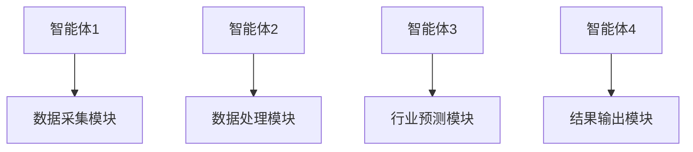

                 


```markdown
# 多智能体协同进行行业轮动分析

> 关键词：多智能体、协同、行业轮动分析、人工智能、大数据、算法

> 摘要：多智能体协同进行行业轮动分析是一种创新性的方法，通过多个智能体的协作，利用大数据和人工智能技术，实现对行业趋势的预测和分析。本文将从背景、核心概念、算法原理、系统架构设计、项目实战等多个方面进行详细探讨，提供深入的分析和实践指导。

---

## 第一章：多智能体协同与行业轮动分析的背景

### 1.1 多智能体协同的背景与意义

#### 1.1.1 多智能体系统的定义与特点
- 多智能体系统（Multi-Agent System, MAS）是由多个相互作用的智能体组成的系统。
- 每个智能体都是独立的个体，能够感知环境、自主决策并执行任务。
- 特点：分布式、协作性、动态性、智能性。

#### 1.1.2 多智能体协同的核心概念
- 协同：多个智能体通过通信和协调，共同完成复杂任务。
- 分布式计算：任务分布在多个智能体之间，避免单点故障。
- 自适应性：智能体能够根据环境变化动态调整策略。

#### 1.1.3 行业轮动分析的背景与重要性
- 行业轮动分析：通过对经济指标、市场数据的分析，预测行业发展趋势。
- 重要性：帮助企业制定投资策略，优化资源配置。

### 1.2 多智能体协同在行业轮动分析中的应用

#### 1.2.1 行业轮动分析的基本概念
- 行业轮动：不同行业在经济周期中的轮番表现。
- 分析方法：基于历史数据，利用统计和机器学习模型预测未来趋势。

#### 1.2.2 多智能体协同的优势与挑战
- 优势：多个智能体可以从不同角度分析数据，提高预测准确性。
- 挑战：通信开销、任务分配、冲突解决。

#### 1.2.3 行业轮动分析的实际应用场景
- 金融投资：基于行业轮动策略进行资产配置。
- 企业决策：优化生产和供应链管理。

---

## 第二章：多智能体协同与行业轮动分析的核心概念

### 2.1 多智能体系统的核心概念

#### 2.1.1 多智能体系统的组成要素
- 智能体：具备感知、决策、执行能力的个体。
- 环境：智能体所处的外部环境，包括数据源和目标。
- 通信机制：智能体之间交换信息的渠道。
- 协作任务：多个智能体共同完成的任务。

#### 2.1.2 多智能体系统的行为模式
- 分散决策：每个智能体独立决策。
- 协作决策：通过通信达成共识。
- 动态调整：根据环境变化实时调整行为。

#### 2.1.3 多智能体系统中的通信机制
- 通信协议：定义信息交换的格式和规则。
- 信息共享：智能体之间共享数据和知识。
- 协调机制：确保智能体行为一致。

### 2.2 行业轮动分析的核心概念

#### 2.2.1 行业轮动的定义与特征
- 行业轮动：行业之间表现的周期性变化。
- 驱动因素：经济周期、政策变化、技术创新等。

#### 2.2.2 行业轮动分析的指标体系
- 宏观经济指标：GDP、利率、通胀率。
- 行业数据：行业增长率、利润率、市场占有率。
- 市场情绪指标：投资者情绪、新闻 sentiment。

#### 2.2.3 行业轮动分析的流程
- 数据采集：收集历史数据和实时数据。
- 数据清洗：处理缺失值和异常值。
- 数据分析：利用统计和机器学习方法进行预测。

---

## 第三章：多智能体协同与行业轮动分析的核心原理

### 3.1 多智能体协同的原理

#### 3.1.1 分布式计算与多智能体协同
- 分布式计算：任务分布在多个节点上，通过通信完成协作。
- 多智能体协同：智能体之间通过通信和协调完成任务。

#### 3.1.2 多智能体系统中的任务分配与协作
- 任务分配：根据智能体的能力和负载进行分配。
- 协作机制：智能体之间通过协商和协调完成任务。

#### 3.1.3 多智能体系统中的冲突解决机制
- 冲突检测：发现任务冲突。
- 冲突解决：通过协商或仲裁机制解决冲突。

### 3.2 行业轮动分析的原理

#### 3.2.1 数据采集与特征提取
- 数据源：股票价格、行业指数、宏观经济数据。
- 特征提取：提取影响行业轮动的关键特征。

#### 3.2.2 行业趋势预测模型
- 时间序列分析：ARIMA、LSTM等模型。
- 机器学习：随机森林、支持向量机（SVM）。
- 深度学习：卷积神经网络（CNN）、循环神经网络（RNN）。

#### 3.2.3 行业轮动信号的识别与处理
- 信号识别：识别行业轮动的信号，如拐点。
- 信号处理：通过多智能体协同提高信号识别的准确性。

---

## 第四章：多智能体协同与行业轮动分析的算法原理

### 4.1 多智能体协同算法

#### 4.1.1 分布式算法的基本原理
- 分布式算法：任务分布在多个智能体上，通过通信完成协作。
- 共识算法：如拜占庭容错（Byzantine Fault Tolerance, BFT）。

#### 4.1.2 多智能体协同中的共识算法
- 共识机制：确保多个智能体达成一致。
- 一致性算法：如Paxos、Raft。

#### 4.1.3 多智能体协同的优化算法
- 分布式优化：如分布式梯度下降（Distributed Gradient Descent）。

### 4.2 行业轮动分析的算法原理

#### 4.2.1 时间序列分析算法
- ARIMA模型：自回归积分滑动平均模型。
- LSTM网络：长短期记忆网络，适用于时间序列预测。

#### 4.2.2 机器学习在行业轮动分析中的应用
- 特征工程：提取关键特征，如行业指数、宏观经济指标。
- 模型训练：利用训练数据训练模型，如随机森林、XGBoost。

#### 4.2.3 基于多智能体的行业轮动预测模型
- 多智能体协同预测：多个智能体分别预测不同行业，然后协同得出最终预测结果。

---

## 第五章：多智能体协同与行业轮动分析的系统架构设计

### 5.1 系统架构概述

#### 5.1.1 系统整体架构图
- 使用 Mermaid 绘制系统架构图，展示各个模块之间的关系。



#### 5.1.2 系统功能模块划分
- 数据采集模块：负责采集行业数据。
- 数据处理模块：清洗和转换数据。
- 行业预测模块：利用机器学习模型进行预测。
- 结果输出模块：输出预测结果和建议。

#### 5.1.3 系统性能指标设计
- 响应时间：系统处理请求的时间。
- 处理能力：系统每秒处理的请求量。
- 可用性：系统正常运行的时间比例。

### 5.2 系统功能设计

#### 5.2.1 数据采集模块设计
- 数据源：股票数据、行业指数、宏观经济指标。
- 采集频率：实时数据采集，如每分钟一次。

#### 5.2.2 数据处理模块设计
- 数据清洗：处理缺失值和异常值。
- 数据转换：将数据转换为适合模型训练的格式。

#### 5.2.3 行业预测模块设计
- 模型选择：选择合适的机器学习模型，如LSTM。
- 模型训练：利用历史数据训练模型。
- 模型预测：基于当前数据预测未来趋势。

### 5.3 系统接口设计

#### 5.3.1 系统内部接口设计
- 智能体之间的通信接口：定义智能体之间的通信协议。
- 模块之间的接口：如数据采集模块与数据处理模块之间的接口。

#### 5.3.2 系统外部接口设计
- 用户接口：用户输入指令，如查询预测结果。
- 第三方接口：与数据源（如金融数据API）对接。

#### 5.3.3 接口交互流程设计
- 使用 Mermaid 绘制接口交互流程图，展示系统内部各模块的交互过程。

---

## 第六章：多智能体协同与行业轮动分析的项目实战

### 6.1 项目环境安装与配置

#### 6.1.1 开发环境搭建
- 操作系统：建议使用Linux或macOS。
- 开发工具：PyCharm、Jupyter Notebook。

#### 6.1.2 依赖库安装与配置
- Python库：numpy、pandas、scikit-learn、tensorflow、keras。
- 安装命令：使用 pip 安装所需的库。

#### 6.1.3 数据集获取与预处理
- 数据源：获取金融数据，如股票价格、行业指数。
- 数据预处理：清洗数据、处理缺失值、标准化。

### 6.2 系统核心功能实现

#### 6.2.1 多智能体协同算法实现
- 编写多智能体协同的代码，实现任务分配和通信。
- 使用分布式计算框架，如Dask或Spark。

#### 6.2.2 行业轮动预测模型实现
- 实现时间序列预测模型，如LSTM。
- 训练模型并进行预测。

#### 6.2.3 系统功能模块实现
- 实现数据采集、数据处理、行业预测和结果输出模块。
- 编写模块之间的接口，确保模块协同工作。

### 6.3 项目案例分析与解读

#### 6.3.1 实际案例分析
- 选择一个行业，如科技行业，进行轮动分析。
- 使用多智能体协同进行预测，并与实际数据对比。

#### 6.3.2 代码实现与解读
- 展示关键代码片段，如数据处理、模型训练、预测结果输出。
- 解读代码功能，说明每个部分的作用。

#### 6.3.3 系统性能优化与调优
- 优化算法性能，如减少计算时间、提高预测准确率。
- 使用分布式计算优化性能。

---

## 第七章：多智能体协同与行业轮动分析的最佳实践与总结

### 7.1 最佳实践 tips

#### 7.1.1 数据质量的重要性
- 确保数据的准确性和完整性，避免数据偏差。
- 数据清洗和预处理是关键步骤。

#### 7.1.2 模型选择与优化
- 根据数据特点选择合适的模型，如时间序列模型。
- 使用交叉验证优化模型参数。

#### 7.1.3 系统设计与架构
- 设计清晰的系统架构，模块化设计便于维护和扩展。
- 确保系统具有良好的扩展性和可维护性。

### 7.2 小结

#### 7.2.1 文章总结
- 多智能体协同与行业轮动分析的结合，提高了行业趋势预测的准确性和效率。
- 通过多智能体协同，可以充分利用多个智能体的能力，实现更复杂的分析任务。

#### 7.2.2 未来展望
- 随着人工智能和大数据技术的发展，多智能体协同在行业轮动分析中的应用将更加广泛。
- 结合区块链技术，实现更加安全和可靠的多智能体协同系统。

### 7.3 注意事项

#### 7.3.1 数据隐私与安全
- 确保数据的隐私和安全，避免数据泄露。
- 使用加密技术保护数据传输和存储。

#### 7.3.2 系统稳定性与可靠性
- 设计可靠的系统架构，确保系统稳定运行。
- 建立完善的监控和预警机制，及时发现和解决问题。

#### 7.3.3 智能体协同的效率与成本
- 在保证预测准确性的前提下，优化智能体协同的效率，降低计算成本。
- 合理分配任务，避免资源浪费。

### 7.4 拓展阅读

#### 7.4.1 推荐书籍
- 《分布式系统：概念与设计》（"Distributed Systems: Concepts and Design"）。
- 《机器学习实战》（"Hands-On Machine Learning with Scikit-Learn, Keras, and TensorFlow"）。

#### 7.4.2 推荐论文
- "Multi-Agent Systems for Financial Market Analysis"。
- "Deep Learning for Stock Market Prediction"。

---

## 作者信息

作者：AI天才研究院/AI Genius Institute & 禅与计算机程序设计艺术 /Zen And The Art of Computer Programming

联系方式：[email protected]

更多内容请访问：[禅与计算机程序设计艺术](https://zenghuai.com)
```

