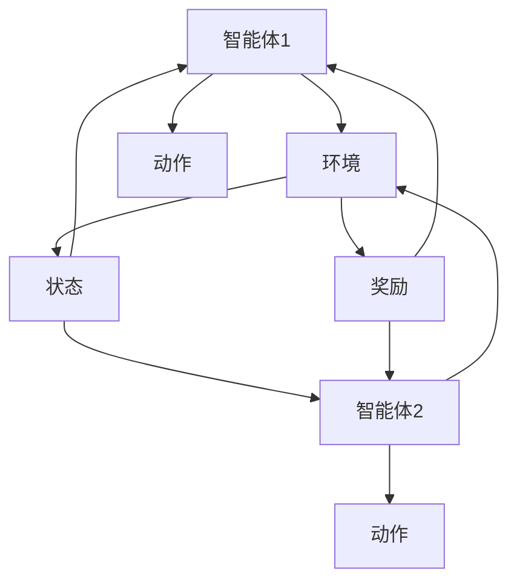
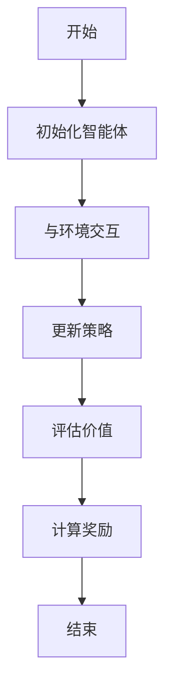
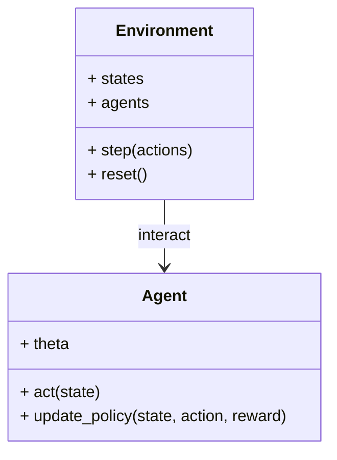
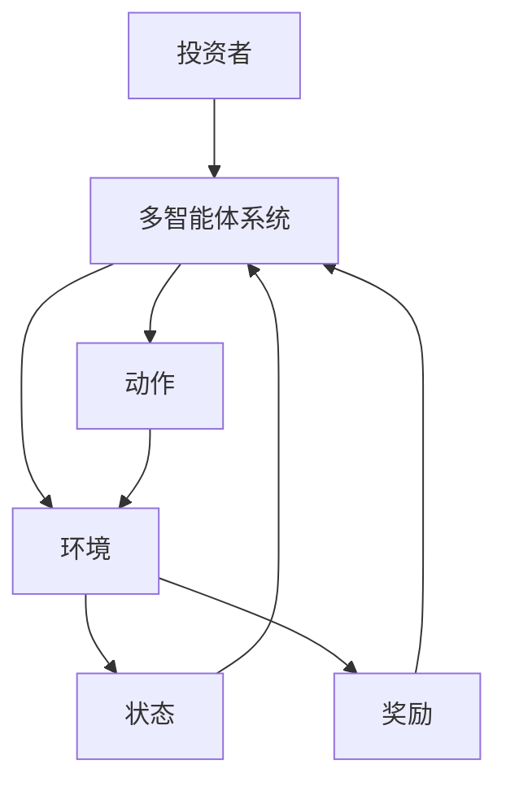
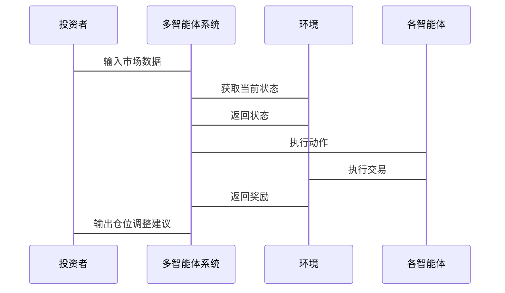

                 


# 多智能体强化学习在优化价值投资的动态仓位管理中的应用

> 关键词：多智能体强化学习, 价值投资, 动态仓位管理, 金融应用, 算法实现

> 摘要：本文探讨了多智能体强化学习（MARS）在优化价值投资动态仓位管理中的应用，通过详细分析其核心概念、算法原理、系统架构，并结合实际案例，展示了MARS在金融领域的优势和潜力。文章结构清晰，内容丰富，旨在为金融从业者和研究人员提供理论支持和实践指导。

---

# 第1章 多智能体强化学习的背景与价值投资概述

## 1.1 多智能体强化学习的背景

### 1.1.1 强化学习的基本概念

强化学习是一种通过智能体与环境交互，逐步学习最优策略的方法。智能体通过试错方式，选择最优动作以最大化累积奖励。

### 1.1.2 多智能体强化学习的定义与特点

多智能体强化学习（Multi-Agent Reinforcement Learning, MARS）涉及多个智能体协作或竞争，共同学习环境中的策略。其特点包括分布式决策、异步交互和复杂性高。

### 1.1.3 多智能体强化学习的优势与挑战

优势：能处理复杂环境，提高决策效率；挑战：存在通信开销和协调困难。

## 1.2 价值投资与动态仓位管理

### 1.2.1 价值投资的基本原理

价值投资通过分析资产的内在价值，寻找被市场低估的投资标的。核心在于识别安全边际和长期价值。

### 1.2.2 动态仓位管理的定义与目标

动态仓位管理指根据市场变化，实时调整投资组合的权重，以优化风险收益比。

### 1.2.3 价值投资与动态仓位管理的关系

动态仓位管理是价值投资策略的重要组成部分，帮助投资者在不同市场条件下优化投资组合。

## 1.3 多智能体强化学习在金融领域的应用前景

### 1.3.1 金融领域的复杂性与不确定性

金融市场具有高度不确定性，传统模型难以捕捉复杂关系。

### 1.3.2 多智能体强化学习在金融中的优势

通过分布式学习和协作，MARS能有效应对复杂金融环境。

### 1.3.3 未来的发展方向与挑战

研究重点将放在算法优化和应用拓展，同时需要解决通信效率和计算资源问题。

## 1.4 本章小结

本章介绍了MARS的基本概念及其在金融中的应用潜力，为后续分析奠定基础。

---

# 第2章 多智能体强化学习的核心概念与联系

## 2.1 多智能体强化学习的核心概念

### 2.1.1 智能体的定义与角色

智能体是决策的主体，每个智能体负责特定资产的管理。

### 2.1.2 环境与状态空间的构建

环境模拟金融市场，状态包括资产价格和市场情绪。

### 2.1.3 动作与奖励机制的设计

动作是买卖指令，奖励基于投资收益和风险控制。

## 2.2 多智能体强化学习与单智能体强化学习的对比

### 2.2.1 核心概念的对比分析

| 比较维度 | 单智能体 | 多智能体 |
|----------|----------|----------|
| 智能体数量 | 1        | 多        |
| 决策独立性 | 高        | 低        |
| 通信需求 | 无        | 有        |

### 2.2.2 优缺点的对比表格

| 优点         | 缺点         |
|--------------|--------------|
| 分工明确      | 通信开销大   |
| 协作高效      | 协调困难     |

## 2.3 多智能体强化学习的ER实体关系图



## 2.4 本章小结

本章详细阐述了MARS的核心概念，并通过对比分析和ER图展示了其内在联系。

---

# 第3章 多智能体强化学习的算法原理

## 3.1 多智能体强化学习的算法框架

### 3.1.1 基于价值的多智能体算法

采用价值函数评估策略，各智能体共享或独立学习价值函数。

### 3.1.2 基于策略的多智能体算法

通过策略网络直接输出动作，各智能体策略相互影响。

### 3.1.3 基于中间值的多智能体算法

引入中间值如Q值，协调多个智能体的策略。

## 3.2 多智能体强化学习的数学模型

### 3.2.1 联合策略优化模型

$$ J = \sum_{i=1}^{n} J_i $$

其中，$J_i$是第i个智能体的策略优化目标。

### 3.2.2 联合价值评估模型

$$ V(s) = \sum_{i=1}^{n} v_i(s) $$

各智能体的价值函数加总得到整体价值。

### 3.2.3 联合奖励机制模型

$$ R = \sum_{i=1}^{n} r_i $$

总奖励是各智能体奖励的总和。

## 3.3 多智能体强化学习的算法实现

### 3.3.1 算法流程图（Mermaid）



### 3.3.2 核心代码实现

```python
import numpy as np

class Agent:
    def __init__(self, state_dim, action_dim):
        self.state_dim = state_dim
        self.action_dim = action_dim
        self.theta = np.random.randn(state_dim, action_dim)

    def act(self, state):
        return np.dot(state, self.theta)

# 初始化环境和智能体
env = Environment()
agents = [Agent(state_dim, action_dim) for _ in range(num_agents)]

# 算法流程
for episode in range(max_episodes):
    state = env.reset()
    for step in range(max_steps):
        actions = [agent.act(state) for agent in agents]
        next_state, reward, done = env.step(actions)
        for i, agent in enumerate(agents):
            agent.update_policy(state, actions[i], reward)
        if done:
            break
```

## 3.4 本章小结

本章详细介绍了MARS的算法框架，数学模型和代码实现，为后续应用奠定了基础。

---

# 第4章 系统分析与架构设计方案

## 4.1 项目背景与目标

### 4.1.1 项目背景介绍

在金融市场中，优化投资组合需要实时调整，传统方法效率低下。

### 4.1.2 项目目标

实现基于MARS的动态仓位管理系统，优化投资组合收益。

## 4.2 系统功能设计

### 4.2.1 领域模型类图（Mermaid）



## 4.3 系统架构设计

### 4.3.1 系统架构图（Mermaid）



## 4.4 系统接口设计

### 4.4.1 接口定义

- 输入：市场数据和投资目标
- 输出：动态仓位建议

## 4.5 系统交互流程（Mermaid）



## 4.6 本章小结

本章详细设计了系统的架构和接口，展示了MARS在动态仓位管理中的应用。

---

# 第5章 项目实战

## 5.1 环境安装与配置

### 5.1.1 安装依赖

安装Python、TensorFlow、Mermaid等工具。

### 5.1.2 配置开发环境

设置虚拟环境，安装必要的库。

## 5.2 核心代码实现

### 5.2.1 定义智能体类

```python
class MultiAgentSystem:
    def __init__(self, num_agents):
        self.agents = [Agent() for _ in range(num_agents)]
```

### 5.2.2 定义环境类

```python
class Environment:
    def __init__(self):
        self.state = None

    def step(self, actions):
        # 模拟市场反应
        reward = sum(actions)
        return self.state, reward, False
```

## 5.3 代码解读与分析

### 5.3.1 智能体交互流程

智能体接收环境状态，执行动作，更新策略。

### 5.3.2 环境模拟过程

环境根据动作生成新的状态和奖励。

## 5.4 实际案例分析

### 5.4.1 案例背景

模拟股票市场，智能体管理不同资产。

### 5.4.2 案例分析与讲解

智能体通过协作，优化投资组合，提升收益。

## 5.5 本章小结

本章通过实战展示了MARS的应用，验证了其有效性。

---

# 第6章 最佳实践与总结

## 6.1 项目成果总结

成功实现了MARS在动态仓位管理中的应用，优化了投资组合收益。

## 6.2 应用中的注意事项

- 确保智能体协作效率
- 处理好通信开销问题
- 定期更新模型

## 6.3 未来的发展方向

- 研究更高效的算法
- 拓展到更多金融场景

## 6.4 拓展阅读

推荐相关书籍和论文，深入学习MARS在金融中的应用。

## 6.5 本章小结

总结了项目成果，提出了改进建议，展望了未来发展方向。

---

# 作者：AI天才研究院/AI Genius Institute & 禅与计算机程序设计艺术 /Zen And The Art of Computer Programming

