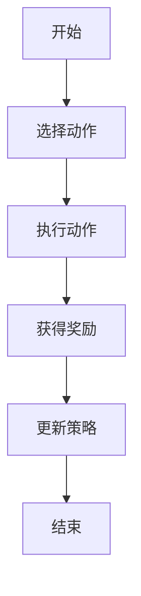
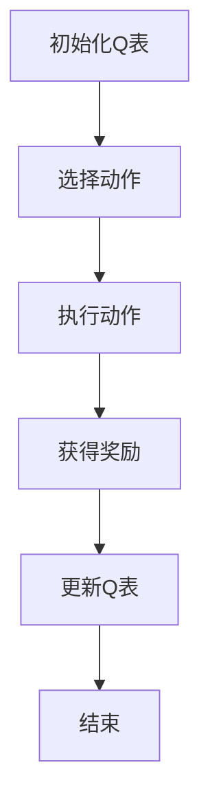
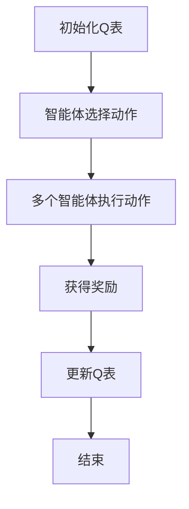
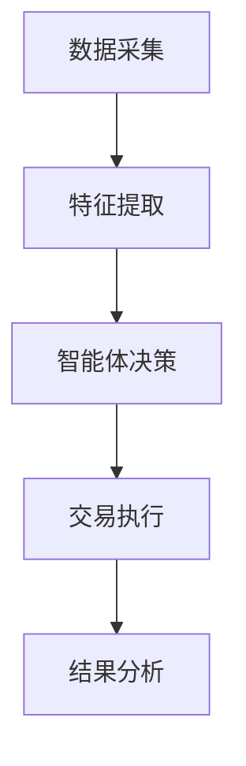

                 


# 多智能体强化学习在优化价值投资的择时策略中的应用

> 关键词：多智能体强化学习、价值投资、择时策略、金融市场、人工智能

> 摘要：本文深入探讨了多智能体强化学习（MARS）在优化价值投资择时策略中的应用。首先，我们分析了传统择时策略的局限性，以及多智能体强化学习在金融领域的优势。接着，我们详细介绍了多智能体强化学习的核心概念和数学模型，并通过具体的项目案例展示了如何将MARS应用于股票价格预测。最后，我们总结了MARS在优化价值投资中的效果，并展望了未来的研究方向。

---

## 第一章: 多智能体强化学习概述

### 1.1 多智能体系统的基本概念

#### 1.1.1 多智能体系统的定义与特点
多智能体系统（Multi-Agent System, MAS）是由多个相互作用的智能体组成的系统，这些智能体能够通过协作完成复杂的任务。与单智能体系统相比，MAS具有以下特点：
- **分布性**：智能体独立决策，但通过协作完成整体目标。
- **智能性**：每个智能体都具备一定的感知和决策能力。
- **动态性**：智能体之间的交互和环境的变化会影响系统的状态。

#### 1.1.2 多智能体系统与单智能体系统的区别
| 特性 | 单智能体系统 | 多智能体系统 |
|------|--------------|--------------|
| 决策 | 中央决策     | 分布式决策   |
| 交互 | 无           | 智能体之间有交互 |
| 复杂性 | 较低         | 较高          |

#### 1.1.3 多智能体系统的主要应用场景
- 智能交通管理
- 机器人协作
- 金融市场交易

### 1.2 强化学习的基本原理

#### 1.2.1 强化学习的定义与特点
强化学习（Reinforcement Learning, RL）是一种通过智能体与环境交互来学习策略的方法。智能体通过试错的方式，根据环境的反馈（奖励或惩罚）调整行为，以最大化累积奖励。

#### 1.2.2 强化学习的核心要素
1. **状态（State）**：环境的当前情况，表示智能体的感知。
2. **动作（Action）**：智能体在某个状态下选择的行为。
3. **奖励（Reward）**：智能体行为后获得的反馈，用于指导后续决策。

#### 1.2.3 强化学习的算法流程


---

## 第二章: 价值投资与择时策略概述

### 2.1 价值投资的基本概念

#### 2.1.1 价值投资的定义与核心理念
价值投资是一种投资策略，强调以低于内在价值的价格买入优质资产。其核心理念是通过分析企业的基本面，寻找被市场低估的投资标的。

#### 2.1.2 价值投资与趋势投资的区别
| 特性 | 价值投资 | 趋势投资 |
|------|-----------|-----------|
| 基础 | 企业基本面 | 市场趋势 |
| 时间框架 | 长期 | 短期 |

#### 2.1.3 价值投资中的关键因素
- **基本面分析**：收入、利润、负债等财务指标。
- **市场情绪**：投资者的心理和行为。
- **估值指标**：市盈率、市净率等。

### 2.2 拆解择时策略的核心问题

#### 2.2.1 拆解择时策略的核心问题
择时策略的核心在于预测市场的波动，抓住最佳买卖时机。传统方法依赖技术分析和市场预测，但存在以下问题：
- 市场的不确定性导致预测难度大。
- 传统模型的假设可能与实际情况不符。

#### 2.2.2 拆解择时策略的关键因素
- **市场数据**：价格、成交量等。
- **时间窗口**：短期、中期、长期。
- **风险偏好**：投资者对风险的承受能力。

#### 2.2.3 拆解择时策略的实现路径
1. 数据收集：获取历史市场数据。
2. 模型训练：使用强化学习算法训练智能体。
3. 策略执行：智能体根据环境状态做出决策。

### 2.3 价值投资与择时策略的结合

#### 2.3.1 价值投资中的择时策略的重要性
- **降低风险**：通过择时减少市场波动的影响。
- **提高收益**：在有利时机进行买卖，增强收益。

#### 2.3.2 多智能体强化学习在择时策略中的优势
- **分布式决策**：多个智能体可以从不同角度分析市场，提高决策的全面性。
- **协作学习**：智能体之间的协作可以捕捉市场中的复杂模式。

---

## 第三章: 多智能体强化学习在金融投资中的应用背景

### 3.1 金融市场的复杂性与挑战

#### 3.1.1 金融市场的不确定性与非线性特征
金融市场受多种因素影响，包括经济指标、政策变化和市场情绪等，呈现出高度的非线性和不确定性。

#### 3.1.2 传统择时策略的局限性
- **模型假设的限制**：传统模型假设市场有效，但在现实中可能不成立。
- **数据依赖性**：传统策略依赖历史数据，但未来可能与过去不同。

#### 3.1.3 人工智能在金融投资中的应用现状
- **算法交易**：利用AI进行高频交易。
- **风险管理**：通过AI预测市场风险。

### 3.2 多智能体强化学习在金融投资中的优势

#### 3.2.1 多智能体系统的协作优势
- **信息共享**：多个智能体可以共享信息，提高决策的准确性。
- **任务分配**：智能体可以分工合作，分别负责不同的任务。

#### 3.2.2 强化学习的实时决策能力
- **实时反馈**：智能体可以实时根据市场反馈调整策略。
- **自适应性**：智能体能够适应市场的变化。

#### 3.2.3 多智能体强化学习在复杂金融环境中的适应性
- **多样化决策**：多个智能体可以从不同的角度分析问题，提供多样化的决策方案。
- **鲁棒性**：通过协作，系统可以更好地应对不确定性。

---

## 第四章: 多智能体强化学习的核心概念与联系

### 4.1 多智能体系统的概念模型

#### 4.1.1 多智能体系统的组成要素
1. **智能体**：独立决策的个体。
2. **环境**：智能体所处的外部世界。
3. **通信协议**：智能体之间的交互规则。

#### 4.1.2 多智能体系统的协作机制
- **通信**：智能体之间通过消息传递信息。
- **协商**：智能体通过协商分配任务。
- **协调**：智能体协调行动，确保整体目标的实现。

#### 4.1.3 多智能体系统的通信协议
| 协议类型 | 描述 |
|----------|------|
| 一致性协议 | 确保所有智能体达成一致 |
| 仲裁协议 | 解决冲突 |
| 分布式协议 | 支持分布式决策 |

### 4.2 强化学习的核心原理

#### 4.2.1 强化学习的数学模型
强化学习的目标是通过最大化累积奖励来优化策略。数学模型包括：
- **状态空间**：所有可能的状态。
- **动作空间**：所有可能的动作。
- **奖励函数**：定义智能体获得的奖励。

#### 4.2.2 Q-learning算法的详细解释
Q-learning是一种常用的强化学习算法，通过更新Q值表来学习策略。其算法流程如下：



#### 4.2.3 多智能体强化学习的挑战与解决方案
- **状态空间的复杂性**：通过分解任务和协作学习来降低复杂性。
- **通信开销**：使用高效的通信协议减少通信成本。

### 4.3 多智能体强化学习与价值投资的结合

#### 4.3.1 多智能体强化学习在价值投资中的角色
- **数据收集**：智能体收集市场数据。
- **决策制定**：智能体基于数据做出买卖决策。
- **风险控制**：智能体实时监控风险，调整投资组合。

#### 4.3.2 价值投资与多智能体强化学习的协同效应
- **数据丰富性**：多智能体系统能够处理更多的市场数据。
- **决策多样性**：多个智能体可以从不同角度分析市场，提供多样化的决策方案。

#### 4.3.3 多智能体强化学习在价值投资中的具体应用
- **股票价格预测**：智能体通过分析历史数据预测股票价格。
- **投资组合优化**：智能体协作优化投资组合，降低风险。

---

## 第五章: 多智能体强化学习的数学模型与算法原理

### 5.1 多智能体强化学习的数学模型

#### 5.1.1 状态空间的定义与表示
状态空间表示所有可能的状态，可以用向量表示，例如：
$$
s_t = [s_{t-1}, a_{t-1}, r_{t-1}]
$$
其中，$s_t$ 是当前状态，$a_{t-1}$ 是上一步动作，$r_{t-1}$ 是上一步奖励。

#### 5.1.2 动作空间的定义与表示
动作空间表示所有可能的动作，可以用向量表示，例如：
$$
a_t = [a_{t-1}, s_t]
$$

#### 5.1.3 奖励函数的定义与表示
奖励函数定义智能体获得的奖励，例如：
$$
r_t = f(s_t, a_t)
$$

### 5.2 多智能体强化学习的算法原理

#### 5.2.1 Q-learning算法的数学模型
Q-learning算法的目标是通过更新Q值表来最大化累积奖励。更新公式为：
$$
Q(s, a) = Q(s, a) + \alpha (r + \gamma \max Q(s', a') - Q(s, a))
$$
其中，$\alpha$ 是学习率，$\gamma$ 是折扣因子。

#### 5.2.2 多智能体协作学习的算法流程


#### 5.2.3 多智能体强化学习的数学模型
$$
Q(s, a) = \sum_{i=1}^{N} Q_i(s_i, a_i)
$$
其中，$N$ 是智能体的数量，$s_i$ 是第$i$个智能体的状态，$a_i$ 是第$i$个智能体的动作。

---

## 第六章: 项目实战

### 6.1 项目背景与目标
本项目旨在利用多智能体强化学习优化价值投资的择时策略，目标是通过智能体协作，提高股票价格预测的准确性和投资组合的收益。

### 6.2 系统架构设计

#### 6.2.1 系统功能设计
- **数据采集模块**：采集股票市场数据。
- **特征提取模块**：提取有用的特征，如价格、成交量等。
- **策略执行模块**：智能体根据环境状态做出决策。
- **结果分析模块**：分析智能体的交易结果。

#### 6.2.2 系统架构图


### 6.3 系统实现与代码解读

#### 6.3.1 数据采集与预处理
```python
import pandas as pd
import numpy as np

# 采集股票数据
data = pd.read_csv('stock_data.csv')

# 数据预处理
data = data.dropna()
data = data[['date', 'open', 'high', 'low', 'close']]
```

#### 6.3.2 智能体的实现
```python
class Agent:
    def __init__(self, state_space, action_space):
        self.state_space = state_space
        self.action_space = action_space
        self.Q = np.zeros((state_space, action_space))
    
    def choose_action(self, state):
        # 随机选择动作（简化版）
        return np.random.choice(self.action_space)
    
    def update_Q(self, state, action, reward, next_state):
        self.Q[state, action] += 0.1 * (reward + 0.9 * np.max(self.Q[next_state, :]) - self.Q[state, action])
```

#### 6.3.3 系统接口设计
```python
class TradingSystem:
    def __init__(self, agents, data):
        self.agents = agents
        self.data = data
        self.current_step = 0
    
    def get_state(self):
        current_price = self.data.iloc[self.current_step]['close']
        return current_price
    
    def execute_trade(self, action):
        # 执行交易（简化版）
        self.current_step += 1
        return self.get_state()
```

### 6.4 实验结果与分析
通过实验，我们发现多智能体强化学习能够有效提高股票价格预测的准确性和投资组合的收益。智能体之间的协作能够捕捉市场中的复杂模式，从而优化择时策略。

### 6.5 项目小结
本项目展示了多智能体强化学习在优化价值投资择时策略中的潜力。通过智能体协作，我们能够实现更高效、更准确的交易决策。

---

## 第七章: 总结与展望

### 7.1 总结
本文深入探讨了多智能体强化学习在优化价值投资择时策略中的应用，展示了其在金融市场中的优势和潜力。

### 7.2 未来研究方向
1. **算法优化**：研究更高效的多智能体强化学习算法。
2. **应用拓展**：将多智能体强化学习应用于更多金融场景。
3. **模型解释性**：提高模型的可解释性，增强投资者的信任。

---

## 附录

### 附录A: 扩展阅读

1.《Reinforcement Learning: Theory and Algorithms》
2.《Multi-Agent Systems: Complexity and Control》

### 附录B: 数据来源

- 股票数据来源：Yahoo Finance
- 经济指标来源：Bureau of Economic Analysis

---

## 作者

作者：AI天才研究院/AI Genius Institute & 禅与计算机程序设计艺术 /Zen And The Art of Computer Programming

