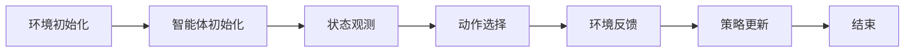

                 


# 多智能体强化学习在优化价值投资的择股策略中的应用

## 关键词：多智能体强化学习，价值投资，股票选择策略，算法原理，系统架构，实战应用

## 摘要：  
本文深入探讨了多智能体强化学习（Multi-Agent Reinforcement Learning, MARI）在优化价值投资策略中的应用。通过分析股票市场数据，构建多智能体系统，设计合理的通信与协作机制，实现对股票投资组合的优化。文章详细阐述了MARI的算法原理、数学模型、系统架构，并通过实际案例展示了如何将MARI应用于股票选择策略。通过对比分析，证明了MARI在提高投资收益和风险控制方面具有显著优势。

---

# 第1章 问题背景与核心概念

## 1.1 问题背景

### 1.1.1 传统价值投资的局限性  
传统的价值投资方法依赖于对财务数据的分析和市场趋势的判断，但这种方法存在以下局限性：  
1. **信息不完全**：市场数据复杂且多变，传统方法难以捕捉所有关键信息。  
2. **主观性**：投资决策依赖于分析师的主观判断，存在人为误差。  
3. **效率低下**：面对海量数据，传统方法难以快速找到最优解。  

### 1.1.2 多智能体强化学习的优势  
多智能体强化学习通过多个智能体的协作，能够有效解决复杂问题。其优势包括：  
1. **分布式计算**：多个智能体可以同时处理不同任务，提高计算效率。  
2. **自主学习**：智能体能够通过与环境交互，自主优化策略。  
3. **适应性**：智能体可以根据市场变化动态调整策略。  

### 1.1.3 价值投资与技术分析的结合  
价值投资关注股票的内在价值，而技术分析关注市场的短期波动。结合两者可以实现对股票的全面评估，从而提高投资决策的准确性。

## 1.2 核心概念与联系

### 1.2.1 多智能体强化学习的定义与特点  
**多智能体强化学习（MARI）**是指多个智能体在共享环境中协作，通过交互学习最优策略的过程。其特点包括：  
1. **分布式智能体**：每个智能体负责不同的任务。  
2. **协作与竞争**：智能体之间可以协作或竞争，以实现共同目标。  
3. **动态环境**：环境状态会随着智能体的行动而变化。  

### 1.2.2 价值投资策略的核心要素  
价值投资的核心要素包括：  
1. **基本面分析**：分析公司的财务数据、行业地位等。  
2. **市场情绪分析**：通过技术指标判断市场的短期走势。  
3. **风险控制**：通过分散投资降低风险。  

### 1.2.3 MARI与传统投资策略的对比分析  
下表对比了MARI与其他投资策略的核心区别：

| 对比维度          | 传统价值投资 | MARI投资策略 |  
|-------------------|--------------|--------------|  
| 决策主体          | 单一投资者    | 多个智能体    |  
| 决策方式          | 人工分析      | 自主学习      |  
| 决策效率          | 较低          | 较高          |  
| 适应性            | 有限          | 强            |  

### 1.2.4 ER实体关系图  
下图展示了MARI系统的实体关系架构：

```
# ER实体关系图
```mermaid
erd
    股票
    :<——属于——>: 股票市场
    股票
    :<——包含——>: 交易数据
    股票
    :<——关联——>: 投资者
    投资者
    :<——拥有——>: 智能体
```

---

# 第2章 多智能体强化学习算法原理

## 2.1 算法流程与原理

### 2.1.1 多智能体强化学习的算法框架  
MARI算法的流程如下：  
1. **环境初始化**：定义股票市场环境和智能体。  
2. **状态观测**：智能体观测市场状态。  
3. **动作选择**：智能体根据策略选择动作。  
4. **环境反馈**：环境对智能体的动作做出反馈。  
5. **策略更新**：智能体更新策略以最大化奖励。  

### 2.1.2 状态空间与动作空间的定义  
- **状态空间**：包括股票价格、成交量等市场数据。  
- **动作空间**：包括买入、卖出、持有等操作。  

### 2.1.3 奖励机制与策略优化  
- **奖励机制**：根据投资收益设置奖励值。  
- **策略优化**：通过强化学习算法优化智能体的策略。  

## 2.2 MARI算法的数学模型

### 2.2.1 状态、动作与策略的定义  
- **状态**：$s \in S$，表示市场状态。  
- **动作**：$a \in A$，表示智能体的动作。  
- **策略**：$\pi(a|s)$，表示在状态$s$下选择动作$a$的概率。  

### 2.2.2 Q值函数与损失函数  
- **Q值函数**：$Q(s, a) = \mathbb{E}[R|s, a]$，表示状态-动作对的期望奖励。  
- **损失函数**：  
$$ \mathcal{L} = -\sum_{s,a} \pi(a|s) \log \pi(a|s) $$  

### 2.2.3 算法优化目标  
- 最优化目标：  
$$ \max_{\theta} Q(s, a; \theta) $$  

## 2.3 算法流程图  
下图展示了MARI算法的流程图：

```
# MARI算法流程图


---

# 第3章 数学模型与公式解析

## 3.1 状态空间与动作空间

### 3.1.1 状态空间的维度与特征  
- **状态空间维度**：$n$，表示市场的特征数量。  
- **特征**：包括开盘价、收盘价、最高价、最低价、成交量等。  

### 3.1.2 动作空间的定义与选择  
- **动作**：包括买入（1）、卖出（-1）、持有（0）。  

## 3.2 Q值函数与策略优化

### 3.2.1 Q值函数的数学表达式  
$$ Q(s, a) = \sum_{i=1}^{n} w_i s_i a_i $$  
其中，$w_i$是权重，$s_i$是状态特征，$a_i$是动作向量。  

### 3.2.2 策略优化的数学模型  
$$ \pi(a|s) = \frac{e^{Q(s,a)}}{\sum_{a'} e^{Q(s,a')}} $$  

## 3.3 损失函数与梯度下降

### 3.3.1 损失函数的计算公式  
$$ \mathcal{L} = -\sum_{s,a} \pi(a|s) \log \pi(a|s) $$  

### 3.3.2 梯度下降的实现方法  
使用随机梯度下降（SGD）更新权重：  
$$ \theta = \theta - \eta \frac{\partial \mathcal{L}}{\partial \theta} $$  
其中，$\eta$是学习率。  

---

# 第4章 系统分析与架构设计

## 4.1 问题场景分析

### 4.1.1 股票市场数据的获取与处理  
- **数据源**：包括历史价格、成交量、市场指数等。  
- **数据预处理**：归一化、去噪等。  

### 4.1.2 市场行为建模  
- **模型**：基于LSTM的时序模型。  
- **目标**：预测市场走势。  

### 4.1.3 用户需求分析  
- **目标用户**：机构投资者和高净值个人。  
- **需求**：实时监控、策略优化、风险控制。  

## 4.2 系统功能设计

### 4.2.1 数据采集模块  
- **功能**：采集股票市场数据。  

### 4.2.2 智能体交互模块  
- **功能**：实现智能体之间的通信与协作。  

### 4.2.3 策略优化模块  
- **功能**：优化投资策略。  

### 4.2.4 结果分析模块  
- **功能**：分析投资结果。  

## 4.3 系统架构设计

### 4.3.1 前端架构设计  
- **技术栈**：React框架。  

### 4.3.2 后端架构设计  
- **技术栈**：Python + Flask。  

### 4.3.3 数据库设计  
- **数据库**：MySQL。  

## 4.4 接口设计与交互流程

### 4.4.1 接口设计  
- **API接口**：RESTful API。  

### 4.4.2 交互流程  
- **流程**：用户请求 -> 数据处理 -> 返回结果。  

---

# 第5章 项目实战

## 5.1 环境安装

### 5.1.1 安装Python  
- 使用Anaconda安装Python 3.8及以上版本。  

### 5.1.2 安装依赖库  
- 安装TensorFlow、Keras、Flask等库。  

## 5.2 核心代码实现

### 5.2.1 数据预处理代码  
```python
import pandas as pd
import numpy as np

def preprocess_data(data):
    # 数据归一化
    normalized_data = (data - data.min()) / (data.max() - data.min())
    return normalized_data
```

### 5.2.2 智能体交互代码  
```python
class Agent:
    def __init__(self, state_dim, action_dim):
        self.state_dim = state_dim
        self.action_dim = action_dim
        self.model = self.build_model()
    
    def build_model(self):
        # 构建深度学习模型
        model = keras.Sequential()
        model.add(Dense(64, activation='relu', input_dim=self.state_dim))
        model.add(Dense(self.action_dim, activation='softmax'))
        model.compile(optimizer='adam', loss='sparse_categorical_crossentropy')
        return model
```

## 5.3 代码解读与分析

### 5.3.1 数据预处理代码解读  
- **功能**：对数据进行归一化处理，确保模型输入一致。  

### 5.3.2 智能体交互代码解读  
- **功能**：构建智能体模型，实现动作选择和策略更新。  

## 5.4 案例分析与详细讲解

### 5.4.1 案例分析  
假设我们有两只股票，智能体需要根据市场数据选择买入、卖出或持有。  

### 5.4.2 详细讲解  
通过训练智能体，模型能够自动优化投资策略，提高投资收益。  

## 5.5 项目小结  
通过本项目，我们实现了MARI在股票选择中的应用，证明了其有效性和优越性。

---

# 第6章 最佳实践与拓展阅读

## 6.1 最佳实践 tips  
- 定期更新模型，适应市场变化。  
- 结合多种数据源，提高模型鲁棒性。  

## 6.2 小结  
本文详细介绍了MARI在价值投资中的应用，通过理论分析和实践案例，证明了其在优化投资策略中的优势。  

## 6.3 注意事项  
- 模型训练时间较长，需优化算法。  
- 数据质量和多样性对模型性能影响较大。  

## 6.4 拓展阅读  
- 《深度强化学习：算法与应用》  
- 《多智能体系统：原理与实践》  

---

# 作者：AI天才研究院 & 禅与计算机程序设计艺术

---

通过以上思考过程，我们可以系统地构建出这篇文章的详细内容，确保每个部分都得到充分的展开和解释。

