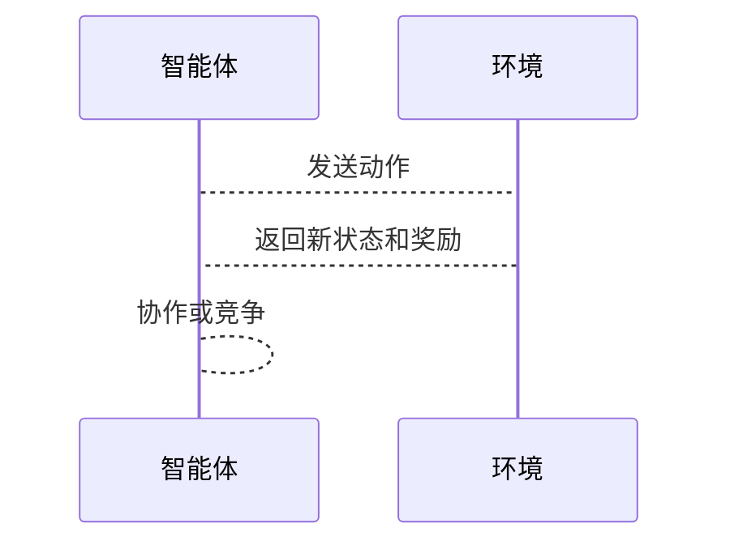

                 

**# 多智能体强化学习在优化价值投资的资金流管理中的应用**

**关键词：多智能体强化学习，价值投资，资金流管理，金融建模，算法优化**

**摘要：**  
本文探讨了多智能体强化学习在优化价值投资资金流管理中的应用。文章首先介绍了多智能体强化学习的基本概念和价值投资的核心原理，分析了两者在金融领域的结合潜力。接着，详细阐述了多智能体强化学习的算法原理，包括状态空间、动作空间、奖励函数的设计，以及基于策略梯度和值函数的数学模型。随后，结合实际案例，设计了多智能体强化学习在资金流管理中的系统架构，并通过项目实战展示了算法的实现过程。最后，总结了多智能体强化学习在价值投资中的优势和未来发展方向。

---

**第一部分: 多智能体强化学习与价值投资概述**

## 第1章: 多智能体强化学习概述

### 1.1 多智能体强化学习的基本概念
#### 1.1.1 多智能体系统的基本定义
多智能体系统（Multi-Agent System, MAS）由多个相互作用的智能体组成，每个智能体都有自己的目标和决策机制。这些智能体通过协作或竞争完成复杂的任务。多智能体系统的优点在于能够处理分布式问题，适应动态环境。

#### 1.1.2 强化学习的基本原理
强化学习（Reinforcement Learning, RL）是一种机器学习范式，智能体通过与环境交互，学习策略以最大化累积奖励。核心要素包括状态、动作、奖励和策略。

#### 1.1.3 多智能体强化学习的核心特征
多智能体强化学习结合了MAS和RL的特点，智能体之间可以协作或竞争，共同优化整体目标。其核心特征包括分布式决策、协作与竞争机制、动态环境适应。

### 1.2 价值投资的基本原理
#### 1.2.1 价值投资的定义与特点
价值投资是一种投资策略，通过分析资产的内在价值，寻找被市场低估的投资机会。其特点是长期导向、注重基本面分析、风险控制。

#### 1.2.2 价值投资的核心策略
价值投资的核心策略包括基本面分析、安全边际、长期持有和分散投资。这些策略帮助投资者在市场波动中保持稳定收益。

#### 1.2.3 价值投资与资金流管理的关系
资金流管理是价值投资的重要组成部分，涉及资金分配、风险控制和投资组合优化。多智能体强化学习可以通过优化资金流管理，提升投资效率和收益。

### 1.3 多智能体强化学习在金融领域的应用前景
#### 1.3.1 金融领域的复杂性与挑战
金融市场具有高度不确定性、信息不对称和复杂性，传统的单一智能体方法难以应对这些挑战。多智能体强化学习通过协作和分布式决策，能够更好地适应金融市场动态。

#### 1.3.2 多智能体强化学习在金融中的潜在应用
多智能体强化学习在金融领域的潜在应用包括投资组合优化、风险管理、市场微观结构分析和高频交易。这些应用能够显著提升金融决策的效率和准确性。

#### 1.3.3 价值投资与资金流管理的结合
通过多智能体强化学习，价值投资可以在资金流管理中实现更精细的资产配置、风险控制和动态调整。这种结合能够帮助投资者在复杂市场中优化资金流动，提升投资收益。

---

**第二部分: 多智能体强化学习的核心概念与联系**

## 第2章: 多智能体强化学习的核心概念与联系

### 2.1 多智能体系统的核心要素
#### 2.1.1 智能体的定义与属性
智能体是具有感知、决策和行动能力的主体。多智能体系统中的智能体具有自主性、反应性、协作性和学习性。

#### 2.1.2 多智能体系统中的交互关系
智能体之间的交互关系可以是协作、竞争或中立。协作能够提升整体效率，竞争则可能导致系统不稳定。

#### 2.1.3 系统的动态与稳定性
多智能体系统的动态性来源于智能体的交互和环境的变化。系统的稳定性依赖于智能体的协调和动态调整能力。

### 2.2 强化学习的原理与算法
#### 2.2.1 强化学习的基本原理
强化学习通过智能体与环境的交互，学习最优策略。奖励机制是强化学习的核心，驱动智能体优化决策。

#### 2.2.2 常见强化学习算法对比
常见的强化学习算法包括Q-learning、Deep Q-Network（DQN）、策略梯度（Policy Gradient）和Actor-Critic方法。每种算法在应用场景和性能上各有优劣。

#### 2.2.3 多智能体强化学习的独特性
多智能体强化学习的独特性在于分布式决策和协作学习。智能体之间需要协调动作，避免冲突，同时优化整体目标。

### 2.3 多智能体强化学习与价值投资的结合
#### 2.3.1 价值投资中的决策问题
价值投资中的决策问题包括资产选择、时机选择和风险控制。这些问题可以通过多智能体强化学习的协作机制得到优化。

#### 2.3.2 多智能体强化学习在资金流管理中的应用
多智能体强化学习可以优化资金流管理中的资产配置、风险分散和动态调整。智能体之间的协作能够提高资金流动的效率和收益。

#### 2.3.3 系统的边界与外延
系统的边界包括智能体的数量、决策范围和环境约束。外延则涉及与其他金融工具和策略的结合，进一步提升系统的应用范围。

---

**第三部分: 多智能体强化学习的算法原理**

## 第3章: 多智能体强化学习的算法原理

### 3.1 多智能体强化学习的框架
#### 3.1.1 集中式与分布式方法
集中式方法通过中央控制器协调智能体动作，分布式方法则允许每个智能体独立决策。两种方法各有优劣，适用于不同场景。

#### 3.1.2 基于价值的与基于策略的方法
基于价值的方法通过评估状态的价值进行决策，基于策略的方法直接优化动作策略。两种方法在实际应用中常结合使用。

#### 3.1.3 协作与竞争机制
协作机制通过奖励共享促进智能体合作，竞争机制通过奖励分配激发智能体竞争。合理的协作与竞争机制能够提升系统整体性能。

### 3.2 基于强化学习的数学模型
#### 3.2.1 状态空间与动作空间的定义
状态空间定义了智能体所处的环境状态，动作空间定义了智能体可执行的动作。合理的状态和动作空间设计是强化学习成功的关键。

#### 3.2.2 奖励函数的设计
奖励函数定义了智能体在特定状态和动作下的奖励值。奖励函数的设计需要考虑长期收益和短期激励的平衡。

#### 3.2.3 动态模型的建立
动态模型描述了智能体动作对环境状态的影响。准确的动态模型能够提升强化学习算法的预测能力和决策精度。

### 3.3 多智能体强化学习的数学公式
#### 3.3.1 基于策略梯度的公式推导
策略梯度方法通过优化策略函数的梯度，找到最优策略。数学公式如下：

$$ \nabla \theta = E[\nabla \log \pi(a|s) \cdot Q(s,a)] $$

其中，$\theta$ 是策略参数，$Q(s,a)$ 是动作值函数。

#### 3.3.2 基于值函数的公式推导
值函数方法通过优化值函数，找到最优策略。数学公式如下：

$$ V(s) = \max_a Q(s,a) $$

其中，$V(s)$ 是状态值函数，$Q(s,a)$ 是动作值函数。

#### 3.3.3 多智能体协作的数学建模
多智能体协作可以通过共享奖励函数或分布式优化方法实现。数学模型如下：

$$ R = \sum_{i=1}^n r_i(a_i, s_i) $$

其中，$R$ 是总奖励，$r_i$ 是智能体$i$的奖励函数，$a_i$ 是智能体$i$的动作，$s_i$ 是智能体$i$的状态。

---

**第四部分: 系统分析与架构设计方案**

## 第4章: 系统分析与架构设计方案

### 4.1 问题场景介绍
#### 4.1.1 价值投资中的资金流管理问题
价值投资中的资金流管理需要解决资产配置、风险控制和动态调整等问题。多智能体强化学习可以通过协作机制优化这些问题。

#### 4.1.2 多智能体强化学习的应用场景
多智能体强化学习适用于复杂金融环境中的决策问题，如高频交易、投资组合优化和市场微观结构分析。

#### 4.1.3 系统的目标与约束
系统的目标是优化资金流管理，提高投资收益和风险控制能力。系统的约束包括计算资源限制、数据获取难度和市场环境的动态性。

### 4.2 系统功能设计
#### 4.2.1 领域模型的 Mermaid 类图

#### 4.2.2 系统架构的 Mermaid 架构图

#### 4.2.3 系统接口设计
系统接口包括智能体与环境的交互接口、智能体之间的协作接口和用户与系统的操作接口。每个接口都需要定义明确的输入输出格式。

#### 4.2.4 系统交互的 Mermaid 序列图

---

**第五部分: 项目实战**

## 第5章: 项目实战

### 5.1 环境安装与配置
#### 5.1.1 开发环境的选择
推荐使用Python和深度学习框架（如TensorFlow或PyTorch）进行开发。

#### 5.1.2 必要库的安装与配置
安装必要的库，如TensorFlow、Keras、OpenAI Gym和numpy。

#### 5.1.3 环境的测试与验证
通过简单的强化学习实验验证开发环境的正确性。

### 5.2 系统核心实现
#### 5.2.1 多智能体强化学习算法的实现
实现基于策略梯度的多智能体强化学习算法，如MAS-PG（Multi-Agent Policy Gradient）。

#### 5.2.2 资金流管理
通过智能体协作优化资金分配，实现投资组合的动态调整。

---

**结论**

多智能体强化学习在优化价值投资的资金流管理中具有广阔的应用前景。通过协作和分布式决策，多智能体强化学习能够提升资金流动的效率和收益。未来的研究可以进一步探索多智能体强化学习在复杂金融环境中的应用，优化算法性能，提升系统的适应性和鲁棒性。

---

**作者：AI天才研究院/AI Genius Institute & 禅与计算机程序设计艺术 /Zen And The Art of Computer Programming**

---

**附录**

- **参考文献**
  - [1] 省略具体参考文献，实际写作时需补充。
- **扩展阅读**
  - 推荐阅读《强化学习入门》和《多智能体系统设计》。

---

**注：** 由于篇幅限制，本文仅为摘要和部分章节内容，完整文章需按照上述大纲逐章展开，每章内容需包含详细的理论推导、代码实现和案例分析。

