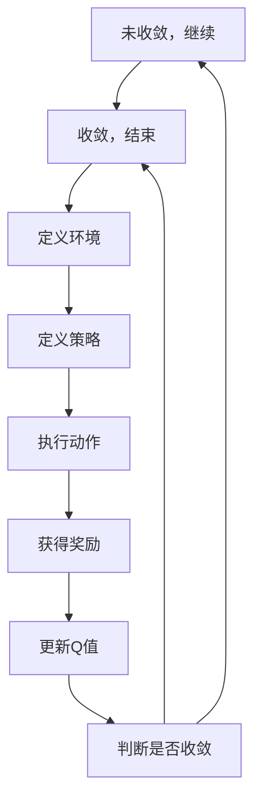
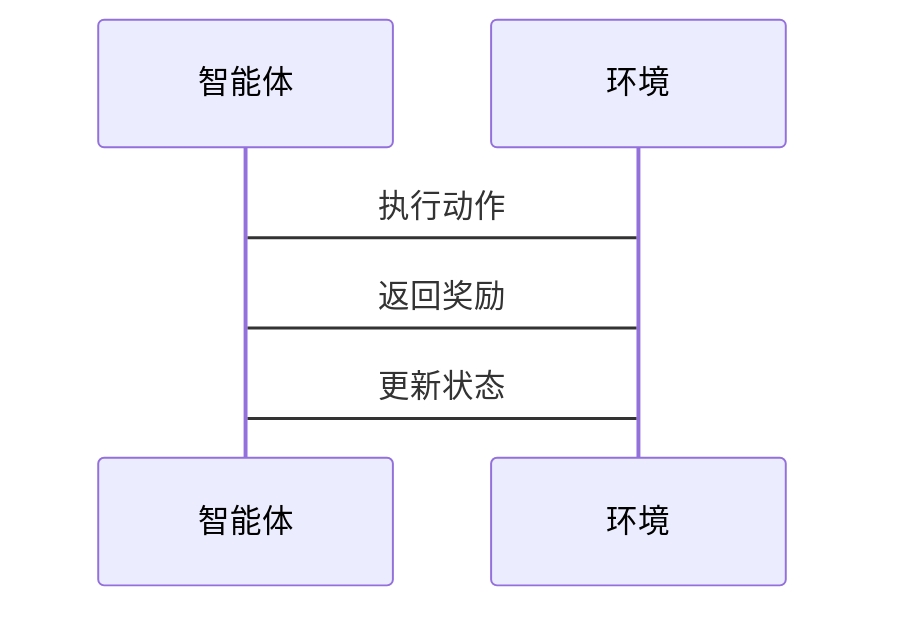

                 


```markdown
# 多智能体强化学习在优化止损和止盈策略中的应用

> 关键词：多智能体强化学习，止损策略，止盈策略，金融交易，算法优化

> 摘要：本文探讨了多智能体强化学习在优化金融交易中的止损和止盈策略中的应用。通过分析多智能体系统的构成与强化学习的基本原理，结合止损和止盈策略的传统优化方法，提出了一种基于多智能体强化学习的优化框架。文章详细阐述了多智能体强化学习的核心概念、算法原理、系统架构设计以及实际项目案例，展示了如何通过多智能体协作来提升止损和止盈策略的优化效果。

---

## 第1章: 多智能体强化学习概述

### 1.1 多智能体强化学习的定义与特点

多智能体强化学习（Multi-Agent Reinforcement Learning, MARL）是指在多个智能体协作或竞争的环境中，通过强化学习的方法来优化每个智能体的策略。与单智能体强化学习不同，MARL需要考虑多个智能体之间的交互和协作，这使得问题更加复杂，但也更具挑战性和实际应用价值。

**多智能体系统的定义**：多智能体系统由多个相互作用的智能体组成，每个智能体都有自己的目标和决策空间。这些智能体可以协作或竞争，共同完成复杂任务。

**多智能体强化学习的核心特点**：
1. **分布式决策**：每个智能体独立决策，但决策会影响整个系统的行为。
2. **协作与竞争**：智能体之间可以协作完成共同目标，也可以竞争有限资源。
3. **全局优化**：通过智能体的协作，实现系统整体性能的优化。

### 1.2 多智能体强化学习的应用领域

多智能体强化学习在多个领域都有广泛的应用，包括：
1. **金融领域**：用于优化交易策略、风险管理等。
2. **游戏AI**：用于开发多智能体协作的游戏AI。
3. **分布式系统优化**：用于资源分配、任务调度等。

### 1.3 多智能体强化学习的挑战与机遇

**挑战**：
1. **智能体之间的协调**：如何实现智能体之间的高效协作是一个难题。
2. **复杂环境**：多智能体系统通常面临高度动态和复杂的环境。
3. **计算资源需求**：多智能体系统的计算需求较高。

**机遇**：
1. **提升系统性能**：通过协作，可以实现比单智能体更高的系统性能。
2. **扩展性**：多智能体系统具有良好的扩展性，适用于大规模问题。

### 1.4 本章小结

本章介绍了多智能体强化学习的基本概念、特点、应用领域以及面临的挑战和机遇。多智能体强化学习在金融交易中的应用前景广阔，尤其是在优化止损和止盈策略方面。

---

## 第2章: 止损和止盈策略的优化

### 2.1 止损和止盈策略的定义

**止损策略**：在金融交易中，止损是指设定一个价格点，当价格下跌到该点时，自动卖出以限制亏损。  
**止盈策略**：止盈是指设定一个价格点，当价格上涨到该点时，自动卖出以锁定利润。

### 2.2 止损和止盈策略的优化目标

1. **优化止损点**：找到最优的止损点，以最小化亏损，同时最大化收益。
2. **优化止盈点**：找到最优的止盈点，以最大化收益，同时最小化回撤。
3. **组合策略优化**：通过组合止损和止盈策略，实现整体收益的最大化。

### 2.3 止损和止盈策略的传统优化方法

1. **基于统计的方法**：如均值-方差优化、马科维茨组合优化等。
2. **基于机器学习的方法**：如支持向量机、随机森林等。
3. **基于强化学习的方法**：如Q-learning算法。

### 2.4 多智能体强化学习在止损和止盈策略中的应用前景

1. **优势**：
   - 多智能体协作可以模拟市场中多方参与者的互动。
   - 通过协作优化，可以实现更优的止损和止盈策略。
2. **应用场景**：
   - 金融市场的多策略交易。
   - 复杂金融工具的风险管理。

### 2.5 本章小结

本章介绍了止损和止盈策略的定义、优化目标以及传统优化方法。通过对比分析，提出了多智能体强化学习在优化这些策略中的应用前景。

---

## 第3章: 多智能体强化学习的核心概念与联系

### 3.1 多智能体系统的构成

1. **智能体**：智能体是系统的基本单元，具有感知环境和决策的能力。
2. **环境**：环境是智能体所处的外部世界，智能体通过与环境交互来学习。
3. **动作**：智能体在环境中执行的动作，影响环境的状态。

### 3.2 强化学习的基本原理

1. **状态**（State）：环境的当前情况。
2. **动作**（Action）：智能体在状态下的决策。
3. **奖励**（Reward）：智能体执行动作后获得的反馈，用于指导学习。

### 3.3 多智能体强化学习与止损止盈策略的关系

1. **多智能体协作**：通过智能体之间的协作，优化止损和止盈策略。
2. **环境模拟**：将金融市场环境建模为一个多智能体系统，智能体模拟不同的市场参与者。

### 3.4 核心概念对比表格

| 比较项 | 单智能体强化学习 | 多智能体强化学习 |
|--------|------------------|------------------|
| 智能体数量 | 1                | 多个             |
| 智能体目标 | 单一目标         | 多个目标         |
| 决策方式 | 集中决策         | 分布式决策       |

### 3.5 ER实体关系图

```mermaid
er
actor(投资者)
 actor(交易员)
 actor(市场分析师)
```

### 3.6 本章小结

本章详细阐述了多智能体强化学习的核心概念及其与止损止盈策略的关系，并通过对比分析和ER图展示了系统的构成。

---

## 第4章: 多智能体强化学习算法原理

### 4.1 多智能体协作算法

1. **Q-learning算法**：一种经典的强化学习算法，用于单智能体学习。
2. **多智能体协作算法**：如Cognitive Hierarchical Q-learning（CHL）。

### 4.2 多智能体强化学习的数学模型

1. **Q值更新公式**：
   $$ Q(s, a) = Q(s, a) + \alpha (r + \gamma \max Q(s', a') - Q(s, a)) $$

2. **多智能体协作的损失函数**：
   $$ L = \sum_{i=1}^n (Q_i(s, a) - Q_{global}(s, a))^2 $$

### 4.3 算法实现的流程图



### 4.4 本章小结

本章详细讲解了多智能体强化学习的算法原理，包括协作算法、数学模型和实现流程。

---

## 第5章: 系统分析与架构设计

### 5.1 问题场景介绍

1. **金融交易平台**：一个典型的多智能体系统，参与者包括投资者、交易员、市场分析师等。

### 5.2 系统功能设计

1. **领域模型**：
   ```mermaid
   classDiagram
       class 智能体 {
           状态
           动作
           奖励
       }
       class 环境 {
           状态
           动作
           奖励
       }
   ```

2. **系统架构设计**：
   ```mermaid
   architecture
       Client
       Server
       Database
   ```

### 5.3 系统接口设计

1. **智能体接口**：定义智能体与环境的交互接口。
2. **环境接口**：定义环境对智能体的反馈接口。

### 5.4 系统交互流程图



### 5.5 本章小结

本章通过系统分析与架构设计，展示了如何将多智能体强化学习应用于金融交易平台。

---

## 第6章: 项目实战

### 6.1 环境搭建

1. **安装Python**：安装Python 3.8及以上版本。
2. **安装依赖库**：如NumPy、Pandas、TensorFlow等。

### 6.2 核心代码实现

1. **数据处理模块**：
   ```python
   import numpy as np

   def process_data(data):
       # 数据预处理逻辑
       return processed_data
   ```

2. **策略优化模块**：
   ```python
   def optimize_strategy(data):
       # 使用强化学习优化策略
       return optimized_strategy
   ```

### 6.3 实际案例分析

1. **案例分析**：通过具体案例展示如何优化止损和止盈策略。
2. **详细解读**：分析优化前后的效果对比。

### 6.4 本章小结

本章通过项目实战，展示了如何将多智能体强化学习应用于实际的金融交易策略优化。

---

## 第7章: 最佳实践与小结

### 7.1 最佳实践 tips

1. **数据质量**：确保数据的准确性和完整性。
2. **模型调参**：合理选择参数，提升模型性能。

### 7.2 小结

本文详细探讨了多智能体强化学习在优化止损和止盈策略中的应用，通过理论分析和实际案例，展示了其在金融交易中的巨大潜力。

### 7.3 注意事项

1. **风险管理**：在实际应用中，需注意风险管理，避免过度依赖模型。
2. **模型解释性**：提升模型的可解释性，便于实际应用和调整。

### 7.4 拓展阅读

1. **相关书籍**：推荐阅读《强化学习》、《多智能体系统》等书籍。
2. **研究方向**：未来可以研究多智能体强化学习在更复杂金融场景中的应用。

---

## 作者信息

作者：AI天才研究院/AI Genius Institute & 禅与计算机程序设计艺术 /Zen And The Art of Computer Programming

---

以上是《多智能体强化学习在优化止损和止盈策略中的应用》的完整目录大纲和文章内容，涵盖了从理论到实践的各个方面，旨在为读者提供一个全面而深入的了解。
```

