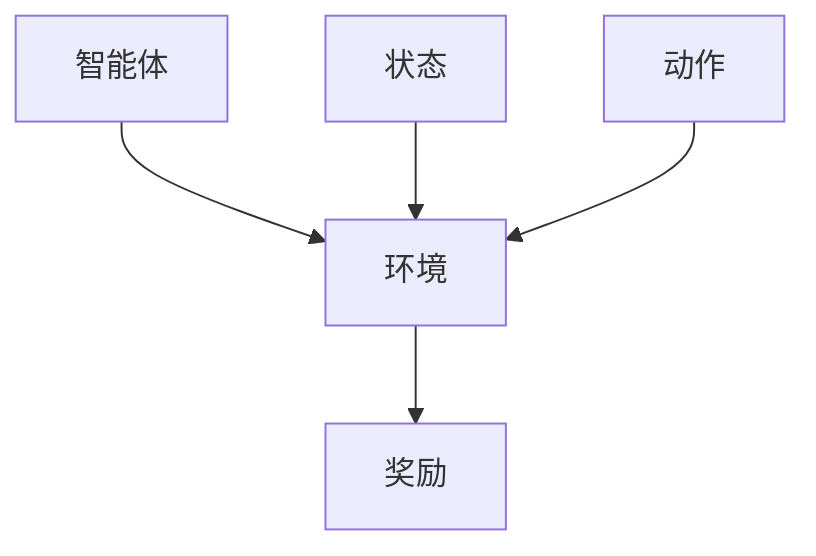
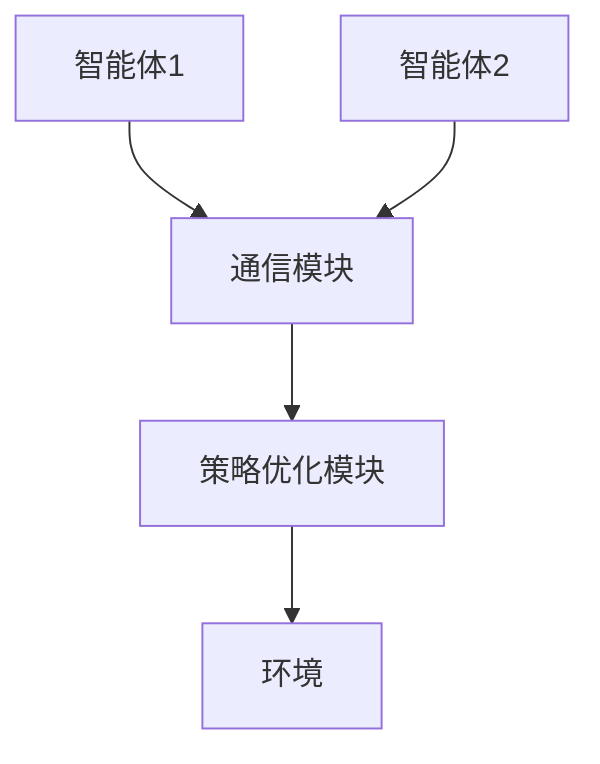

                 


# 多智能体强化学习：复杂环境下的AI Agent协作

> 关键词：多智能体强化学习，AI Agent协作，分布式智能体系统，博弈论，价值分解，异构多智能体

> 摘要：多智能体强化学习（Multi-Agent Reinforcement Learning, MARL）是人工智能领域的重要研究方向，旨在研究多个智能体在复杂环境下的协作与竞争问题。本文从基础概念出发，深入探讨多智能体强化学习的核心原理、算法实现、系统架构设计以及实际应用场景，帮助读者全面理解多智能体强化学习的技术本质和应用价值。

---

## 第一章: 多智能体强化学习概述

### 1.1 多智能体强化学习的定义与背景

多智能体强化学习（MARL）是一种人工智能技术，研究多个智能体在复杂环境中的协作与竞争问题。与单智能体强化学习不同，MARL需要同时考虑多个智能体的决策过程及其相互作用，是实现复杂任务的重要技术手段。

#### 1.1.1 多智能体强化学习的定义
多智能体强化学习是指多个智能体在一个共享环境中通过交互和协作，共同完成复杂任务的学习方法。智能体之间可以通过通信和协作实现目标，也可以通过竞争优化整体性能。

#### 1.1.2 多智能体强化学习与单智能体强化学习的区别
| 属性 | 单智能体强化学习 | 多智能体强化学习 |
|------|-----------------|------------------|
| 智能体数量 | 1               | ≥2              |
| 决策依赖 | 独立决策         | 互相影响         |
| 状态空间 | 单一状态         | 多状态          |
| 行动影响 | 单一影响         | 多重影响         |

#### 1.1.3 多智能体强化学习的应用场景
多智能体强化学习广泛应用于自动驾驶、机器人协作、游戏AI、分布式任务分配等领域。例如，在自动驾驶中，多个车辆需要协同决策以避免碰撞并提高交通效率。

### 1.2 多智能体强化学习的核心概念

#### 1.2.1 智能体的定义与特征
智能体（Agent）是指能够感知环境并采取行动以实现目标的实体。智能体具有以下特征：
- **自主性**：无需外部干预，自主决策。
- **反应性**：能够感知环境并实时调整策略。
- **协作性**：与其他智能体协作完成任务。
- **学习能力**：通过与环境交互学习优化策略。

#### 1.2.2 环境与状态空间
环境是智能体所处的外部世界，智能体通过感知环境状态来做出决策。状态空间包括所有可能的状态集合，例如在棋类游戏中，状态空间包括棋盘的每一种可能布局。

#### 1.2.3 动作与奖励机制
动作是智能体在某一状态下采取的具体行动，奖励是对智能体行为的反馈，用于指导智能体优化策略。

#### 1.2.4 协作与竞争关系
协作是指智能体之间为了共同目标而合作，竞争则是指智能体之间为了各自目标而博弈。在实际应用中，协作与竞争往往同时存在。

---

## 第二章: 多智能体强化学习的核心概念与联系

### 2.1 多智能体强化学习的核心概念

#### 2.1.1 智能体的属性与特征
智能体的属性包括感知能力、决策能力、学习能力和协作能力。通过这些属性，智能体可以在复杂环境中完成任务。

#### 2.1.2 环境的建模与表示
环境可以通过状态空间、动作空间和奖励函数来建模。例如，在机器人协作任务中，环境可以表示为物理空间和任务目标。

#### 2.1.3 状态与动作的对比
状态描述了环境的当前情况，动作是智能体对当前状态的响应。例如，在棋盘游戏中，状态是棋盘的布局，动作是移动棋子。

#### 2.1.4 协作与竞争的对比
协作强调智能体之间的合作，竞争强调智能体之间的博弈。例如，在自动驾驶中，车辆之间需要协作以避免碰撞，同时在交通流中也需要竞争以优化通行效率。

### 2.2 多智能体强化学习的核心概念对比

#### 2.2.1 智能体与环境的对比
智能体是主动决策的主体，环境是被动的背景。智能体通过感知环境并采取行动来改变环境状态。

#### 2.2.2 状态与动作的对比
状态是环境的描述，动作是智能体的响应。状态是输入，动作是输出。

#### 2.2.3 协作与竞争的对比
协作强调共同目标，竞争强调个体目标。协作需要协调，竞争需要平衡。

### 2.3 多智能体强化学习的ER实体关系图



---

## 第三章: 多智能体强化学习的算法原理

### 3.1 分布式多智能体强化学习算法

#### 3.1.1 分布式多智能体强化学习的基本原理
分布式多智能体强化学习（Distributed MARL）是一种通过多个智能体协作完成任务的方法。每个智能体独立学习，通过通信和协作优化整体策略。

#### 3.1.2 分布式多智能体强化学习的实现步骤
1. 初始化多个智能体。
2. 每个智能体感知环境并采取行动。
3. 智能体之间通信并共享信息。
4. 智能体更新策略以优化奖励。

#### 3.1.3 分布式多智能体强化学习的优缺点
- 优点：适用于大规模分布式系统，具有良好的扩展性。
- 缺点：通信开销大，容易出现协调问题。

### 3.2 价值分解方法

#### 3.2.1 价值分解的基本原理
价值分解（Value Decomposition）是一种通过分解整体价值为个体价值来优化多智能体协作的方法。

#### 3.2.2 价值分解的实现步骤
1. 将整体价值分解为个体价值。
2. 每个智能体优化自身的价值。
3. 整合个体价值以实现整体优化。

#### 3.2.3 价值分解的优缺点
- 优点：能够有效分解问题，提高协作效率。
- 缺点：分解方式可能影响整体最优性。

### 3.3 基于博弈论的协作方法

#### 3.3.1 博弈论在多智能体强化学习中的应用
博弈论通过分析智能体之间的策略互动，为多智能体协作提供理论支持。

#### 3.3.2 基于纳什均衡的协作算法
纳什均衡是一种稳定状态，其中每个智能体的策略都是最优反应。

#### 3.3.3 基于帕累托最优的协作算法
帕累托最优是一种整体最优状态，适用于多个智能体之间的协作优化。

### 3.4 异构多智能体系统

#### 3.4.1 异构多智能体系统的定义
异构多智能体系统是指由不同类型的智能体组成的系统，每个智能体具有不同的功能和能力。

#### 3.4.2 异构多智能体系统的协作机制
异构多智能体系统需要通过通信和协作实现任务分配和协同决策。

#### 3.4.3 异构多智能体系统的实现步骤
1. 定义智能体类型和功能。
2. 设计通信协议和协作机制。
3. 实现智能体之间的交互和协作。

---

## 第四章: 多智能体强化学习的数学模型与公式

### 4.1 多智能体强化学习的基本公式

#### 4.1.1 Q-learning算法的数学公式
Q-learning算法是一种经典的强化学习算法，其更新公式为：
$$Q(s, a) = Q(s, a) + \alpha (r + \gamma \max Q(s', a') - Q(s, a))$$
其中，$s$ 是状态，$a$ 是动作，$r$ 是奖励，$\gamma$ 是折扣因子，$\alpha$ 是学习率。

#### 4.1.2 多智能体协作的纳什均衡定义
纳什均衡是一种策略组合，其中每个智能体的策略都是对其他智能体策略的最优反应。

---

## 第五章: 系统分析与架构设计

### 5.1 项目背景与需求分析

#### 5.1.1 项目背景
本项目旨在研究多智能体强化学习在复杂环境中的协作问题。

#### 5.1.2 项目需求
- 实现多智能体协作。
- 设计高效的通信与协作机制。

### 5.2 系统功能设计

#### 5.2.1 系统功能模块
- 智能体模块：负责感知环境并采取行动。
- 通信模块：负责智能体之间的信息交换。
- 策略优化模块：负责更新智能体的策略。

#### 5.2.2 系统功能流程
1. 智能体感知环境并采取行动。
2. 智能体之间通信并共享信息。
3. 智能体优化策略以提高奖励。

### 5.3 系统架构设计

#### 5.3.1 系统架构图


#### 5.3.2 系统接口设计
- 智能体与通信模块的接口。
- 通信模块与策略优化模块的接口。
- 策略优化模块与环境的接口。

---

## 第六章: 项目实战

### 6.1 环境安装与配置

#### 6.1.1 环境需求
- Python 3.8+
- TensorFlow 2.0+
- gym库或其他强化学习库。

#### 6.1.2 安装依赖
```bash
pip install gym numpy tensorflow
```

### 6.2 系统核心实现

#### 6.2.1 智能体类的实现
```python
class Agent:
    def __init__(self, state_space, action_space):
        self.state_space = state_space
        self.action_space = action_space
        # 初始化策略网络
        self.policy = PolicyNetwork(state_space, action_space)
    
    def act(self, state):
        # 根据当前状态采取行动
        action = self.policy.act(state)
        return action
```

#### 6.2.2 通信模块的实现
```python
class CommunicationModule:
    def __init__(self, agents):
        self.agents = agents
    
    def send(self, sender, message):
        # 发送消息
        pass
    
    def receive(self, receiver, message):
        # 接收消息
        pass
```

### 6.3 代码解读与分析

#### 6.3.1 策略优化模块
策略优化模块负责更新智能体的策略以提高奖励。

#### 6.3.2 智能体协作的实现
智能体通过通信模块共享信息并协作完成任务。

### 6.4 案例分析与详细讲解

#### 6.4.1 案例分析
以多智能体协作的交通灯控制为例，展示如何通过多智能体强化学习实现交通流量优化。

#### 6.4.2 详细讲解
从环境建模、智能体设计到策略优化，详细讲解每一步的实现细节。

### 6.5 项目小结

#### 6.5.1 项目成果
通过本项目，我们成功实现了多智能体强化学习在复杂环境中的协作。

#### 6.5.2 项目总结
本项目展示了多智能体强化学习的技术优势和实际应用价值。

---

## 第七章: 最佳实践、小结、注意事项与拓展阅读

### 7.1 最佳实践 tips

- 合理设计通信机制，避免通信开销过大。
- 定期评估智能体的协作效果，及时优化策略。

### 7.2 小结

多智能体强化学习是一种复杂但强大的技术，通过多个智能体的协作可以实现更复杂的任务。

### 7.3 注意事项

- 多智能体协作需要考虑通信和协调问题。
- 多智能体系统的扩展性和鲁棒性需要重点关注。

### 7.4 拓展阅读

- 多智能体强化学习的经典论文。
- 相关技术书籍和课程。

---

## 作者：AI天才研究院/AI Genius Institute & 禅与计算机程序设计艺术 /Zen And The Art of Computer Programming

