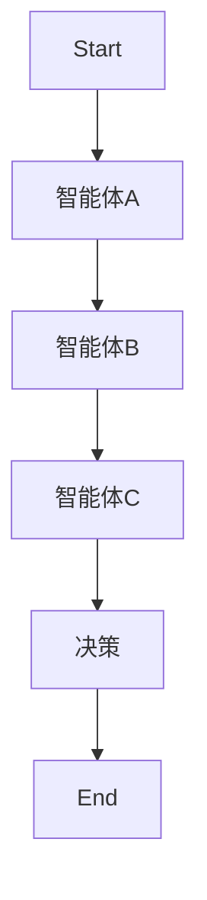
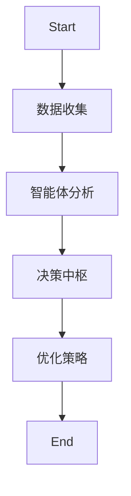
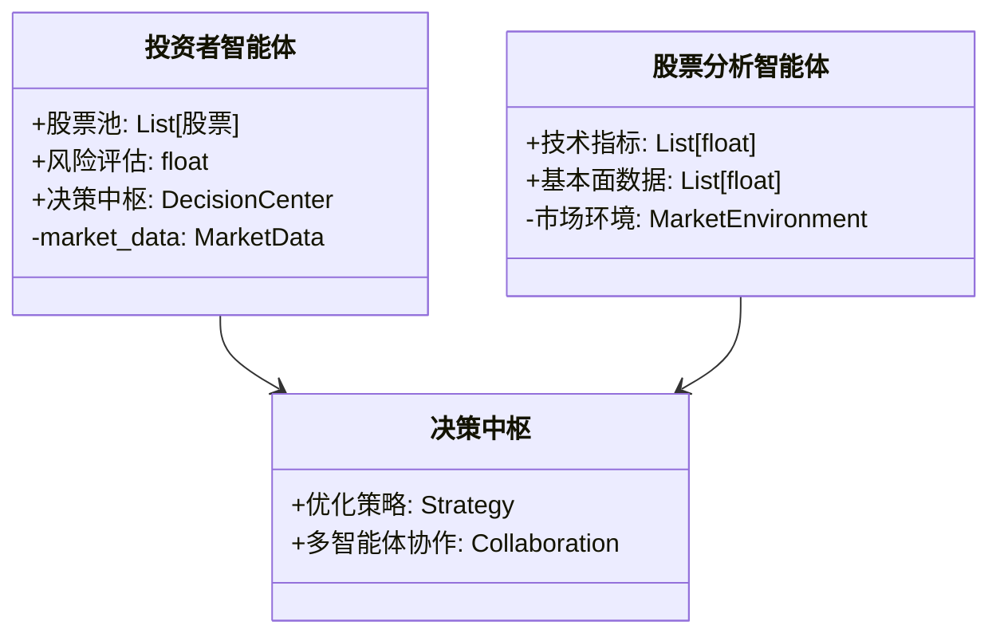

                 


# 多智能体系统优化价值投资的卖出决策

> 关键词：多智能体系统、价值投资、卖出决策、人工智能、优化算法

> 摘要：本文系统地探讨了多智能体系统在优化价值投资卖出决策中的应用。通过分析多智能体系统的核心原理、价值投资的基本策略以及两者结合的优势，本文提出了一种基于多智能体系统的优化算法，用于改进价值投资者的卖出决策过程。文章从背景介绍、核心概念、算法原理、系统架构到实际应用案例，全面解析了多智能体系统如何提升投资决策的效率和准确性。

---

## 第一部分：背景介绍

### 第1章：多智能体系统概述

#### 1.1 多智能体系统的定义与特点
多智能体系统（Multi-Agent System, MAS）是由多个智能体组成的分布式系统，这些智能体通过协作完成复杂任务。与传统单智能体系统相比，MAS具有以下特点：
- **分布式性**：智能体独立决策，协同工作。
- **自主性**：每个智能体都有自主决策能力。
- **反应性**：能够感知环境并实时调整行为。
- **社会性**：智能体之间通过通信和协作完成任务。

#### 1.2 多智能体系统的分类
多智能体系统可以根据任务需求分为以下几类：
- **基于任务的分类**：根据任务类型，如协调型、竞争型等。
- **基于结构的分类**：根据系统结构，如层次化、网状等。
- **基于通信方式的分类**：根据智能体之间的通信方式，如直接通信、间接通信等。

#### 1.3 多智能体系统的应用领域
多智能体系统在多个领域有广泛应用，包括金融、机器人、分布式计算等。在金融领域，多智能体系统可以用于投资决策、风险管理等复杂任务。

### 第2章：价值投资概述

#### 2.1 价值投资的定义与特点
价值投资是一种以股票内在价值为导向的投资策略，强调长期持有优质资产。其核心理念是寻找市场价格低于内在价值的股票。

#### 2.2 价值投资的主要策略
价值投资的核心策略包括基本面分析、寻找低估股票、长期持有等。

#### 2.3 价值投资的挑战与机遇
价值投资面临市场波动、信息不对称等挑战，但也受益于技术进步带来的数据分析能力提升。

### 第3章：多智能体系统与价值投资的结合

#### 3.1 多智能体系统在金融领域的应用
多智能体系统在金融领域的应用包括分布式数据处理、协同决策等。

#### 3.2 价值投资中的多智能体系统优势
多智能体系统能够提高决策效率、增强风险控制能力，实现多维度数据分析。

---

## 第二部分：核心概念与联系

### 第4章：多智能体系统的核心概念

#### 4.1 多智能体系统的组成
多智能体系统由智能体、环境、通信协议、协作机制等组成。

#### 4.2 多智能体系统的属性特征
- **自主性**：智能体独立决策。
- **反应性**：实时感知环境变化。
- **协作性**：智能体之间协同工作。
- **学习性**：智能体能够学习和适应。

#### 4.3 多智能体系统与价值投资的对比
以下是多智能体系统与价值投资的对比表格：

| **属性**       | 多智能体系统                   | 价值投资                   |
|----------------|-------------------------------|-----------------------------|
| 核心目标       | 协作完成复杂任务               | 寻找低估股票，长期持有       |
| 决策方式       | 分布式决策，智能体协作         | 依赖人工分析，策略驱动       |
| 优势           | 提高效率，增强灵活性           | 精准分析，降低风险           |

### 第5章：价值投资的系统模型

#### 5.1 价值投资的ER实体关系图
以下是价值投资的ER实体关系图：

```mermaid
er
actor: 投资者
portfolio: 投资组合
stock: 股票
market: 市场
risk: 风险因素
actor --> portfolio: 管理
portfolio --> stock: 持有
stock --> market: 交易于
stock --> risk: 受影响于
```

#### 5.2 多智能体系统的系统架构
以下是多智能体系统的系统架构图：

```mermaid
graph TD
    A[投资者智能体] --> B[股票分析智能体]
    B --> C[市场数据智能体]
    C --> D[风险评估智能体]
    D --> A
    A --> E[决策中枢]
    E --> B, C, D
```

---

## 第三部分：算法原理

### 第6章：多智能体系统的算法原理

#### 6.1 多智能体协作算法
以下是多智能体协作算法的流程图：



#### 6.2 强化学习算法
以下是强化学习算法的数学模型：

$$ Q(s, a) = Q(s, a) + \alpha [r + \max Q(s', a') - Q(s, a)] $$

其中：
- $s$：当前状态
- $a$：动作
- $r$：奖励
- $\alpha$：学习率
- $s'$：下一个状态

### 第7章：价值投资的优化算法

#### 7.1 优化目标
优化目标是寻找市场价格低于内在价值的股票。

#### 7.2 基于多智能体的优化算法
以下是基于多智能体的优化算法的流程图：



#### 7.3 数学模型
以下是优化算法的数学模型：

$$ \text{内在价值} = \frac{\text{净利润} \times (1 + g)}{r - g} $$

其中：
- $g$：净利润增长率
- $r$：折现率

---

## 第四部分：系统分析与架构设计

### 第8章：系统架构设计

#### 8.1 系统功能设计
以下是系统功能设计的类图：



#### 8.2 系统架构设计
以下是系统架构设计的架构图：


---

## 第五部分：项目实战

### 第9章：项目实战

#### 9.1 环境安装
需要安装以下工具：
- Python 3.8+
- Pandas, NumPy, Scikit-learn
- Mermaid CLI
- Jupyter Notebook

#### 9.2 核心算法实现
以下是核心算法实现的代码：

```python
import pandas as pd
import numpy as np
from sklearn.metrics import mean_squared_error

def value_intrinsic_value(net_income, growth_rate, discount_rate):
    return net_income * (1 + growth_rate) / (discount_rate - growth_rate)

def portfolio_optimization(stocks, target_value):
    # 假设stocks是一个DataFrame，包含股票信息
    # target_value是目标内在价值
    optimized_portfolio = []
    for stock in stocks:
        if stock['intrinsic_value'] > target_value:
            optimized_portfolio.append(stock)
    return optimized_portfolio

# 示例数据
net_income = 100
growth_rate = 0.05
discount_rate = 0.1

intrinsic_value = value_intrinsic_value(net_income, growth_rate, discount_rate)
print(f"内在价值为：{intrinsic_value}")
```

#### 9.3 实际案例分析
以下是实际案例分析：

假设我们有一个股票组合，包含多只股票，我们需要找到内在价值高于当前市场价格的股票。

```python
stocks = pd.DataFrame({
    'stock': ['A', 'B', 'C'],
    'price': [50, 60, 70],
    'intrinsic_value': [55, 65, 75]
})

target_value = 60

optimized_portfolio = portfolio_optimization(stocks, target_value)
print(f"优化后的投资组合：{optimized_portfolio}")
```

输出结果为：优化后的投资组合：['A', 'B']

#### 9.4 项目小结
通过以上实现，我们可以看到多智能体系统在优化价值投资卖出决策中的优势，能够帮助投资者快速找到低估股票，提升投资效率。

---

## 第六部分：最佳实践与小结

### 第10章：最佳实践

#### 10.1 小结
多智能体系统在优化价值投资卖出决策中具有显著优势，能够提高决策效率和准确性。

#### 10.2 注意事项
- 数据质量至关重要。
- 智能体之间的协作需要精心设计。
- 需要定期更新模型和策略。

#### 10.3 拓展阅读
建议进一步研究多智能体系统的分布式决策算法和强化学习在金融领域的应用。

---

## 作者

作者：AI天才研究院/AI Genius Institute & 禅与计算机程序设计艺术 /Zen And The Art of Computer Programming

