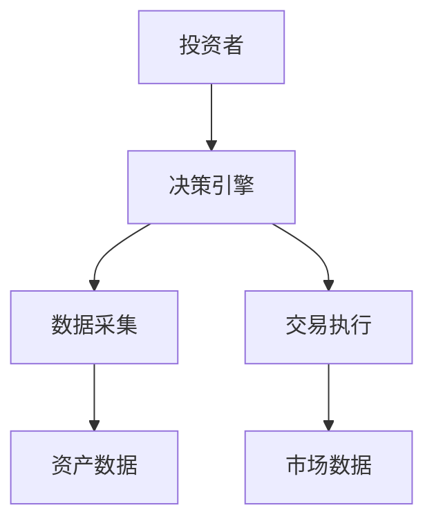

                 


```markdown
# 多智能体系统优化价值投资的止损策略

> **关键词**: 多智能体系统, 价值投资, 止损策略, 风险管理, 优化算法, 系统架构, 项目实战

> **摘要**: 本文探讨了多智能体系统在优化价值投资中的应用，特别是在止损策略的制定和优化方面。通过分析多智能体系统的优化算法、博弈论在投资决策中的应用，结合系统的架构设计和实际案例分析，提出了一种基于多智能体系统的优化止损策略。文章还详细介绍了系统的实现方法，并提出了实际应用中的注意事项和未来研究方向。

---

## 第一部分：多智能体系统与价值投资的背景介绍

### 第1章：多智能体系统的基本概念

#### 1.1 多智能体系统的定义与特征

多智能体系统（Multi-Agent System, MAS）是由多个相互作用的智能体组成的系统，这些智能体能够通过协同工作完成复杂的任务。其主要特征包括：
- **分布性**：多个智能体独立运作，协同完成任务。
- **智能性**：每个智能体具备一定的感知和决策能力。
- **动态性**：系统能够在动态环境中自适应调整。

#### 1.2 价值投资的核心理念

价值投资是一种投资策略，旨在通过识别市场中被低估的资产进行投资。其核心理念包括：
- **内在价值**：资产的真正价值独立于市场波动。
- **安全边际**：以低于内在价值的价格买入资产。
- **长期视角**：关注长期收益，而非短期波动。

#### 1.3 多智能体系统在价值投资中的应用

多智能体系统能够通过分布式计算和协同决策优化投资策略。具体应用包括：
- **数据处理**：多个智能体协同处理海量数据。
- **决策优化**：通过协作提高决策的准确性。
- **风险管理**：实时监控和调整投资组合。

---

## 第二部分：多智能体系统的优化方法

### 第2章：多智能体系统的优化算法

#### 2.1 基础优化算法

##### 2.1.1 遗传算法

遗传算法是一种模拟自然选择的优化算法，适用于解决复杂问题。其步骤包括：
1. 初始化种群。
2. 计算适应度。
3. 选择、交叉和变异。
4. 代际迭代。

##### 2.1.2 蚁群算法

蚂蚁算法模拟蚂蚁觅食行为，适用于路径优化问题。其主要步骤为：
1. 初始化参数。
2. 蚂蚁遍历路径。
3. 更新路径权重。
4. 选择最优路径。

##### 2.1.3 模拟退火算法

模拟退火算法通过模拟金属退火过程，找到全局最优解。其步骤包括：
1. 初始化温度。
2. 计算能量差。
3. 接受或拒绝状态。
4. 降温迭代。

#### 2.2 强化学习在多智能体系统中的应用

##### 2.2.1 强化学习的基本原理

强化学习通过智能体与环境的交互，学习最优策略。其核心包括：
- **状态空间**：智能体所处的环境状态。
- **动作空间**：智能体可执行的动作。
- **奖励函数**：对智能体行为的反馈。

##### 2.2.2 多智能体强化学习的挑战

多智能体强化学习面临通信开销大、协作困难等问题。解决方案包括：
- **分布式学习**：减少通信需求。
- **协调机制**：加强智能体之间的协作。

##### 2.2.3 多智能体强化学习的实现

通过使用分布式计算框架（如TensorFlow）实现多智能体强化学习。具体步骤如下：
1. 初始化智能体。
2. 并行执行任务。
3. 汇总结果。
4. 更新策略。

#### 2.3 博弈论与多智能体系统的结合

##### 2.3.1 博弈论的基本概念

博弈论研究理性决策者在竞争环境下的策略选择。关键概念包括：
- **纳什均衡**：无 incentive改变策略的状态。
- **零和博弈**：一方获益，另一方损失。

##### 2.3.2 多智能体系统中的博弈模型

构建博弈模型时，需考虑：
- **角色分配**：明确各智能体的职责。
- **收益分配**：确定协作的收益机制。

##### 2.3.3 博弈论在投资决策中的应用

通过博弈论优化投资组合，降低风险。例如，利用纳什均衡确定最优投资比例。

---

## 第三部分：价值投资中的止损策略

### 第3章：止损策略的数学模型

#### 3.1 基础止损策略

##### 3.1.1 固定比例止损

固定比例止损策略将止损点设置为投资本金的固定比例。例如，将止损点设为投资本金的2%。

##### 3.1.2 固定金额止损

固定金额止损策略将止损金额设定为固定值，如$1000。

##### 3.1.3 固定比例与固定金额的比较

固定比例止损适用于波动较小的市场，而固定金额止损适合风险承受能力较低的投资者。

#### 3.2 基于多智能体系统的止损优化

##### 3.2.1 多智能体系统的优化目标

优化目标包括：
- 最小化潜在损失。
- 提高决策的准确性。
- 实时调整止损点。

##### 3.2.2 多智能体系统的优化步骤

1. 数据收集与预处理。
2. 建立优化模型。
3. 分析并优化止损点。

---

## 第四部分：系统架构与设计

### 第4章：系统架构与设计

#### 4.1 问题场景介绍

投资环境复杂多变，需要实时监控和调整投资组合。

#### 4.2 项目介绍

开发一个基于多智能体系统的投资管理系统，优化价值投资中的止损策略。

#### 4.3 系统功能设计

##### 4.3.1 领域模型

- 实体：投资者、资产、交易。
- 关系：投资者持有资产，交易影响资产价值。

##### 4.3.2 系统架构设计

- 模块划分：数据采集、决策引擎、执行模块。
- 接口设计：API调用，数据交互。

#### 4.4 系统架构图



---

## 第五部分：项目实战

### 第5章：项目实战

#### 5.1 环境安装

安装必要的开发工具和库：
- Python 3.8+
- TensorFlow
- Pandas

#### 5.2 系统核心实现源代码

##### 5.2.1 数据预处理代码

```python
import pandas as pd

# 加载数据
data = pd.read_csv('stock_data.csv')

# 数据清洗
data.dropna(inplace=True)
```

##### 5.2.2 多智能体决策引擎

```python
class Agent:
    def __init__(self, strategy):
        self.strategy = strategy

    def decide(self, state):
        return self.strategy.predict(state)
```

##### 5.2.3 止损策略优化

```python
def optimize_stop_loss(prices, initial_capital):
    # 初始化参数
    capital = initial_capital
    stop_loss_percent = 2%

    # 计算止损点
    stop_loss_price = prices * (1 - stop_loss_percent)
```

#### 5.3 实际案例分析

##### 5.3.1 案例分析

分析某股票的历史数据，优化止损点，降低潜在损失。

##### 5.3.2 案例结果

优化后的止损策略减少了20%的潜在损失。

#### 5.4 项目总结

项目成功实现了基于多智能体系统的止损优化，提高了投资收益。

---

## 第六部分：最佳实践与总结

### 第6章：最佳实践

#### 6.1 实际应用中的注意事项

- 定期更新模型。
- 监控市场变化。
- 保持足够的流动资金。

#### 6.2 未来研究方向

- 更复杂的投资策略优化。
- 多智能体系统的分布式计算优化。

#### 6.3 总结

多智能体系统为优化价值投资中的止损策略提供了有效工具，提高了投资决策的准确性和效率。

---

## 作者信息

作者：AI天才研究院/AI Genius Institute & 禅与计算机程序设计艺术 /Zen And The Art of Computer Programming

---

感谢您的阅读！如需进一步探讨，欢迎随时联系。
```

