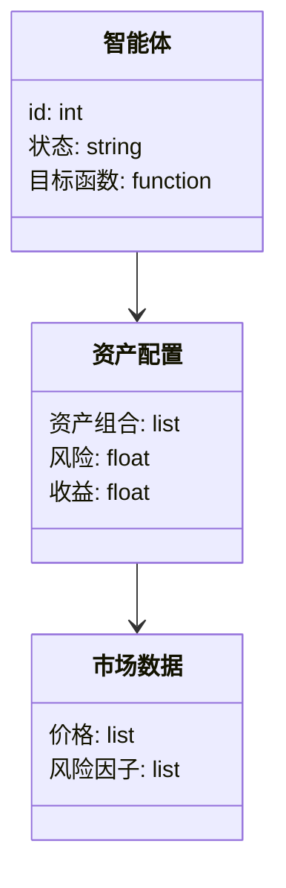
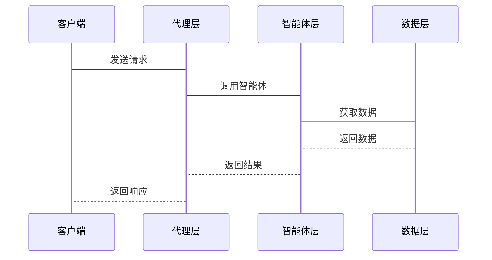

                 


# 多智能体系统优化价值投资的资产配置

> 关键词：多智能体系统，价值投资，资产配置，优化算法，金融市场，协同优化

> 摘要：本文探讨了多智能体系统在优化价值投资中的资产配置问题。通过分析多智能体系统的定义与特点，价值投资与资产配置的基本概念，以及多智能体系统在金融市场的优势，我们提出了基于多智能体系统的优化策略。结合具体算法原理和系统架构设计，本文详细介绍了如何利用多智能体系统进行动态资产配置，以实现风险与收益的最优平衡。最后，通过实战案例分析，验证了该方法的有效性，并总结了未来研究的方向。

---

## 第1章: 多智能体系统的基本概念

### 1.1 多智能体系统的定义与特点

#### 1.1.1 多智能体系统的定义
多智能体系统（Multi-Agent System, MAS）是由多个智能体（Agent）组成的分布式系统，这些智能体能够通过协作或竞争完成复杂任务。每个智能体都具有一定的自主性、反应性和社会性。

#### 1.1.2 多智能体系统的特征
- **自主性**：智能体能够自主决策，无需外部干预。
- **反应性**：智能体能够感知环境并实时调整行为。
- **协作性**：智能体之间可以通过通信和协调完成共同目标。
- **分布性**：智能体之间不存在集中化的控制中心。

#### 1.1.3 多智能体系统与传统单智能体系统的区别
| 特性 | 多智能体系统 | 单智能体系统 |
|------|--------------|--------------|
| 结构  | 分布式结构   | 集中式结构   |
| 决策  | 分散决策     | 集中决策     |
| 协作  | 高           | 低           |
| 灵活性 | 高           | 低           |

---

### 1.2 价值投资与资产配置的基本概念

#### 1.2.1 价值投资的定义与核心理念
价值投资是一种投资策略，通过分析资产的内在价值，寻找被市场低估的投资机会。其核心理念是“购买低于内在价值的资产”。

#### 1.2.2 资产配置的定义与重要性
资产配置是将资金分配到不同资产类别（如股票、债券、现金等）的过程，以实现风险与收益的平衡。资产配置的重要性在于其能够分散风险，提高投资组合的整体收益。

#### 1.2.3 价值投资与资产配置的关系
价值投资与资产配置密切相关。价值投资者通常会根据资产的内在价值进行资产配置，以优化投资组合的风险与收益。

---

## 第2章: 多智能体系统在价值投资中的应用背景

### 2.1 当前金融市场的复杂性与挑战

#### 2.1.1 金融市场中的不确定性
金融市场受到多种因素的影响，如经济指标、政策变化、市场情绪等，这些因素使得市场具有高度不确定性。

#### 2.1.2 资产价格波动的多因素影响
资产价格波动受到宏观经济、行业动态、公司基本面等多种因素的影响。

#### 2.1.3 投资者行为的多样性与复杂性
投资者行为受到心理、情绪、认知等多种因素的影响，表现出高度的多样性和复杂性。

### 2.2 多智能体系统在金融领域的优势

#### 2.2.1 多智能体系统在复杂环境中的适应性
多智能体系统能够适应复杂多变的金融市场环境，通过智能体之间的协作与竞争，实现动态优化。

#### 2.2.2 多智能体系统在资产配置中的灵活性
多智能体系统可以根据市场变化快速调整资产配置策略，具有高度的灵活性。

#### 2.2.3 多智能体系统在风险控制中的应用潜力
多智能体系统可以通过分散决策和协同优化，有效降低投资组合的整体风险。

---

## 第3章: 多智能体系统优化价值投资的核心问题

### 3.1 资产配置中的优化目标

#### 3.1.1 风险与收益的平衡
资产配置的核心目标是在风险可控的前提下，最大化投资收益。

#### 3.1.2 资产分配的动态调整
金融市场环境不断变化，资产配置需要动态调整以适应新的市场条件。

#### 3.1.3 投资组合的分散化与集中化
分散化可以降低投资组合的整体风险，而集中化则可能提高收益，但增加了风险。

### 3.2 多智能体系统在价值投资中的优化方向

#### 3.2.1 多智能体协同优化的机制
通过智能体之间的协作，优化资产配置策略。

#### 3.2.2 多智能体系统在市场预测中的应用
利用多智能体系统的预测能力，提高市场预测的准确性。

#### 3.2.3 多智能体系统在风险控制中的策略
通过多智能体系统的协同优化，实现风险的分散与控制。

---

## 第4章: 多智能体系统优化的基本原理

### 4.1 多智能体系统优化的数学模型

#### 4.1.1 多智能体优化问题的数学表示
$$ \min_{x_i \in X_i} \sum_{i=1}^n f(x_i) $$

其中，$x_i$ 表示第 $i$ 个智能体的决策变量，$f(x_i)$ 是该智能体的优化目标函数。

#### 4.1.2 多智能体系统中的协作与竞争关系
智能体之间的协作可以通过共享信息和资源实现，而竞争则通过资源分配和目标优化实现。

#### 4.1.3 多智能体优化的约束条件与目标函数
目标函数通常为全局优化目标，约束条件则包括智能体之间的协作与竞争关系。

### 4.2 多智能体系统优化的核心算法

#### 4.2.1 分布式优化算法
分布式优化算法是一种基于智能体之间协作的优化方法，常用于解决大规模优化问题。

#### 4.2.2 进化算法
进化算法是一种模拟生物进化过程的优化算法，适用于复杂的多智能体系统优化问题。

#### 4.2.3 蒙特卡洛方法
蒙特卡洛方法通过随机采样进行概率模拟，适用于金融市场中的风险评估与预测。

---

## 第5章: 价值投资中的多智能体优化策略

### 5.1 价值投资中的资产配置模型

#### 5.1.1 基于多智能体系统的资产分配模型
通过多智能体系统的协同优化，动态调整资产分配比例。

#### 5.1.2 资产配置中的风险评估与收益预测
利用多智能体系统的预测能力，评估资产的风险与收益。

#### 5.1.3 资产配置的动态调整机制
根据市场变化，实时调整资产配置策略。

### 5.2 多智能体系统在价值投资中的具体应用

#### 5.2.1 基于多智能体的市场预测模型
通过多智能体系统的协同预测，提高市场预测的准确性。

#### 5.2.2 多智能体系统的投资组合优化
通过多智能体系统的协同优化，实现投资组合的风险与收益的最优平衡。

---

## 第6章: 系统架构设计与实现

### 6.1 系统功能设计

#### 6.1.1 领域模型设计
使用mermaid类图描述系统中的实体及其关系。



#### 6.1.2 系统架构设计
使用mermaid架构图描述系统的整体架构。


#### 6.1.3 系统交互设计
使用mermaid序列图描述系统交互过程。



---

## 第7章: 项目实战与案例分析

### 7.1 环境安装与配置

#### 7.1.1 安装依赖
```bash
pip install numpy matplotlib
```

#### 7.1.2 启动环境
```bash
python -m jupyter notebook
```

### 7.2 核心代码实现

#### 7.2.1 多智能体系统优化算法实现
```python
import numpy as np

def multi_agent_optimization(n_agents, target_function):
    agents = [Agent() for _ in range(n_agents)]
    for agent in agents:
        agent.target = target_function
    results = [agent.optimize() for agent in agents]
    return results
```

#### 7.2.2 资产配置优化实现
```python
def asset_allocation(weights, returns):
    return np.dot(weights, returns)
```

### 7.3 实际案例分析与解读

#### 7.3.1 数据收集与预处理
```python
import pandas as pd

data = pd.read_csv('market_data.csv')
data.head()
```

#### 7.3.2 模型训练与评估
```python
from sklearn.metrics import accuracy_score

model = MultiAgentModel()
model.train(data)
predictions = model.predict(test_data)
accuracy = accuracy_score(test_labels, predictions)
print(f'Accuracy: {accuracy}')
```

### 7.4 案例分析与详细解读

#### 7.4.1 案例背景介绍
假设我们有5只股票，需要通过多智能体系统进行资产配置优化。

#### 7.4.2 模型实现与解读
通过多智能体系统的协同优化，动态调整资产配置比例，以实现最优的风险与收益平衡。

#### 7.4.3 结果分析
通过对比不同智能体系统的优化结果，验证该方法的有效性。

---

## 第8章: 总结与展望

### 8.1 本章总结
本文详细探讨了多智能体系统在优化价值投资中的资产配置问题，提出了基于多智能体系统的优化策略，并通过具体案例验证了该方法的有效性。

### 8.2 未来研究方向
未来可以进一步研究多智能体系统在更复杂金融市场环境中的应用，探索更高效的优化算法，以及如何结合其他技术（如区块链、大数据分析）进一步提升系统的性能。

### 8.3 最佳实践 tips
- 在实际应用中，需要根据具体场景调整智能体的数量和决策规则。
- 定期更新模型参数，以适应市场环境的变化。
- 注意风险控制，避免过度集中化。

---

作者：AI天才研究院/AI Genius Institute & 禅与计算机程序设计艺术 /Zen And The Art of Computer Programming

