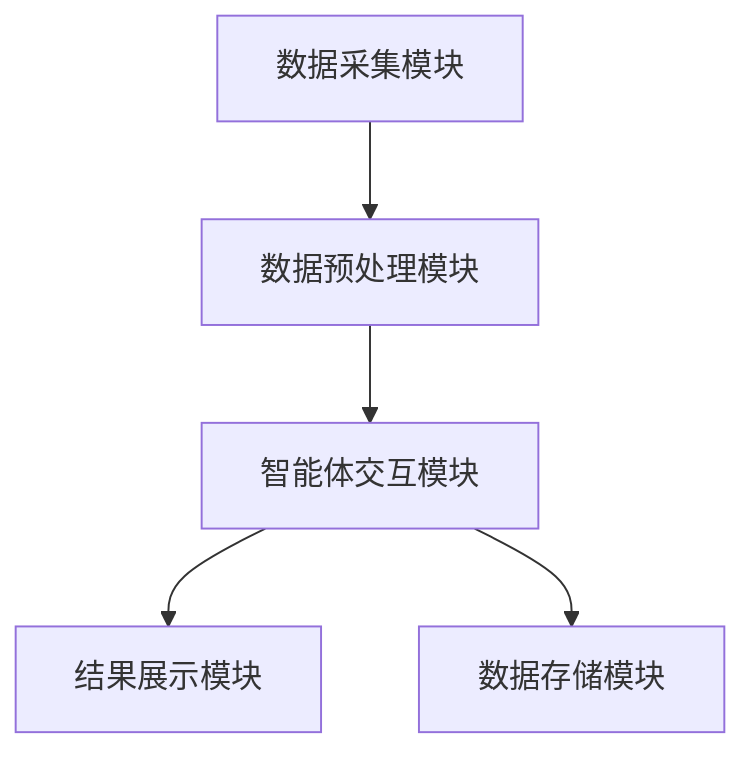

                 


# 多智能体系统分析全球资金流向

> 关键词：多智能体系统，资金流向分析，博弈论，强化学习，系统架构设计，全球金融分析

> 摘要：本文深入探讨了多智能体系统在分析全球资金流向中的应用。通过介绍多智能体系统的基本概念、数学模型、算法实现以及系统架构设计，结合实际案例分析，展示了如何利用多智能体系统来理解复杂的全球资金流动规律。文章内容涵盖背景介绍、核心概念、算法原理、系统设计和项目实战，旨在为读者提供全面而深入的技术指导。

---

# 目录

1. [多智能体系统与全球资金流向分析基础](#多智能体系统与全球资金流向分析基础)
2. [多智能体系统的数学模型与算法](#多智能体系统的数学模型与算法)
3. [全球资金流向分析的系统架构设计](#全球资金流向分析的系统架构设计)
4. [全球资金流向分析的项目实战](#全球资金流向分析的项目实战)
5. [结论与展望](#结论与展望)

---

## 1. 多智能体系统与全球资金流向分析基础

### 1.1 多智能体系统的定义与特点

#### 1.1.1 多智能体系统的定义
多智能体系统（Multi-Agent System，MAS）是由多个智能体（Agent）组成的分布式系统，这些智能体通过协作或竞争完成特定目标。智能体是具有感知、决策和行动能力的实体，可以是软件程序或物理设备。

#### 1.1.2 多智能体系统的核心特征
- **分布式性**：智能体分布在网络中，不存在集中控制节点。
- **自主性**：每个智能体都具有自主决策能力。
- **协作性**：智能体之间通过协作完成复杂任务。
- **动态性**：系统环境和智能体状态可能随时间变化。

#### 1.1.3 多智能体系统与传统单智能体系统的对比
| 特性         | 多智能体系统                   | 单智能体系统                 |
|--------------|-------------------------------|-----------------------------|
| 结构         | 分布式，多个智能体协作         | 集中式，单个智能体完成任务   |
| 可扩展性     | 高                           | 低                         |
| 灵活性       | 高                           | 低                         |
| 应用场景     | 适合复杂、动态的环境           | 适合简单、静态的环境         |

### 1.2 全球资金流向分析的背景与意义

#### 1.2.1 全球资金流向分析的定义
全球资金流向分析是指通过研究资金在全球范围内的流动情况，揭示资金在不同地区、行业和金融工具之间的转移规律。

#### 1.2.2 全球资金流向分析的重要性
- **经济预测**：通过分析资金流向，可以预测经济趋势和市场波动。
- **风险管理**：识别资金流动中的风险点，制定有效的风险管理策略。
- **政策制定**：为政府和金融机构提供数据支持，优化资源配置。

#### 1.2.3 多智能体系统在资金流向分析中的优势
- **实时性**：多智能体系统可以实时处理大量数据，快速响应市场变化。
- **分布式计算**：多个智能体协同工作，提高计算效率和准确性。
- **自适应性**：系统可以根据市场环境动态调整分析策略。

### 1.3 多智能体系统的核心要素

#### 1.3.1 智能体的定义与属性
智能体是多智能体系统的基本单元，具有以下属性：
- **身份（Identity）**：智能体的唯一标识。
- **知识（Knowledge）**：智能体拥有的信息和数据。
- **目标（Goal）**：智能体的行为动机。
- **能力（Capability）**：智能体执行任务的能力。
- **效用函数（Utility Function）**：衡量智能体目标实现程度的函数。

#### 1.3.2 智能体之间的交互关系
智能体之间的交互可以通过以下方式进行：
- **直接通信**：智能体之间通过消息传递信息。
- **间接交互**：通过共享数据库或中间件进行交互。
- **协调机制**：利用协调算法实现智能体之间的协作。

#### 1.3.3 多智能体系统的整体架构
多智能体系统的整体架构通常包括以下部分：
- **环境（Environment）**：智能体所处的外部世界，包含数据源和目标。
- **智能体（Agent）**：具有感知、决策和行动能力的实体。
- **通信层（Communication Layer）**：支持智能体之间的信息交换。
- **协调层（Coordination Layer）**：实现智能体之间的协作与同步。

---

## 2. 多智能体系统的数学模型与算法

### 2.1 多智能体系统中的博弈论模型

#### 2.1.1 博弈论基础
博弈论是研究理性主体之间策略互动的数学理论。在多智能体系统中，博弈论常用于描述智能体之间的竞争与合作。

#### 2.1.2 博弈论在多智能体系统中的应用
- **纳什均衡**：在博弈论中，纳什均衡是一个策略组合，使得每个智能体在不改变自身策略的情况下无法通过单方面改变策略而获益。
- **囚徒困境**：一个经典的博弈论场景，用于说明合作与背叛的动态。

#### 2.1.3 纳什均衡与协调问题
纳什均衡是多智能体系统中的一个重要概念，但实际应用中常常面临“协调问题”，即多个纳什均衡的存在可能导致智能体无法达成一致。

### 2.2 多智能体系统的强化学习算法

#### 2.2.1 强化学习基础
强化学习是一种机器学习范式，通过智能体与环境的交互，学习最优策略以最大化累计奖励。

#### 2.2.2 多智能体强化学习的挑战与解决方案
- **多智能体协同问题**：多个智能体需要通过协作实现共同目标。
- **策略协调问题**：如何确保智能体之间的策略协调一致。
- **通信机制**：通过通信机制实现智能体之间的信息共享和策略调整。

#### 2.2.3 基于强化学习的资金流向预测模型
基于强化学习的资金流向预测模型可以通过以下步骤实现：
1. **状态表示**：将市场数据（如价格、成交量等）表示为状态。
2. **动作空间**：定义智能体的可能操作（如买入、卖出）。
3. **奖励函数**：定义智能体的收益或损失作为奖励。

### 2.3 多智能体系统的数学公式与模型

#### 2.3.1 多智能体系统的状态表示
状态表示可以是市场数据的某种特征向量，例如：
$$
S = [p_1, p_2, \ldots, p_n]
$$
其中，$p_i$表示第$i$个市场的价格。

#### 2.3.2 多智能体系统的动作空间
动作空间可以定义为智能体的可能操作，例如：
$$
A = \{ \text{买入}, \text{卖出}, \text{持有} \}
$$

#### 2.3.3 多智能体系统的奖励函数
奖励函数通常表示为：
$$
R = \sum_{i=1}^n r_i
$$
其中，$r_i$是第$i$个智能体获得的奖励。

---

## 3. 全球资金流向分析的系统架构设计

### 3.1 系统架构概述

#### 3.1.1 系统目标与范围
系统的目标是实时分析全球资金流向，提供资金流动的实时监控和预测。

#### 3.1.2 系统功能模块划分
系统功能模块包括：
- 数据采集模块
- 数据预处理模块
- 智能体交互模块
- 结果展示模块

#### 3.1.3 系统架构的分层设计
系统架构通常分为以下层次：
- 数据层：存储原始数据和处理后的数据。
- 智能体层：实现智能体的行为和交互。
- 控制层：协调智能体的行动和数据流。

### 3.2 数据流与交互流程

#### 3.2.1 数据输入与处理
数据输入包括金融市场数据（如股票价格、成交量）和其他相关信息（如新闻、政策变化）。

#### 3.2.2 智能体之间的交互流程
智能体之间通过通信层进行信息交换，例如：
1. 智能体A发送市场数据给智能体B。
2. 智能体B根据接收到的数据做出决策。
3. 智能体B将决策结果反馈给智能体A。

#### 3.2.3 系统输出与结果展示
系统输出包括资金流向的实时监控和预测结果，可以通过图表或报告的形式展示。

### 3.3 系统架构的Mermaid图



---

## 4. 全球资金流向分析的项目实战

### 4.1 环境安装与配置

#### 4.1.1 开发环境的选择
推荐使用Python作为开发语言，配合以下库：
- `numpy`：用于数值计算。
- `pandas`：用于数据分析。
- `matplotlib`：用于数据可视化。
- `scikit-learn`：用于机器学习算法。

#### 4.1.2 依赖库的安装
安装以下Python库：
```bash
pip install numpy pandas matplotlib scikit-learn
```

#### 4.1.3 数据源的获取与预处理
可以从金融数据供应商（如Yahoo Finance）获取数据，并进行清洗和标准化。

### 4.2 系统核心实现

#### 4.2.1 智能体的设计与实现
以下是一个简单的智能体实现示例：
```python
class Agent:
    def __init__(self, id):
        self.id = id
        self.position = 0  # 0表示持有现金，1表示持有资产
        self.capital = 10000  # 初始资金

    def decide(self, market_data):
        # 根据市场数据做出决策
        if market_data['price'] > market_data['moving_average']:
            return 'buy'
        else:
            return 'sell'

    def act(self, action, market_data):
        if action == 'buy':
            self.position = 1
            self.capital -= market_data['price'] * 10
        elif action == 'sell':
            self.position = 0
            self.capital += market_data['price'] * 10
```

#### 4.2.2 交互流程的实现
智能体之间的交互可以通过以下方式实现：
```python
def interact(agent1, agent2, market_data):
    action1 = agent1.decide(market_data)
    action2 = agent2.decide(market_data)
    if action1 == 'buy' and action2 == 'sell':
        # 网络中的交易
        agent1.act(action1, market_data)
        agent2.act(action2, market_data)
```

#### 4.2.3 结果展示与分析
通过可视化工具展示资金流向的实时变化，例如使用`matplotlib`绘制资金流动的图表。

### 4.3 实际案例分析

#### 4.3.1 数据源与预处理
假设我们使用的是全球主要股票市场的数据，包括纽约证券交易所（NYSE）、纳斯达克（NASDAQ）、伦敦证券交易所（LSE）等。

#### 4.3.2 智能体的协同与竞争
在实际案例中，智能体可以协同工作，共同预测市场趋势，或者在竞争中寻找最佳策略。

---

## 5. 结论与展望

### 5.1 研究结论
多智能体系统在分析全球资金流向中具有显著优势，尤其是在实时性和分布式计算方面。通过博弈论和强化学习的结合，可以实现更准确的资金流动预测。

### 5.2 未来展望
未来的研究可以进一步探索以下方向：
- 更高效的多智能体协同算法。
- 更精准的资金流向预测模型。
- 更广泛的应用场景，如跨境资本流动监控和金融市场风险管理。

---

作者：AI天才研究院/AI Genius Institute & 禅与计算机程序设计艺术 /Zen And The Art of Computer Programming

