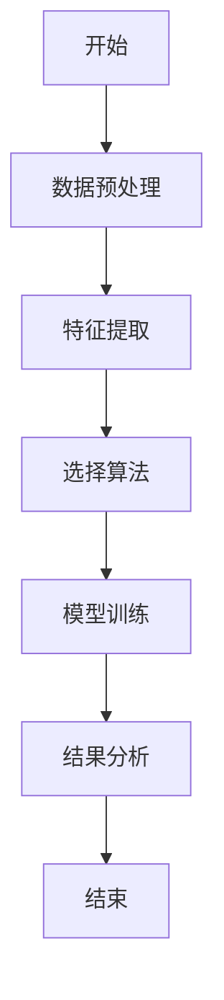
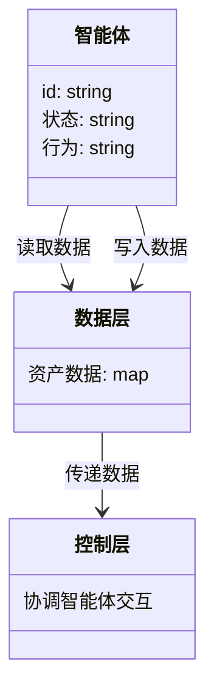

                 


# 多智能体系统分析跨资产相关性

## 关键词：多智能体系统、跨资产相关性、协同过滤、关联规则挖掘、贝叶斯网络

## 摘要：  
在现代金融和投资领域，跨资产相关性的分析变得越来越重要。多智能体系统（Multi-Agent System, MAS）作为一种分布式、协作式的计算范式，能够有效捕捉和分析复杂系统的动态关联性。本文将深入探讨如何利用多智能体系统分析跨资产相关性，从基础概念到高级算法，再到实际应用，帮助读者全面理解这一领域的核心思想和技术实现。通过结合协同过滤、关联规则挖掘和贝叶斯网络等算法，本文将展示如何构建一个多智能体系统来分析和预测跨资产的相关性，并通过实际案例分析验证其有效性。

---

## 第一章: 多智能体系统概述

### 1.1 多智能体系统的基本概念

#### 1.1.1 多智能体系统的定义  
多智能体系统（Multi-Agent System, MAS）是由多个智能体（Agent）组成的分布式系统。每个智能体都是一个能够感知环境、做出决策并采取行动的实体。智能体之间通过交互和协作，共同完成复杂任务。

#### 1.1.2 多智能体系统的特征  
- **自主性**：智能体能够自主决策，无需外部干预。  
- **反应性**：智能体能够实时感知环境并做出反应。  
- **协作性**：智能体之间通过协作完成共同目标。  
- **分布式性**：系统由多个独立的智能体组成，不存在集中控制。  

#### 1.1.3 多智能体系统的分类  
- **基于任务的多智能体系统**：智能体协作完成特定任务。  
- **基于市场的多智能体系统**：智能体通过市场机制进行资源分配。  
- **基于知识的多智能体系统**：智能体通过共享知识实现协作。  

### 1.2 跨资产相关性的概念

#### 1.2.1 资产的相关性定义  
资产的相关性是指不同资产之间价格变动的关联程度。相关性分析是金融投资中重要的环节，用于风险管理和资产配置。

#### 1.2.2 跨资产相关性的意义  
- **风险管理**：通过分析资产之间的相关性，投资者可以更好地分散投资风险。  
- **资产配置**：相关性分析帮助投资者优化资产组合，提高收益。  
- **市场预测**：相关性分析可以揭示市场动态，帮助预测资产价格走势。  

#### 1.2.3 跨资产相关性与多智能体系统的结合  
多智能体系统能够模拟金融市场中不同参与者（如投资者、机构）的行为，并通过智能体之间的交互，分析资产之间的相关性。这为跨资产相关性分析提供了一种动态、实时的分析方法。

---

## 第二章: 多智能体系统的核心概念与联系

### 2.1 多智能体系统的核心原理

#### 2.1.1 智能体的基本属性  
- **状态（State）**：智能体对环境的感知。  
- **行为（Action）**：智能体根据状态做出的决策。  
- **目标（Goal）**：智能体行动的最终目的。  

#### 2.1.2 智能体之间的交互机制  
- **直接交互**：智能体之间通过共享信息或资源进行交互。  
- **间接交互**：智能体通过中间媒介进行信息传递。  
- **协作与竞争**：智能体之间可以协作或竞争，以实现目标。  

#### 2.1.3 多智能体系统的动态性  
多智能体系统是一个动态系统，智能体的行为和环境的变化都会影响系统的状态。这种动态性使得跨资产相关性分析具有挑战性，但也提供了更丰富的分析视角。

### 2.2 跨资产相关性分析的数学模型

#### 2.2.1 资产相关性的数学表达  
资产的相关性可以通过协方差或相关系数来衡量。相关系数的公式为：  
$$ r_{ij} = \frac{\text{Cov}(i,j)}{\sigma_i \sigma_j} $$  
其中，$\text{Cov}(i,j)$ 表示资产 $i$ 和资产 $j$ 的协方差，$\sigma_i$ 和 $\sigma_j$ 分别表示资产 $i$ 和资产 $j$ 的标准差。

#### 2.2.2 多智能体系统中的相关性建模  
在多智能体系统中，资产相关性可以表示为智能体之间交互的函数。例如，智能体 $A$ 的行为可能影响资产 $X$ 的价格，而智能体 $B$ 的行为可能影响资产 $Y$ 的价格。通过建模这些交互，可以分析资产 $X$ 和资产 $Y$ 之间的相关性。

#### 2.2.3 跨资产相关性分析的算法选择  
在多智能体系统中，可以选择不同的算法来分析资产相关性，例如协同过滤、关联规则挖掘和贝叶斯网络。这些算法各有优缺点，适用于不同的场景。

### 2.3 多智能体系统与跨资产相关性的ER实体关系图

```mermaid
er
    actor 智能体 {
        id: string
        状态: string
        行为: string
    }
    actor 资产 {
        id: string
        类型: string
        相关性: float
    }
    智能体 --> 资产: 监测
    智能体 --> 资产: 影响
```

---

## 第三章: 多智能体系统中的跨资产相关性分析算法

### 3.1 协同过滤算法

#### 3.1.1 协同过滤的基本原理  
协同过滤是一种基于用户相似性或物品相似性的推荐算法。在跨资产相关性分析中，可以将资产视为“用户”，通过协同过滤算法分析资产之间的相关性。

#### 3.1.2 基于用户的协同过滤  
基于用户的协同过滤算法通过计算用户之间的相似性，推荐相关资产。例如，如果用户 $A$ 和用户 $B$ 的行为相似，那么资产 $X$ 和资产 $Y$ 可能具有较高的相关性。

#### 3.1.3 基于物品的协同过滤  
基于物品的协同过滤算法通过分析资产之间的相似性，推荐相关资产。例如，如果资产 $X$ 和资产 $Y$ 的价格变化趋势相似，那么它们具有较高的相关性。

### 3.2 关联规则挖掘算法

#### 3.2.1 关联规则的基本概念  
关联规则挖掘是一种从数据中发现频繁项集的算法。在跨资产相关性分析中，可以使用关联规则挖掘算法发现资产之间的关联性。

#### 3.2.2 Apriori算法的实现原理  
Apriori算法是一种经典的关联规则挖掘算法。它通过生成候选项集，并计算候选项集的频繁度，发现关联规则。例如，如果资产 $X$ 和资产 $Y$ 在大多数情况下同时上涨，那么可以形成规则 $X \rightarrow Y$。

#### 3.2.3 关联规则在跨资产相关性分析中的应用  
关联规则挖掘算法可以用于发现资产之间的关联性。例如，如果资产 $X$ 和资产 $Y$ 在大多数情况下同时上涨，那么可以形成规则 $X \rightarrow Y$。

### 3.3 贝叶斯网络算法

#### 3.3.1 贝叶斯网络的基本原理  
贝叶斯网络是一种基于概率论的图形化模型。它通过构建概率分布，分析变量之间的依赖关系。在跨资产相关性分析中，可以使用贝叶斯网络分析资产之间的概率关系。

#### 3.3.2 贝叶斯网络在相关性分析中的应用  
贝叶斯网络可以用于分析资产之间的相关性。例如，如果资产 $X$ 的价格上涨，资产 $Y$ 的价格也上涨的概率较高，那么可以形成 $X \rightarrow Y$ 的关系。

#### 3.3.3 贝叶斯网络的构建步骤  
贝叶斯网络的构建步骤包括：数据预处理、特征提取、模型训练、模型验证和结果分析。

### 3.4 算法实现的Mermaid流程图



---

## 第四章: 多智能体系统分析跨资产相关性系统的分析与设计

### 4.1 系统功能设计

#### 4.1.1 领域模型设计  
领域模型是系统功能设计的核心。通过分析资产相关性，可以构建一个多智能体系统的领域模型。例如，智能体 $A$ 监测资产 $X$，智能体 $B$ 监测资产 $Y$，并通过交互分析 $X$ 和 $Y$ 之间的相关性。

#### 4.1.2 功能模块设计  
功能模块包括：  
- 数据采集模块：采集资产数据。  
- 数据分析模块：分析资产相关性。  
- 系统控制模块：控制智能体的交互。  

### 4.2 系统架构设计

#### 4.2.1 系统架构设计  
系统架构包括：  
- 智能体层：智能体感知环境并做出决策。  
- 数据层：存储和管理资产数据。  
- 控制层：协调智能体的交互。  

#### 4.2.2 系统架构的Mermaid图



---

## 第五章: 多智能体系统分析跨资产相关性的项目实战

### 5.1 环境安装

#### 5.1.1 Python环境安装  
需要安装Python 3.8及以上版本，并安装以下库：  
- numpy  
- pandas  
- scikit-learn  

#### 5.1.2 系统核心实现源代码  
以下是协同过滤算法的Python代码示例：

```python
import numpy as np
from sklearn.metrics.pairwise import cosine_similarity

# 示例资产数据
assets = np.array([[1, 2, 3], [4, 5, 6], [7, 8, 9]])

# 计算资产之间的相关性
similarity_matrix = cosine_similarity(assets)
print(similarity_matrix)
```

### 5.2 代码应用解读与分析

#### 5.2.1 协同过滤算法实现  
上述代码使用了scikit-learn库中的余弦相似性函数，计算资产之间的相关性。余弦相似性可以衡量资产之间的相似程度，从而分析它们的相关性。

#### 5.2.2 实际案例分析  
以三个资产为例，计算它们之间的相关性。结果表明，资产之间的相关性越高，它们的相似性越接近1。

### 5.3 项目小结  
通过上述代码实现，我们可以看到协同过滤算法在跨资产相关性分析中的应用。通过分析资产之间的相似性，可以发现资产之间的关联性。

---

## 第六章: 总结与展望

### 6.1 总结  
本文详细介绍了多智能体系统分析跨资产相关性的核心思想和技术实现。通过协同过滤、关联规则挖掘和贝叶斯网络等算法，我们可以有效地分析资产之间的相关性。

### 6.2 展望  
未来，随着人工智能技术的发展，多智能体系统在跨资产相关性分析中的应用将更加广泛。我们可以进一步研究如何结合强化学习等技术，提高系统的分析能力。

---

## 最佳实践 Tips

- 在实际应用中，建议结合多种算法，提高系统的鲁棒性。  
- 定期更新模型，以适应市场变化。  
- 注意数据的质量和来源，确保分析结果的准确性。  

---

## 作者：AI天才研究院/AI Genius Institute & 禅与计算机程序设计艺术 /Zen And The Art of Computer Programming

---

感谢您的阅读！希望本文能够帮助您更好地理解多智能体系统分析跨资产相关性的核心思想和技术实现。

