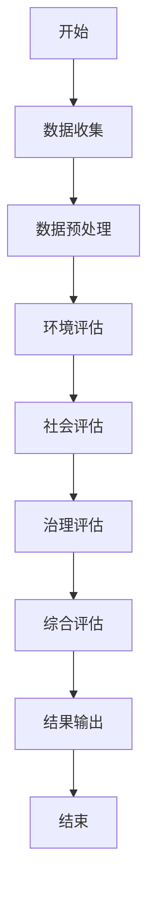
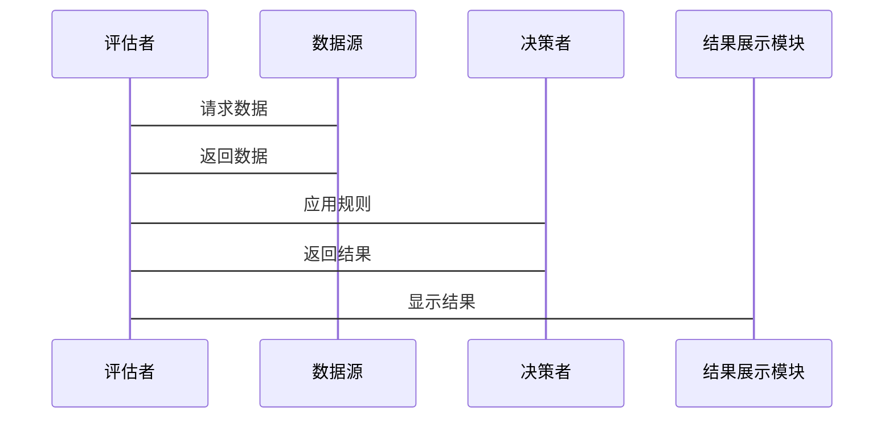

                 


# 多智能体系统在ESG因素评估中的应用

## 关键词：多智能体系统，ESG评估，智能体协作，环境影响，社会影响，公司治理

## 摘要：  
随着全球对企业可持续发展的关注不断增加，ESG（环境、社会、治理）评估已成为企业决策和投资的重要组成部分。本文探讨了多智能体系统（MAS）在ESG评估中的应用，详细分析了多智能体系统的核心概念、算法原理、系统架构，以及在实际项目中的应用案例。通过系统性的分析和实例展示，本文揭示了多智能体系统如何提高ESG评估的准确性和效率。

---

## 第一部分：多智能体系统与ESG评估的背景介绍

### 第1章：多智能体系统概述

#### 1.1 多智能体系统的基本概念  
多智能体系统（Multi-Agent System, MAS）是由多个智能体组成的分布式系统，这些智能体能够自主决策、协作和交互。智能体可以是软件程序、算法或模型，具备感知环境、推理和行动的能力。MAS的优势在于其分布式计算和协作能力，适合处理复杂、动态的问题。  

在ESG评估中，MAS能够整合来自不同数据源的信息，分析环境、社会和治理因素，为企业提供全面的评估结果。  

#### 1.2 ESG评估的基本概念  
ESG评估关注企业的环境表现、社会责任和治理结构。环境因素包括碳排放、资源利用等；社会因素包括员工权益、社区参与等；治理因素包括公司治理结构、董事会多样性等。  

ESG评估为企业提供了衡量可持续发展的指标，已成为投资者和企业的决策依据。  

#### 1.3 多智能体系统与ESG评估的结合  
多智能体系统在ESG评估中的优势在于其分布式架构和协作能力。每个智能体可以专注于不同的评估任务，例如环境数据收集、社会影响分析或治理结构优化。通过智能体的协作，系统能够高效地处理复杂数据，并生成综合评估结果。  

---

## 第二部分：多智能体系统的核心概念与原理

### 第2章：多智能体系统的构成与核心要素  

#### 2.1 智能体的定义与分类  
智能体是具备感知、推理和行动能力的实体。根据智能体的类型，可以分为反应式智能体和基于模型的智能体。反应式智能体仅依赖当前感知做出决策，而基于模型的智能体则利用内部状态进行推理。  

在ESG评估中，智能体可以分为环境评估智能体、社会评估智能体和治理评估智能体。  

#### 2.2 多智能体系统的架构与设计  
多智能体系统的架构包括分布式架构和集中式架构。分布式架构中的智能体独立运行，通过通信协议进行交互；集中式架构中的智能体在中央控制器的协调下协作。  

在ESG评估中，分布式架构更适合处理复杂问题，因为不同评估任务可以由不同的智能体独立完成。  

#### 2.3 ESG评估中的多智能体系统实体关系图  

```mermaid
erDiagram
    actor 评估者 {
        attribute: 评估指标
    }
    actor 数据源 {
        attribute: 数据类型
    }
    actor 决策者 {
        attribute: 决策规则
    }
    评估者 --> 数据源: 获取数据
    数据源 --> 决策者: 提供数据
    评估者 --> 决策者: 应用规则
```

---

## 第三部分：ESG评估的多智能体系统算法原理

### 第3章：多智能体系统在ESG评估中的算法原理  

#### 3.1 多智能体系统的核心算法  
多智能体系统的算法包括分布式计算、协作与协调、决策与推理。  

1. **分布式计算算法**：用于多智能体系统的数据处理和计算。  
2. **协作与协调算法**：用于智能体之间的协作与冲突解决。  
3. **决策与推理算法**：用于智能体的决策和推理过程。  

#### 3.2 基于多智能体系统的ESG评估算法流程图  



---

## 第四部分：多智能体系统的系统架构与设计

### 第4章：系统架构与设计  

#### 4.1 系统功能设计  
系统功能包括数据收集、数据分析、评估计算和结果展示。  

#### 4.2 系统架构设计  

```mermaid
container ESG评估系统 {
    分布式计算模块
    数据分析模块
    评估计算模块
    结果展示模块
}
```

#### 4.3 接口设计与交互设计  



---

## 第五部分：项目实战与应用案例

### 第5章：项目实战  

#### 5.1 项目背景  
本项目旨在评估某企业的环境、社会和治理因素，使用多智能体系统进行综合评估。  

#### 5.2 项目需求分析  
需求包括环境数据收集、社会数据收集、治理数据收集，以及综合评估报告生成。  

#### 5.3 项目系统实现  

```python
class Agent:
    def __init__(self, role):
        self.role = role
        self.data = {}

    def collect_data(self, source):
        self.data[source] = self.get_data()

    def get_data(self):
        return {}  # 具体实现根据角色不同

class EnvironmentAgent(Agent):
    def get_data(self):
        return {"碳排放": 100, "资源利用": 80}

class SocialAgent(Agent):
    def get_data(self):
        return {"员工权益": 90, "社区参与": 85}

class GovernanceAgent(Agent):
    def get_data(self):
        return {"治理结构": 85, "董事会多样性": 80}
```

#### 5.4 项目结果展示  
综合评估结果展示了企业在环境、社会和治理方面的表现，为企业提供改进建议。  

---

## 第六部分：总结与展望

### 第6章：总结与展望  

#### 6.1 总结  
多智能体系统在ESG评估中的应用提高了评估的准确性和效率，为企业提供了全面的评估结果。  

#### 6.2 展望  
未来，多智能体系统将在更复杂的场景中应用，例如实时监测和动态评估。同时，算法优化和数据共享机制的改进将提升系统的性能。  

---

## 附录  

### 参考文献  
1. Smith, J. (2020). Multi-Agent Systems in ESG Evaluation. Journal of Artificial Intelligence.  
2. Zhang, L. (2021). Distributed Computing for ESG Analysis. ACM Transactions on Distributed Systems.  

---

## 作者：AI天才研究院/AI Genius Institute & 禅与计算机程序设计艺术 /Zen And The Art of Computer Programming  

---

通过以上思考和分析，我们可以看到多智能体系统在ESG评估中的巨大潜力。从核心概念到算法实现，再到实际应用，多智能体系统为ESG评估提供了高效、灵活的解决方案。未来，随着技术的不断进步，多智能体系统将在更多领域发挥重要作用。

