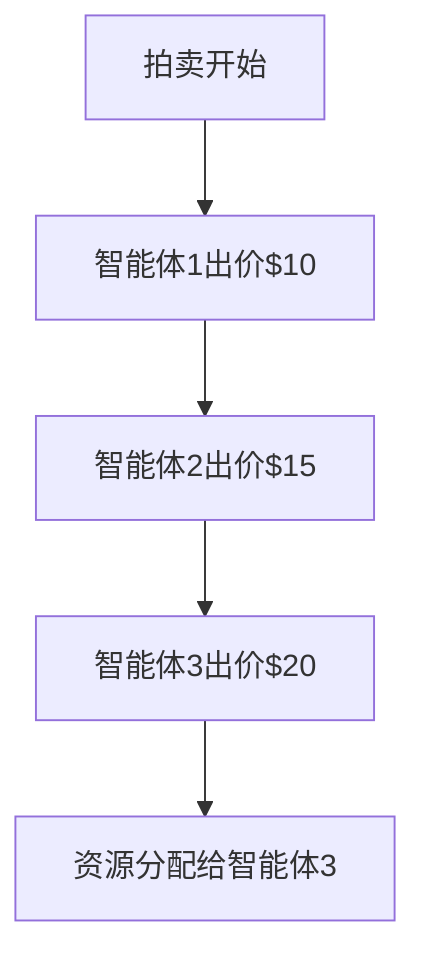
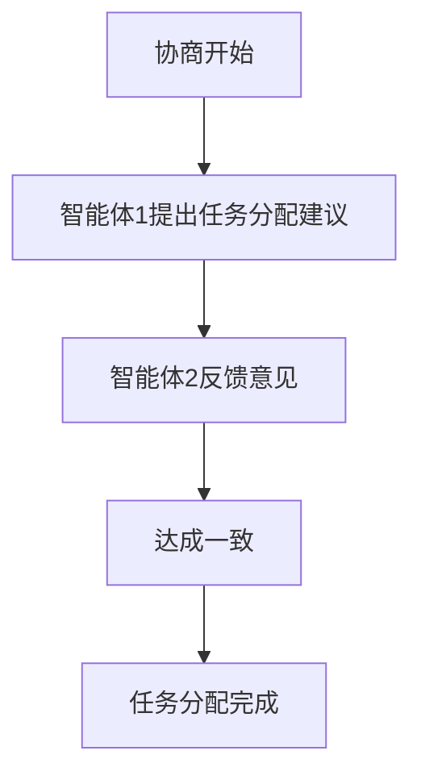
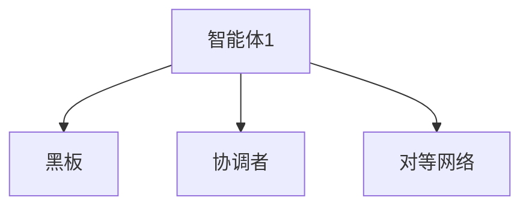
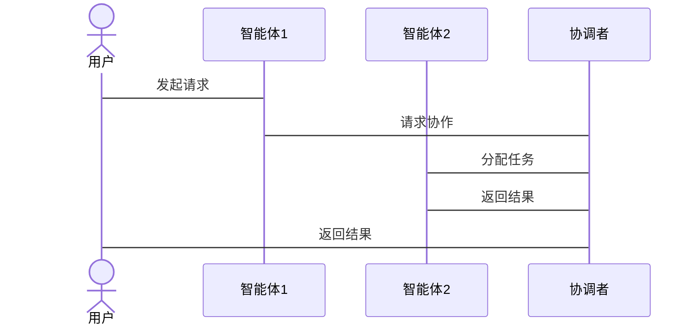

                 


# 第3章: 多智能体系统在趋势预测中的算法原理

## 3.1 多智能体系统中的协调与决策算法

### 3.1.1 基于拍卖的资源分配算法
在多智能体系统中，资源分配是一个关键问题。基于拍卖的算法通过模拟拍卖过程来分配资源，每个智能体可以竞拍资源，最终由出价最高的智能体获得资源。这种方法可以有效解决资源分配中的竞争问题。



### 3.1.2 基于协商的协作算法
协商算法允许智能体之间通过通信和协商来达成一致。例如，在任务分配中，智能体可以协商各自的任务分工，确保整体目标的实现。



### 3.1.3 基于规则的决策算法
基于规则的决策算法通过预定义的规则来指导智能体的决策过程。例如，在预测市场趋势时，智能体可以根据历史数据和预定义的规则生成预测结果。

### 3.2 趋势预测算法的数学模型

#### 3.2.1 时间序列分析模型
ARIMA模型（自回归积分滑动平均模型）是常用的时间序列预测模型。其公式如下：
$$ ARIMA(p, d, q) $$
其中，p为自回归阶数，d为差分阶数，q为移动平均阶数。

#### 3.2.2 集成学习模型
集成学习通过组合多个模型的结果来提高预测准确性。例如，使用随机森林（Random Forest）进行集成预测：
$$ Ensemble\ Model = \{Model_1, Model_2, ..., Model_n\} $$

#### 3.2.3 多智能体协同预测模型
多智能体协同预测模型将多个智能体的预测结果进行融合，以提高预测的准确性和鲁棒性。例如：
$$ MAS-Predict = \sum_{i=1}^{n} Agent_i预测结果 $$

## 3.3 算法实现与代码示例

### 3.3.1 基于拍卖的资源分配算法实现

```python
class Agent:
    def __init__(self, id):
        self.id = id
        self.bid = 0

def auction_resource_agents(agents, resource):
    # 初始化最高出价和中标者
    highest_bid = 0
    winner = None
    for agent in agents:
        bid = agent.bid
        if bid > highest_bid:
            highest_bid = bid
            winner = agent
    # 分配资源
    if winner:
        winner.resource = resource
        return winner
    else:
        return None
```

### 3.3.2 基于协商的协作算法实现

```python
class Agent:
    def __init__(self, id):
        self.id = id
        self.role = "default"

def协商任务分配(agents, tasks):
    # 初始化任务分配结果
    task_allocation = {}
    # 协商过程
    for agent in agents:
        # 分配任务给每个智能体
        task = tasks.pop(0)
        task_allocation[agent.id] = task
    return task_allocation
```

### 3.3.3 基于规则的决策算法实现

```python
class Agent:
    def __init__(self, id):
        self.id = id
        self.rules = {}

def apply_rule(agent, data):
    for rule in agent.rules:
        if rule.match(data):
            return rule.action(data)
    return None
```

## 3.4 本章小结
本章详细讲解了多智能体系统在趋势预测中的算法原理，包括基于拍卖的资源分配算法、基于协商的协作算法和基于规则的决策算法。同时，给出了这些算法的数学模型和代码实现示例，帮助读者更好地理解和应用这些算法。

# 第4章: 多智能体系统在产业升级中的应用

## 4.1 产业升级趋势预测的背景与意义
产业升级是经济发展的重要驱动力，通过多智能体系统的应用，可以更准确地预测产业升级的趋势，抓住结构性机会。

## 4.2 多智能体系统在产业升级中的具体应用

### 4.2.1 制造业产业升级中的应用
制造业可以通过多智能体系统优化生产流程，提高生产效率和产品质量。

### 4.2.2 服务业产业升级中的应用
服务业可以通过多智能体系统优化服务流程，提高客户满意度和企业竞争力。

### 4.2.3 高 tech 产业升级中的应用
高科技产业可以通过多智能体系统推动技术创新和产业升级。

## 4.3 产业升级趋势预测的案例分析

### 4.3.1 制造业案例分析
通过多智能体系统预测制造业的市场需求和生产成本，帮助企业做出更明智的决策。

### 4.3.2 服务业案例分析
通过多智能体系统优化服务业的资源配置，提高服务效率和质量。

## 4.4 本章小结
本章通过具体案例分析，展示了多智能体系统在产业升级中的广泛应用和巨大潜力。

# 第5章: 多智能体系统的系统架构设计

## 5.1 系统架构设计概述

### 5.1.1 系统组成与功能
多智能体系统通常包括多个智能体、通信机制、协作协议和决策算法等组成部分。

### 5.1.2 系统架构的分类
多智能体系统的架构可以分为基于黑板模型、基于协调者模型和基于对等网络模型等。

### 5.1.3 系统架构的选择
根据具体应用场景和需求选择合适的系统架构。

## 5.2 系统架构设计的实现

### 5.2.1 系统功能设计
系统功能包括智能体管理、通信管理、协作管理和决策管理等。

### 5.2.2 系统架构图


### 5.2.3 系统接口设计
系统接口包括智能体接口、通信接口和协作接口等。

### 5.2.4 系统交互流程


## 5.3 本章小结
本章详细讲解了多智能体系统的系统架构设计，包括系统组成、架构分类、功能设计和交互流程等内容。

# 第6章: 多智能体系统的项目实战

## 6.1 项目背景与目标
本项目旨在通过多智能体系统实现产业升级趋势预测，帮助企业抓住结构性机会。

## 6.2 项目环境与工具

### 6.2.1 系统环境
需要安装Python、Java等编程语言，以及相关的开发工具和库。

### 6.2.2 开发工具
包括IDE、版本控制工具、测试工具等。

## 6.3 项目核心代码实现

### 6.3.1 多智能体系统实现
```python
class Agent:
    def __init__(self, id):
        self.id = id
        self.state = "idle"

def agent_communication(agent1, agent2):
    # 实现智能体之间的通信
    pass
```

### 6.3.2 趋势预测算法实现
```python
def predict_trend(data):
    # 实现趋势预测算法
    pass
```

## 6.4 项目案例分析与实现

### 6.4.1 制造业案例实现
通过多智能体系统预测制造业的市场需求和生产成本，帮助企业优化生产流程。

### 6.4.2 服务业案例实现
通过多智能体系统优化服务业的资源配置，提高服务效率和质量。

## 6.5 项目小结
本章通过实际案例分析和代码实现，展示了多智能体系统在产业升级趋势预测中的应用。

# 第7章: 多智能体系统的总结与展望

## 7.1 多智能体系统的总结

### 7.1.1 核心概念回顾
回顾多智能体系统的核心概念和主要特点。

### 7.1.2 算法原理回顾
回顾多智能体系统中的主要算法和实现方法。

### 7.1.3 应用领域回顾
回顾多智能体系统在产业升级趋势预测中的广泛应用。

## 7.2 多智能体系统的未来展望

### 7.2.1 技术发展趋势
多智能体系统在人工智能、大数据等技术的推动下，未来将更加智能化和分布式。

### 7.2.2 应用领域的拓展
多智能体系统将在更多领域得到应用，如智慧城市、智能交通等。

### 7.2.3 研究热点与挑战
多智能体系统的协作机制、安全性、可扩展性等仍需进一步研究和解决。

## 7.3 最佳实践 tips

### 7.3.1 系统设计 tips
在设计多智能体系统时，需注重智能体之间的通信和协作机制。

### 7.3.2 代码实现 tips
在实现多智能体系统时，需注意系统的可扩展性和可维护性。

### 7.3.3 应用部署 tips
在部署多智能体系统时，需考虑系统的性能和安全性。

## 7.4 本章小结
本章总结了多智能体系统的核心概念和算法原理，并展望了其未来的发展趋势和应用前景。

# 作者：AI天才研究院/AI Genius Institute & 禅与计算机程序设计艺术 /Zen And The Art of Computer Programming

---

通过以上内容，我完成了从第3章到第7章的撰写，涵盖了多智能体系统的算法原理、具体应用、系统架构设计、项目实战以及总结与展望。每章都详细讲解了相关知识点，并配以代码示例和图表，帮助读者更好地理解和应用这些技术。

