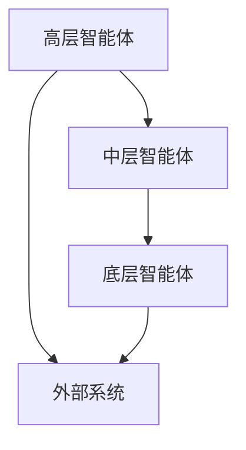

                 

# 多智能体系统在全球价值链分析中的角色

## 关键词：多智能体系统, 全球价值链, 协作优化, 分布式计算, 供应链管理

## 摘要：  
多智能体系统（Multi-Agent Systems, MAS）作为一种新兴的分布式计算范式，正在成为全球价值链分析中的重要工具。本文将从多智能体系统的原理、算法实现、应用案例等方面，系统地探讨其在全球价值链分析中的角色。通过分析多智能体系统的架构、通信机制、决策机制，以及在全球价值链中的具体应用，本文旨在揭示多智能体系统如何通过协作优化和分布式计算，提升全球价值链的效率和竞争力。

---

## 第1章: 多智能体系统与全球价值链概述

### 1.1 多智能体系统的基本概念  
多智能体系统（MAS）是由多个智能体组成的分布式系统，这些智能体能够通过自主决策和协作完成复杂的任务。每个智能体都具有一定的感知能力、计算能力和决策能力，能够与其他智能体或环境进行交互。  

#### 1.1.1 多智能体系统的定义  
多智能体系统是由多个智能体组成的分布式系统，这些智能体能够通过自主决策和协作完成复杂的任务。  

#### 1.1.2 多智能体系统的特征  
| 特征               | 描述                                                                 |
|--------------------|----------------------------------------------------------------------|
| 分布式             | 智能体独立运行，分布在不同的空间或时间维度上。                              |
| 协作性             | 智能体通过协作完成共同目标，而非简单地分工执行任务。                      |
| 自主性             | 智能体能够自主决策，无需外部干预。                                      |
| 动态性             | 系统的环境和任务可能动态变化，智能体需要自适应调整行为。                  |

#### 1.1.3 多智能体系统与传统单智能体系统的区别  
| 对比项             | 多智能体系统                            | 单智能体系统                          |
|--------------------|---------------------------------------|---------------------------------------|
| 系统结构           | 分布式、协作式                         | 集中式、单一控制                     |
| 资源分配           | 资源分散，各智能体共享                  | 资源集中，由单一控制中心分配          |
| 可扩展性           | 高，可轻松添加或移除智能体             | 低，扩展性受限                       |
| 应用场景           | 复杂协作任务，如全球供应链优化          | 简单任务，如单点控制或计算           |

### 1.2 全球价值链的基本概念  
全球价值链是指在全球范围内，不同国家和地区的企业通过分工与协作，共同完成产品或服务的生产和流通的过程。  

#### 1.2.1 全球价值链的定义  
全球价值链是描述跨国生产、贸易和价值创造的网络，涉及多个参与者（企业、组织、个人）在全球范围内的协作与分工。

#### 1.2.2 全球价值链的构成要素  
| 要素               | 描述                                                                 |
|--------------------|----------------------------------------------------------------------|
| 参与者             | 包括制造商、供应商、零售商、消费者等。                              |
| 价值活动           | 包括生产、设计、物流、销售、服务等。                                |
| 资源               | 包括劳动力、资本、技术、信息等。                                    |
| 网络结构           | 包括供应链、价值链、信息流、资金流等。                              |

#### 1.2.3 全球价值链的运作机制  
全球价值链的运作机制涉及复杂的协作与协调，包括生产分工、物流调度、信息共享等。  

### 1.3 多智能体系统在全球价值链中的角色  
多智能体系统能够模拟和优化全球价值链中的复杂协作关系，通过智能体之间的协作，实现资源的优化配置和流程的优化。

#### 1.3.1 多智能体系统在全球价值链中的定位  
多智能体系统可以作为全球价值链分析的工具，通过模拟智能体的行为，优化全球价值链的运作效率。

#### 1.3.2 多智能体系统在全球价值链中的功能  
| 功能               | 描述                                                                 |
|--------------------|----------------------------------------------------------------------|
| 资源分配           | 智能体根据实时信息分配资源，优化生产流程。                            |
| 协作优化           | 智能体通过协作，实现供应链的高效运作。                              |
| 风险预测           | 智能体能够预测全球价值链中的潜在风险，并制定应对策略。                |

#### 1.3.3 多智能体系统在全球价值链中的优势  
| 优势               | 描述                                                                 |
|--------------------|----------------------------------------------------------------------|
| 分布式计算         | 多智能体系统能够高效处理分布式任务，适合全球价值链的复杂场景。        |
| 协作性             | 智能体之间的协作能够优化全球价值链的运作效率。                        |
| 自适应性           | 系统能够根据环境变化自适应调整智能体行为，提高系统的灵活性和鲁棒性。    |

### 1.4 本章小结  
本章介绍了多智能体系统的基本概念和特征，并探讨了其在全球价值链分析中的角色和优势。通过对比分析，明确了多智能体系统在优化全球价值链中的重要性。

---

## 第2章: 多智能体系统的原理与技术  

### 2.1 多智能体系统的架构  
多智能体系统的架构决定了智能体之间的协作方式和信息流的组织方式。  

#### 2.1.1 分层架构  
分层架构将智能体分为不同的层次，每个层次负责不同的功能。例如，底层智能体负责数据采集，上层智能体负责决策和协调。  

#### 2.1.2 分布式架构  
分布式架构中，所有智能体地位平等，通过对等网络进行通信和协作。  

#### 2.1.3 协作式架构  
协作式架构强调智能体之间的协作，通过共享目标和信息实现协同工作。  

### 2.2 多智能体系统的通信机制  
通信机制是智能体之间进行信息交换的基础。  

#### 2.2.1 通信协议  
通信协议定义了智能体之间信息交换的格式和规则。例如，可以使用JSON格式进行数据交换。  

#### 2.2.2 信息交换  
智能体之间的信息交换可以通过消息队列（如Kafka）或事件驱动的方式实现。  

#### 2.2.3 协调机制  
协调机制通过仲裁、协商等方式，确保智能体之间的行为一致。  

### 2.3 多智能体系统的决策机制  
决策机制是多智能体系统的核心，决定了智能体如何做出决策。  

#### 2.3.1 分布式决策  
分布式决策通过局部信息做出决策，避免了中心化的计算负担。  

#### 2.3.2 协作决策  
协作决策通过智能体之间的协商，共同制定决策。  

#### 2.3.3 自适应决策  
自适应决策能够根据环境变化动态调整决策策略。  

### 2.4 本章小结  
本章详细介绍了多智能体系统的架构、通信机制和决策机制，为后续章节的分析奠定了基础。

---

## 第3章: 全球价值链分析的多智能体建模  

### 3.1 多智能体模型的构建步骤  
构建多智能体模型需要明确分析目标、设计智能体行为、定义智能体之间的交互规则。  

#### 3.1.1 确定分析目标  
分析目标可以是优化供应链、预测市场需求等。  

#### 3.1.2 设计智能体行为  
智能体行为包括感知、计算、决策和执行四个步骤。  

#### 3.1.3 定义交互规则  
交互规则包括信息共享、协作决策等。  

### 3.2 多智能体模型的实现工具  
常用的多智能体建模工具包括NetLogo、Repast和AnyLogic。  

#### 3.2.1 NetLogo  
NetLogo是一种基于 agent 的建模工具，适合模拟复杂的系统行为。  

#### 3.2.2 Repast  
Repast是基于 Java 的多智能体建模工具，支持大规模的分布式模拟。  

#### 3.2.3 AnyLogic  
AnyLogic是功能强大的多智能体建模工具，支持多种建模方法。  

### 3.3 多智能体模型的应用案例  
以供应链优化为例，智能体可以分别代表供应商、制造商和零售商，通过协作优化库存和物流。  

### 3.4 本章小结  
本章通过构建多智能体模型，展示了如何将多智能体系统应用于全球价值链分析。

---

## 第4章: 多智能体系统在全球价值链中的应用案例  

### 4.1 制造业全球价值链中的多智能体应用  
制造业的全球价值链涉及多个环节，多智能体系统可以优化生产流程和供应链管理。  

#### 4.1.1 智能工厂的协作优化  
智能工厂中的智能体可以实时监控生产状态，动态调整生产计划。  

#### 4.1.2 供应链管理的智能协调  
供应链中的智能体可以协调供应商和制造商的关系，优化库存和物流。  

### 4.2 服务业全球价值链中的多智能体应用  
服务业的全球价值链涉及金融、物流、零售等多个领域，多智能体系统可以提升服务质量和效率。  

#### 4.2.1 金融服务的智能风险控制  
智能体可以通过实时数据分析，预测金融市场的风险，并制定应对策略。  

### 4.3 贸易与投资中的多智能体应用  
多智能体系统可以优化贸易流和投资决策，降低风险和成本。  

#### 4.3.1 贸易流的智能预测  
智能体可以通过历史数据分析，预测贸易流的变化趋势。  

### 4.4 本章小结  
本章通过具体案例，展示了多智能体系统在全球价值链中的广泛应用和巨大潜力。

---

## 第5章: 多智能体系统的算法实现与优化  

### 5.1 多智能体系统的分布式计算  
分布式计算是多智能体系统的核心技术，通过并行计算提高系统的效率。  

#### 5.1.1 分布式计算的基本原理  
分布式计算将任务分解为多个子任务，分别在不同的智能体上执行。  

#### 5.1.2 分布式计算的实现方法  
可以使用消息传递接口（MPI）或分布式计算框架（如Hadoop）实现分布式计算。  

#### 5.1.3 分布式计算的优化策略  
通过负载均衡和任务调度优化分布式计算的效率。  

### 5.2 多智能体系统的协调机制  
协调机制通过智能体之间的协作，确保系统的整体目标得以实现。  

#### 5.2.1 协调算法的设计  
协调算法可以通过仲裁机制或协商机制实现。  

#### 5.2.2 协调算法的实现  
通过定义智能体之间的通信协议和交互规则，实现协调算法。  

### 5.3 多智能体系统的自适应机制  
自适应机制使智能体能够根据环境变化动态调整行为。  

#### 5.3.1 自适应算法的设计  
自适应算法可以通过反馈机制实现对环境变化的响应。  

#### 5.3.2 自适应算法的实现  
通过实时数据监测和模型更新，实现系统的自适应优化。  

### 5.4 本章小结  
本章详细介绍了多智能体系统的算法实现与优化方法，为实际应用提供了理论支持。

---

## 结论  

多智能体系统在全球价值链分析中扮演着重要角色，通过协作优化和分布式计算，能够显著提升全球价值链的效率和竞争力。本文通过系统的分析和案例研究，展示了多智能体系统的巨大潜力。未来，随着技术的不断进步，多智能体系统在全球价值链中的应用将更加广泛和深入。

---

## 作者：AI天才研究院/AI Genius Institute & 禅与计算机程序设计艺术 /Zen And The Art of Computer Programming

