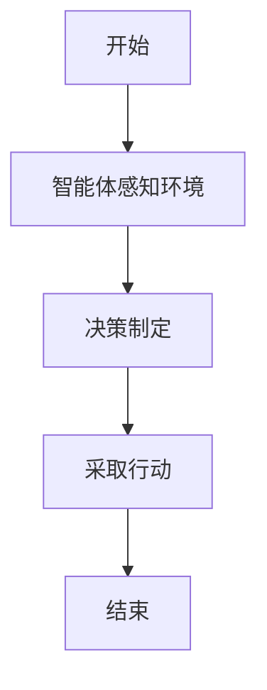
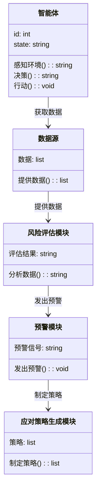
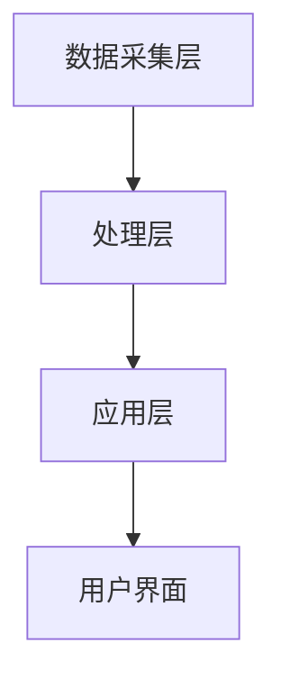
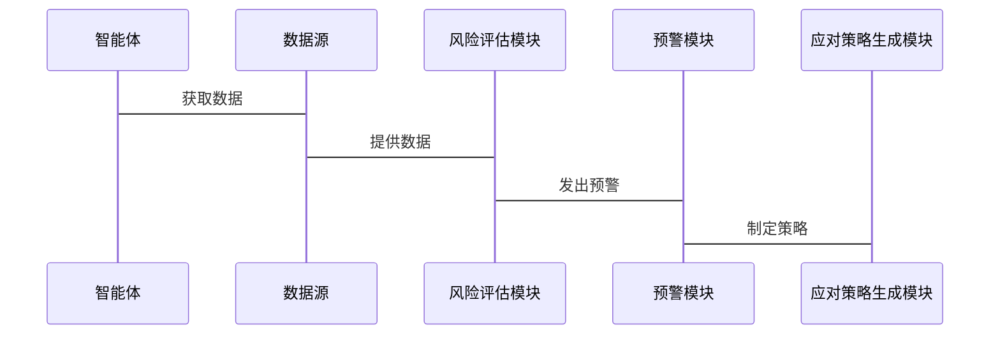

                 


```markdown
# 多智能体系统在全球地缘政治风险分析中的角色

**关键词**: 多智能体系统, 地缘政治风险分析, 算法原理, 系统架构, 项目实战

**摘要**: 多智能体系统（Multi-Agent Systems, MAS）在地缘政治风险分析中的应用，通过分布式计算和协同推理，能够有效应对复杂多变的地缘政治环境。本文系统地探讨了多智能体系统的核心概念、算法原理、系统架构，结合实际案例，展示了多智能体系统在全球地缘政治风险分析中的关键角色，并提出了未来研究的方向。

---

## 第1章 多智能体系统与地缘政治风险分析概述

### 1.1 多智能体系统的基本概念
多智能体系统（MAS）是由多个智能体（Agent）组成的分布式系统，每个智能体都是具有计算能力的实体，能够感知环境、自主决策并与其他智能体协作。MAS的核心特征包括分布式性、自治性、反应性和协同性。

#### 1.1.1 多智能体系统的定义
多智能体系统由多个智能体组成，智能体通过通信和协作完成任务，具有以下特点：
- **分布式**：智能体分布在不同的位置，独立运行。
- **自治性**：每个智能体能够自主决策。
- **反应性**：智能体能够感知环境并实时响应。
- **协同性**：智能体之间通过通信协作完成共同目标。

#### 1.1.2 多智能体系统的特征
- **异构性**：智能体可以有不同的类型和功能。
- **动态性**：环境和任务可能动态变化。
- **复杂性**：智能体之间的交互复杂，需要协调。

#### 1.1.3 多智能体系统的核心要素
- **智能体**：基本单元，具有计算能力。
- **通信机制**：智能体之间交换信息的方式。
- **协作机制**：智能体之间协同完成任务的规则。

### 1.2 地缘政治风险分析的背景
地缘政治风险分析是研究全球政治、经济、军事等领域的潜在风险，帮助决策者制定应对策略。

#### 1.2.1 地缘政治风险的定义
地缘政治风险是指在全球范围内可能对国家或组织造成负面影响的政治、经济、军事等因素。

#### 1.2.2 地缘政治风险的主要来源
- **政治因素**：政府政策变化、国际关系紧张。
- **经济因素**：经济波动、贸易争端。
- **军事因素**：战争、恐怖主义。
- **社会因素**：社会动荡、民族冲突。

#### 1.2.3 地缘政治风险分析的重要性
准确分析地缘政治风险，可以帮助企业和政府制定有效的风险管理策略，避免潜在损失。

### 1.3 多智能体系统与地缘政治风险分析的结合
多智能体系统通过分布式计算和协同推理，能够处理地缘政治风险分析中的复杂性和不确定性。

#### 1.3.1 多智能体系统在地缘政治分析中的作用
- **数据收集**：智能体实时收集全球政治、经济数据。
- **信息处理**：智能体分析数据，识别潜在风险。
- **决策支持**：智能体提供风险评估和应对策略。

#### 1.3.2 多智能体系统与地缘政治风险分析的结合方式
- **分布式计算**：多智能体系统利用分布式计算优势，处理海量数据。
- **协同推理**：智能体之间协作，提高分析精度。

#### 1.3.3 多智能体系统在地缘政治风险分析中的优势
- **高效性**：分布式计算提高处理速度。
- **准确性**：协同推理提高分析结果的准确性。

### 1.4 本章小结
本章介绍了多智能体系统的基本概念和地缘政治风险分析的背景，探讨了两者结合的意义和优势，为后续章节奠定了基础。

---

## 第2章 多智能体系统与地缘政治风险分析的核心概念

### 2.1 多智能体系统的原理
多智能体系统的原理包括个体智能体的行为规则和智能体之间的交互机制。

#### 2.1.1 个体智能体的行为规则
智能体根据感知信息制定决策，通过反应式或基于模型的方法进行推理。

#### 2.1.2 智能体之间的交互机制
智能体通过通信协议交换信息，协调行动。

#### 2.1.3 多智能体系统的动态演化
系统根据环境变化动态调整智能体的行为和协作方式。

### 2.2 地缘政治风险分析的原理
地缘政治风险分析通过数据收集、建模和预测，识别潜在风险。

#### 2.2.1 风险识别与评估
通过分析历史数据和当前事件，识别潜在风险因素。

#### 2.2.2 风险预测与预警
利用模型预测风险发生的可能性，并发出预警信号。

#### 2.2.3 风险应对策略
制定应对措施，降低风险影响。

### 2.3 多智能体系统与地缘政治风险分析的联系
多智能体系统在地缘政治风险分析中的应用，提高了分析的效率和准确性。

#### 2.3.1 多智能体系统的分布式计算优势
多智能体系统能够处理海量数据，提高计算效率。

#### 2.3.2 地缘政治风险分析的复杂性与多智能体系统的适应性
地缘政治风险分析涉及多个变量和复杂关系，多智能体系统能够有效处理。

#### 2.3.3 多智能体系统在地缘政治风险分析中的具体应用
- **数据采集**：智能体实时采集全球政治、经济数据。
- **信息处理**：智能体分析数据，识别潜在风险。
- **决策支持**：智能体提供风险评估和应对策略。

### 2.4 本章小结
本章详细讲解了多智能体系统的原理和地缘政治风险分析的原理，并探讨了两者之间的联系和应用。

---

## 第3章 多智能体系统的算法原理

### 3.1 多智能体系统的算法原理
多智能体系统的算法包括个体智能体的行为规则和全局协作机制。

#### 3.1.1 多智能体协同算法
多智能体协同算法通过协调智能体的行为，实现全局目标。

#### 3.1.2 多智能体通信协议
智能体之间通过通信协议交换信息，确保协作顺利进行。

#### 3.1.3 多智能体系统的协调机制
通过协调机制，智能体之间达成一致，避免冲突。

### 3.2 算法实现
以下是一个简单的多智能体协同算法实现：

```python
class Agent:
    def __init__(self, id):
        self.id = id
        self.state = "idle"
    
    def感知环境(self):
        # 智能体感知环境，返回当前状态
        return self.state
    
    def 决策(self, 状态):
        # 根据状态制定决策
        if 状态 == "威胁":
            return "警告"
        else:
            return "正常"
    
    def 行动(self, 决策):
        # 根据决策采取行动
        if 决策 == "警告":
            self.state = "警告"
        else:
            self.state = "正常"
```

### 3.3 算法流程图


### 3.4 数学模型
多智能体系统的协作可以用博弈论中的纳什均衡来描述。纳什均衡是指在给定其他智能体策略的情况下，智能体无法通过单方面改变策略而获得更好的结果。

数学表达式如下：
$$
\text{纳什均衡} = (x_1, x_2, ..., x_n)
$$
其中，$x_i$表示第$i$个智能体的策略。

### 3.5 本章小结
本章详细讲解了多智能体系统的算法原理，并通过代码和流程图展示了算法的实现过程。

---

## 第4章 系统分析与架构设计

### 4.1 系统分析
地缘政治风险分析系统需要实时采集和处理大量数据，具有高实时性和高准确性要求。

#### 4.1.1 问题场景介绍
系统需要分析全球政治、经济、军事等领域的数据，识别潜在风险。

#### 4.1.2 项目介绍
本项目旨在利用多智能体系统，构建一个全球地缘政治风险分析平台。

### 4.2 系统功能设计
系统功能包括数据采集、风险评估、预警和应对策略生成。

#### 4.2.1 数据采集模块
智能体实时采集全球政治、经济数据。

#### 4.2.2 风险评估模块
对采集的数据进行分析，识别潜在风险。

#### 4.2.3 预警模块
根据风险评估结果，发出预警信号。

#### 4.2.4 应对策略生成模块
制定应对措施，降低风险影响。

#### 4.2.5 领域模型类图


### 4.3 系统架构设计
系统架构包括数据采集层、处理层和应用层。

#### 4.3.1 系统架构图


#### 4.3.2 系统接口设计
系统接口包括数据接口和用户接口。

#### 4.3.3 系统交互序列图


### 4.4 本章小结
本章详细分析了系统的功能和架构设计，并通过图表展示了系统的结构和交互过程。

---

## 第5章 项目实战

### 5.1 环境安装
项目需要安装Python和相关库，如numpy和pandas。

### 5.2 核心代码实现
以下是项目的核心代码：

```python
import numpy as np
import pandas as pd

class Agent:
    def __init__(self, id):
        self.id = id
        self.data = []
    
    def 感知环境(self):
        return self.data
    
    def 决策(self, 状态):
        if 状态 == "威胁":
            return "警告"
        else:
            return "正常"
    
    def 行动(self, 决策):
        if 决策 == "警告":
            print(f"Agent {self.id} 发出警告")
        else:
            print(f"Agent {self.id} 正常运行")

# 初始化智能体
agents = [Agent(i) for i in range(1, 4)]

# 智能体感知环境
for agent in agents:
    print(f"Agent {agent.id} 的感知结果：{agent.感知环境()}")
```

### 5.3 代码解读与分析
代码实现了多个智能体的协作，每个智能体根据感知到的环境状态进行决策，并采取相应的行动。

### 5.4 案例分析
以下是一个案例分析：

```python
# 初始化智能体
agents = [Agent(i) for i in range(1, 4)]

# 智能体感知环境
for agent in agents:
    agent.data = ["威胁", "正常", "威胁"]

# 智能体决策
for agent in agents:
    状态 = agent.感知环境()
    决策 = agent.决策(状态)
    agent.行动(决策)
```

### 5.5 项目小结
本章通过实际项目展示了多智能体系统的实现过程，包括环境安装、核心代码实现和案例分析。

---

## 第6章 总结与展望

### 6.1 总结
多智能体系统在全球地缘政治风险分析中的应用，提高了分析的效率和准确性。通过分布式计算和协同推理，系统能够处理复杂多变的地缘政治环境。

### 6.2 最佳实践 tips
- **数据质量**：确保数据的准确性和实时性。
- **算法优化**：不断优化算法，提高分析精度。
- **系统安全性**：加强系统安全性，防止数据泄露。

### 6.3 未来研究方向
- **智能体协作机制**：研究更高效的协作机制。
- **复杂环境适应性**：提高系统在复杂环境中的适应性。
- **多模态数据融合**：研究多模态数据的融合方法。

### 6.4 本章小结
本章总结了多智能体系统在全球地缘政治风险分析中的应用，并提出了未来的研究方向。

---

**作者：AI天才研究院 & 禅与计算机程序设计艺术**

---

以上是《多智能体系统在全球地缘政治风险分析中的角色》的技术博客文章的完整内容，涵盖了从背景介绍到项目实战的各个方面，希望对读者有所帮助。
```

