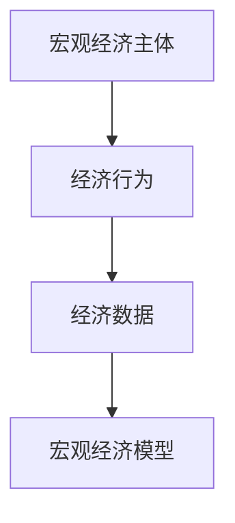
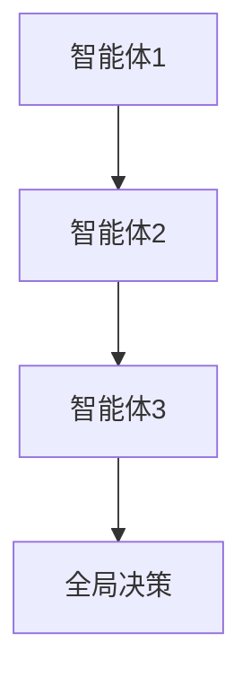
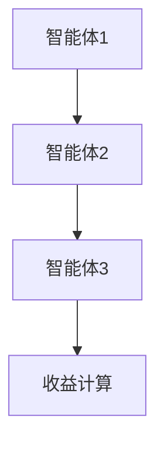
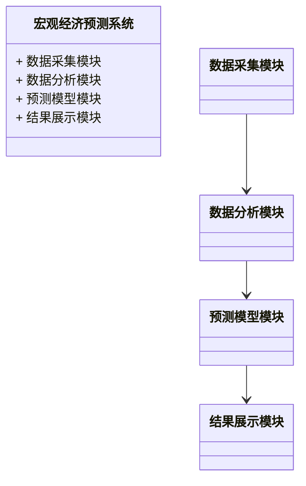
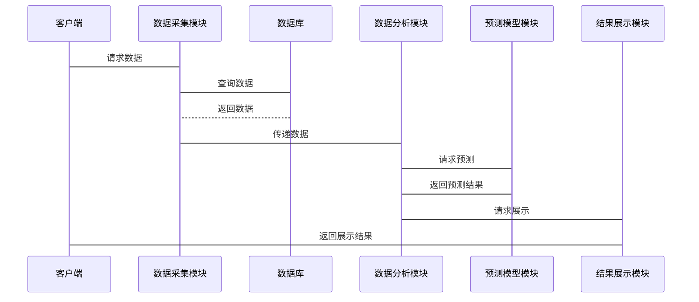

                 


# 多智能体系统在全球宏观经济分析中的角色

## 关键词：多智能体系统，宏观经济分析，分布式计算，博弈论，经济预测，系统架构

## 摘要：  
本文探讨了多智能体系统在全球宏观经济分析中的角色与应用。通过分析宏观经济分析的复杂性与挑战，结合多智能体系统的分布式计算和博弈论模型，展示了如何利用多智能体系统进行宏观经济预测、政策模拟和经济行为建模。本文详细讲解了多智能体系统的宏观经济分析框架、核心算法、系统架构设计以及实际案例，为读者提供了一个全面的视角来理解多智能体系统在全球宏观经济分析中的重要性。

---

# 第一部分: 多智能体系统与宏观经济分析的背景

## 第1章: 多智能体系统与宏观经济分析的背景

### 1.1 多智能体系统的定义与特点  
多智能体系统（Multi-Agent System, MAS）是由多个智能体组成的分布式系统，每个智能体具有一定的自主性、反应性和社会性。以下是多智能体系统的核心特点：  
1. **自主性**：智能体能够独立决策和行动，无需外部干预。  
2. **反应性**：智能体能够感知环境并实时调整行为。  
3. **分布式性**：智能体之间通过通信和协作完成共同目标。  
4. **社会性**：智能体之间存在复杂的交互与合作。  

### 1.2 宏观经济分析的背景与挑战  
宏观经济分析是对整体经济系统运行的观察与研究，包括GDP、通货膨胀、就业率等指标的分析。然而，宏观经济分析面临着以下挑战：  
1. **复杂性**：经济系统涉及众多参与者，如企业、消费者、政府等，各参与者之间存在复杂的交互关系。  
2. **动态性**：经济系统的运行受到多种因素的影响，如政策变化、市场波动等，具有高度的动态性。  
3. **不确定性**：经济系统的未来走势往往难以预测，存在较高的不确定性。  

### 1.3 多智能体系统在全球宏观经济分析中的作用  
多智能体系统能够模拟经济系统中多个参与者的交互行为，从而为宏观经济分析提供新的视角和方法。具体作用包括：  
1. **建模复杂性**：多智能体系统能够模拟经济系统中复杂的交互关系，帮助经济学家更好地理解经济现象。  
2. **预测与模拟**：通过模拟经济系统的运行，多智能体系统可以用于预测经济趋势和评估政策效果。  
3. **实时分析**：多智能体系统的实时性使其能够快速响应经济系统的动态变化。  

---

## 第2章: 多智能体系统的宏观经济分析框架

### 2.1 多智能体系统的宏观经济分析模型  
多智能体系统的宏观经济分析模型通常包括以下组成部分：  
1. **智能体类型**：定义不同类型的经济参与者，如消费者、企业、政府等。  
2. **行为规则**：为每个智能体定义行为规则，如消费决策、投资决策等。  
3. **交互机制**：定义智能体之间的交互方式，如市场交易、信息共享等。  
4. **数据处理**：对智能体的交互数据进行收集、分析和处理，生成宏观经济指标。  

### 2.2 宏观经济分析的核心概念与联系  
以下是单智能体系统和多智能体系统在宏观经济分析中的对比：  

#### 对比表格  
| 概念 | 行为方式 | 复杂性 | 数据来源 |  
|------|----------|--------|----------|  
| 单智能体系统 | 单一决策 | 低 | 单一数据源 |  
| 多智能体系统 | 分布式决策 | 高 | 多数据源 |  

#### ER实体关系图  
以下是宏观经济分析中智能体与经济行为的关系图：  



---

## 第3章: 多智能体系统的算法原理

### 3.1 分布式计算与多智能体系统的算法  
#### 3.1.1 分布式计算的基本原理  
分布式计算是一种将计算任务分配到多个计算节点上进行处理的技术。其核心思想是通过节点之间的协作完成复杂的计算任务。  

#### 3.1.2 多智能体系统的分布式算法  
多智能体系统的分布式算法通常包括以下步骤：  
1. **任务分配**：将整体任务分配给多个智能体。  
2. **信息交换**：智能体之间通过通信协议交换信息。  
3. **局部决策**：每个智能体基于自身信息做出局部决策。  
4. **全局协调**：通过协调机制将局部决策整合为全局决策。  

#### 3.1.3 分布式算法的实现步骤  
以下是分布式计算的实现流程图：  



---

### 3.2 博弈论模型与多智能体系统的结合  
博弈论模型是研究智能体之间策略交互的重要工具。以下是博弈论模型与多智能体系统的结合方式：  

#### 3.2.1 博弈论模型的基本原理  
博弈论模型描述了智能体在博弈中的策略选择和收益计算。其核心公式为：  
$$ \text{收益} = \text{策略选择} \times \text{概率} $$  

#### 3.2.2 博弈论模型的实现步骤  
以下是博弈论模型的实现流程图：  



---

# 第二部分: 多智能体系统在全球宏观经济分析中的应用

## 第4章: 多智能体系统的系统分析与架构设计

### 4.1 宏观经济预测的系统设计  
#### 4.1.1 问题场景介绍  
宏观经济预测通常涉及以下场景：  
1. 数据收集：收集GDP、通货膨胀率等宏观经济指标。  
2. 数据分析：分析数据之间的关系，发现经济趋势。  
3. 预测与决策：基于分析结果做出宏观经济预测。  

#### 4.1.2 系统功能设计  
以下是宏观经济预测系统的功能模块图：  



#### 4.1.3 系统架构设计  
以下是宏观经济预测系统的架构图：  


#### 4.1.4 系统接口设计  
以下是系统接口的交互序列图：  



---

## 第5章: 多智能体系统的项目实战

### 5.1 项目环境与安装  
#### 5.1.1 环境要求  
- 操作系统：Windows/Mac/Linux  
- 开发工具：Python/Java/C++  
- 依赖库：NumPy、Matplotlib、networkx  

#### 5.1.2 环境安装  
以下是Python环境的安装步骤：  
1. 安装Python：`python --version`  
2. 安装依赖库：  
   ```bash
   pip install numpy matplotlib networkx
   ```

---

### 5.2 核心代码实现  
#### 5.2.1 经济预测模型的实现  
以下是Python代码实现：  
```python
import numpy as np
import matplotlib.pyplot as plt

class Agent:
    def __init__(self, id):
        self.id = id
        self.data = []

    def collect_data(self, data):
        self.data.append(data)

    def analyze_data(self):
        return np.mean(self.data)

    def make_decision(self):
        return self.analyze_data()

# 初始化智能体
agents = [Agent(i) for i in range(4)]

# 数据生成
data = np.random.random(100)
for agent in agents:
    agent.collect_data(data)

# 决策计算
decisions = [agent.make_decision() for agent in agents]
print("Decisions:", decisions)

# 可视化
plt.plot(data, label='原始数据')
plt.plot(decisions, label='决策结果')
plt.legend()
plt.show()
```

#### 5.2.2 代码解读与分析  
上述代码实现了多智能体系统的经济预测模型。每个智能体负责收集数据、分析数据并做出决策。最终将所有智能体的决策结果进行可视化展示。

---

### 5.3 实际案例分析  
#### 5.3.1 案例背景  
假设我们有四个智能体，分别代表不同的经济部门。我们需要通过智能体之间的数据交互，预测整体经济趋势。  

#### 5.3.2 案例实现  
根据上述代码，我们可以看到四个智能体的决策结果与原始数据之间的关系。通过可视化展示，可以更好地理解经济趋势。  

---

## 第6章: 最佳实践与小结

### 6.1 小结  
本文详细探讨了多智能体系统在全球宏观经济分析中的角色与应用。通过背景介绍、算法原理、系统架构设计和项目实战，展示了多智能体系统在宏观经济分析中的优势与潜力。

### 6.2 注意事项  
- 在实际应用中，需要考虑智能体之间的通信效率和数据隐私问题。  
- 需要根据具体场景选择合适的算法和模型。  

### 6.3 拓展阅读  
- 推荐阅读《Multi-Agent Systems: Algorithmic, Complexity, and Agent-Oriented Methodologies》  
- 推荐学习博弈论与分布式计算的相关知识。  

---

## 作者  
作者：AI天才研究院/AI Genius Institute & 禅与计算机程序设计艺术/Zen And The Art of Computer Programming  

--- 

以上是完整的技术博客文章，内容涵盖多智能体系统在全球宏观经济分析中的角色与应用，结合了理论与实践，适合对宏观经济分析和多智能体系统感兴趣的读者阅读。

