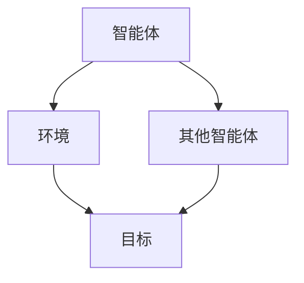
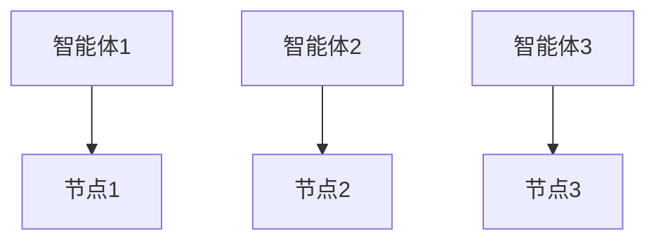
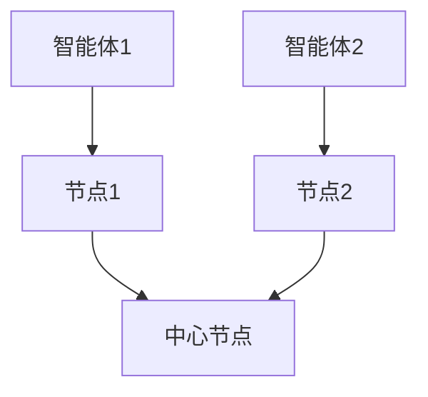

                 


# 多智能体系统在全球政治风险分析中的角色

---

## 关键词：多智能体系统，全球政治风险分析，博弈论，分布式计算，风险管理

---

## 摘要

在全球化和信息化的今天，政治风险分析变得越来越复杂和重要。传统的单一智能体分析方法已难以应对多变的全球政治环境。多智能体系统（Multi-Agent Systems, MAS）作为一种新兴的分布式计算范式，通过多个智能体的协作和交互，能够有效捕捉和分析复杂的政治风险。本文从多智能体系统的定义、核心概念、算法原理、系统架构、项目实战等多个方面展开，深入探讨多智能体系统在全球政治风险分析中的角色和应用价值。

---

## 第1章: 多智能体系统与全球政治风险分析的背景介绍

### 1.1 多智能体系统的定义与核心概念

#### 1.1.1 多智能体系统的定义

多智能体系统（Multi-Agent System, MAS）是由多个智能体（Agent）组成的分布式系统，每个智能体都是一个能够感知环境、做出决策并采取行动的实体。智能体可以是软件程序、机器人或其他智能系统，它们通过通信和协作完成复杂任务。

#### 1.1.2 多智能体系统的属性与特征

| 属性 | 特征 |
|------|------|
| 分布式 | 智能体独立运行，无中心控制 |
| 协作性 | 智能体之间通过协作完成共同目标 |
| 反应性 | 智能体能够实时感知环境并做出反应 |
| 多样性 | 智能体可以具有不同的功能和目标 |

#### 1.1.3 多智能体系统的组成要素



### 1.2 全球政治风险分析的背景与挑战

#### 1.2.1 全球政治风险的定义

全球政治风险是指在全球范围内，由于政治不稳定、政策变化、地缘政治冲突等因素可能导致的经济、社会或安全风险。

#### 1.2.2 全球政治风险分析的复杂性

全球政治风险分析涉及多个因素，包括：

- **经济因素**：经济政策变化、债务危机等。
- **地缘政治因素**：国际冲突、外交关系变化等。
- **社会因素**：社会动荡、抗议活动等。
- **政策因素**：政府政策调整、法律法规变化等。

#### 1.2.3 多智能体系统在政治风险分析中的作用

多智能体系统能够通过以下方式提升政治风险分析的能力：

- **分布式计算**：多个智能体可以同时处理不同来源的数据。
- **协作与交互**：智能体之间可以共享信息，形成更全面的分析结果。
- **动态适应**：智能体能够实时响应环境变化。

### 1.3 多智能体系统与政治风险分析的关联

#### 1.3.1 多智能体系统的核心优势

- **并行计算能力**：多个智能体可以同时处理大量数据。
- **协作能力**：智能体之间的协作能够提供更全面的分析结果。
- **适应性**：智能体能够动态调整策略以应对环境变化。

#### 1.3.2 多智能体系统在政治风险分析中的应用场景

- **地缘政治风险评估**：分析不同国家之间的关系变化。
- **经济政策风险预测**：预测经济政策变化对市场的影响。
- **社会动荡风险预警**：监测社会动荡的早期信号。

#### 1.3.3 多智能体系统与传统分析方法的对比

| 方面 | 传统分析方法 | 多智能体系统 |
|------|--------------|-------------|
| 分析能力 | 基于单一模型 | 基于多个智能体协作 |
| 处理复杂性 | 低效 | 高效 |
| 实时性 | 较差 | 较好 |

---

## 第2章: 多智能体系统的数学模型与算法原理

### 2.1 多智能体系统的基本模型

#### 2.1.1 个体行为模型

个体行为模型描述单个智能体的行为逻辑。假设一个智能体的目标函数为：

$$
f(x) = \max_{x} \{ x^T c \}
$$

其中，\( x \) 是智能体的决策变量，\( c \) 是目标权重向量。

#### 2.1.2 集体行为模型

集体行为模型描述多个智能体的协作行为。假设多个智能体的协作目标为：

$$
F(X) = \sum_{i=1}^n f_i(x_i)
$$

其中，\( X = \{x_1, x_2, ..., x_n\} \) 是所有智能体的决策变量集合。

#### 2.1.3 个体间交互模型

个体间交互模型描述智能体之间的信息交换和影响。假设智能体 \( i \) 对智能体 \( j \) 的影响为：

$$
I_{ij} = \beta x_i
$$

其中，\( \beta \) 是影响系数。

### 2.2 多智能体系统的博弈论基础

#### 2.2.1 博弈论的基本概念

博弈论是研究多个决策主体（智能体）在竞争或合作环境下的行为规律的数学理论。

#### 2.2.2 多智能体系统的博弈模型

多智能体系统的博弈模型可以表示为：

$$
G = \langle N, A, P \rangle
$$

其中，\( N \) 是智能体集合，\( A \) 是动作空间，\( P \) 是支付函数。

#### 2.2.3 博弈论在政治风险分析中的应用

例如，在分析国家间的贸易政策博弈时，智能体可以分别代表不同的国家，根据自身利益选择最优策略。

### 2.3 多智能体系统的算法实现

#### 2.3.1 分布式计算算法

分布式计算算法通过将任务分解到多个智能体完成，例如：

1. 智能体 \( i \) 分配任务 \( T_i \)。
2. 智能体 \( i \) 计算结果 \( R_i \)。
3. 智能体 \( i \) 将结果发送到中央节点。
4. 中央节点汇总所有结果，输出最终结果。

#### 2.3.2 协作算法

协作算法通过智能体之间的协作完成复杂任务，例如：

1. 智能体 \( i \) 发布任务请求。
2. 智能体 \( j \) 响应并提供数据。
3. 智能体 \( i \) 综合数据，输出结果。

#### 2.3.3 学习与适应算法

学习与适应算法通过强化学习等方式优化智能体的行为策略，例如：

1. 智能体 \( i \) 采取动作 \( a \)。
2. 环境给出反馈 \( r \)。
3. 智能体 \( i \) 更新策略以最大化期望回报。

---

## 第3章: 多智能体系统的系统架构与设计

### 3.1 系统架构设计

#### 3.1.1 分层架构

分层架构将系统划分为多个层次，例如：

- **感知层**：负责数据采集。
- **计算层**：负责数据处理。
- **决策层**：负责策略制定。

#### 3.1.2 分布式架构

分布式架构将智能体部署在不同的节点上，例如：



#### 3.1.3 混合架构

混合架构结合分层和分布式架构，例如：



### 3.2 系统功能设计

#### 3.2.1 数据采集模块

数据采集模块负责从多个来源采集数据，例如：

- 数据来源：新闻报道、政府公告、经济指标等。
- 数据类型：文本、数值、时间序列等。

#### 3.2.2 智能体交互模块

智能体交互模块负责智能体之间的通信与协作，例如：

1. 智能体 \( i \) 发送消息 \( m \) 到智能体 \( j \)。
2. 智能体 \( j \) 接收消息 \( m \) 并处理。
3. 智能体 \( j \) 返回响应 \( r \)。

#### 3.2.3 风险评估模块

风险评估模块负责根据智能体的分析结果输出风险评估报告，例如：

- 风险等级：低、中、高。
- 风险来源：经济、政治、社会等。

### 3.3 系统接口设计

#### 3.3.1 智能体间接口

智能体间接口定义智能体之间的通信协议，例如：

- 接口名称：`exchange_message`
- 参数：`from`, `to`, `message`

#### 3.3.2 用户接口

用户接口定义用户与系统的交互方式，例如：

- 接口名称：`getRiskAssessment`
- 参数：`country`, `time_frame`

#### 3.3.3 数据接口

数据接口定义数据的输入输出格式，例如：

- 接口名称：`getData`
- 参数：`source`, `type`

### 3.4 本章小结

---

## 第4章: 多智能体系统在全球政治风险分析中的应用案例

### 4.1 案例分析：地缘政治风险评估

#### 4.1.1 案例背景

分析中美贸易摩擦对全球经济的影响。

#### 4.1.2 案例分析过程

1. 智能体 \( A \) 采集美国的贸易政策数据。
2. 智能体 \( B \) 采集中国的贸易政策数据。
3. 智能体 \( C \) 分析数据并预测风险。
4. 输出风险评估报告。

#### 4.1.3 案例结果与启示

- 风险等级：高。
- 主要风险来源：贸易政策变化。

### 4.2 案例分析：经济政策风险预测

#### 4.2.1 案例背景

预测某国货币政策变化对经济的影响。

#### 4.2.2 案例分析过程

1. 智能体 \( D \) 采集经济指标数据。
2. 智能体 \( E \) 分析数据并预测政策变化。
3. 输出风险预测报告。

#### 4.2.3 案例结果与启示

- 预测结果：货币政策可能放松。
- 风险等级：中。

### 4.3 案例分析：社会动荡风险预警

#### 4.3.1 案例背景

监测某国社会动荡的早期信号。

#### 4.3.2 案例分析过程

1. 智能体 \( F \) 监测社交媒体数据。
2. 智能体 \( G \) 分析数据并预警风险。
3. 输出预警报告。

#### 4.3.3 案例结果与启示

- 预警级别：橙色。
- 主要信号：社交媒体上的抗议活动增多。

### 4.4 本章小结

---

## 第5章: 多智能体系统的项目实战与实现

### 5.1 项目环境配置

#### 5.1.1 开发工具安装

- Python 3.8+
- pip install multiagent

#### 5.1.2 系统架构设计


### 5.2 系统核心实现

#### 5.2.1 核心代码实现

```python
class Agent:
    def __init__(self, id):
        self.id = id
        self.data = {}

    def exchange_message(self, other, message):
        other.data[self.id] = message

    def get_data(self):
        return self.data
```

#### 5.2.2 代码应用解读

- 每个智能体都有自己的数据存储。
- 智能体之间通过 `exchange_message` 方法交换数据。
- 中心节点汇总所有智能体的数据。

### 5.3 实际案例分析

#### 5.3.1 案例分析：地缘政治风险评估

- 代码实现：多个智能体分别采集不同国家的数据。
- 风险评估：综合多个智能体的分析结果。

### 5.4 项目小结

---

## 第6章: 总结与展望

### 6.1 总结

多智能体系统通过分布式计算和协作能力，能够有效分析全球政治风险。本文从理论到实践，详细探讨了多智能体系统在政治风险分析中的应用。

### 6.2 展望

未来的研究方向包括：

- 更高效的分布式算法。
- 更智能的协作机制。
- 更广泛的应用场景。

---

## 作者

作者：AI天才研究院/AI Genius Institute & 禅与计算机程序设计艺术 /Zen And The Art of Computer Programming

