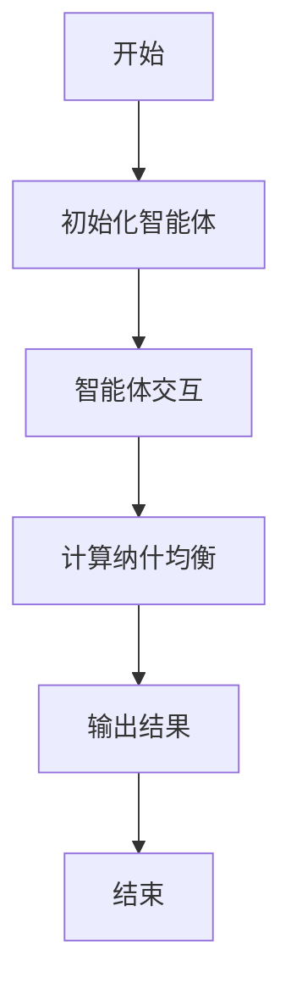
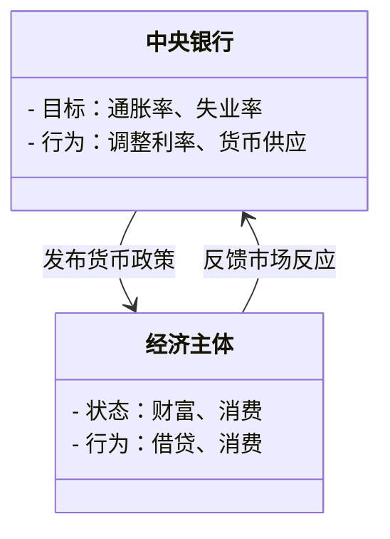
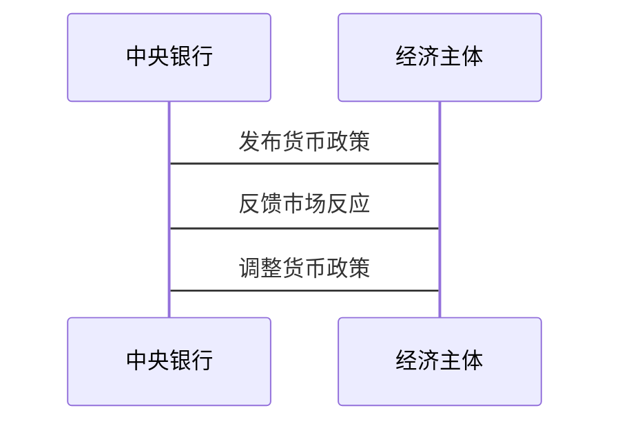

                 


# 多智能体系统在全球货币政策影响分析中的角色

---

## 关键词：
多智能体系统, 货币政策, 影响分析, 分布式计算, 博弈论模型, 系统架构设计, 项目实战

---

## 摘要：
本文探讨了多智能体系统在全球货币政策影响分析中的角色，从核心概念、算法原理、数学模型、系统架构到项目实战，全面解析多智能体系统在货币政策分析中的应用。通过详细分析，本文揭示了多智能体系统如何通过智能体协同、分布式计算和博弈论模型，有效模拟和预测全球货币政策的影响，为政策制定者和研究人员提供新的视角和工具。

---

## 第一部分：背景介绍

### 第1章：多智能体系统的定义与货币政策的影响分析

#### 1.1 多智能体系统的定义
- **1.1.1 多智能体系统的概念**
  多智能体系统（Multi-Agent Systems, MAS）是由多个智能体（Agent）组成的复杂系统，这些智能体能够自主决策、相互协作并适应环境变化。
  
- **1.1.2 多智能体系统的特征**
  - 分布式：智能体独立运行，通过通信协作完成任务。
  - 自主性：智能体具备自主决策能力。
  - 社会性：智能体之间通过交互形成复杂的社会关系。

- **1.1.3 多智能体系统的应用场景**
  - 经济学：模拟市场行为、货币政策影响。
  - 人工智能：分布式问题求解、群体智能。

#### 1.2 货币政策的影响分析
- **1.2.1 货币政策的基本概念**
  货币政策是中央银行通过调节货币供应量和利率，影响经济活动的政策工具。

- **1.2.2 货币政策的传导机制**
  货币政策通过利率、信贷、资产价格等渠道影响企业和个人行为，进而影响整体经济。

- **1.2.3 全球货币政策的复杂性**
  全球化背景下，货币政策的溢出效应、国际协调等问题增加了分析的复杂性。

#### 1.3 多智能体系统与货币政策的结合
- **1.3.1 多智能体系统在货币政策分析中的作用**
  多智能体系统能够模拟经济主体的行为，提供复杂经济现象的微观基础。

- **1.3.2 多智能体系统的建模优势**
  - 微观基础：模拟个体行为，构建宏观现象。
  - 分布式计算：适合处理复杂经济问题。

---

## 第二部分：核心概念与联系

### 第2章：多智能体系统的核心原理

#### 2.1 智能体的属性与行为规则
- **智能体的属性**
  - 状态（State）：描述智能体的当前情况。
  - 行为（Behavior）：智能体的决策和动作。
  - 目标（Goal）：驱动智能体行为的目标。

- **行为规则**
  - 反应式规则：基于当前状态做出反应。
  - 规则式规则：基于预定义规则做出决策。

#### 2.2 多智能体系统的相互作用
- **相互作用方式**
  - 协作：智能体之间协同完成任务。
  - 竞争：智能体之间争夺资源。

- **通信机制**
  - 信息传递：智能体之间通过消息传递信息。
  - 协调机制：通过协商达成一致。

#### 2.3 核心要素对比
```mermaid
表格
| 智能体类型 | 属性          | 行为规则         | 通信方式       |
|------------|---------------|-----------------|----------------|
| 经济主体   | 状态、目标     | 反应式、规则式   | 市场交易        |
| 中央银行   | 货币政策目标   | 基于规则的决策   | 货币政策工具    |
```

#### 2.4 ER实体关系图
```mermaid
er
actor 中央银行 {
  role 设定货币政策
}
actor 经济主体 {
  role 受货币政策影响
}
```

---

## 第三部分：算法原理

### 第3章：多智能体系统的算法实现

#### 3.1 分布式计算算法
- **分布式计算原理**
  智能体在分布式环境中协作，通过通信完成任务。

- **算法实现**
  ```python
  def distributed_algorithm():
      # 初始化智能体
      agents = [Agent(i) for i in range(n_agents)]
      # 分配任务
      for agent in agents:
          agent.start()
      # 等待完成
      while not all_agents_done():
          pass
  ```

#### 3.2 博弈论模型
- **博弈论模型简介**
  智能体在博弈环境中做出决策，寻求最优策略。

- **纳什均衡**
  $$ \text{纳什均衡} \text{定义为} (x^*, y^*) \text{，使得} u(x^*, y^*) \geq u(x, y^*) \text{和} v(x^*, y^*) \geq v(x^*, y) \text{对所有} x, y \text{成立} $$

#### 3.3 算法流程图


---

## 第四部分：数学模型

### 第4章：货币政策分析的数学模型

#### 4.1 货币政策传导机制
- **货币政策工具**
  - 利率：影响借贷成本。
  - 货币供应量：影响市场流动性。

- **货币政策传导模型**
  $$ \text{LM曲线}：L(i, Y) = L^0 + L^1 Y $$
  $$ \text{IS曲线}：i = i^* - L^2 (Y - Y^*) $$

#### 4.2 多智能体系统的数学表达
- **智能体行为模型**
  $$ a_t = \beta a_{t-1} + \epsilon_t $$
  其中，\( a_t \) 表示智能体在时间 \( t \) 的行为，\( \beta \) 为惯性系数，\( \epsilon_t \) 为随机扰动项。

#### 4.3 系统方程组
$$
\begin{cases}
\frac{dy}{dt} = ky - dx \\
\frac{dx}{dt} = x - ky
\end{cases}
$$
其中，\( y \) 表示经济状态，\( x \) 表示货币政策变量，\( k \) 为比例常数。

---

## 第五部分：系统分析与架构设计

### 第5章：系统架构设计

#### 5.1 问题场景介绍
- **问题描述**
  分析全球货币政策对经济主体的影响，模拟不同政策下的经济结果。

- **项目介绍**
  构建一个多智能体系统，模拟中央银行、企业和消费者的行为，分析货币政策的影响。

#### 5.2 功能模块设计


#### 5.3 系统架构图
```mermaid
container 宏观经济系统 {
    组件 中央银行
    组件 经济主体
}
```

#### 5.4 接口与交互设计
- **接口设计**
  - 中央银行接口：发布利率、货币供应。
  - 经济主体接口：接收货币政策，调整行为。

- **交互流程**


---

## 第六部分：项目实战

### 第6章：多智能体系统的实现

#### 6.1 环境安装
- **工具安装**
  - 安装Python和必要的库（如NumPy、Matplotlib、networkx）。
  - 安装多智能体框架（如Multi-Agent Frameworks for Python）。

#### 6.2 核心代码实现
```python
class Agent:
    def __init__(self, id):
        self.id = id
        self.state = 0

    def update_state(self, new_state):
        self.state = new_state

def main():
    agents = [Agent(i) for i in range(5)]
    for agent in agents:
        agent.update_state(1)
    for agent in agents:
        print(f"Agent {agent.id}: {agent.state}")

if __name__ == "__main__":
    main()
```

#### 6.3 案例分析与解读
- **案例：模拟中央银行调整利率**
  - **代码实现**
    ```python
    central_bank = CentralBank(target_inflation=2, target_unemployment=5)
    economy = Economy(agents, central_bank)
    economy.run_simulation(100)
    ```

- **结果分析**
  - 模拟结果显示，利率调整对企业和消费者行为的影响，验证货币政策的有效性。

#### 6.4 项目小结
- **实现总结**
  成功构建了一个多智能体系统，模拟中央银行和经济主体的行为，验证了系统的可行性和分析能力。

---

## 第七部分：总结

### 第7章：总结与展望

#### 7.1 内容回顾
- 多智能体系统在全球货币政策分析中的应用。
- 系统的架构设计、算法实现和项目实战。

#### 7.2 未来展望
- **研究方向**
  - 提高智能体的智能性和自适应性。
  - 结合大数据和机器学习，增强系统的预测能力。

#### 7.3 最佳实践 tips
- **系统设计**
  在设计多智能体系统时，明确智能体的目标和行为规则，确保系统的可扩展性和可维护性。

- **代码实现**
  使用模块化设计，方便后续的维护和扩展。

- **测试与验证**
  通过模拟实验验证系统的有效性和准确性。

---

## 作者：
作者：AI天才研究院/AI Genius Institute  
联系：禅与计算机程序设计艺术/Zen And The Art of Computer Programming

