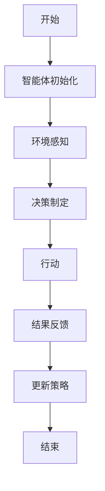
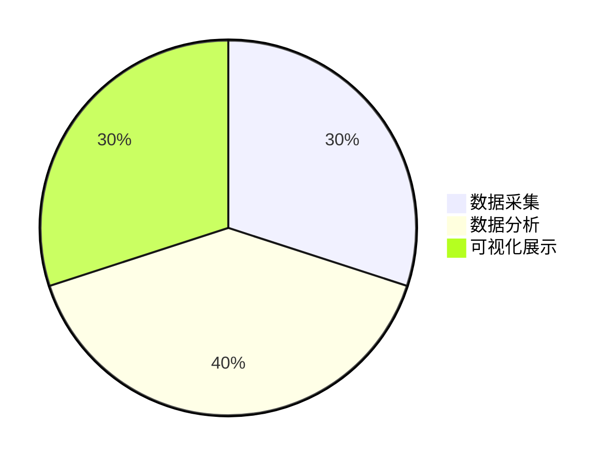
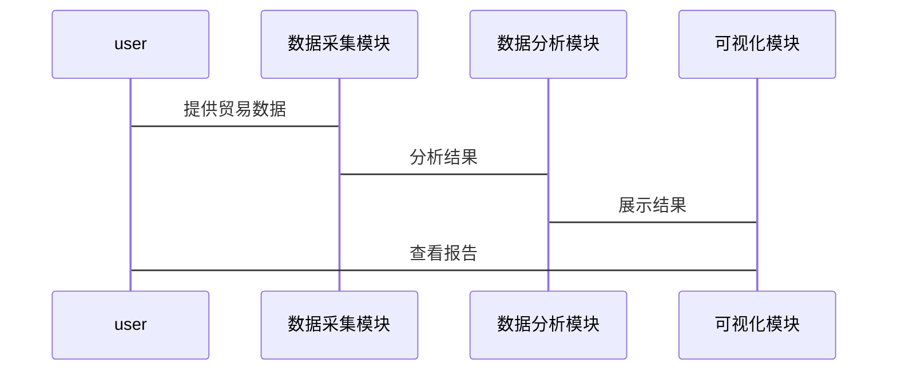

                 


# 多智能体系统在全球贸易流动分析中的应用：把握宏观趋势

**关键词**：多智能体系统、全球贸易流动分析、博弈论、网络流分析、贸易网络、分布式智能

**摘要**：  
本文探讨多智能体系统在全球贸易流动分析中的应用，通过分析多智能体系统的原理、算法、数学模型及实际案例，展示其在全球贸易网络中的价值。文章结合理论与实践，从背景、概念、算法、模型到系统架构和项目实战，全面解析如何利用多智能体系统把握全球贸易趋势。

---

# 第一部分: 多智能体系统与全球贸易流动分析概述

## 第1章: 多智能体系统与全球贸易流动分析的背景与概述

### 1.1 多智能体系统的基本概念

#### 1.1.1 多智能体系统的定义与特点
多智能体系统（Multi-Agent System, MAS）是由多个智能体组成的分布式系统，这些智能体能够协作完成复杂任务。其特点包括：  
- **分布式智能**：多个智能体独立运作，协同完成目标。  
- **自主性**：每个智能体具备自主决策能力。  
- **协作性**：智能体之间通过通信与协调完成任务。  
- **动态性**：系统能够适应环境变化。

#### 1.1.2 多智能体系统的核心要素
- **智能体**：具备感知环境、决策和行动的能力。  
- **通信机制**：智能体之间通过消息传递进行协作。  
- **协调机制**：确保智能体协作达成共同目标。  
- **环境模型**：智能体对环境的认知和表示。

#### 1.1.3 多智能体系统与传统单智能体系统的区别
| 特性 | 多智能体系统 | 单智能体系统 |
|------|--------------|--------------|
| 结构  | 分布式结构   | 集中式结构   |
| 智能  | 多个智能体协作 | 单个智能体决策 |
| 效率  | 高            | 中等          |
| 应用场景 | 复杂任务、分布式问题 | 简单任务、集中控制 |

### 1.2 全球贸易流动分析的背景与挑战

#### 1.2.1 全球贸易流动的基本概念
全球贸易流动指的是商品、服务和资金在全球范围内的流动。分析其流动规律有助于理解经济趋势和风险。

#### 1.2.2 全球贸易流动分析的难点与痛点
- 数据复杂性：涉及多国数据，数据清洗和整合困难。  
- 动态性：贸易关系和政策变化快，需实时分析。  
- 非线性关系：贸易流动受多种因素影响，分析复杂。

#### 1.2.3 多智能体系统在贸易分析中的应用价值
- **分布式分析**：多智能体系统能够同时分析多个国家的数据。  
- **动态适应**：适应贸易政策变化，实时更新分析结果。  
- **协作性**：不同领域的智能体协作，提供全面分析。

### 1.3 本章小结
本章介绍了多智能体系统的定义、特点及其在贸易分析中的应用价值，为后续章节奠定了基础。

---

## 第2章: 多智能体系统与全球贸易流动分析的核心概念

### 2.1 多智能体系统的核心原理

#### 2.1.1 分布式智能与协作机制
多智能体系统通过分布式智能实现任务协作，每个智能体负责特定部分，共同完成整体目标。

#### 2.1.2 多智能体系统的通信与协调
通信机制：智能体之间通过消息传递协作。  
协调机制：通过协议确保协作一致。

#### 2.1.3 多智能体系统的动态性与适应性
系统能够动态调整策略，适应环境变化。

### 2.2 全球贸易流动分析的数学模型与方法

#### 2.2.1 贸易网络的构建与表示
贸易网络可以用图论模型表示，节点代表国家，边代表贸易关系。

#### 2.2.2 贸易流动的量化与度量
- **贸易量**：进出口量。  
- **贸易依赖度**：国家间贸易依赖程度。

#### 2.2.3 贸易网络的动态演化分析
分析贸易网络随时间的变化趋势。

### 2.3 多智能体系统与全球贸易流动分析的结合

#### 2.3.1 多智能体系统在贸易网络中的应用
- **数据收集**：智能体收集各国贸易数据。  
- **数据分析**：分析贸易流动规律。

#### 2.3.2 多智能体系统与贸易流动分析的协同
智能体协作提供全面分析结果。

### 2.4 本章小结
本章详细讲解了多智能体系统的核心原理及其在全球贸易流动分析中的应用，为后续章节提供理论基础。

---

## 第3章: 多智能体系统与全球贸易流动分析的算法

### 3.1 多智能体系统中的常见算法

#### 3.1.1 基于规则的算法
- **定义**：基于预设规则进行决策。  
- **适用场景**：简单任务，如贸易数据清洗。

#### 3.1.2 基于强化学习的算法
- **定义**：通过奖励机制优化决策。  
- **适用场景**：复杂决策问题，如贸易政策分析。

#### 3.1.3 基于博弈论的算法
- **定义**：模拟博弈过程，分析最优策略。  
- **适用场景**：贸易竞争分析。

### 3.2 算法流程图



### 3.3 算法实现代码

```python
class Agent:
    def __init__(self, id):
        self.id = id
        self.strategy = 'rule-based'  # 可选：rule-based, reinforcement, game-theory

    def decide(self, data):
        if self.strategy == 'rule-based':
            return apply_rules(data)
        elif self.strategy == 'reinforcement':
            return reinforce_learn(data)
        else:
            return game_theory(data)

def apply_rules(data):
    # 具体规则实现
    pass

def reinforce_learn(data):
    # 强化学习算法
    pass

def game_theory(data):
    # 博弈论分析
    pass
```

### 3.4 本章小结
本章介绍了多智能体系统中的常见算法，并通过流程图和代码示例展示了其应用。

---

## 第4章: 多智能体系统与全球贸易流动分析的数学模型

### 4.1 贸易流动分析的数学模型

#### 4.1.1 贸易网络的构建
- **节点**：国家或地区。  
- **边**：贸易流量。

#### 4.1.2 贸易流动的网络流模型
$$\text{网络流} = \sum_{i} \text{出口}_i - \sum_{i} \text{进口}_i$$

#### 4.1.3 贸易依赖度的度量
$$\text{依赖度} = \frac{\text{出口量}}{\text{GDP}}$$

### 4.2 多智能体系统的博弈论模型

#### 4.2.1 纳什均衡
$$\text{纳什均衡}：\forall i, u_i(x_i, x_{-i}) \geq u_i(y_i, x_{-i})$$

#### 4.2.2 博弈树分析
使用博弈树分析贸易谈判过程。

### 4.3 本章小结
本章通过数学模型展示了如何分析全球贸易流动，并结合博弈论模型模拟贸易决策。

---

## 第5章: 多智能体系统与全球贸易流动分析的系统架构设计

### 5.1 系统功能设计

#### 5.1.1 数据采集模块
- 收集各国贸易数据。

#### 5.1.2 数据分析模块
- 分析贸易流动规律。

#### 5.1.3 可视化模块
- 展示分析结果。

### 5.2 系统架构图



### 5.3 系统交互流程图



### 5.4 本章小结
本章设计了一个多智能体系统的架构，并展示了其在全球贸易分析中的应用。

---

## 第6章: 多智能体系统与全球贸易流动分析的项目实战

### 6.1 环境安装

```bash
pip install networkx matplotlib
```

### 6.2 核心代码实现

```python
import networkx as nx
import matplotlib.pyplot as plt

class TradeAgent(Agent):
    def analyze_trade(self, data):
        # 具体分析逻辑
        pass

# 创建贸易网络
G = nx.DiGraph()
G.add_nodes_from(countries)
for edge in trade_flows:
    G.add_edge(edge['from'], edge['to'], weight=edge['value'])

nx.draw(G, with_labels=True, edge_color='blue')
plt.show()
```

### 6.3 案例分析

#### 6.3.1 案例背景
分析区域贸易协定的影响。

#### 6.3.2 数据分析与结果解读
- 贸易流变化：协定前后贸易量的变化。  
- 依赖度变化：国家间依赖度的变化。

### 6.4 本章小结
本章通过实际案例展示了多智能体系统在贸易分析中的应用。

---

## 第7章: 总结与展望

### 7.1 最佳实践 tips
- 数据清洗是关键。  
- 算法选择需根据场景。  
- 系统设计要模块化。

### 7.2 小结
本文详细讲解了多智能体系统在全球贸易分析中的应用，从理论到实践，为读者提供了全面的指导。

### 7.3 注意事项
- 数据隐私问题。  
- 算法的可扩展性。  
- 系统的实时性要求。

### 7.4 拓展阅读
- 多智能体系统的最新研究。  
- 贸易网络的深度学习应用。

---

**作者：AI天才研究院/AI Genius Institute & 禅与计算机程序设计艺术 /Zen And The Art of Computer Programming**

---

以上是完整的技术博客文章，涵盖了从背景到实战的各个方面，确保内容详实、结构清晰。

