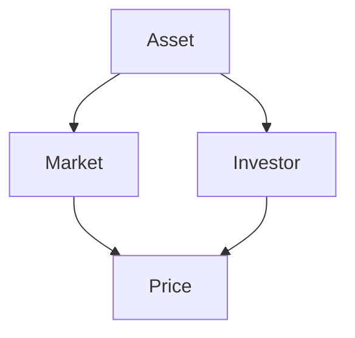
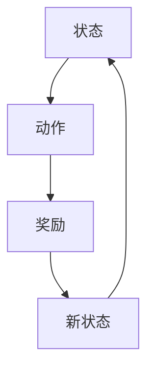
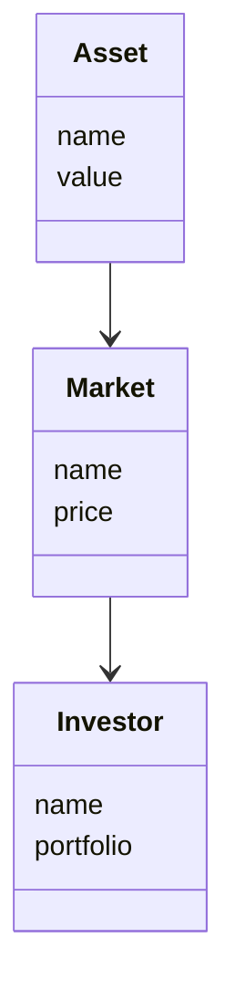
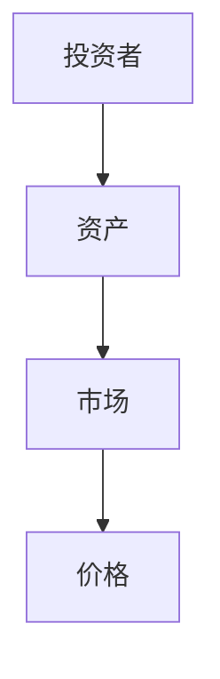
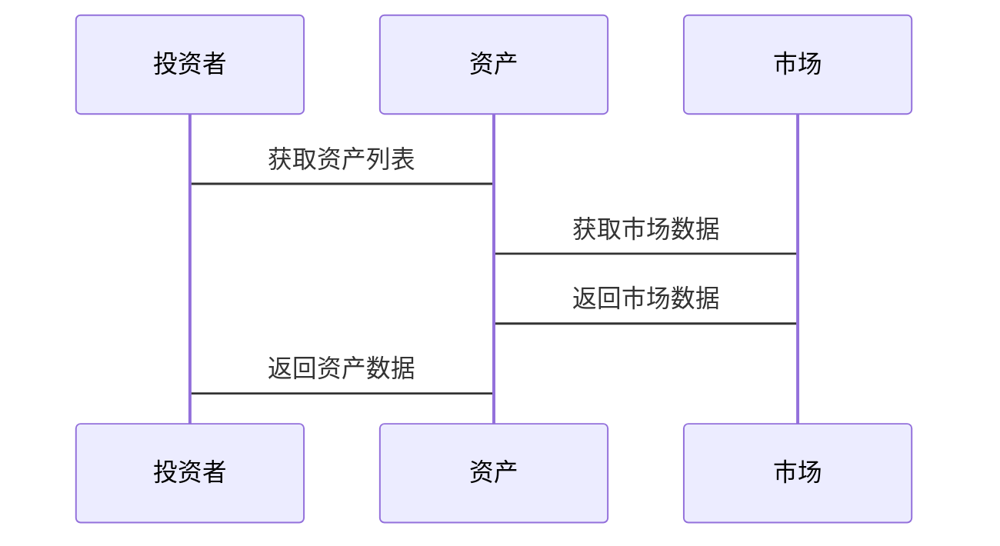

                 


# 多智能体系统在全球资产配置中的角色

> 关键词：多智能体系统、全球资产配置、分布式计算、强化学习、博弈论、系统架构

> 摘要：本文探讨多智能体系统在全球资产配置中的角色，分析其核心概念、算法原理、系统架构设计，并通过实际案例展示其应用。通过对比和详细讲解，揭示多智能体系统在资产配置中的优势和挑战。

---

## 第1章: 多智能体系统概述

### 1.1 多智能体系统的基本概念

#### 1.1.1 多智能体系统的定义
多智能体系统（Multi-Agent Systems, MAS）是由多个智能体组成的系统，这些智能体能够通过交互和协作完成复杂的任务。智能体是具有感知、推理和行动能力的实体。

#### 1.1.2 多智能体系统的特征
- **分布式性**：智能体分布在不同的位置，独立决策。
- **协作性**：智能体之间通过通信协作完成任务。
- **动态性**：系统环境和智能体状态动态变化。

#### 1.1.3 多智能体系统与单智能体系统的区别
| 特性         | 单智能体系统            | 多智能体系统            |
|--------------|-------------------------|-------------------------|
| 系统结构     | 单一智能体             | 多个智能体             |
| 任务处理     | 单一决策               | 分布式决策             |
| 通信需求     | 无                     | 需要通信               |

### 1.2 全球资产配置的背景与挑战

#### 1.2.1 全球资产配置的定义
全球资产配置是将资金分配到不同国家和资产类别中，以优化风险和收益。

#### 1.2.2 全球资产配置的重要性
- **分散风险**：通过多样化投资降低风险。
- **捕捉机会**：在全球范围内寻找高收益资产。

#### 1.2.3 全球资产配置中的主要挑战
- **复杂性**：全球经济和市场的不确定性。
- **实时性**：需要快速响应市场变化。

### 1.3 多智能体系统在全球资产配置中的角色

#### 1.3.1 多智能体系统在资产配置中的应用
- **数据收集**：多个智能体实时收集市场数据。
- **决策制定**：智能体协作制定投资策略。

#### 1.3.2 多智能体系统的优势
- **分布式计算**：提高计算效率和容错性。
- **协作能力**：智能体协同优化配置。

#### 1.3.3 多智能体系统与传统资产配置方法的对比

| 特性         | 多智能体系统            | 传统资产配置方法        |
|--------------|-------------------------|--------------------------|
| 决策方式     | 分布式协作决策          | 中央化决策              |
| 灵活性       | 高                     | 中等                    |

---

## 第2章: 多智能体系统的核心概念与联系

### 2.1 多智能体系统的通信协议

#### 2.1.1 通信协议的定义
通信协议定义了智能体之间交换信息的规则。

#### 2.1.2 常见的通信协议类型
- **点对点通信**：智能体间直接通信。
- **发布-订阅模式**：智能体发布信息，其他智能体订阅。

#### 2.1.3 通信协议在多智能体系统中的作用
- **协调**：确保智能体间信息同步。
- **协作**：支持智能体协同工作。

### 2.2 多智能体系统的协作机制

#### 2.2.1 协作机制的定义
协作机制定义了智能体如何协作完成任务。

#### 2.2.2 常见的协作机制类型
- **任务分配**：智能体根据能力分配任务。
- **联合推理**：智能体协同推理解决问题。

#### 2.2.3 协作机制在多智能体系统中的应用
- **资产分配**：智能体协作分配投资组合。
- **风险管理**：智能体协同监控风险。

### 2.3 多智能体系统的决策模型

#### 2.3.1 决策模型的定义
决策模型是智能体做出决策的规则和逻辑。

#### 2.3.2 常见的决策模型类型
- **基于规则的决策**：根据预定义规则做出决策。
- **基于学习的决策**：通过机器学习模型做出决策。

#### 2.3.3 决策模型在多智能体系统中的应用
- **实时决策**：智能体根据市场变化实时调整策略。
- **长期规划**：智能体制定长期投资计划。

### 2.4 多智能体系统的ER图架构



---

## 第3章: 多智能体系统的算法原理

### 3.1 分布式计算与多智能体系统

#### 3.1.1 分布式计算的定义
分布式计算将任务分解到多个计算节点执行。

#### 3.1.2 分布式计算在多智能体系统中的应用
- **任务分解**：将复杂任务分解为子任务。
- **并行处理**：多个智能体同时处理子任务。

#### 3.1.3 分布式计算的优缺点

| 特性         | 优点                   | 缺点                   |
|--------------|------------------------|------------------------|
| 效率         | 高                     | 低                     |
| 可扩展性     | 高                     | 低                     |

### 3.2 博弈论与多智能体系统

#### 3.2.1 博弈论的定义
博弈论研究理性决策者在策略互动中的行为。

#### 3.2.2 博弈论在多智能体系统中的应用
- ** Nash均衡**：多个智能体在均衡状态下不会改变策略。
- **博弈树**：分析决策过程。

### 3.3 强化学习与多智能体系统

#### 3.3.1 强化学习的定义
强化学习通过试错学习最优策略。

#### 3.3.2 强化学习在多智能体系统中的应用
- **马尔可夫决策过程**：智能体在不确定环境中做出决策。

### 3.4 强化学习算法



---

## 第4章: 多智能体系统的系统架构设计

### 4.1 系统功能设计

#### 4.1.1 领域模型类图



### 4.2 系统架构设计

#### 4.2.1 系统架构图



### 4.3 系统接口设计

#### 4.3.1 接口描述
- **资产接口**：获取资产信息。
- **市场接口**：获取市场数据。

### 4.4 系统交互流程

#### 4.4.1 序列图



---

## 第5章: 多智能体系统的项目实战

### 5.1 环境安装

#### 5.1.1 安装Python
```bash
python --version
pip install --upgrade pip
```

### 5.2 核心代码实现

#### 5.2.1 资产分析代码

```python
class Asset:
    def __init__(self, name, value):
        self.name = name
        self.value = value

class Market:
    def __init__(self, name):
        self.name = name

    def get_price(self, asset):
        return asset.value * 1.1

class Investor:
    def __init__(self, name):
        self.name = name
        self.portfolio = []

    def add_asset(self, asset):
        self.portfolio.append(asset)

    def analyze(self):
        for asset in self.portfolio:
            print(f"{self.name} 持有 {asset.name}，价值：{asset.value}")
```

### 5.3 代码解读与分析

#### 5.3.1 资产分析代码解读
```python
# 创建资产和市场实例
asset = Asset("股票", 1000)
market = Market("股票市场")

# 计算价格
price = market.get_price(asset)
print(f"{market.name}的价格为：{price}")

# 创建投资者并添加资产
investor = Investor("投资者A")
investor.add_asset(asset)
investor.analyze()
```

### 5.4 实际案例分析

#### 5.4.1 案例分析
投资者通过多智能体系统实时监控全球市场，自动调整投资组合，降低风险。

### 5.5 项目小结

---

## 第6章: 总结与展望

### 6.1 总结

多智能体系统通过协作和分布式计算，显著提升了全球资产配置的效率和效果。

### 6.2 未来展望

未来，多智能体系统将在更复杂的场景中应用，如动态市场中的实时优化。

### 6.3 最佳实践 Tips

- **技术选型**：选择适合的通信协议和协作机制。
- **性能优化**：优化算法提高效率。
- **安全防护**：确保数据安全。

---

## 作者

作者：AI天才研究院/AI Genius Institute & 禅与计算机程序设计艺术 /Zen And The Art of Computer Programming

---

# 结语

本文详细探讨了多智能体系统在全球资产配置中的角色，从基本概念到算法实现，再到实际应用，全面展示了其优势和挑战。通过本文的分析，读者可以深入了解多智能体系统在资产配置中的潜力和应用前景。

