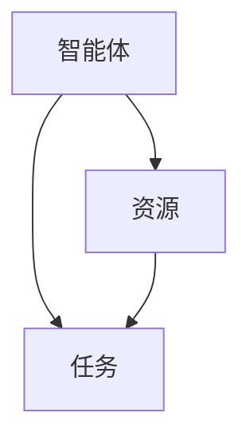
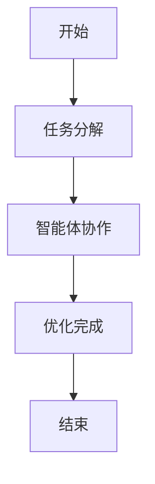
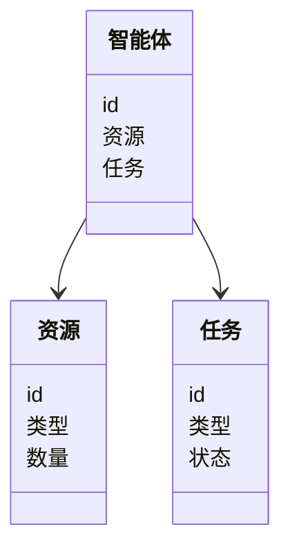
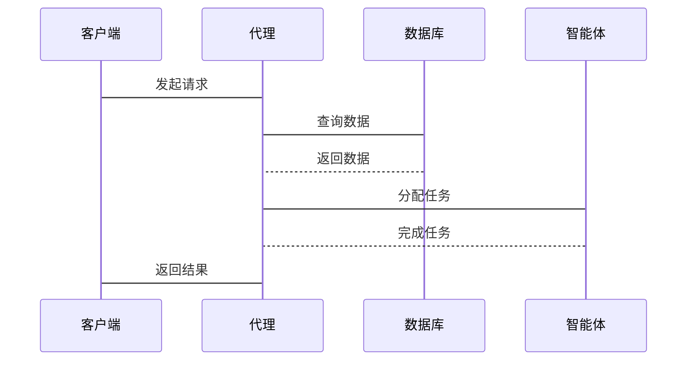

                 


# 多智能体系统在全球资源配置效率评估中的应用：寻找优质公司

## 关键词：多智能体系统，资源配置效率，优质公司评估，分布式计算，协同优化，系统架构，全球资源配置

## 摘要

多智能体系统通过协同优化和分布式计算，能够有效评估全球资源配置效率，帮助识别和选择优质公司。本文从基本概念、核心算法、系统架构到实际案例，详细阐述多智能体系统在资源配置中的应用，探讨其在寻找优质公司中的优势和挑战。

# 第一部分: 多智能体系统与全球资源配置效率评估背景

## 第1章: 多智能体系统概述

### 1.1 多智能体系统的基本概念

#### 1.1.1 多智能体系统的定义
多智能体系统（Multi-Agent System, MAS）由多个智能体组成，这些智能体通过协同完成复杂任务。智能体具备自主性、反应性、目标导向和社交能力。

#### 1.1.2 多智能体系统的特征
- **自主性**：智能体能够自主决策。
- **反应性**：能感知环境并实时响应。
- **目标导向**：每个智能体都有明确的目标。
- **分布式**：智能体分布在网络中，协同工作。

#### 1.1.3 多智能体系统的应用场景
多智能体系统广泛应用于经济、交通、物流等领域，特别是在需要高效资源配置的场景中表现出色。

### 1.2 全球资源配置效率评估的必要性

#### 1.2.1 全球资源配置的基本概念
资源配置指将资源分配到不同用途，以最大化整体效益。全球资源配置涉及跨国资源分配，复杂性高。

#### 1.2.2 资源配置效率的定义与衡量标准
资源配置效率指资源被有效利用的程度，常用GDP增长、资源利用率等指标衡量。

#### 1.2.3 多智能体系统在资源配置中的作用
多智能体系统通过分布式计算和协同优化，提升资源配置效率，帮助识别高效率的公司。

### 1.3 寻找优质公司的目标与意义

#### 1.3.1 优质公司的定义与特征
优质公司具备高效运营、良好市场表现和持续创新能力。

#### 1.3.2 全球化视角下的公司评估
全球化视角下，公司评估需考虑跨国经营、全球市场和资源分配效率。

#### 1.3.3 多智能体系统在公司评估中的优势
多智能体系统能够处理海量数据，实时分析，提供精准的资源配置建议。

### 1.4 本章小结
本章介绍了多智能体系统的定义、特征及其在资源配置中的作用，强调其在寻找优质公司中的重要性。

# 第二部分: 多智能体系统的核心概念与联系

## 第2章: 多智能体系统的核心概念

### 2.1 多智能体系统的组成要素

#### 2.1.1 智能体的定义与属性
智能体是系统的基本单元，具备自主性、反应性和目标导向。

#### 2.1.2 多智能体系统的结构层次
- **物理层**：智能体的硬件实现。
- **逻辑层**：智能体的行为规则。
- **协作层**：智能体之间的协同机制。

#### 2.1.3 智能体之间的关系与交互
智能体之间通过通信和协作完成任务，关系包括竞争、合作和中立。

### 2.2 多智能体系统中的通信机制

#### 2.2.1 智能体间通信的模型与协议
通信模型包括发布-订阅、请求-响应，协议如FIPA、DAML。

#### 2.2.2 通信中的信息传递与处理
信息传递需确保准确性和及时性，处理包括解析和加密。

#### 2.2.3 通信机制对资源配置效率的影响
有效的通信机制减少信息延迟，提升资源配置效率。

### 2.3 多智能体系统的协同与优化

#### 2.3.1 协同的基本概念与实现方式
协同指多个智能体为共同目标合作，实现方式包括规划、协商和协调。

#### 2.3.2 优化的目标与方法
优化目标是最大化资源利用，方法包括遗传算法、模拟退火。

#### 2.3.3 协同与优化对资源配置效率的提升
协同优化减少资源浪费，提高整体效率。

### 2.4 核心概念对比分析

#### 2.4.1 多智能体系统与单智能体系统的对比
| 特性 | 单智能体系统 | 多智能体系统 |
|------|--------------|-------------|
| 资源分配 | 中央控制 | 分布式 |
| 可扩展性 | 低 | 高 |

#### 2.4.2 实体关系图（ER图）



### 2.5 本章小结
本章详细分析了多智能体系统的组成、通信机制和协同优化，展示了其在资源配置中的优势。

# 第三部分: 多智能体系统的算法原理

## 第3章: 分布式计算与协同优化算法

### 3.1 分布式计算的基本原理

#### 3.1.1 分布式计算的概念
分布式计算将任务分解成多个部分，由不同节点处理，提升计算效率。

#### 3.1.2 分布式计算的优势
- **高可用性**：单点故障风险低。
- **高扩展性**：易于扩展。
- **资源利用率高**：充分使用计算资源。

### 3.2 协同优化算法的实现

#### 3.2.1 协同优化的基本概念
协同优化指多个智能体协同完成优化任务，避免资源冲突。

#### 3.2.2 协同优化的实现步骤



#### 3.2.3 协同优化的数学模型

$$
\text{目标函数} = \sum_{i=1}^{n} x_i
$$

$$
\text{约束条件} = \{x_i \leq 1 \mid i=1,2,\dots,n\}
$$

### 3.3 分布式计算与协同优化的结合

#### 3.3.1 分布式计算在协同优化中的应用
分布式计算提供并行处理能力，加速协同优化过程。

#### 3.3.2 协同优化对分布式计算的优化

$$
\text{优化目标} = \min \sum_{i=1}^{n} f_i(x_i)
$$

### 3.4 本章小结
本章介绍了分布式计算和协同优化的基本原理及其结合，展示了其在资源配置中的应用。

# 第四部分: 系统分析与架构设计

## 第4章: 系统分析与架构设计

### 4.1 系统分析

#### 4.1.1 问题场景介绍
系统需在全球范围内评估资源配置效率，识别优质公司。

#### 4.1.2 项目介绍
开发一个多智能体系统，实现全球资源配置效率评估。

### 4.2 系统功能设计

#### 4.2.1 领域模型设计



#### 4.2.2 系统架构设计


### 4.3 系统接口设计

#### 4.3.1 接口设计
- **智能体接口**：处理任务和资源。
- **代理接口**：协调智能体通信。
- **数据库接口**：存储和检索数据。

### 4.4 系统交互设计

#### 4.4.1 交互流程



### 4.5 本章小结
本章通过系统分析和架构设计，展示了多智能体系统如何实现全球资源配置效率评估。

# 第五部分: 项目实战

## 第5章: 项目实战

### 5.1 环境安装与配置

#### 5.1.1 安装Python
使用Anaconda安装Python 3.8及以上版本。

#### 5.1.2 安装依赖库
安装必要的库，如numpy、pandas、scikit-learn。

#### 5.1.3 安装多智能体框架
使用JADE框架或基于socket的通信库。

### 5.2 系统核心实现

#### 5.2.1 智能体代码实现

```python
class Agent:
    def __init__(self, id):
        self.id = id
        self.resources = {}
    
    def allocate_resource(self, resource_id, quantity):
        self.resources[resource_id] += quantity
```

#### 5.2.2 资源分配算法实现

```python
def distribute_resources(agents, resources):
    for agent in agents:
        available = resources.get(agent.id, 0)
        if available > 0:
            agent.allocate_resource(agent.id, available)
```

#### 5.2.3 资源评估与优化

```python
def evaluate_resources(agents):
    efficiency = {}
    for agent in agents:
        efficiency[agent.id] = sum(agent.resources.values())
    return efficiency
```

### 5.3 代码应用解读与分析

#### 5.3.1 代码功能解读
代码实现智能体的资源分配和评估，展示多智能体系统的协同优化。

#### 5.3.2 实际案例分析
通过具体案例，展示系统如何识别优质公司。

### 5.4 项目小结
本章通过项目实战，展示了多智能体系统在资源配置中的实现和应用。

# 第六部分: 总结与展望

## 第6章: 总结与展望

### 6.1 全文总结
多智能体系统通过分布式计算和协同优化，有效提升资源配置效率，帮助识别优质公司。

### 6.2 未来展望
未来研究将探索更高效的协同机制和更复杂的优化算法，提升系统的智能化和适应性。

### 6.3 最佳实践 tips

#### 6.3.1 实践建议
- 确保智能体间的通信高效可靠。
- 定期更新优化算法，适应变化。
- 建立完善的监控和反馈机制。

#### 6.3.2 注意事项
- 避免过度复杂化系统。
- 注重数据安全和隐私保护。
- 确保系统的可扩展性和可维护性。

### 6.4 拓展阅读
建议阅读多智能体系统的经典书籍，如《Multi-Agent Systems: Algorithm and Applications》。

## 作者信息

作者：AI天才研究院/AI Genius Institute  
联系方式：contact@aicourse.com  
官方网站：https://www.aicourse.com  
备注：禅与计算机程序设计艺术 /Zen And The Art of Computer Programming  

# 结语

多智能体系统在资源配置效率评估中的应用前景广阔，随着技术进步，其在寻找优质公司中的作用将更加显著。

